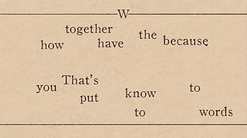

# 使用 PyMuPDF 从 pdf 中提取标题和段落

> 原文：<https://towardsdatascience.com/extracting-headers-and-paragraphs-from-pdf-using-pymupdf-676e8421c467?source=collection_archive---------4----------------------->



由[制作的动画享受动画](https://enjoyanimation.com/work)

## 一种从 pdf 文档中解析标题和段落的简单方法

这是完全不同的东西:解析 pdf 文档并提取标题和段落！有各种各样的软件包可以从 pdf 文档中提取文本并将其转换成 HTML，但是我发现这些软件包对于手头的任务来说要么过于复杂，要么过于复杂。根据我的经验，一般的 pdf 解析器对所有文档进行一般化处理，但是对于结构相似的文档的特定用例，我们可以用自己的代码来提高性能！

## 方法学

由于 pdf 文件由非结构化的文本组成，我们需要在不同的文档中找到一些关于标题和段落如何分隔的相似之处。使用一个关于保险公司的荷兰保单条款的大型 pdf 文件(每个 50-150 页)的小样本，我发现*有些*一致的是标题和段落通常由文本的**字体大小**和**字体粗细**分隔，并且**最常用的字体**可以被认为是段落。现在，这是我们创造方法论的一个很好的起点。

1.  使用 PyMuPDF 将段落标识为文档中使用最多的字体的文本，将标题标识为比段落样式更大的字体，将下标标识为比段落样式更小的字体。
2.  为标题、段落和下标创建一个带有 HTML 样式元素标签的字典，比如`<h1>`、`<p>`和`<s0>`。
3.  用这些元素`<tags>`注释文本片段。

## 识别段落、标题和下标

我们使用 PyMuPDF 包来读取 PDF 文件。该软件包逐页打开 pdf 文档，将其所有内容保存在一个`block`中，并识别文本`size`、`font`、`colour`和`flags`。我发现一些 pdf 文档只通过`font`和`size`来区分标题和段落，但是其他的使用所有四个属性。为了说明这一点，我们将添加一个`granularity`标志，这样我们就可以决定在区分文档中不同的文本部分时包含哪些属性。

在这个阶段，我们将创建一个包含所有不同样式和属性的`dictionary`和一个包含所有这些样式的`[(font_size, count), ..]`列表。

我们迭代文档的`pages`和`blocks`，由`PyMuPDF`包(导入为`fitz`)解析，并根据我们的`granularity`标志识别所有的样式和属性。

我们的一个文档的输出如下所示:

```
font_counts, styles = fonts(doc, granularity=False)[('9.5', 1079), ('10.0', 190), ('8.5', 28), ('10.5', 24), ...]{'12.0': {'size': 12.0, 'font': 'ArialMT'}, '9.0': {'size': 9.0, 'font': 'XKZKVH+VAGRoundedStd-Light'}, ...}
```

我们可以看到最常用的字体大小是`9.5`，有`1079`个这样大小的文本。很可能这个字体大小代表了我们文档中的段落。

## 元素标签字典

接下来，我们将为每种字体大小创建一个包含元素标签的字典。**注意**，这里我们只考虑字体大小，但是如果你在`fonts()`函数中使用`granularity=True`标志，通过几行额外的代码，你可以找到一种方法来合并其他属性！

`line 12-13`首先，我们确定段落的大小，以区分标签的类型`<header>`、`<paragraph>`或`<subscript>`。`line 16-19`我们将大小从高到低排序，以便我们可以向每个元素标签添加正确的整数。注意，我们使用`1`作为**最大的**标签，这个数字随着标题和下标的字体大小的减小而减小！我们这样做是因为它与 HTLM 标签的排序方式相同。`line 22-32`用标签填充字典，如下所示。

```
{60.0: '<h1>', 59.69924545288086: '<h2>', 36.0: '<h3>', 30.0: '<h4>', 24.0: '<h5>', 20.0: '<h6>', 16.0: '<h7>', 14.0: '<h8>', 13.0: '<h9>', 10.5: '<h10>', 10.0: '<h11>', 9.5: '<p>', 9.452380180358887: '<s1>', 9.404520988464355: '<s2>', 8.5: '<s3>', 8.0: '<s4>', 7.5: '<s5>', 7.0: '<s6>'}
```

## 提取标题和段落

我们再次迭代文档的页面和块。对于第一个块，我们用`element tag`和来自 span `s['text']`的实际文本初始化`block_string`。对于接下来的每个区间，我们检查字体`size`是否与前一个区间的字体`size`匹配，或者是否有新的文本大小。相应地，如果字符串大小相同，我们就将它们连接起来。`blocks`是由`PyMuPDF`包分隔和识别的文本部分，但我发现它们有时包含句子的一部分。因此，为什么我用一个`'|'`将它们连接起来，以表明一个新的块已经开始。在后处理步骤中，我们可以决定如何处理这些由管道分隔的部分(连接它们或分离它们)。

我们返回一个包含管道的字符串列表，然后能够识别哪些文本部分是标题、段落或下标，如下所示。

```
['<h4>Als onderdeel van het | ZekerheidsPakket Particulieren |', '', '<h1>Informatie  over  uw|', '<h2>Inboedelverzekering|', '<h1>Basis|', '', '<h6>Inhoud|', '', '<p>pagina| Leeswijzer, Uw verzekering in het kort | 3 | Polisvoorwaarden Inboedelverzekering Basis | 7 |', '', '<s3>3|', '', '<h7>Uw verzekering in het kort|',
```

正如您所看到的，我们仍然需要执行几个后处理步骤来清理数据，并可能以不同的方式对其进行排序，但这至少是一个起点。我希望你在这里学到了一些东西，并快乐编码！完整的脚本和示例 pdf 文档可以在[这里](https://github.com/LouisdeBruijn/Medium/tree/master/PDF%20retrieval)找到。