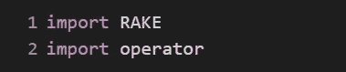
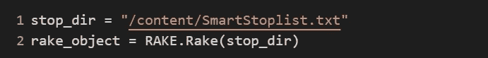
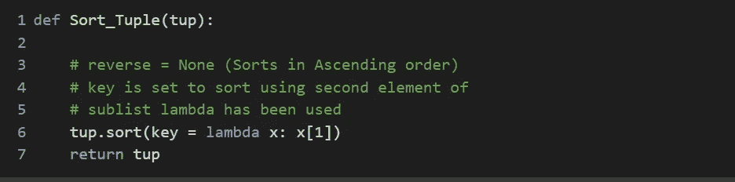
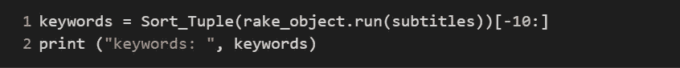
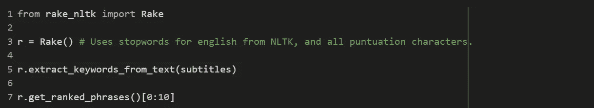
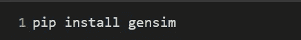

# 从文本中提取关键短语:Python 中的 RAKE 和 Gensim

> 原文：<https://towardsdatascience.com/extracting-keyphrases-from-text-rake-and-gensim-in-python-eefd0fad582f?source=collection_archive---------4----------------------->

## 使用 Python 从大型文本段落中获取关键短语

《华盛顿邮报》称，它平均每天发布 1200 篇**故事**、图片和视频**(不过，这一数字还包括有线**故事**)。内容真多啊！谁有时间浏览所有的新闻？如果我们能从每篇新闻文章中提取相关的短语，这不是很棒吗？**

****

**Romain Vignes 在 Unsplash 上拍摄的照片**

**关键短语是总结段落要点的一组单词(或词组)。这并不是对文本的总结，它只是文章中讨论的相关概念的列表。**

# **关键短语提取是如何工作的？**

1.  **当像“写作”、“书面的”、“写了的”这样的词表示相同的意思:“写”时，将每一个词包括在文章的词汇中是没有意义的。因此，我们对文本进行词汇化，也就是说，首先将每个单词转换成其词根形式。**
2.  ****选择潜在短语:**文本段落包含许多单词，但并非所有单词都相关。其中大多数可能是经常使用的词，如“a”、“that”、“then”等。这种词称为停用词，必须过滤掉，否则会污染输出。具有上下文相似性的连续单词必须组合在一起。**
3.  ****给每个短语打分:**一旦你有了一个可能的短语列表，你需要对它们进行排序，以确定哪一个是最重要的。**

# **我们将讨论什么？**

**在这篇博客中，我们将探索以下关键短语提取算法的 python 实现:**

*   **耙子**
*   **RAKE-NLTK**
*   **根西姆**

**让我们来看一段示例文本，这样我们就可以比较所有算法的输出:**

```
AI Platform Pipelines has two major parts: (1) the infrastructure for deploying and running structured AI workflows that are integrated with [Google Cloud Platform](https://venturebeat.com/2020/03/09/google-launches-machine-images-to-simplify-data-science-workflows/) services and (2) the pipeline tools for building, debugging, and sharing pipelines and components. The service runs on a Google Kubernetes cluster that’s automatically created as a part of the installation process, and it’s accessible via the Cloud AI Platform dashboard. With AI Platform Pipelines, developers specify a pipeline using the Kubeflow Pipelines software development kit (SDK), or by customizing the TensorFlow Extended (TFX) Pipeline template with the TFX SDK. This SDK compiles the pipeline and submits it to the Pipelines REST API server, which stores and schedules the pipeline for execution.
```

# **耙子**

**RAKE 代表**快速自动关键词提取**。算法本身在 Michael W. Berry 的 [*文本挖掘应用和理论*](http://www.amazon.com/Text-Mining-Applications-Michael-Berry/dp/0470749822) 一书中有描述。我们在这里只是浏览一下实现，如果你想了解幕后发生了什么，我推荐这个[站点](https://www.thinkinfi.com/2018/09/keyword-extraction-using-rake-in-python.html)。**

****安装:****

****

****进口:****

****

****停用词:****

**从[这里](https://raw.githubusercontent.com/zelandiya/RAKE-tutorial/master/data/stoplists/SmartStoplist.txt)下载这个停用词列表，并将路径保存在一个名为 stop_dir 的变量中。**

****从文本创建一个耙子对象:****

****

**现在，是时候提取关键词了！RAKE 最初并不按照分数的顺序打印关键字。但是它返回分数和提取的关键短语。让我们编写一个快速函数来对这些提取的关键短语和分数进行排序。**

****

**将文本段落存储在一个变量中，并将其传递给 rake_object。我们将变量命名为字幕。第一行末尾的 10 意味着我们只提取前 10 个关键字。**

****

**答对了。我们完了！分数越高，关键词就越重要。**

```
keywords: [(‘installation process’, 4.0), (‘tensorflow extended’, 4.0), (‘sharing pipelines’, 5.4), (‘google kubernetes cluster’, 9.5), (‘ai platform pipelines’, 10.4), (‘google cloud platform services’, 15.0), (‘cloud ai platform dashboard’, 15.0), (‘pipelines rest api server’, 15.4), (‘running structured ai workflows’, 15.5), (‘kubeflow pipelines software development kit’, 23.4)]
```

# **RAKE-NLTK**

**RAKE-NLTK 是[的修改版本](http://sujitpal.blogspot.co.nz/2013/03/implementing-rake-algorithm-with-nltk.html)，它使用自然语言处理工具包 NLTK 进行一些计算。**

****安装:****

****

****导入，声明一个 RAKE-NLTK 对象并提取！** 我们再次提取前 10 个关键词。**

****

**下面是使用 RAKE-NLTK 对同一段文本的输出。对于所选择的通道，RAKE 和 RAKE-NLTK 给出相同的输出。但情况并非总是如此。在其他段落中自己尝试一下吧！**

```
[‘kubeflow pipelines software development kit’, ‘running structured ai workflows’, ‘pipelines rest api server’, ‘cloud ai platform dashboard’, ‘google cloud platform services’, ‘ai platform pipelines’, ‘google kubernetes cluster’, ‘two major parts’, ‘sharing pipelines’, ‘tensorflow extended’]
```

# **根西姆**

**在 Gensim Python 和 Cython 中实现，Gensim 是一个用于自然语言处理的开源库，使用现代统计机器学习。**

****安装:****

****

****导入和函数调用:****

****

****输出:****

```
pipelines pipeline platform developers development sdk tfx kubernetes
```

**Gensim 中简单的关键字函数调用似乎不执行内置的预处理。**

# **结论**

**我们学习了如何编写 Python 代码来从文本段落中提取关键字。**

**以下是一些其他很酷的关键短语提取实现。看看他们！**

*   **[NLTK](https://medium.com/analytics-vidhya/automated-keyword-extraction-from-articles-using-nlp-bfd864f41b34)**
*   **[TextRank](/textrank-for-keyword-extraction-by-python-c0bae21bcec0)**

**您可以在所有这些算法上尝试示例文本段落，看看什么最适合您的用例！**

**发现了不同的关键词提取算法。放在评论里吧！**