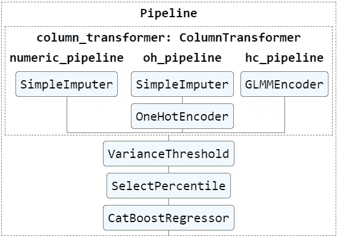
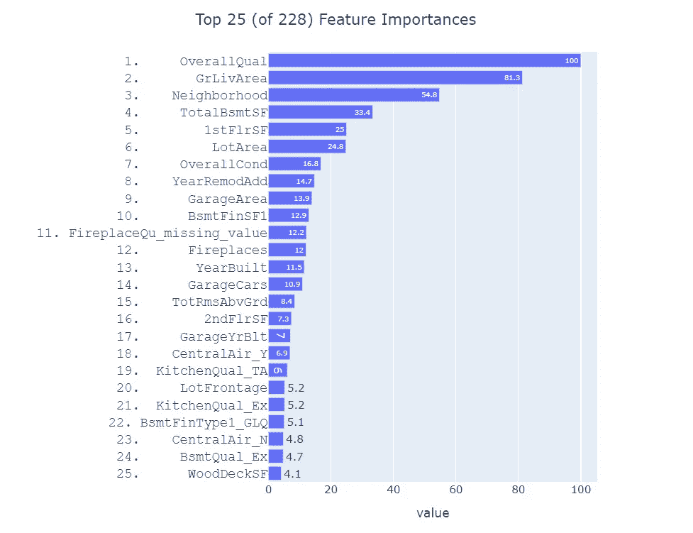

# 从 Scikit-Learn 管道中提取和绘制功能名称和重要性

> 原文：<https://towardsdatascience.com/extracting-plotting-feature-names-importance-from-scikit-learn-pipelines-eb5bfa6a31f4?source=collection_archive---------15----------------------->

## 如何解释您的渠道、模式及其特点


[https://unsplash.com/photos/L0oJ4Dlfyuo](https://unsplash.com/photos/L0oJ4Dlfyuo)

如果您曾经承担过生产机器学习模型的任务，您可能知道 Scikit-Learn 库提供了创建生产质量的机器学习工作流的最佳方式之一——如果不是最佳方式的话。生态系统的[管道](https://scikit-learn.org/stable/modules/generated/sklearn.pipeline.Pipeline.html)、[列转换器](https://scikit-learn.org/stable/modules/generated/sklearn.compose.ColumnTransformer.html)、[预处理程序](https://scikit-learn.org/stable/modules/classes.html#module-sklearn.preprocessing)、[估算器](https://scikit-learn.org/stable/modules/classes.html#module-sklearn.impute)、&、[特征选择](https://scikit-learn.org/stable/modules/classes.html#module-sklearn.feature_selection)类是将原始数据转换为模型就绪特征的强大工具。

然而，在任何人让您部署到生产环境之前，您都需要对新模型的工作原理有一些基本的了解。解释黑盒模型如何工作的最常见方式是绘制要素名称和重要性值。如果您曾经尝试过从 ColumnTransformer 处理的异构数据集中提取特性名称，您就会知道这不是一件容易的事情。详尽的互联网搜索只让我注意到其他人问了[同样的](https://github.com/scikit-learn/scikit-learn/pull/12627) [问题](https://github.com/scikit-learn/scikit-learn/pull/13307)或提供了[部分答案](https://github.com/scikit-learn/scikit-learn/issues/12525)，而不是产生一个全面和令人满意的解决方案。

为了补救这种情况，我开发了一个名为`FeatureImportance`的类，它将从管道实例中提取特性名称和重要性值。然后，它使用 Plotly 库，仅用几行代码来绘制特性的重要性。在这篇文章中，我将加载一个合适的管道，演示如何使用我的类，然后概述它是如何工作的。完整的代码可以在[这里](https://www.kaggle.com/kylegilde/feature-importance)或者这篇博文的末尾找到。

注意:从 scikit-learn 1.0 中的[变化开始，我的类可能无法工作。](https://scikit-learn.org/stable/auto_examples/release_highlights/plot_release_highlights_1_0_0.html#feature-names-support)

在继续之前，我应该注意两件事:

1.  我相信 Joey Gao 在[这个帖子](https://github.com/scikit-learn/scikit-learn/issues/12525#issuecomment-436217100)中的代码展示了解决这个问题的方法。
2.  我的帖子假设您以前使用过 Scikit-Learn 和 Pandas，并且熟悉 ColumnTransformer、Pipeline 和预处理类如何促进可再现的特征工程过程。如果您需要复习，请查看这个 [Scikit-Learn 示例](https://scikit-learn.org/stable/auto_examples/compose/plot_column_transformer_mixed_types.html)。

## 创建管道

出于演示的目的，我编写了一个名为 [fit_pipeline_ames.py](https://www.kaggle.com/kylegilde/fit-pipeline-ames) 的脚本。它从 Kaggle 加载 [Ames housing 训练数据，并适合中等复杂的管道。我在下面画出了它的视觉表现。](https://www.kaggle.com/c/house-prices-advanced-regression-techniques/data)

```
from sklearn import set_config 
from sklearn.utils import estimator_html_repr 
from IPython.core.display import display, HTML 

from fit_pipeline_ames import pipe   # create & fit pipeline
set_config(display='diagram')
display(HTML(estimator_html_repr(pipe)))
```



这个`pipe`实例包含以下 4 个步骤:

1.  [ColumnTransformer](https://scikit-learn.org/stable/modules/generated/sklearn.compose.ColumnTransformer.html) 实例由 3 条管道组成，共包含 4 个 Transformer 实例，包括 [category_encoders](https://contrib.scikit-learn.org/category_encoders/) 包中的 [SimpleImputer](https://scikit-learn.org/stable/modules/generated/sklearn.impute.SimpleImputer.html) 、[OneHotEncoder](https://scikit-learn.org/stable/modules/generated/sklearn.preprocessing.OneHotEncoder.html)&[GLMMEncoder](http://contrib.scikit-learn.org/category_encoders/glmm.html)。关于我如何动态构造这个特殊的 ColumnTransformer 的完整解释，请参见我以前的博客文章。
2.  [VarianceThreshold](https://scikit-learn.org/stable/modules/generated/sklearn.feature_selection.VarianceThreshold.html) 使用默认阈值 0，这将删除任何仅包含单一值的特征。如果一个特征没有变化，一些模型将会失败。
3.  [选择百分位数](https://scikit-learn.org/stable/modules/generated/sklearn.feature_selection.SelectPercentile.html)使用百分位数阈值为 90 的 [f_regression](https://scikit-learn.org/stable/modules/generated/sklearn.feature_selection.f_regression.html) 评分函数。这些设置保留了前 90%的功能，而丢弃了后 10%的功能。
4.  使用前面步骤中创建和选择的特征，将 [CatBoostRegressor](https://catboost.ai/docs/concepts/python-reference_catboostregressor.html) 模型拟合到`SalesPrice`因变量。

## 绘图功能重要性

在`FeatureImportance`的帮助下，我们可以提取特性名称和重要性值，并用 3 行代码绘制出来。

```
from feature_importance import FeatureImportance
feature_importance = FeatureImportance(pipe)
feature_importance.plot(top_n_features=25)
```



`plot`方法接受许多控制绘图显示的参数。最重要的如下:

*   `top_n_features`:控制将要绘制的特征数量。默认值为 100。该图的标题将显示该值以及总共有多少个特征。要绘制所有特征，只需将`top_n_features`设置为大于总特征的数字。
*   `rank_features`:该参数控制是否在特征名称前显示整数等级。默认为`True`。我发现这有助于解释，尤其是在比较来自多个模型的特性重要性时。
*   `max_scale`:决定重要性值是否按最大值&乘以 100 进行缩放。默认为`True`。我发现这提供了一种直观的方式来比较其他特性和最重要的特性的重要性。例如，在上面的图中，我们可以说`GrLivArea`对模型的重要性是顶部特性`OverallQty`的 81%。

## 它是如何工作的

应该使用合适的管道实例来实例化`FeatureImportance`类。(如果您想将所有诊断打印到您的控制台，您也可以将`verbose`参数更改为`True`。)我的类验证这个管道以一个`ColumnTransformer`实例开始，以一个具有`feature_importance_`属性的回归或分类模型结束。作为中间步骤，流水线可以有任意数量的或没有来自[sk learn . feature _ selection](https://scikit-learn.org/stable/modules/feature_selection.html)的类实例。

`FeatureImportance`类由 4 个方法组成。

1.  是最难设计的方法。它遍历`ColumnTransformer`转换器，使用`hasattr`函数来辨别我们正在处理的类的类型，并相应地提取特性名称。(特别注意:如果 ColumnTransformer 包含管道，并且管道中的某个转换器正在添加全新的列，则它必须位于管道的最后。例如，OneHotEncoder，[MissingIndicator](https://scikit-learn.org/stable/modules/generated/sklearn.impute.MissingIndicator.html)&simple imputr(add _ indicator = True)将之前不存在的列添加到数据集，因此它们应该在管道中排在最后。)
2.  `get_selected_features`通话`get_feature_names`。然后，基于`get_support`方法的存在，它测试主管道是否包含来自 sklearn.feature_selection 的任何类。如果是，此方法将仅返回选择器类保留的要素名称。它存储未在`discarded_features`属性中选择的特征。以下是我的管道中的选择器删除的 24 个特性:

```
feature_importance.discarded_features['BsmtFinSF2','BsmtHalfBath','Alley_Pave','LandContour_Lvl','Utilities_AllPub','Utilities_NoSeWa','LotConfig_Corner','LotConfig_FR2','Condition1_RRNe','Condition2_RRAe','Condition2_RRAn','HouseStyle_SLvl','RoofStyle_Mansard','RoofMatl_ClyTile','RoofMatl_Metal','RoofMatl_Roll','RoofMatl_Tar&Grv','ExterCond_Ex','Foundation_Stone','Foundation_Wood','BsmtFinType2_GLQ','Electrical_missing_value','FireplaceQu_Fa','GarageCond_Gd','MiscFeature_Gar2','SaleType_ConLI']
```

3.`get_feature_importance`调用`get_selected_features`然后创建一个熊猫系列，其中值是来自模型的特征重要性值，其索引是由前两种方法创建的特征名称。然后，该系列被存储在`feature_importance`属性中。

4.`plot`调用`get_feature_importance`并根据规格绘制输出。

## 密码

这篇博文的原始笔记本可以在[这里](https://www.kaggle.com/kylegilde/extracting-scikit-feature-names-importances)找到。`FeatureImportance`的完整代码如下所示，可以在[这里](https://www.kaggle.com/kylegilde/feature-importance)找到。

如果你创建了一个你认为应该被支持的管道，但是没有，请提供一个可重复的例子，我会考虑做必要的修改。

请继续关注关于使用 Scikit-Learn ColumnTransformers 和 Pipelines 训练和调整模型的更多帖子。如果你觉得这篇文章有帮助或者有任何改进的想法，请告诉我。谢谢！