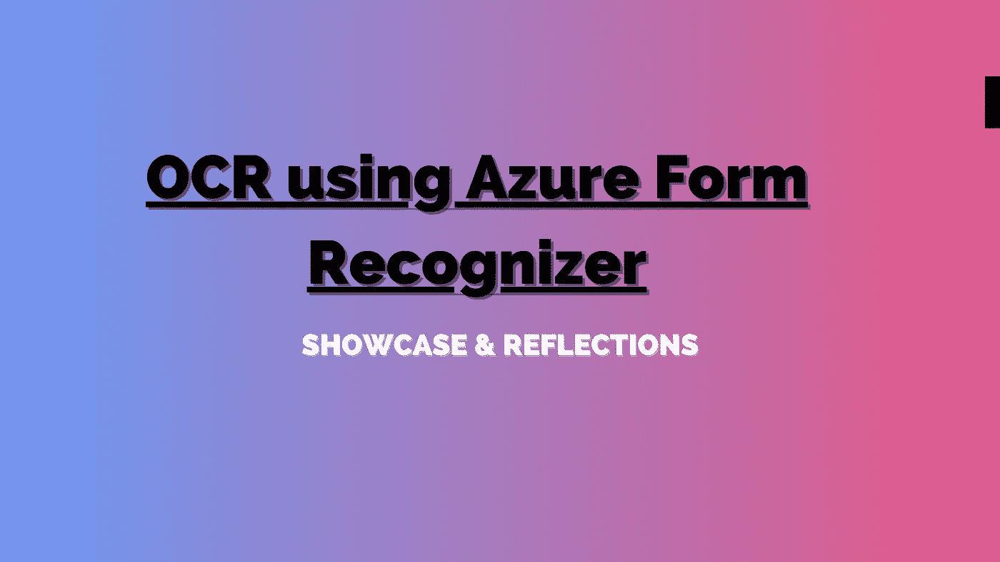
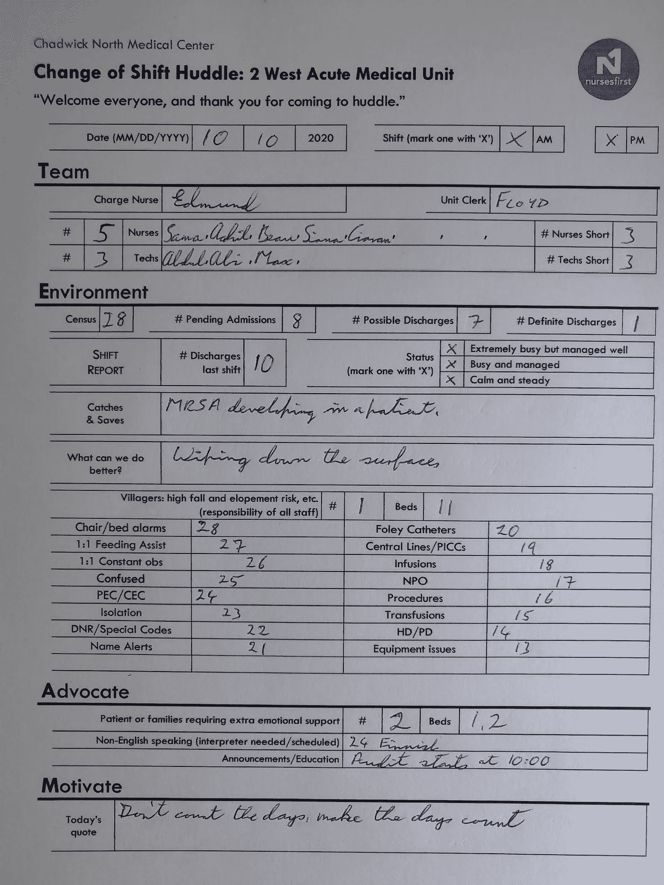
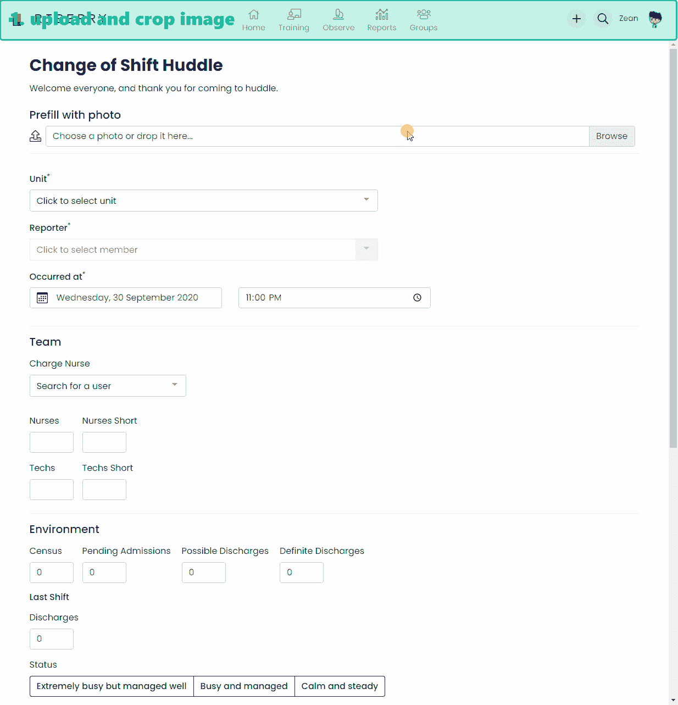
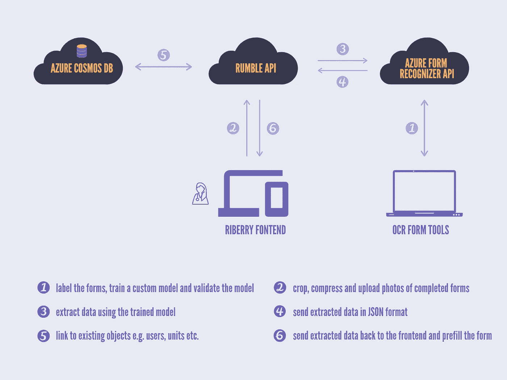
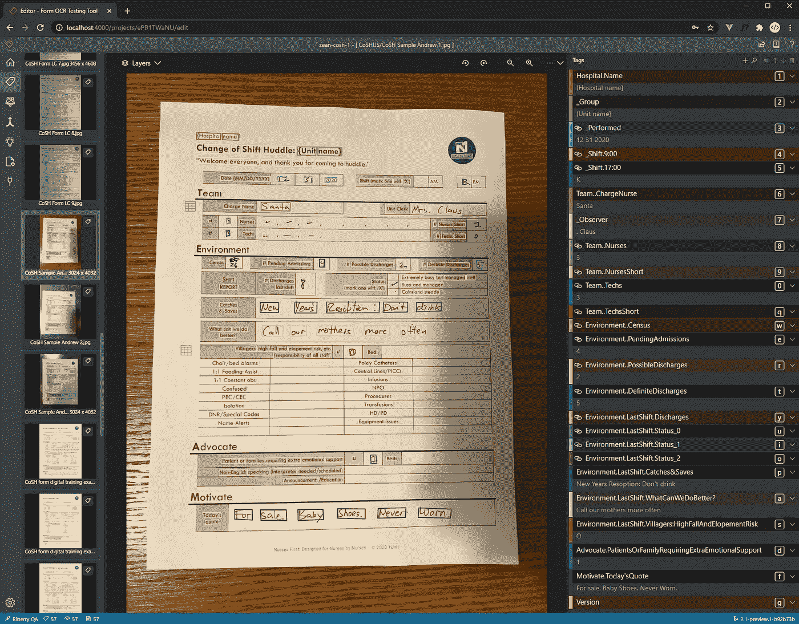
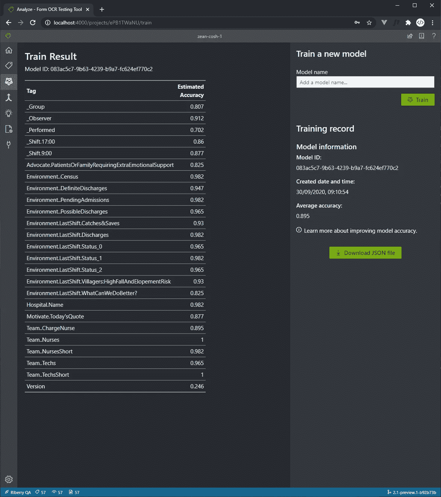
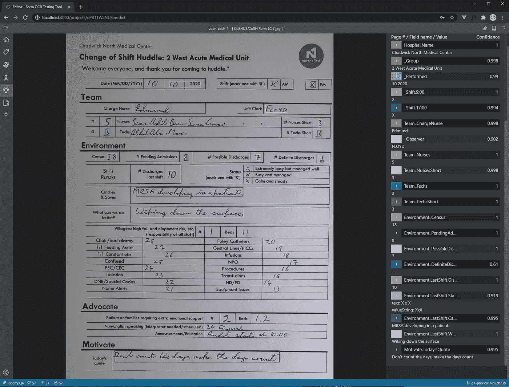
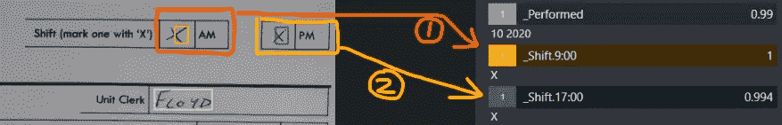
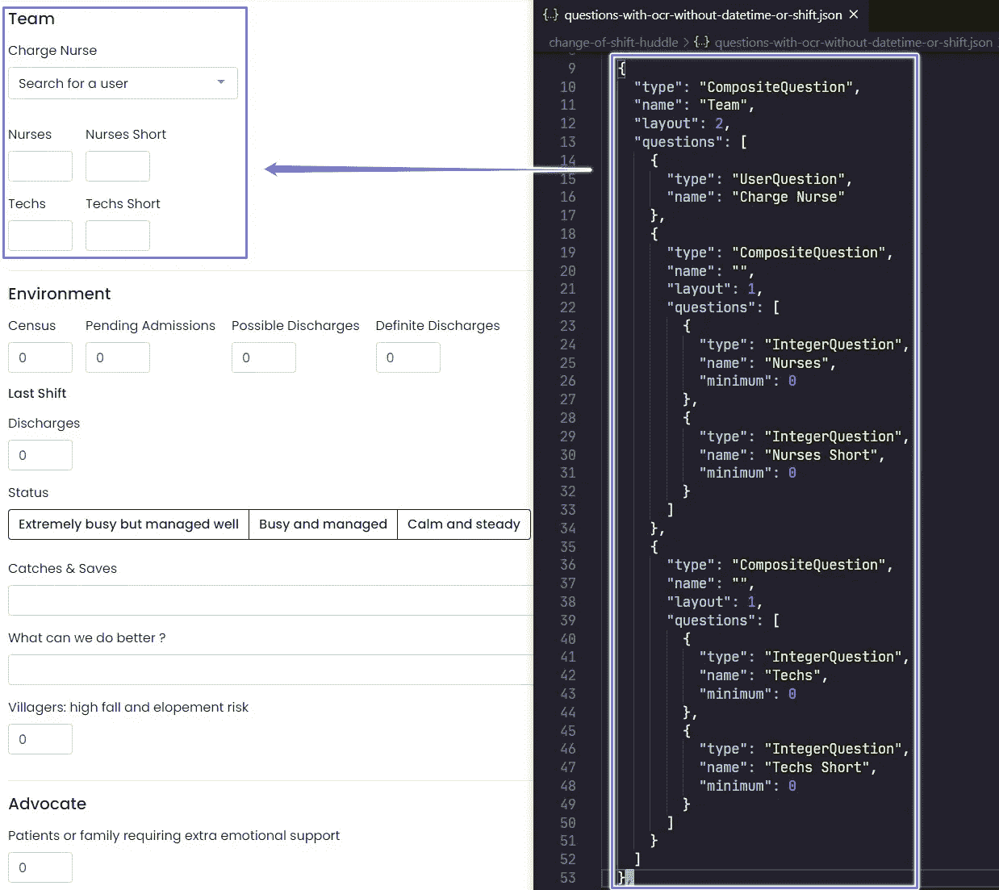
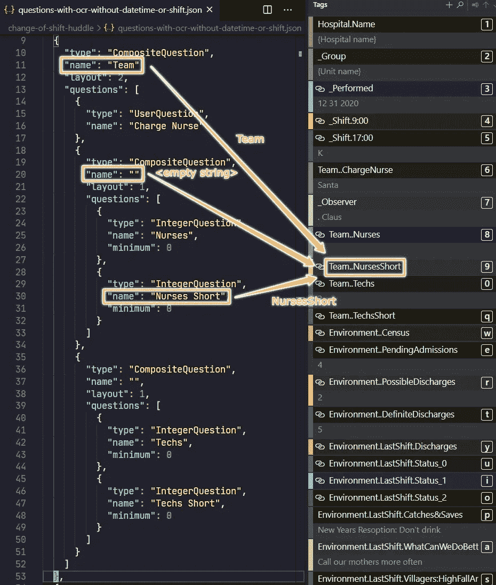

# 在医院环境中从纸质表格中提取交接班数据

> 原文：<https://towardsdatascience.com/extracting-shift-handover-data-from-paper-forms-in-a-hospital-environment-b2fbb23fe585?source=collection_archive---------61----------------------->

图片作者。

# 背景

在大多数医院的交接班时，会填写一份纸质表格来总结上一次交接班，并强调即将到来的交接班的关键方面。例如，一个完整的表单可能如下所示。

填好的表格样本。图片作者。

这些完成的表格在以后被收集在一起，一个人将仔细检查每一个表格并在计算机上手动输入数据。然后，记录的数据可以输入到分析系统中，以生成见解。

# 项目的目标

**该项目的主要目标**是通过构建一个工具来简化数据收集流程，

*   用户可以使用他们的智能手机给完成的表格拍照，
*   然后，该工具自动提取数据并预填充表单，并且
*   用户可以查看和保存数据。

用户可以选择在完成表单后立即拍照并上传，或者在稍后拍摄多个完成的表单。

其他一些功能包括:

*   提供表格的数字版本，用户可以直接在他们的电话/平板电脑上填写，
*   保存原始图像和提取的数据，
*   链接数据，如单位、用户等。到系统中的现有实体。

# 演示

在[里贝里](https://riberry.health/)，我们建立了一个平台，用于在医院环境中收集数据和生成见解，以及提供临床改进计划。本文只关注使用 OCR 从纸质表单中提取数据——这是数据收集方面的一个特性。

下面是如何从纸质表格中提取数据并输入系统的演示。

OCR 演示。图片作者。

# 架构概述

我们使用微软的[表单识别器](https://azure.microsoft.com/en-au/services/cognitive-services/form-recognizer/)服务从表单中提取数据。更具体地说，我们已经训练了一个定制模型，而不是使用预先构建的模型，来更好地处理我们的客户使用的表单的结构。

在非常高的水平上，我们将首先训练一个模型。然后，用户可以通过前端(又名 Riberry)将填写好的表格的照片上传到名为 Rumble 的 API。然后，Rumble 使用经过训练的模型从表单中提取数据，并在将提取的数据发送回用户之前对其进行转换和清理。下图对此过程有更详细的解释。

架构概述。图片作者。

# 训练模型

> **注意**:本文的重点是展示最终产品，并反思在添加 OCR 支持方面学到的经验，而不是如何使用 Azure Form Recognizer 服务的分步指南。写指南也没有意义；你不可能真的打败他们的[文档和例子](https://docs.microsoft.com/en-us/azure/cognitive-services/form-recognizer/?branch=release-build-cogserv-forms-recognizer)。
> 
> 如果您想学习如何使用表单识别器服务，我强烈推荐您通读他们的文档—这确实是最有效的方法。

表单识别器服务的核心是一组[REST API](https://westus2.dev.cognitive.microsoft.com/docs/services/form-recognizer-api-v2/operations/AnalyzeWithCustomForm)，允许您通过使用监督/非监督机器学习来训练模型，管理(例如，列出、删除、复制)模型，以及使用定制/预构建的模型提取数据。

此外，它还提供了一个开源工具(OCR-Form-Tools) ，它可以与这些 REST APIs 进行交互，并提供一个直观的 UI 来标记您的数据，训练模型并通过预测测试文档来验证模型。

> **提示**:在[他们关于设置样品贴标工具的指南](https://docs.microsoft.com/en-us/azure/cognitive-services/form-recognizer/quickstarts/label-tool?tabs=v2-0#set-up-the-sample-labeling-tool)中，他们谈到了通过 Docker 运行该工具。
> 
> 比起使用 Docker，我发现从 [GitHub](https://github.com/microsoft/OCR-Form-Tools) 中取出一份工具并从源代码中构建/运行它要容易得多。

在工具启动并运行之后，我能够轻松地标记我们的样本数据、训练模型和测试模型。

标记训练数据。图片作者。

训练一个模特。图片作者。

验证训练好的模型。图片作者。

# 杂项反思

现在项目已经部署到生产中，这是一个很好的时间来回顾它，反思我从做这件事中学到的各种事情/教训。

## 1.培训过程

使用监督学习方法预测表单内容应该有三个主要阶段，

1.  检测表单上的文本元素(打印的或手写的)并计算它们的预期大小和位置，
2.  从每个元素中提取实际的文本内容，
3.  使用步骤 1 中获得的元素大小和位置信息，将元素分类到指定的不同标签中。

> **提示**:通过监督学习，我们正在拟合一个模型，根据页面上元素的位置信息将页面上的元素分类到不同的标签中。
> 
> 我们 ***不是*** 训练任何 NLP 模型从页面上识别的元素中提取文本。这一部分由表单识别器服务在内部处理。

每个文本元素的位置和大小由其由 8 个数字组成的边界框来表示。并且这 8 个数字应该是每个训练实例即每个文本元素的主要特征。

还可能有许多数据论证和特征操作技术应用于训练数据，以人工扩展数据集，从而提高模型的准确性。例如，他们可能会使用一些保留标签的变换技术，如去噪/锐化、弹性变形、仿射变换、降维等。

但总的来说，成本函数应该相对简单，只有几个变量。对于[只需要 5 个文档](https://docs.microsoft.com/en-us/azure/cognitive-services/form-recognizer/overview#custom-models)就可以开始使用，我并不感到惊讶。

## 2.添加对复选框/单选问题的支持

表单识别器服务[并不正式支持复选框或单选按钮](https://docs.microsoft.com/en-us/azure/cognitive-services/form-recognizer/overview#input-requirements)，但是我已经能够很容易地绕过它，

*   为复选框或单选问题中的每个选项应用标签，以及
*   在预测时，将这些带有值的标签视为用户选择的选项。

例如，医院使用的表单包含一个带有两个选项的复选框问题— AM 或 PM。在训练过程中，我分别为 AM 和 PM 选项设置了标签`_Shift.9:00`和`_Shift.17:00`(见下文)。

添加对复选框/单选问题的支持。图片作者。

假设，如果我们将上面的表单输入到训练好的模型中，将为`_Shift.9:00`和`_Shift.17:00`提取一个字符串‘x’。如果这是一个复选框问题，我会认为两个选项都被选中，如果这是一个单选问题，我会认为第一个选项被选中。

## 3.异步提取数据，并在结果就绪时通知用户

在**向其端点发送**表单并从中提取数据之后，您将获得一个`Operation-Location`、[，这是一个包含](https://westus2.dev.cognitive.microsoft.com/docs/services/form-recognizer-api-v2/operations/AnalyzeWithCustomForm)、`[resultId](https://westus2.dev.cognitive.microsoft.com/docs/services/form-recognizer-api-v2/operations/AnalyzeWithCustomForm)`、[的 URL，用于跟踪进度并获得分析操作](https://westus2.dev.cognitive.microsoft.com/docs/services/form-recognizer-api-v2/operations/AnalyzeWithCustomForm)的结果。我们要反复检查这个结果数据的 URL。

> **提示**:我将检查结果的频率设置为每秒一次。这似乎与他们的 OCR 工具用于检查结果的频率相同。
> 
> **提示**:如果您的用户必须等待结果才能采取下一步行动，请在发布图像进行分析之前对其进行压缩，以缩短等待时间。
> 
> 如今智能手机上拍摄的图像相当大，我将它们压缩到 4.1 背景

纸质表单上的字段与数字表单上的字段并不完全匹配——纸质表单上的一些数据被忽略，而网络表单上有一些额外的字段。此外，虽然纸质表格很少改变，但我们会通过添加/删除问题或围绕现有问题移动来稍微更新数字表格。

**4.2 我们如何设计它**

## web 表单上的问题及其布局是使用 JSON 文件定义的。不涉及细节，在下面的截图中，JSON 结构(右)定义了表单的**团队**部分(左)。

在 JSON 中定义问题。图片作者。

但是，我们也使用 JSON 文件中问题的名称来自动构造该问题的标签(在 OCR 中使用)。例如，在下面的截图中，标签— **团队..护士简写**——“护士简写”问题是通过用一个点连接其所有祖先和自身的名字而创建的。

来自问题名称的标签。图片作者。

**4.3 设计问题**

这意味着，每当我们更改表格的数字版本时(例如，添加/删除问题或重新排列表格上的字段)，都会生成一组新的标签。我们必须重新命名表单识别器中使用的标签，重新训练模型，将其复制到生产环境中等等。这是一个非常耗时的过程。

**4.4 我们应该做什么而不是做什么**

我们应该将标签生成从 form.gggg 的 JSON 定义中分离出来

假设纸质表单很少改变，我们应该硬编码一组标签用于表单识别器服务。然后，我们可以扩展 JSON 定义以包含一个`label`属性，该属性指定每个问题所使用的标签(如果适用的话)。

这不仅简化了绑定数据的代码(即，将提取的数据转换为域对象)，还意味着我们可以自由地重新排列表单上的问题，而不必在表单识别器中重新训练模型。

参考

[表单识别器 API (v2.0)](https://westus2.dev.cognitive.microsoft.com/docs/services/form-recognizer-api-v2/operations/AnalyzeWithCustomForm)

[表单识别器文档](https://docs.microsoft.com/en-us/azure/cognitive-services/form-recognizer/?branch=release-build-cogserv-forms-recognizer)

[OCR 表单工具](https://github.com/microsoft/OCR-Form-Tools)

# [设置样品标签工具](https://docs.microsoft.com/en-us/azure/cognitive-services/form-recognizer/quickstarts/label-tool?tabs=v2-0#set-up-the-sample-labeling-tool)

*   [Form Recognizer API (v2.0)](https://westus2.dev.cognitive.microsoft.com/docs/services/form-recognizer-api-v2/operations/AnalyzeWithCustomForm)
*   [Form Recognizer documentation](https://docs.microsoft.com/en-us/azure/cognitive-services/form-recognizer/?branch=release-build-cogserv-forms-recognizer)
*   [OCR-Form-Tools](https://github.com/microsoft/OCR-Form-Tools)
*   [Set up the sample labelling tool](https://docs.microsoft.com/en-us/azure/cognitive-services/form-recognizer/quickstarts/label-tool?tabs=v2-0#set-up-the-sample-labeling-tool)