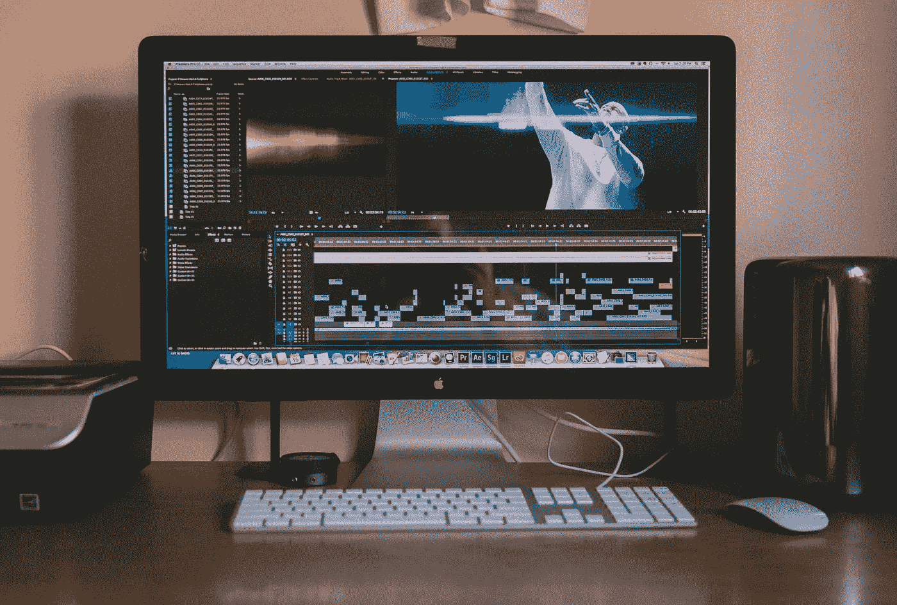
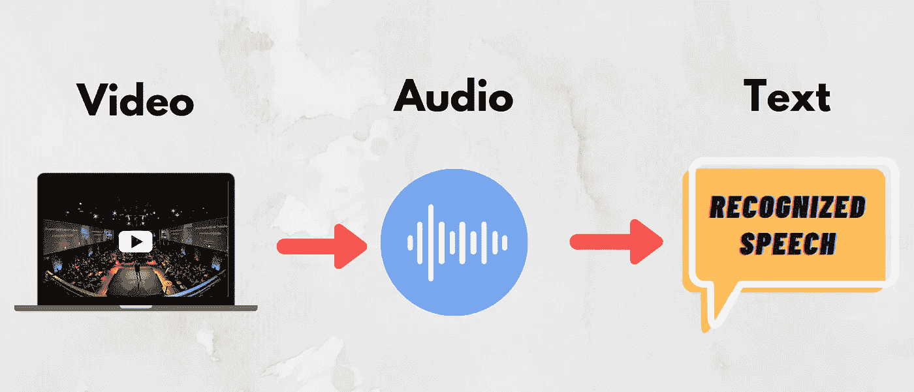

# 使用 Python 从视频中提取语音

> 原文：<https://towardsdatascience.com/extracting-speech-from-video-using-python-f0ec7e312d38?source=collection_archive---------1----------------------->

## 使用 Google 语音识别 API 的简单实用项目



雅各布·欧文斯在 [Unsplash](https://unsplash.com/photos/l82NzBSYbj0?utm_source=unsplash&utm_medium=referral&utm_content=creditCopyText) 上的照片

在这篇文章中，我将向你展示如何从视频文件中提取演讲。在识别演讲之后，我们将把它们转换成文本文档。这将是一个简单的机器学习项目，这将有助于你理解谷歌语音识别库的一些基础知识。语音识别是机器学习概念下的一个热门话题。语音识别越来越多地用于许多领域。例如，我们在网飞节目或 YouTube 视频中看到的字幕大多是由使用人工智能的机器创建的。其他语音识别器的伟大例子是个人语音助手，如谷歌的 Home Mini，亚马逊 Alexa，苹果的 Siri。

## 目录:

*   ***入门***
*   ***第一步:导入库***
*   ***第二步:视频转音频***
*   ***第三步:语音识别***
*   ***最后一步:导出结果***



照片由[亚历山大·佩莱斯](https://unsplash.com/@apellaes?utm_source=unsplash&utm_medium=referral&utm_content=creditCopyText)在 [Unsplash](https://unsplash.com/@apellaes?utm_source=unsplash&utm_medium=referral&utm_content=creditCopyText) 拍摄

# 入门指南

正如你可以理解的标题，我们将需要这个项目的视频记录。它甚至可以是你对着镜头说话的录音。使用名为 *MoviePy，*的库，我们将从视频记录中提取音频。下一步，我们将使用谷歌的语音识别库将音频文件转换成文本。如果您准备好了，让我们从安装库开始吧！

## 图书馆

我们将为这个项目使用两个库:

*   语音识别
*   电影

在将它们导入到我们的项目文件之前，我们必须安装它们。在 python 中安装模块库非常容易。您甚至可以在一行代码中安装几个库。在您的终端窗口中写下下面一行:

```
pip install SpeechRecognition moviepy
```

是的，就是它。 **SpeechRecognition** 模块支持多种识别 API，Google Speech API 就是其中之一。你可以从[这里](https://pypi.org/project/SpeechRecognition/)了解更多关于这个模块的信息。

**MoviePy** 是一个可以读写所有最常见的音频和视频格式的库，包括 GIF。如果您在安装 moviepy 库时遇到问题，请尝试安装 ffmpeg。Ffmpeg 是一个领先的多媒体框架，能够解码、编码、转码、复用、解复用、流式传输、过滤和播放人类和机器创造的几乎任何东西。

现在，我们应该开始在代码编辑器中编写代码了。我们将从导入库开始。

# 步骤 1-导入库

```
import speech_recognition as sr import moviepy.editor as mp
```

是的，这就是我们完成任务所需要的。抓紧时间，让我们进入下一步。

# 步骤 2 —视频到音频转换

在这一步，我们将做一些很酷的事情，将我们的视频记录转换成音频文件。视频格式有很多种，其中一些可以列举如下:

*   MP4 (mp4、m4a、m4v、f4v、f4a、m4b、m4r、f4b、mov)
*   3GP (3gp、3gpp2、3g2、3gpp、3gpp 2)
*   OGG (ogg、oga、ogv、ogx)
*   WMV (wmv、wma、asf*)

我们应该知道我们的视频格式做转换没有任何问题。除了视频格式，了解一些音频格式也是一个很好的练习。以下是其中的一些:

*   MP3 文件
*   加气混凝土
*   WMA
*   AC3(杜比数字)

现在，我们对这两种格式都有了一些了解。是时候使用 MoviePy 库进行转换了。你不会相信这有多容易。

```
clip = mp.VideoFileClip(r”video_recording.mov”) 

clip.audio.write_audiofile(r”converted.wav”)
```

我建议转换成 wav 格式。它与语音识别库配合得很好，这将在下一步中介绍。

[](/building-a-speech-recognizer-in-python-2dad733949b4) [## 用 Python 构建语音识别器

### 使用谷歌云语音 API 将您的音频文件转换为文本

towardsdatascience.com](/building-a-speech-recognizer-in-python-2dad733949b4) 

# 步骤 3 —语音识别

首先，让我们定义识别器。

```
r = sr.Recognizer()
```

现在让我们导入在上一步(步骤 2)中创建的音频文件。

```
audio = sr.AudioFile("converted.wav")
```

完美！最棒的部分来了，就是识别音频文件中的语音。识别器将尝试理解语音并将其转换为文本格式。

```
with audio as source:
  audio_file = r.record(source)result = r.recognize_google(audio_file)
```

# 最后一步—导出结果

干得好！艰苦的工作完成了。在这一步中，我们将把识别的语音导出到一个文本文档中。这将有助于你储存你的作品。我还添加了一个*打印(“准备！”)*结束代码。以便我们知道文件何时准备好，工作何时完成。

```
# exporting the result 
with open('recognized.txt',mode ='w') as file: 
   file.write("Recognized Speech:") 
   file.write("\n") 
   file.write(result) 
   print("ready!")
```

# 视频演示

刚刚开始我在 YouTube 上的旅程，我将为您演示机器学习、数据科学、人工智能和更多项目。尽情享受吧！

[](https://lifexplorer.medium.com/membership) [## 加入我的介绍链接媒体-贝希克居文

### 作为一个媒体会员，你的会员费的一部分会给你阅读的作家，你可以完全接触到每一个故事…

lifexplorer.medium.com](https://lifexplorer.medium.com/membership) 

恭喜你。你已经创建了一个程序，将视频转换成音频文件，然后从该音频中提取语音。最后，将识别的语音导出到文本文档中。希望你喜欢阅读这篇文章并参与这个项目。如果你今天学到了新东西，我很高兴。从事像这样的动手编程项目是提高编码技能的最好方式。

如果您在执行代码时有任何问题，请随时[联系我](https://sonsuzdesign.blog/contact/)。

> 关注我的[博客](https://medium.com/@lifexplorer)和[了解数据科学](https://towardsdatascience.com/)以获得灵感。

## 相关内容:

[](/convert-text-to-speech-in-5-lines-of-code-1c67b12f4729) [## 用 5 行代码将文本转换成语音

### 了解文本到语音转换可以发挥作用的领域

towardsdatascience.com](/convert-text-to-speech-in-5-lines-of-code-1c67b12f4729) [](/simple-face-detection-in-python-1fcda0ea648e) [## Python 中的简单人脸检测

### 如何使用 OpenCV 库检测图像中的人脸

towardsdatascience.com](/simple-face-detection-in-python-1fcda0ea648e)