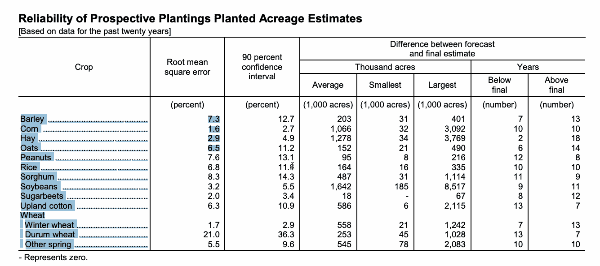
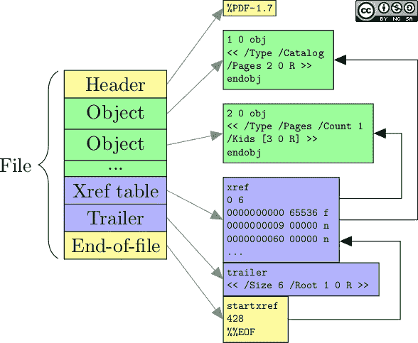
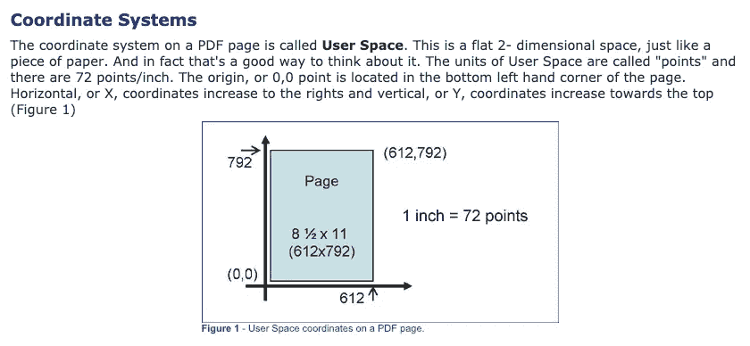
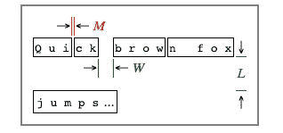
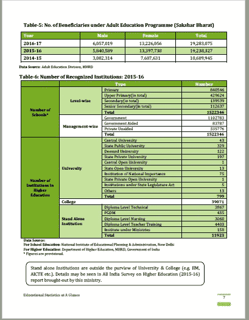
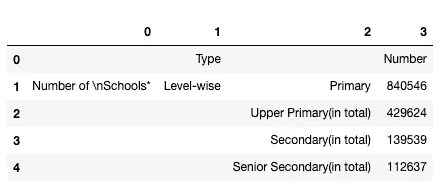
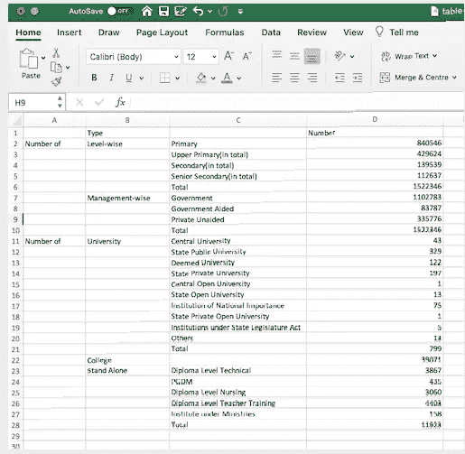
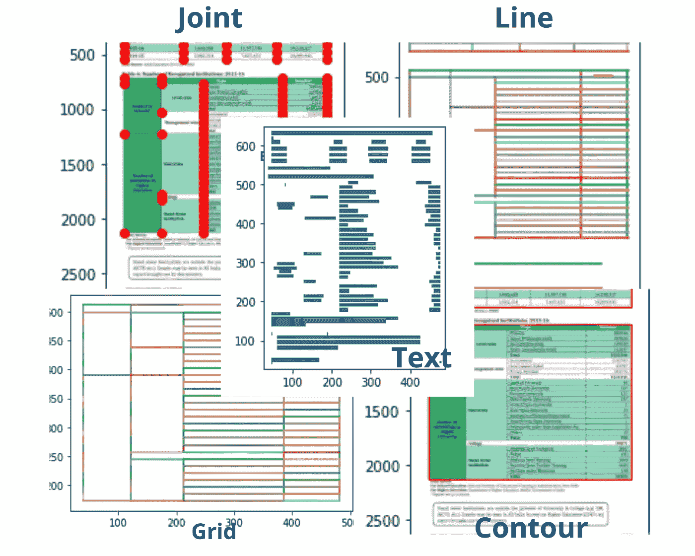

# Camelot 让从 pdf 中提取表格数据变得简单。

> 原文：<https://towardsdatascience.com/extracting-tabular-data-from-pdfs-made-easy-with-camelot-80c13967cc88?source=collection_archive---------4----------------------->

## 从 pdf 中提取表格并不困难。


丹尼·米勒在 [Unsplash](https://unsplash.com?utm_source=medium&utm_medium=referral) 上的照片

从 pdf 中提取表格数据很难。但更大的问题是，许多公开数据都是 PDF 文件。这些公开数据对于分析和获得重要见解至关重要。然而，访问这样的数据成为一个挑战。例如，让我们看看由[国家农业统计局(NASS)](http://by the National Agricultural Statistics Service (NASS),) 发布的一份重要报告，它涉及美国种植的主要农作物:



报告来源:[https://www . NASS . USDA . gov/Publications/Todays _ Reports/Reports/pspl 0320 . pdf](https://www.nass.usda.gov/Publications/Todays_Reports/reports/pspl0320.pdf)

对于任何分析，起点都应该是获取包含详细信息的表格，并将其转换为大多数可用工具都能接受的格式。正如你在上面看到的，在这种情况下，简单的复制粘贴是行不通的。大多数情况下，标题不在正确的位置，一些数字会丢失。这使得 pdf 处理起来有些棘手，显然，这是有原因的。我们将讨论这个问题，但首先让我们试着理解 PDF 文件的概念。

这篇文章是寻找合适数据集的完整系列文章的一部分。以下是该系列中包含的所有文章:

**第 1 部分** : [为数据分析任务获取数据集—高级谷歌搜索](/getting-datasets-for-data-analysis-tasks-advanced-google-search-b1c01f9cc324)

**第 2 部分** : [为数据分析任务寻找数据集的有用站点](/useful-sites-for-finding-datasets-for-data-analysis-tasks-1edb8f26c34d)

**第三部分** : [为深度学习项目创建定制图像数据集](/creating-custom-image-datasets-for-deep-learning-projects-6e5db76158d4)

**第 4 部分** : [毫不费力地将 HTML 表格导入 Google Sheets](/import-html-tables-into-google-sheets-effortlessly-f471eae58ac9)

**第 5 部分** : [用 Camelot 从 pdf 中提取表格数据变得很容易。](/extracting-tabular-data-from-pdfs-made-easy-with-camelot-80c13967cc88)

**第六部分** : [从 XML 文件中提取信息到熊猫数据帧](/extracting-information-from-xml-files-into-a-pandas-dataframe-11f32883ce45)

**第 7 部分** : [5 个真实世界数据集，用于磨练您的探索性数据分析技能](/5-real-world-datasets-for-exploratory-data-analysis-21b7cc5afe7e)

# 可移植文档格式，又名 pdf


来源: [Adobe PDF 文件图标](http://Adobe Systems CMetalCore)

[PDF](https://en.wikipedia.org/wiki/PDF) 代表可移植文档格式。这是 Adobe 在 90 年代早期创建的一种文件格式。它基于 [PostScript](https://en.wikipedia.org/wiki/PostScript) 语言，通常用于呈现和共享文档。开发 PDF 背后的想法是要有一种格式，使得在任何现代打印机上查看、显示和打印文档成为可能。

> 每个 PDF 文件都封装了一个固定布局平面文档的完整描述，包括文本、字体、矢量图形、光栅图像以及其他显示*[*维基百科*](https://en.wikipedia.org/wiki/PDF) *所需的信息。**

*基本 PDF 文件包含以下元素。*

**

*[来源:GUILLAUME ENDIGNOUX 的 PDF 语法简介](https://gendignoux.com/blog/2016/10/04/pdf-basics.html)*

## *为什么从 PDF 中提取表格很难？*

*如果你看上面的 PDF 布局，你会发现其中没有表格的概念。PDF 包含将字符放置在二维平面的 x，y 坐标上的指令，不保留单词、句子或表格的知识。*

**

*来源:[https://www . PDF scripting . com/public/PDF-Page-coordinates . cfm](https://www.pdfscripting.com/public/PDF-Page-Coordinates.cfm)*

*那么 PDF 如何区分单词和句子呢？通过将字符放在一起来模拟单词，而通过将单词放在相对更远的位置来模拟句子。下图将更具体地巩固这一概念:*

**

*来源:http://www.unixuser.org/~euske/python/pdfminer/index.html*

*m 表示上图中两个字之间的距离， **W** 表示两个字之间的间距。任何带有空格的文本块被组合成一个。表格是通过在没有任何行或列信息的电子表格中输入单词来模拟的。因此，这使得从 pdf 中提取数据用于分析变得非常困难。然而，政府报告、文档等形式的大量公开数据。，以 pdf 格式发布。一种能够提取信息而不影响其质量的工具是当前需要的。这一点将我们带到了一个名为 [**Camelot**](https://camelot-py.readthedocs.io/en/master/) 的多功能库，它被创建来从 pdf 中提取表格信息。*

# *卡米洛特:人类 PDF 表格提取*

**

*来源:[https://camelot-py.readthedocs.io/en/master/](https://camelot-py.readthedocs.io/en/master/)*

*Camelot 的名字来源于著名的 [Camelot 项目](http://www.planetpdf.com/planetpdf/pdfs/warnock_camelot.pdf)，它是一个开源的 Python 库，可以帮助您轻松地从 pdf 中提取表格。它建立在另一个用于 PDF 文档的文本提取工具 [pdfminer](https://pypi.org/project/pdfminer/) 之上。*

*它附带了许多有用的功能，例如:*

*   ***可配置性—** 适用于大多数情况，但也可以进行配置*
*   ***使用 Matplotlib 库进行可视化调试***
*   *输出有多种格式，包括 CSV、JSON、Excel、HTML，甚至 Pandas dataframe。*
*   *开源 -麻省理工学院许可*
*   *详细的**文档***

## *装置*

*您可以通过 conda、pip 或直接从源代码安装 Camelot。如果您使用 pip，不要忘记安装以下依赖项: [Tkinter](https://wiki.python.org/moin/TkInter) 和 [Ghostscript](https://www.ghostscript.com/) 。*

```
*#conda (easiest way)
$ conda install -c conda-forge camelot-py#pip after [installing the tk and ghostscript dependencies](https://camelot-py.readthedocs.io/en/master/user/install-deps.html#install-deps)
$ pip install "camelot-py[cv]"*
```

## *工作*

*在我们开始工作之前，最好先了解一下到底发生了什么。通常，Camelot 使用两种解析方法来提取表:*

*   ***Stream** :查找单词之间的空格来识别表格。*
*   ***点阵**:寻找页面上的线条来识别表格[。默认使用](https://camelot-py.readthedocs.io/en/master/user/how-it-works.html) [点阵](https://camelot-py.readthedocs.io/en/master/user/how-it-works.html#lattice)。*

*你可以在[文档](https://camelot-py.readthedocs.io/en/master/user/how-it-works.html)中读到更多关于卡梅洛特的工作。*

## *使用*

*现在让我们进入激动人心的部分——从 pdf 中提取表格。在这里，我使用了一个 PDF 文件，其中包含了印度 2015-16 年成人教育项目**受益人数[的信息。PDF 看起来像这样:](https://www.mhrd.gov.in/sites/upload_files/mhrd/files/statistics-new/ESAG-2018.pdf)***

**

*来源:[https://www . mhrd . gov . in/sites/upload _ files/mhrd/files/statistics-new/ESAG-2018 . pdf](https://www.mhrd.gov.in/sites/upload_files/mhrd/files/statistics-new/ESAG-2018.pdf)*

*我们将从导入库和读入 PDF 文件开始，如下所示:*

```
*import camelot
tables = camelot.read_pdf('schools.pdf')*
```

*我们得到一个`TableList`对象，这是一个由`[**Table**](https://camelot-py.readthedocs.io/en/master/api.html#camelot.core.Table)`对象组成的列表。*

```
*tables
--------------
<TableList n=2>*
```

*我们可以看到已经检测到两个表，通过它的索引可以很容易地访问这两个表。让我们访问第二个表，即包含更多信息的表，并查看其形状:*

```
*tables[1] #indexing starts from 0<Table shape=(28, 4)>*
```

*接下来，让我们打印解析报告，它是表的提取质量的指示:*

```
*tables[1].parsing_report{'accuracy': 100.0, 'whitespace': 44.64, 'order': 2, 'page': 1}*
```

*它显示了高达 100%的准确性，这意味着提取是完美的。我们也可以如下访问表格的数据框架:*

```
*tables[1].df.head()*
```

**

*作者将 PDF 提取到 Dataframe |图像中*

*整个表格也可以提取为 CSV 文件，如下所示:*

```
*tables.export('table.csv')*
```

**

*作者导出为 CSV |图像的 PDF 表格*

## *可视化调试*

*此外，您还可以根据指定的种类绘制 PDF 页面上的元素，如`‘text’, ‘grid’, ‘contour’, ‘line’, ‘joint’`等。这些对于调试和使用不同的参数来获得最佳输出非常有用。*

```
*camelot.plot(tables[1],kind=<specify the kind>)*
```

**

*在 PDF 页面上找到的绘图元素|作者图片*

## *高级用法和 CLI*

*Camelot 也有一个命令行界面[。它还配备了一系列高级功能，如:](https://camelot-py.readthedocs.io/en/master/user/cli.html#cli)*

*   *读取加密的 pdf*
*   *阅读旋转的 pdf*
*   *当默认结果不完美时调整参数。指定精确的表格边界，指定列分隔符，等等。你可以在这里阅读更多关于这些功能的信息[。](https://camelot-py.readthedocs.io/en/master/user/advanced.html#advanced)*

## *缺点*

*Camelot 只能处理基于文本的 pdf，不能处理扫描的文档。因此，如果你有扫描文件，你必须看看其他一些替代品。*

# *⚔️神剑——网络界面:蛋糕上的糖衣*

*Camelot 的另一个有趣的特性是，它也有一个名为 **Excalibur** 的 web 界面，供那些不想编码但仍想使用该库特性的人使用。让我们快速看看如何使用它。*

## *装置*

*安装 [Ghostscript](https://www.ghostscript.com/) 后，使用 pip 安装 Excalibur:*

```
*$ pip install excalibur-py* 
```

*然后使用以下命令启动 web 服务器:*

```
*$ excalibur webserver*
```

*然后，您可以导航到本地主机来访问该界面。下面的视频演示了整个过程:*

*Excalibur 演示|作者视频*

# *结论*

*在上面的文章中，我们研究了 Camelot——这是一个开源 python 库，对于从 pdf 中提取表格数据非常有帮助。事实上，它有许多可以调整的参数，这使得它具有很好的可伸缩性，并适用于许多情况。Web 界面为寻找无代码环境的人们提供了一个极好的选择。总的来说，它似乎是一个有用的工具，可以帮助减少通常用于数据提取的时间。*

# *参考*

*这篇文章的灵感来自 Vinayak Mehta 的[演讲，vinay AK](https://www.youtube.com/watch?v=m6xKhzp54-E)Mehta 是 2019 印度 PyCon 上卡米洛特项目的创建者和维护者。一些资源摘自活动结束后公开分享的幻灯片。强烈建议观看演示以获得更清晰的内容。*