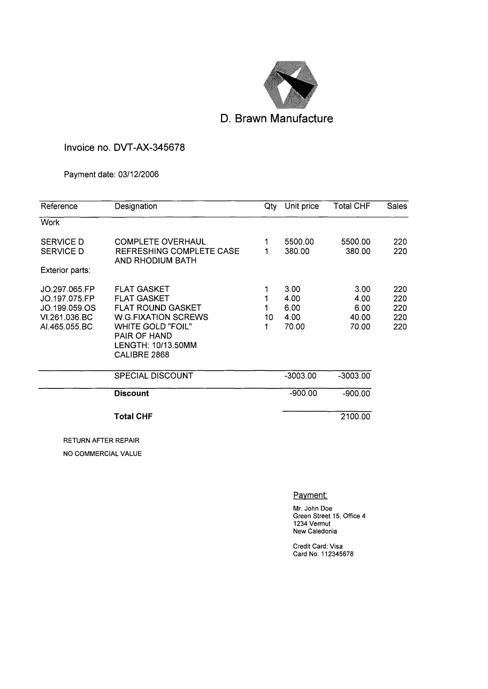
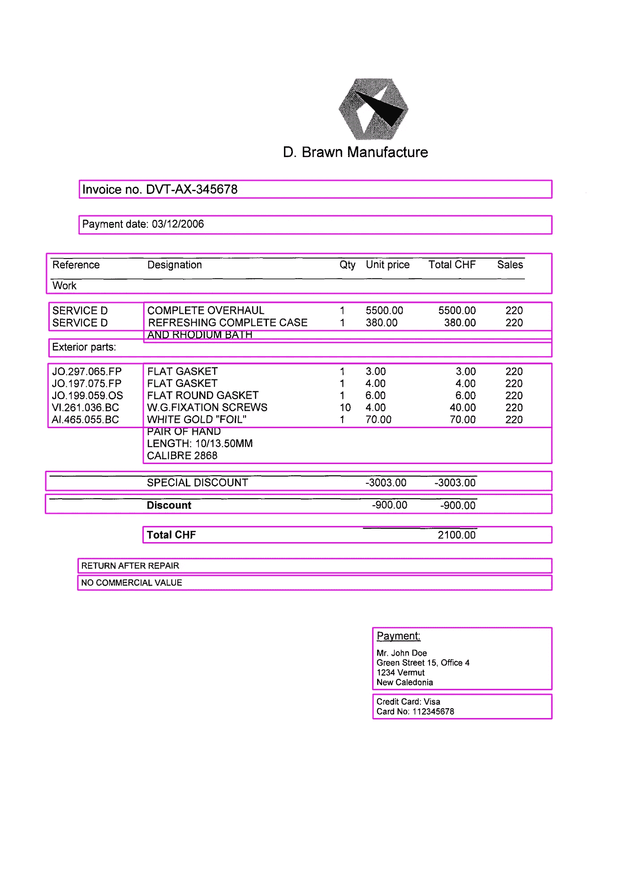
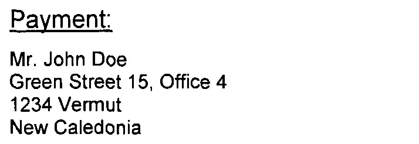
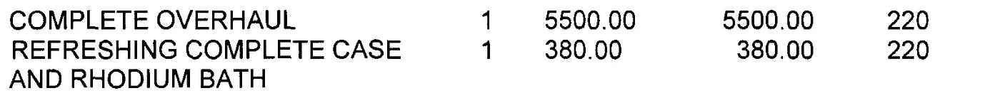

# 使用 Pytesseract & Open CV 从扫描的 PDF 中提取文本

> 原文：<https://towardsdatascience.com/extracting-text-from-scanned-pdf-using-pytesseract-open-cv-cd670ee38052?source=collection_archive---------0----------------------->

## 使用 Python 和其他开源库的文档智能

从发票的数字副本中提取信息的过程可能是一项棘手的任务。市场上有各种工具可以用来完成这项任务。然而，有许多因素导致大多数人希望使用开源库来解决这个问题。

几天前，我遇到了一个类似的问题，我想和你分享我解决这个问题的所有方法。我用来开发这个解决方案的库是 **pdf2image** (用于将 pdf 转换成图像)**、OpenCV** (用于图像预处理)，最后是用于 OCR 的**pytesserac**以及 **Python** 。

# **将 PDF 转换为图像**

pdf2image 是一个 python 库，它使用 pdftoppm 库将 pdf 转换为一系列 PIL 图像对象。以下命令可用于使用 pip 安装方法安装 pdf2image 库。

> pip 安装 pdf2image

注意:pdf2image 使用的 ***Poppler*** 是基于 xpdf-3.0 代码库的 pdf 渲染库，没有它就无法工作。有关 Poppler 的下载和安装说明，请参考以下资源。

[*https://anaconda.org/conda-forge/popple*](https://anaconda.org/conda-forge/poppler)*r*

[*https://stack overflow . com/questions/18381713/how-to-install-poppler-on-windows*](https://stackoverflow.com/questions/18381713/how-to-install-poppler-on-windows)

安装后，任何 pdf 可以转换成图像使用以下代码。

使用 Python 将 PDF 转换为图像

将 PDF 转换为图像后，下一步是突出显示我们必须从中提取信息的图像区域。

> 注意:在标记区域之前，请确保您已经对图像进行了预处理以提高其质量(DPI ≥ 300，应调整偏斜度、锐度和亮度、阈值等。)

# **标记用于信息提取的图像区域**

在这一步中，我们将标记图像中需要提取数据的区域。在用矩形标记了这些区域之后，我们将从原始图像中一个接一个地裁剪这些区域，然后将它们提供给 OCR 引擎。

> 我们大多数人都会想到这一点——为什么我们要在进行 OCR 之前标记图像中的区域，而不是直接进行呢？
> 
> 这个问题的简单答案是你可以
> 
> 此问题的唯一问题是，有时文档中嵌入了隐藏的换行符/分页符，如果此文档直接传递到 OCR 引擎，数据的连续性会自动中断(因为 OCR 会识别换行符)。

通过这种方法，我们可以对任何给定的文档获得最大的正确结果。在我们的例子中，我们将尝试使用完全相同的方法从发票中提取信息。

以下代码可用于标记图像中感兴趣的区域，并获得它们各自的坐标。

用于标记图像中感兴趣区域的 Python 代码



原始图像(来源:Abbyy OCR 工具示例发票图像)



图像中标记的感兴趣区域(来源:Abbyy OCR 工具样本发票图像)

# **对图像应用光学字符识别**

一旦我们标记了感兴趣的区域(以及相应的坐标),我们就可以简单地裁剪特定区域的原始图像，并通过 pytesseract 来获得结果。

对于那些不熟悉 Python 和 OCR 的人来说，pytesseract 可能是一个让人不知所措的词。根据它的官方网站-

> Python-tesseract 是[谷歌的 Tesseract-OCR 引擎](https://github.com/tesseract-ocr/tesseract)的包装器。它作为 tesseract 的独立调用脚本也很有用，因为它可以读取 Pillow 和 Leptonica 图像库支持的所有图像类型，包括 jpeg、png、gif、bmp、tiff 等。此外，如果用作脚本，Python-tesseract 将打印识别的文本，而不是将其写入文件。

另外，如果你想玩玩 pytesseract 的配置参数，我建议你先浏览下面的链接。

[](https://pypi.org/project/pytesseract/) [## 宇宙魔方

### Python-tesseract 是 Python 的光学字符识别(OCR)工具。也就是说，它会识别并“读取”…

pypi.org](https://pypi.org/project/pytesseract/) [](https://stackoverflow.com/questions/44619077/pytesseract-ocr-multiple-config-options) [## Pytesseract OCR 多个配置选项

### 感谢贡献一个堆栈溢出的答案！请务必回答问题。提供详细信息并分享…

stackoverflow.com](https://stackoverflow.com/questions/44619077/pytesseract-ocr-multiple-config-options) 

以下代码可用于执行此任务。

裁剪图像，然后执行 OCR



裁剪后的图像-1 来自原始图像(来源:Abbyy OCR 工具示例发票图像)

OCR 的输出:

```
Payment:

Mr. John Doe

Green Street 15, Office 4
1234 Vermut

New Caledonia
```



裁剪后的图像-2 来自原始图像(来源:Abbyy OCR 工具示例发票图像)

OCR 输出

```
COMPLETE OVERHAUL 1 5500.00 5500.00 220
REFRESHING COMPLETE CASE 1 380.00 380.00 220
AND RHODIUM BATH
```

如你所见，我们输出的准确率是 100%。

所以这一切都是关于如何开发一个从复杂文档(比如发票)中提取数据的解决方案。

OCR 在文档智能方面有许多应用。使用 pytesseract，无论文档的格式如何(无论是扫描的文档、pdf 还是简单的 jpeg 图像)，都可以提取几乎所有的数据。

此外，由于它是开源的，所以整个解决方案既灵活又不昂贵。