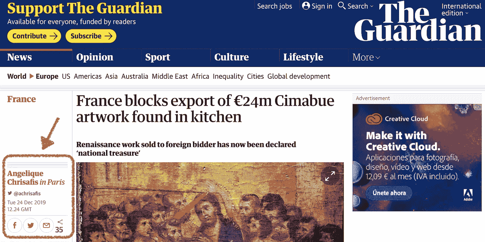
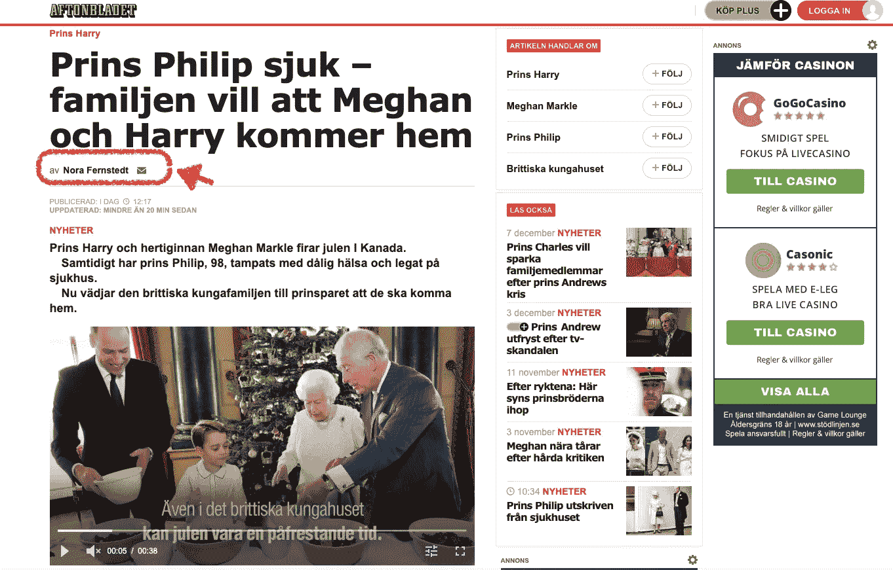
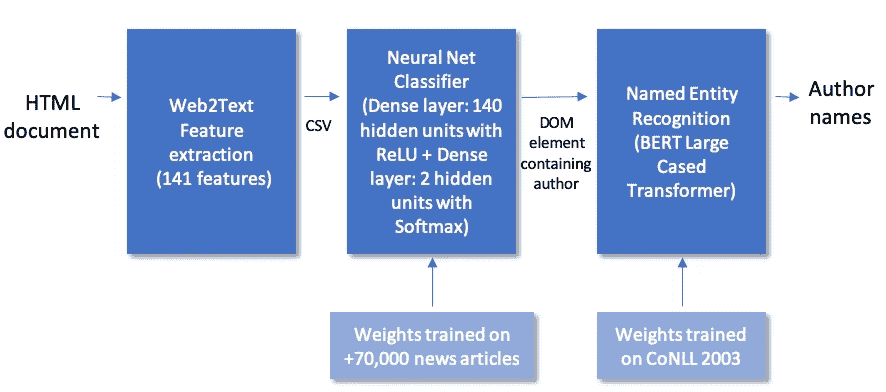
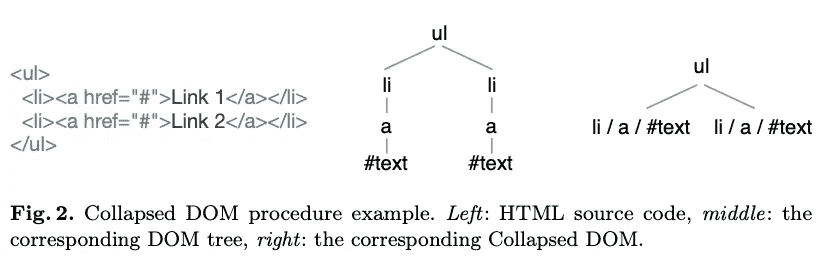
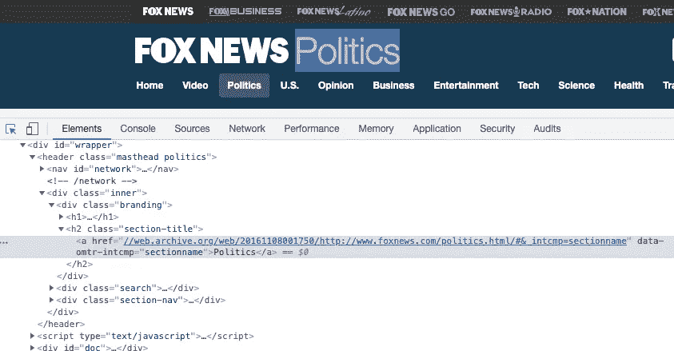
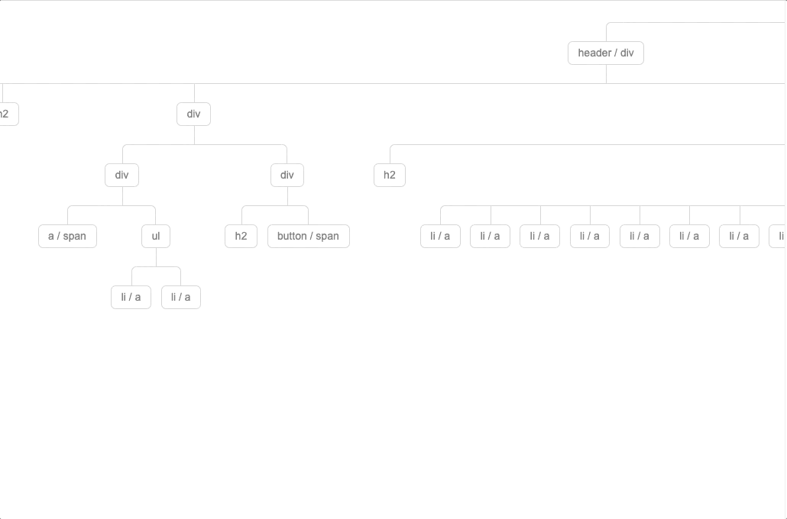
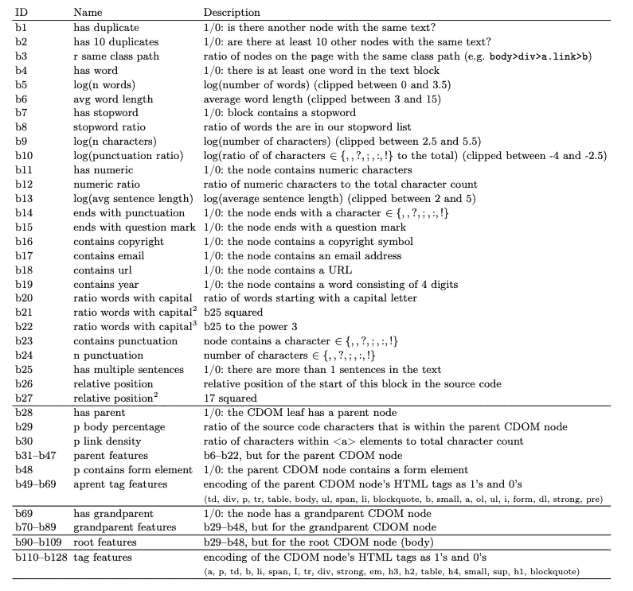
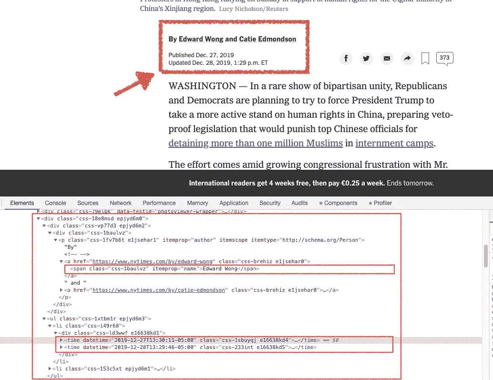
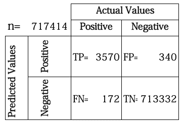

# 基于 DOM 分割和 BERT 的新闻故事作者抽取

> 原文：<https://towardsdatascience.com/extracting-the-author-of-news-stories-with-dom-based-segmentation-and-bert-69225ea0e5c2?source=collection_archive---------22----------------------->

## 如何利用 Web2Text 的 HTML 特征生成框架和 HuggingFace Transformers 进行海量内容提取


获得大量新闻故事的作者是令人生畏的。网页有不同的格式，一个完美的解决方案应该在所有情况下，当可用时，识别作者的全名。作者的名字有时会出现在标题的正下方，但有时会出现在文章的下方，或者几乎完全隐藏在不同的栏目中。作者的名字可能出现在**的任何一种语言**中，可能有也可能没有助词在里面，比如英语介词 ***by*** 。在某些情况下，有一个以上的作者，名字用**逗号-** 或 ***和-*** 分隔。

> 基于**试探法的解析器，**也就是说，使用正则表达式和 bash 脚本来处理条件，在很多情况下都可以很好地工作。然而，一个好的解决方案应该推广到看不见的格式。例如，一些文章在文档中有给定名称的列表(链接到网站上的其他文章或其他元素)，这可能会产生歧义。

众所周知，分类器非常适合内容提取任务，因为它们可以查看多个上下文和布局特征。



这篇来自**卫报**的文章在左栏有作者。字符串**在巴黎**指的是记者写文章的地点，而不是名字的一部分。



瑞典小报 **Aftonbladet** 上的一篇新闻文章，通讯作者在左边。瑞典语中， **av** 放在作者姓名前，类似于英语中的 by**。注意到第二列有一些名字(**哈里王子**、**梅根汗·马克尔**等等。)，这可能会被误认为是文章的作者。这个标题也包含了一个名字( **Prins Phillip** )，同样不是作者。**

# 获取培训示例

我使用了 Andrew Thompson 的[All News](https://www.kaggle.com/snapcrack/all-the-news)数据集(其中有来自 15 家美国出版物的 73，000 篇文章，带有 URL 和作者)。新闻文章的时间跨度为 2015 年至 2017 年。[Archive.org](https://archive.org/)以其原始格式存储了大约 27000 篇新闻文章，其他的都在他们原来的新闻网站上。抓取所有链接大概花了三天时间(4.1 GB 压缩数据)。

因为报纸每隔一段时间就会改变他们的网站结构，所以语料库涵盖的不同案例的数量是未知的(但可以说是很少的)。收集和手动标记其他新闻渠道的更多培训示例以涵盖更多案例应该相当容易。

# 概观

流水线包含三个步骤:一个**预处理器**，一个**分类器**，以及**命名实体识别**



端到端作者提取器管道

# 预处理程序

我使用了论文[web 2 text:Deep Structured Boilerplate Removal](https://arxiv.org/pdf/1801.02607.pdf)([Github repo](https://github.com/dalab/web2text))中的预处理器。

> Web2Text 可以为兼容和不兼容的 HTML 构建一个 DOM 树。它有逻辑来清理已知包含非信息数据的 DOM 节点，向下遍历 DOM 树并折叠单个子节点及其各自的子节点。



(来源:Web2Text)

该模型的训练示例是 HTML 文件的 DOM 节点。每个 HTML 文件平均有 138 个 DOM 节点。因此，该数据集总共包含 m = 73K * 138 = 101M 个训练示例。平均而言，代码需要 127 毫秒将每个 HTML 文件转换为 CSV 特征表示文件，其中每行代表一个特征，每列是一个 DOM 节点(运行在 1.7GHz 双核 i7 和 8GB DDR3 内存上)。

主类`ExtractPageFeatures`将一个原始 HTML 文件作为输入，并生成一个 CSV 文件，该文件具有去除样板文件的功能。我修改了这段代码，并创建了更适合作者提取任务的新特性。编译 Scala 项目后，您可以在任何 HTML 文件上运行:

```
> ./extract_page_features.sh  <input_html_file>
```

让我们以数据集中的一个文本为例:



算法通过路由`header -> div -> div -> h2 / a`到达令牌*政治* (8 个字符)。注意`<h2>`和`<a>`是如何折叠成一片叶子的。

对于每个折叠的 DOM (CDOM)节点，Web2Text 构建一个特征向量:



Web2Text 允许您将 CDOM 树输出到 HTML 文件中，以便您可以看到每个节点的特征。

Web2Text 附带了一组 128 个预定义的特性:



Web2Text 的开箱即用特性(来源:Web2Text)

功能存在于以下级别:

*   叶子
*   父母
*   祖父或祖母
*   根

预处理器使用*对后代特征进行求和(对整数)，或者使用 ***或*** (对布尔值)来计算祖先级特征(父级、祖父级或根级)。例如，如果有两个兄弟节点，一个有电子邮件地址，另一个没有，预处理器会将公共父节点标记为包含电子邮件。*

*在作者提取任务中使用祖先级别的数据捕获功能非常方便，因为在许多新闻网站中，作者姓名和出版日期(有时还有作者的社交媒体资料)被小方框包围。该信息可以帮助分类器学习识别哪些块包含作者。*

**

*在这个来自纽约时报的例子中，预处理器将包含作者的节点标记为在祖先层有一个 T21 日期字段。*

## *特征工程*

*作者提取任务用一些额外的特性扩展了 Web2Text(出于性能原因，仅当`2<=nWords<=5`时才运行检查):*

*   *`contains_popular_name`:如果 CDOM 节点包含 1880-2008 年期间美国每年 1000 个最常见婴儿名字的[数据集](https://github.com/hadley/data-baby-names)中的一个名字，则为真。在任何一年，它涵盖了美国 80%的男孩和 67%的女孩的名字(68k 的重复数据删除记录)。(注意:这一部分使用了字符串比较。这个特性的一个更好的解决方案将涉及单词嵌入或者可能是 BERT 或它的后继者)。*
*   *`contains_author_particle`:如果 CDOM 节点包含粒子 *by* 或 *and，则为真。**
*   *`contains_author_url`:如果节点包含格式为`http[s]://[something]/author/[something`的 URL，则为真。许多报纸都包含一个链接，链接到一个包含作者传记的页面，或者一个包含同一作者的其他文章的页面，并带有这种格式的链接。*

*我很兴奋地得知我可以使用 Web2Text 的一些标准特性来捕获与我的任务相关的信息:*

*   *`contains_two_capitalized_words`:包含至少两个大写单词(*无名氏*、*无名氏* ) (Web2Text 的特性`b20`、`b21`、`b22`)*
*   *`at_least_two_words`:包含至少两个单词(由 Web2Text 特征`b5`捕获)*
*   *`contains_date`:合理距离内的节点包含日期。这是由父级或祖父级的`contains_year`特性(`b19`)捕获的。*

*扩展该模型的一些非常有趣的特性是:*

*   *呈现的 HTML 字体大小*
*   *祖先节点包含到社交媒体的链接*
*   *`number_of_sibling_nodes`:同胞 CDOM 叶数。捕捉名称可以是链接列表的一部分的事实，如前面看到的 Aftonbladet 的例子。*
*   *确定文章使用的语言，因为该模型依赖于大写字母、英语日期格式和一系列英语名字。*

# *分类*

*Web2Text 的架构使用卷积神经网络，然后是隐藏马尔可夫模型，分别计算块和相邻块对上的一元和成对势。然而，在我们的例子中，我们希望每页最多找到一个包含作者姓名的块，所以我将这个问题构建为一个包含两个类的二进制分类器:`{contains_author, not_contains_author}`，并选择了最小化二进制交叉熵损失的块。实际模型是一个简单的**神经网络** (1 个隐含层；140 个隐藏单元)*

# *分类结果*

## *超参数*

***分析的 HTML 文件数量:**15000【717414**训练示例(DOM 节点)**；**历元:**50；**批量大小:** 50 档；**学习率:**0.0001；**辍学率:**0.2；**培训/开发/测试分割** : 60%/20%/20%。*

## *关键指标*

***准确率:**99.93%；**精度:**91.30%；**召回:**95.40%；**F1-得分:** 93.31%。*

***培训时间:** 8.3 小时*

## *混淆矩阵*

**

*在`/public/trained_model_all_the_news/`，训练模型的权重存储在我们的存储库中。*

# *推理*

*该模型在推理期间执行两个步骤:*

*1.-对 HTML 文档运行**训练好的神经网络**，选择代价最小的 DOM 块。*

*2.-运行一个 **BERT 命名实体识别器**，从块中提取所有人名。这个模型使用 HuggingFace Transformer 对 **BERT (Large，cased)**[**链接到模型**](https://huggingface.co/bert-large-cased-finetuned-conll03-english) 的实现，并将一个句子中的每个标记标记为属于四种类型: *Person* 、 *MISC* 、 *Organization* 和 *Location* ，使用标准的 [IOB 格式](https://en.wikipedia.org/wiki/Inside%E2%80%93outside%E2%80%93beginning_(tagging))。对于作者提取任务，只有人名(`PER`标签)是相关的。该模型使用用于命名实体识别的标准数据集 **CoNLL-2003** ⁵数据集进行微调。*

*最后，您可以运行以下命令来预测新闻文章的作者姓名:*

```
*> ./inference_from_url.sh [https://www.theguardian.com/us-news/2016/jul/13/alton-sterling-son-cameron-protesters-baton-rouge](https://www.theguardian.com/us-news/2016/jul/13/alton-sterling-son-cameron-protesters-baton-rouge)The Author Name is: Jessica Glenza.*
```

# *贮藏室ˌ仓库*

*[https://github.com/canetcesc/AuthorExtractor](https://github.com/canetcesc/AuthorExtractor)*

# *参考*

*[1]沃格尔斯、加内亚和埃克霍夫。" [Web2text:深度结构化样板去除](https://arxiv.org/abs/1801.02607)(2018)*欧洲信息检索会议*。斯普林格，查姆。*

*[2]周和马舒克。"[通过机器学习进行网页内容抽取](https://pdfs.semanticscholar.org/a355/13ebc494326f7ba0141b718b08cbb3a7dff7.pdf)(2014)*斯坦福大学*。*

*[3]姚和左。[网页内容提取的一种机器学习方法](http://cs229.stanford.edu/proj2013/YaoZuo-AMachineLearningApproachToWebpageContentExtraction.pdf)(2013)S*坦福德大学*。*

*[4] J. Devlin、M.W. Chang、K. Lee 和 K. Toutanova。" [Bert:用于语言理解的深度双向变换器的预训练](https://arxiv.org/abs/1810.04805)(2018)*arXiv 预印本 arXiv:1810.04805* 。*

*[5]桑和德默德。[CoNLL-2003 共享任务介绍:独立于语言的命名实体识别](https://arxiv.org/abs/cs/0306050)(2003)*arXiv 预印本 cs/0306050* 。*

# *感谢*

*非常感谢[催眠师](http://hypefactors.com)为这篇文章提供了想法。Hypefactors 是一个面向媒体专业人士的平台，其管道中的一个组件是识别每天数百万篇新闻文章的作者。这篇文章是由他们的真实业务需求所激发的，尽管实现可能有所不同。*

*剪贴画由[工作室](http://www.freepik.com)提供。*