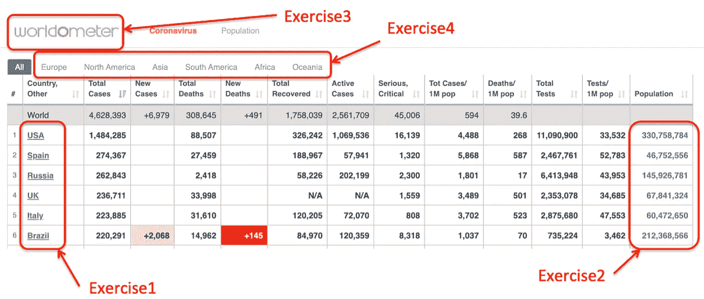
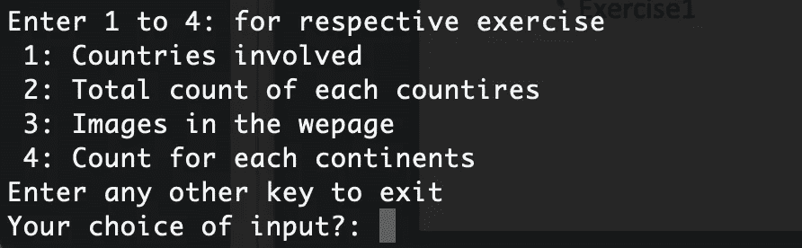
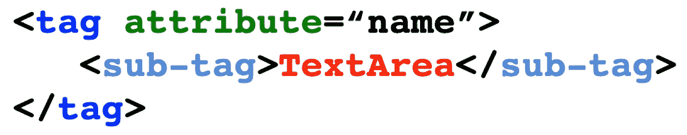
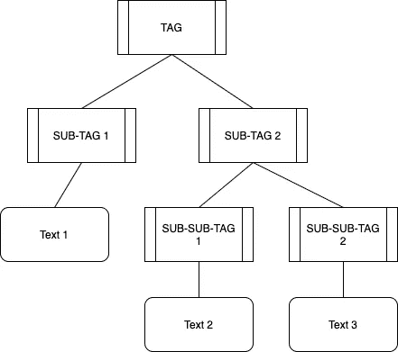
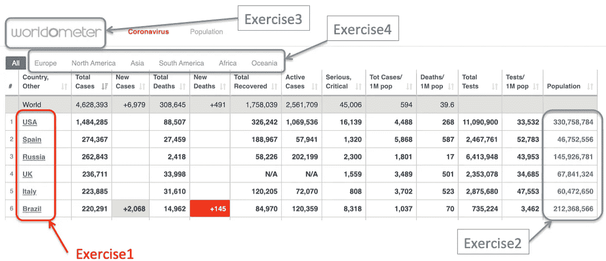
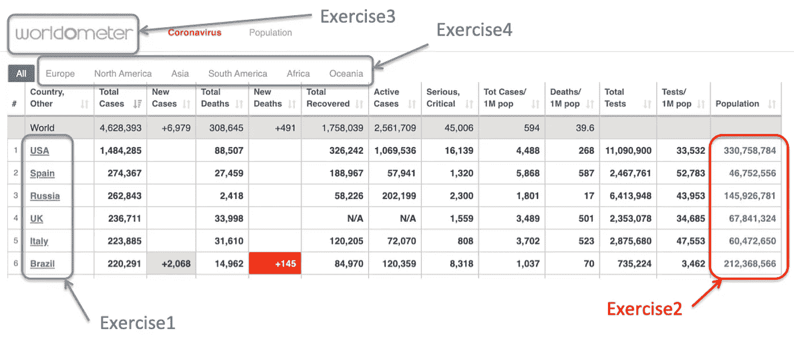
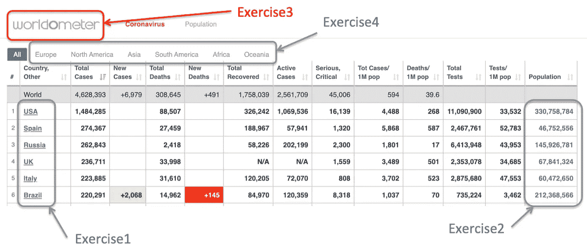
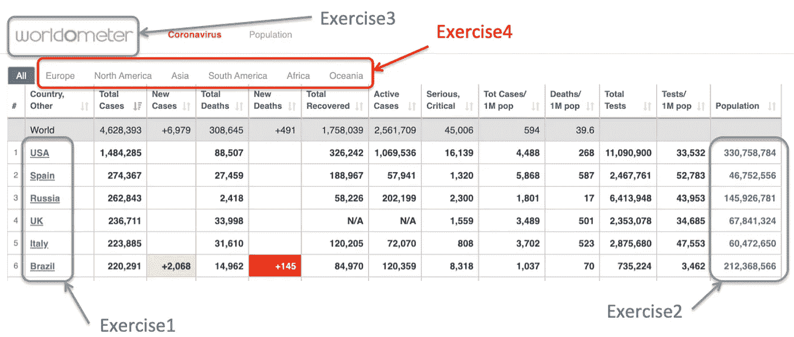
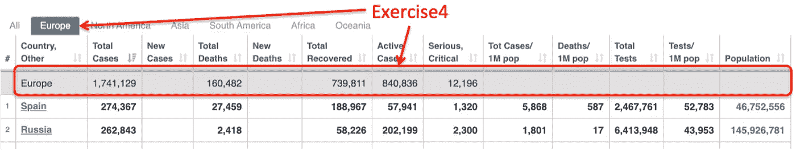
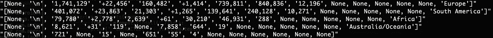

# 用 Python 为非程序员提取网页信息

> 原文：<https://towardsdatascience.com/extracting-webpage-information-with-python-for-non-programmer-1ab4be2bb812?source=collection_archive---------16----------------------->

## 基本编程必备

## 用一些基本的数据挖掘技能来增强自己的能力


图片由 [Isaac Quesada](https://unsplash.com/@isaacquesada) 在 [Unsplash](https://unsplash.com/photos/U0apbBgkOeQ) 上拍摄

知道如何使用脚本从网页中提取数据是很有帮助的。我发现最简单的方法是在 lxml 库的帮助下使用 Python。

最好的部分是，你可能不需要在你的机器上做。你可以把你的脚本放到 [Python 在线编译器](https://www.onlinegdb.com/online_python_interpreter)上，然后你得到一些数据。

对于一些简单的东西，我们只需要在一个文件中的几行代码，然后它会做非常酷的事情。

下面举几个例子。

[](https://medium.com/better-marketing/export-personal-medium-partner-program-data-into-excel-spreadsheet-8887cb4d4442) [## 如何在 Excel 中分析您的中型合作伙伴计划数据

### 在简单的图形中寻找模式

medium.com](https://medium.com/better-marketing/export-personal-medium-partner-program-data-into-excel-spreadsheet-8887cb4d4442) [](https://medium.com/better-programming/how-to-find-your-mutual-connections-on-medium-d0c586c04e6f) [## 如何在媒体上找到你们的相互联系

### 使用 Python 脚本和指令，不需要任何编码知识

medium.com](https://medium.com/better-programming/how-to-find-your-mutual-connections-on-medium-d0c586c04e6f) 

# 学习网站

为了使学习更加相关，我们将把 [Wordometer 冠状病毒网页](https://www.worldometers.info/coronavirus/)作为我们的来源。

如果你访问这个页面，你会看到类似下面的内容。我将学习分成 4 个部分，我称之为练习，如下所示。



我已经提供了[代码脚本](https://gist.github.com/elye/b4197c8db5b0d1380d1f2426fa08add7)(只有 70 行)，借此复制粘贴并运行它(在[在线编译器](https://www.onlinegdb.com/online_python_interpreter)中)，你会看到下面的内容



并选择每个数字来执行它。这应该会使学习更容易。

# HTML 的基础

所有网页都是用 HTML 构建的。

让我们来看看 HTML 最基本的结构，因为这是我们提取所需信息时需要认识的基本模式。

我能提供的最基本的结构如下。



1.  它们都是由包裹着`<`和`>`的`tag`组成。而且它通常带有一个对它的补充，即`</tag>`，或者它只是在`tag`中以`/>`结尾。
2.  在`<tag>`中，它可能有一个或多个被命名的`attribute`。这有助于区分同类型的`tag`。
3.  在`<tag>`对周围，我们可以有一个(或多个)标签被包裹在里面，我在上面将其命名为`<sub-tag>`。你可以成像，`sub-tag`可以有 `sub-sub-tag`等等…，它构成了 HTML 的大部分。
4.  有时,`tag`可以用一个`text`包围它，这通常构成了我们要寻找的信息的核心。

就是这样！给自己拍一下。您已经掌握了 HTML(以及 XML)结构🎉

# 第一件事:在 HTML 中阅读

在提取 HTML 信息之前，我们需要让我们的脚本先读取 HTML。有两种方法可以做到这一点。

## 1.直接从网站读取和加载 HTML

我们使用 Python 的[请求库。别担心，就像下面这条线一样简单，然后就搞定了。](https://realpython.com/python-requests/)

```
import requests
```

之后，尝试使用下面的代码获取网站内容。

```
response = requests.get(url)
```

为了更加健壮，万一`url`出错或者网站关闭，我添加了以下内容

```
try:
  response = requests.get(url)
except:
  print ('Sorry bad url') 
  sys.exit(2)if response.status_code != 200:
  print ('Sorry invalid response ' + str(response.status_code))
  sys.exit(2)
```

如果请求加载成功，那么您可以使用下面的代码获取 Html 内容，并将其提取到一个*树*中。

```
tree = html.fromstring(response.text)
```

> 之所以称之为树，是因为如果我们画出标签关系，它们看起来就像一棵树。



HTML 标签树

## 2.将 HTML 保存在文件中并从中读取

有时这是需要的，因为一些网页需要凭证登录，因此从脚本访问它会更复杂，因为您需要提供所需的凭证。

但是因为你只需要从 HTML 中提取一些数据，你可以把它保存为一个*。html* 文件，并获取从中读取的脚本。

之后，在您的 *python* 脚本中，您只需要

1.  打开文件，并将其作为一个*字符串*(一组字母)读取。
2.  读出 HTML 内容，形成一个*树*

```
inputFile = open(inputfile,"r") 
fileContent = str(inputFile.readlines())tree = html.fromstring(fileContent)
```

# 准备提取数据！

1 **提取单** `**tag**` **包裹** `**text**` **。**简单回顾一下，在练习 1 中，我们要提取如下所示的国家名称。



如果我们检查它的 HTML 代码，我们会看到下面的模式。

```
<a class=”mt_a” href=”country/spain/”>Spain</a>
```

为了提取`Spain`，我们只需要识别具有`"mt_a"`的属性`class`的`a`标签。

为了提取，我们只需对*树*使用`xpath`函数。

```
extracteditems = tree.xpath(‘//a[[@class](http://twitter.com/class)=”mt_a”]/text()’)
print("\n".join(extracteditems))
```

我们将得到一个列表，在这里我们用一个新行(即`"\n"`)将它们分开，并打印出来。

我们会得到

```
USA
Spain
Russia
UK
Italy
... and many more ...
```

轻松点。

2 **抽取** `**tag**` **和** `**sub-tag**` **包裹** `**text**` **。简单回顾一下，在练习 2 中，我们要提取每个国家的人口信息。**



如果我们检查它的 HTML 代码，我们会看到下面的模式。

```
<td style=”font-weight: bold; text-align:right”>
   <a href=”/world-population/spain-population/”>46,752,556</a> 
</td><td style=”font-weight: bold; text-align:right”>2,467,761</td>
<td style=”font-weight: bold; text-align:right”>52,783</td>
```

我们无法获得 `<a href=”/world-population/spain-population/”>`，因为每个国家的`href`会有所不同。

我们也不能捕获`<td style=”font-weight: bold; text-align:right”>`，因为上面显示了许多我们不想要的其他数字(例如`2,467,761`)。

因此，最好是捕获后面跟有`<a>`标签的`<td style=”font-weight: bold; text-align:right”>`。

为了提取，我们只对*树*使用`xpath`函数。

```
extracteditems = tree.xpath(
    '//td[[@style](http://twitter.com/style)="font-weight: bold; text-align:right"]//a/text()')print("\n".join(extracteditems))
```

我们将得到一个列表，在这里我们用一个新行(即`"\n"`)将它们分开，并打印出来。

```
330,758,784
46,752,556
145,926,781
67,841,324
60,472,650
... and many more ...
```

轻松点。

3 **从** `**tag**` **中提取** `**attrib**` **值。**简单回顾一下，在练习 3 中，我们想要提取网站的图片 URL。



在 HTML 中，图像 URL 存储为`img`标签的`src`属性。

```

```

要提取它，我们首先需要先提取`img`元素，然后使用下面的特殊提取，即`list(map(lambda ...))`来提取每个`src`属性，即`x.attrib.get(‘src’)`。

`x`是每个`elements`内的一个单项。

```
elements = tree.xpath(‘//img’)
extracteditems = list(map(lambda x: x.attrib.get(‘src’), elements))
print(“\n”.join(extracteditems))
```

由此，我们现在可以得到

```
/img/worldometers-logo.gif
/images/alert.png
/img/alert-plus.png
... and a few others ...
```

在`list(map(lambda ...))`上有点复杂，但这是一种提取元素列表中各个项目的方法。

4 **迭代每个** `**tag**` **来提取** `**sub-tags**` **。**简单回顾一下，在练习 4 中，我们想要提取每个大洲的高级数字



更具体地说，当我们进入其中一个大陆时，值如下所示，这就是我们要提取的内容。



如果我们查看 HTML，每个大洲的数据都用具有`"total_row_world row_continnet"`的`class`属性的`tr`分组。

```
<tr class="total_row_world row_continent" data-continent="Europe" style="display: none">
  <td></td>
  <td style="text-align:left;"><nobr>Europe</nobr></td>    
  <td>1,741,129</td>
  <td></td>
  <td>160,482</td>
  <td></td>
  <td>739,811</td>
  <td>840,836</td>
  <td>12,196</td>
  <td></td>
  <td></td>
  <td></td>
  <td></td>
  <td></td>
  <td style="display:none;" data-continent="Europe">Europe</td>
</tr>
```

让我们提取`"total_row_world row_continnet"`作为信息段。

为了进一步提取每个部分中的每一项，我们创建了一个单独的函数名`extractElements`，如下所示。我们发送`x`,它是各个部分中的每个部分。

```
sections = tree.xpath(
    '//tr[[@class](http://twitter.com/class)="total_row_world row_continent"]')extracteditems = list(map(lambda x: 
    '\"' + str(**extractElements(x)**) + '\"', sections))print("\n".join(extracteditems))
```

现在在函数`extractElements`中，我们使用`findall`提取出所有的`td`标签，并再次使用`list(map(lambda ...))`单独提取它的`text`。

```
def extractElements(element):
    return list(map(lambda x: x.text, element.findall('.//td')))
```

输出如下所示。



就是这样！

为了进一步说明`element.findall(‘.//td’)`是如何工作，我使用了一个 for 循环来单独打印每个提取的

```
def extractElements(element):
 **for item in element.findall('.//td'):
    print('  EXTRACTED: ' + str(item.text))**return list(map(lambda x: x.text, element.findall('.//td')))
```

输出如下所示

```
EXTRACTED: 1,741,129
EXTRACTED: +22,456
EXTRACTED: 160,482
EXTRACTED: +1,414
EXTRACTED: 739,811
... and more ...
EXTRACTED: Europe
EXTRACTED: None
EXTRACTED:
```

学会了这四种方法，你现在就有了探索你感兴趣的网站并提取相关信息进行进一步处理的基本要素。🛠

干杯。

感谢阅读。你可以在这里查看我的其他话题。

您可以在[](https://medium.com/@elye.project)**[*Twitter*](https://twitter.com/elye_project)*[*脸书*](https://www.facebook.com/elye.project/)*或 [*Reddit*](https://www.reddit.com/user/elyeproj/) 上关注我，了解关于移动开发、媒体写作等相关主题的小技巧和学习。~Elye~****