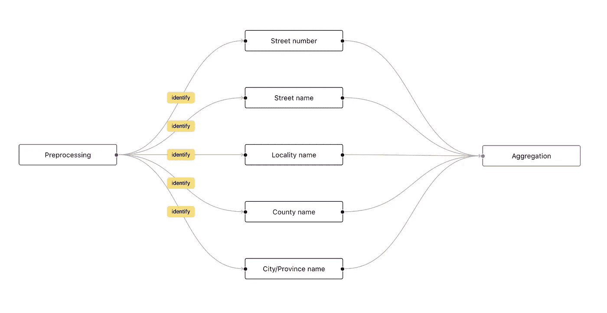

# 从非结构化文本中提取越南地址数据

> 原文：<https://towardsdatascience.com/extraction-of-vietnam-address-data-from-the-unstructured-text-150fe8cb0045?source=collection_archive---------36----------------------->

## 如今，社交网络和电子商务是我们生活的重要组成部分。我们在这些平台上买卖很多东西，越南也不例外。


丹尼尔·伯纳德在 [Unsplash](https://unsplash.com?utm_source=medium&utm_medium=referral) 上的照片

# 介绍

如今，社交网络和电子商务是我们生活的重要组成部分。我们在这些平台上买卖很多东西，越南也不例外；在这个人口超过 9400 万的国家，脸书(Messenger)和 Zalo 是两个最大的社交网络。除此之外，很多商家利用这些平台卖各种东西。所以聊天应用是沟通自己想买的商品的主要渠道，比如价格、保质期、收货人地址、电话号码、什么时候送到(Ahamove 和 GHN 是越最大的送货公司)等等因此，在 Ahamove，我们开发了一个应用程序，可以快速帮助商家发现买家信息，如地址和电话号码。我们面临两个挑战:

*   如何快速提取非结构化文本的地址数据？
*   当这些文本通常没有结构、发音符号或拼写错误时，我们如何检测它们呢？

这些问题以及我们如何解决它们将在下面的章节中介绍。

# 1.消息中的越南语

首先，越南语是一种严重依赖发音符号的语言。这些许多音调符号，通常在同一个元音上有两个，使得书面越南语很容易在拉丁字母的本地化变体中识别出来。有 9 个区别符号，例如一个急性符号(dấu sắc)，一个坟墓符号(dấu huyền)，一个扬抑符号(dấu)，一个短音符(dấu ớ)，一个喇叭符号(ư或ơ)，一个上面的钩子符号(dấu hỏi)，一个波浪符号(dấu ng)，一个下面的符号(d\u n\ng)，一个染料符号——类似于{\或{\\。

> 在理想的世界中，使用拉丁语发音符号的任何语言的人都可以轻松地排版他们的语言，并产生高质量的排版。
> 
> 维克多·高尔特尼

然而，当我们互相发信息时，我们可以用或不用发音符号来发信息，但对方可以很好地理解。例如，我们可以传达这样的信息:

```
Giao hàng cho em đến 285 đường Cách mạng tháng Tám, Phường 12, Quận 10, Hồ Chí Minh nha
// English: Can you deliver it to 285 Cách mạng tháng Tám street, Ward 12, District 10, Hồ Chí Minh city for me, please.
```

如果我们传达这样的信息是没问题的:

```
Giao hang cho em den 285 duong cach mang thang tam phuong 12 quan 10 ho chi minh nha
```

越南所有有文化的人都能理解，没有任何困难。

其次，人们通常倾向于在对话中使用缩写。他们通常会将上述信息缩写成以下具有相同含义的例子:

```
gh cho e den 285 duong cmtt, p12, q10, hcm nha
gh cho e den 285 cmt8, p.12, q10, tp.hcm nha
gh cho em den 285 d.cmt8, p12, q.10, tp hcm nha
```

第三，他们可以使用错误的发音标记位置，他们也理解得很好。例如，当我们发信息时，意思是一样的，但是如果你做越南语听写测试，你的分数是 F；D

```
đường == đừơng
Trường Trinh == Trừơng Trinh
```

最后，当他们一起传递信息时，客户的信息通常不遵循越南语的结构。意思是文本没有主语+动词+宾语这样的结构。例如，当他们点东西时，对话通常是这样的:

```
Merchant: Cho mình xin địa chỉ và số điện thoại của bạn với.
//English: Could you give me your address and phone number, please?Customer: 285 cmt8, p.12, q10 09028388xx3
//or more harder structure like
Customer: 285 09028388xx3 cmt8 p12 q10
```

总之，在聊天应用程序中有许多不同的方式来发送消息。其中一些不容易被统计模型预测或在两个同义词之间进行比较。要解决这个问题，我们首先需要弄清楚越南的地址结构。在下一节中，我们将对此进行更多的解释。


我们存档的结果。*作者图片*

# 2.越南地址结构

如上所述，我们只关注越南地址，但也有可能发展到其他国家和语言。越南的行政单位分为四级。在第一层，越南分为 58 个省和 5 个直辖市。直辖市是最高级别的中央控制城市，拥有与省同等的特殊地位。直辖市分为市区、镇、农村区作为二级单位。之后，城市地区被划分为选区，城镇被划分为选区和公社，而农村地区被划分为乡镇和公社。最后，最后一层单元是村落、村庄和社区。有许多层单元，但我们只用一个单元来代表每个层单元。

1.  一线:城市
2.  二线:县
3.  第三层:地区

我们绕过了第四层，因为我们通常不在地址中使用它，我们也找不到任何关于第四层的知识来源。


越南地址结构。*作者图片*

首先，地点单位有三种可能的后缀:街道名称、国家名称和城市/省份名称。在地点单位之后，我们通常用一个地区名、县名和市/省名，以便区分两个区/县或市/省之间的地点单位。对于街道编号，给出后缀，例如街道名称。在街道名称之后，它通常跟随着与地点单元中的街道名称相同的结构。

***街巷号***

在越南有几种不同的方式来显示地址号码。这将在下面解释:

1.  如果房子或建筑在正面。它由一个数字(如“2”)或一系列数字(如“200”)组成。如果有两个或两个以上的组合土地，该街道编号包含一个街道编号范围(例如“200–201–202”)。此外，它可以以字符作为后缀(例如“47a”)
2.  另一方面，当房子放在小巷里。水花用来表示房子或建筑在巷子里。斜线越多，巷子越深越曲折(如“76/4/8/3”、“76a/34h”)。
3.  在胡志明市，“Bis”不定期出现。事实上，它反映了越南历史上法国殖民主义时代的痕迹(如“56 之二”)。“Bis”在法语中是重复或再次的意思。
4.  有时，街道号码的前缀是“số nhà”或“số”(如“Số nhà 500 hẻm 34/56”)。)

***地址名称***

街道的名称可以有不同的结构。在某些情况下，他们有前缀“đường”或“phố”，这在北边更常见，意思是“街道”然而，很大一部分街道不是以这些前缀开头的。街道可以用不同的方式命名，通常使用缩写。因为在越南常见的街道是“mạng 汤汤”，可以用不同的方式缩写:

1.  恰赫·mạng·汤 8
2.  Cach mang thang tam
3.  cmtt
4.  cmt8

我们也有一些街道命名，如“đườngsố76”意味着“76 号街”。地址中门牌号和街道名称相同的房屋。这在 Hồ的胡志明市经常发生。不同之处在于选区或地区部分——例如，像“恰赫·mạng·汤·汤”这样的街道穿过第 1 区和第 3 区。所以这里需要病房名或区名来澄清。

***地名***

这没有任何具体的案例；它通常以“phường”、“x”和“thị trấn.”为前缀。但是，在某些情况下，一些县的地名可能是其他县或市/省的街道名或县名。

***县名***

类似的问题描述为地点名称，县名称可以是街道名称或其他地区的地点。用于识别县名的指示符以“quận”、“huyện”或“thị x”为前缀

***城市/省份名称***

如上面街道名称中所述，城市或省份通常以各种方式使用，如“phố Hồ市”、“TP。“hồ·齐明”、“tp.hcm”、“tp hcm”、“hcmc”都是同一个城市的同义词。然而，这种方式有一个缺点。在一些城市或省份，名称可能很难识别，例如,“Nẵng”或“đồng 奈”在缩写时是“n”。

***国家名称***

目前只关注越南，所以国名只有越南；我们在提取信息时也绕过国家名称，因为如果它没有我上面解释的这些步骤，那么它是绝对错误的。

***地名***

一般来说，地名不遵循任何特定的模式。它可以利用这是最难识别的部分，并经常改变。所以我们只关注商场、建筑、部门，因为它们很少变化。

# 3.我们的目标

我们旨在识别与特定地点单元和地址相关的地址数据。因此，诸如商场、建筑、部门和地址等场所单位必须加以识别。我们关注这些类型的原因是:

1.  地址是具有一定顺序的结构化文本，由不同的属性组成(如街道号码、地址名称、地点名称、县名、城市名称、地名等。).因为我们可以依次利用这些属性。此外，如果我们不能识别所有的地址属性或大多数属性，结果也不会更有价值。
2.  这些属性不经常变化(地名除外)。所以我们不经常维护它。对于地名，只有商场和部门是重点，因为他们很少改变。
3.  我们不需要识别咖啡店、沙龙或餐馆，因为我们只关注住宅区。终端用户通常不会在胡志明市的星巴克咖啡点东西，不是吗？
4.  我们从维基百科、越南统计总局、OpenStreetMap 和 350 多个网站收集数据，以收集地址和地点单位。

我们目前只关注越南的地址，因为每个国家的地址结构都非常不同。然而，我们已经计划在其他国家和语言开发。我们已经开发了一种混合方法，使得手动开发的试探法和自由数据都可以作为信任资源。

# 4.地址数据的标识

有许多不同的方法。然而，一般来说，信息提取可以大致分为两类。有两种方法:*基于规则的匹配*和*训练* s *统计模型。*

*   *基于规则的匹配*是一种定义明确模式的方式。它类似于在原始文本上使用正则表达式，但是它让您找到您正在寻找的单词和短语。此外，您可以访问和分析周围的标记，将范围合并到单个标记中，或者向命名实体添加条目。这意味着你可以控制结果。在这种方法中，它明显优于训练静态模型。
*   *训练*的*统计模型*是对数据集应用统计分析的过程。静态模型是观察数据的数学表示。训练一个新模型需要一些努力，但是一旦完成，它可以以各种形式和在各种环境中被识别。

通过结合静态模型和基于规则的组件，可以提高静态模型的准确性。通过为特定标记提供标签、实体或句子边界。我们还在静态模型之后使用基于规则的组件来纠正常见错误。为了建立更抽象的逻辑，基于规则的组件可以引用静态模型设置的属性。

# 5.解决办法



完整的工作流程。*作者图片*

通过这样做，我们还可以独立于通常在它们之后或之前的其他属性来检测属性。最后，我们将找到的候选地址组合成一个或多个完整的地址。

***预处理***

最初，我们通过在我们想要获得地址数据的数据上使用正则表达式来移除所有发音符号。这样做之后，会对数据进行一些清理，例如删除非 Unicode 字符或邮政编码，因为越南语很少使用邮政编码。如果没有完成这些预处理步骤，标记化可能会产生错误的结果。最后的预处理步骤包括词性(POS)。在该步骤中获得的 POS 标签稍后用于识别单个属性。

**识别单个属性**

地址的每个属性都是单独标识的，几乎独立于其他属性，因此数据中地址格式结构的变化对整体结果的影响很小。在某些情况下，两个有规律地相互继承的属性的序列被用来识别属性。这使得单个步骤的排序考虑了前一步骤的信息以用于下一步骤。在识别单个属性的过程中，所有可能包含地址属性的标记序列都被标注为候选。此外，一些候选属性用启发法进行了注释，从而产生了这个候选属性。

# 6.地址属性的集合

我们将县候选作为种子来聚合结果，因为地址的名称和地点可以重复，但县在不同的城市或省中不能重复。基于此，我们尝试为每个县候选人分配地址。为此，执行以下步骤:

1.  首先，我们检查所有候选地址是否有地址号码。如果不是，那么我们忽略它，因为我们不能通过使用这些地址找到准确的位置。
2.  第二，地址号后面的下一个候选必须是地址名。如果下一个候选项是地区或县，我们将其转换为地址名称，因为街道名称可以与地区或县相同(巴海 Trung 街和巴海 Trung 区)。但是，这种方法可能是错误的，因为客户可能会键入错误的地址。幸运的是，我们有一个很好的反向地址 API，可以检查地址是否正确，所以这不是大问题。
3.  第三，地址后的名称可以是地名或县名。我们如何知道它是一个地方或县的名称？如果候选人的长度大于 5(包括城市名称)或 4(不包括城市名称)，则包括地点和县名。此外，因为县在不同的城市中不重复，所以如果县候选是县名，我们可以确定县候选是县名。另一方面，它是地名。
4.  第四，地名是一种特殊的称呼类型。在地名可以是县名、省名或市名(如永旺梦乐坛府或永旺梦乐平阳)之后，这些地名很少改变，因此我们可以将它们收集到地名录中以便快速查找。
5.  如果在文本中找到所有属性，则假定它们属于一个公共地址。

# 7.问题

我们面临一些重要的挑战，这些挑战对未来的工作很有意义。检查提取的地址，我们主要意识到错误识别的地址名称的原因:

*   我们没有足够的知识来源，所以郊区的一些地址无法识别，然后就被忽略了。为了解决这个问题，我们建立了一个统计模型，可以学习这些丢失的地址，并在下一次改进地址检测。然而，这种方法超出了本文的范围。我们将在另一篇文章中讨论这种方法。

# 8.结论和未来工作

我们提出了一种在非结构化文本中识别越南地址的方法。为此，我们开发了一种混合方法，利用可以从 OpenStreetMaps、Wikipedia、General Statistics Office 和其他来源获得的信息模式和地名词典。

随着 AhaMove 的区域扩展，我们将调整和评估该方法在其他语言和其他国家的可行性。为此，需要确定识别单一地址属性的模式，并需要汇编具体国家的地名录。