# 咖啡豆一生中的萃取

> 原文：<https://towardsdatascience.com/extraction-over-the-life-of-the-coffee-bean-f777f017718a?source=collection_archive---------34----------------------->

## 咖啡数据科学

## 萃取与咖啡烘焙时间的数据

我收集照片数据已经快两年了。我想浏览这些信息，看看我是否能看到任何趋势，特别是烤肉的年龄。主要警告是:

1.  随着时间的推移，我的方法有所改进。
2.  我的品味变了。
3.  我的味觉扩展了。

所以我对数据进行了归一化处理，以给出一个更公平的比较。我发现烘烤后 5 周内，味道和萃取度都有所改善。过去三周，我没有发现味道有所下降，而这正是烘焙师通常暗示的。然而，我没有过去 5 周的太多数据，因为我的烘焙通常在 1 磅左右，而且我喝了太多的浓缩咖啡，以至于烘焙时间不会太长。

# 烘焙/储存/提取

## 烤

我每周用一个烤箱烤一次 T1，我把它加满到 350 克。他们说最大重量是 250 克，但是对于中等程度的烘烤，你可以更高。当我启动机器时，我把豆子放进去，而不是等着滚筒达到温度。我知道这不符合标准，但我不介意。我还没有对充电温度进行并排比较，但我相信有一天我会的。

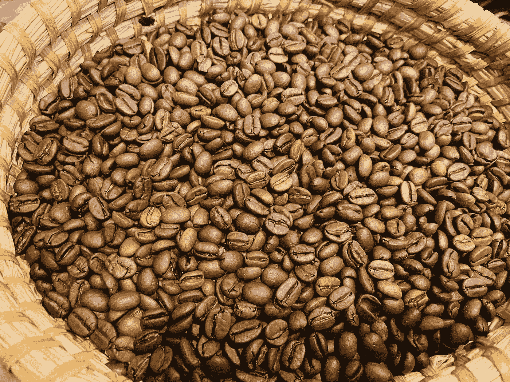

所有图片由作者提供

当我开始收集数据时，我在第一次裂纹(FC)后 1 分钟结束烘烤。现在，我在 1:30 过 FC。我过去常常在烤之前混合豆子，现在我在烤之后做它。

## 储存；储备

这些豆子大部分储存在密封的塑料或玻璃罐中，但它们没有被真空密封。它们被存放在厨房的橱柜里，暴露在光线下。虽然人们说暴露在光线下对咖啡没有好处，但我还没有看到支持或否定这一说法的数据。

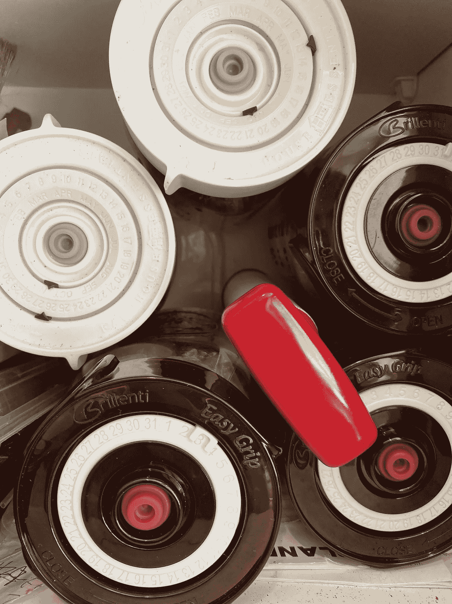

## 提取，血统

我是杠杆机器的粉丝，这些镜头大部分是在金快车上拍摄的。有些是拉帕沃尼，Flair，Kompresso，意大利的恩里科和拉佩皮纳。我从 10 秒的预灌输开始，但在过去的两年里，我已经转移到 30 秒的[预灌输](https://link.medium.com/Ej4ZtOi1Bab)。我也是一年前开始[压脉](https://link.medium.com/6Ok1apk1Bab)，很多镜头都是[断奏](https://link.medium.com/op8kDeo1Bab)或者[断奏捣实](https://link.medium.com/IM7eanm1Bab)。六个月前，我做了相当多的工作，在研磨前加热豆子，在冲泡前冷却研磨物(又名[辣磨](https://link.medium.com/xvnd8Ep1Bab))。最重要的是，我已经使用[纸质过滤器](https://link.medium.com/5OScb2s1Bab)将近一年了。

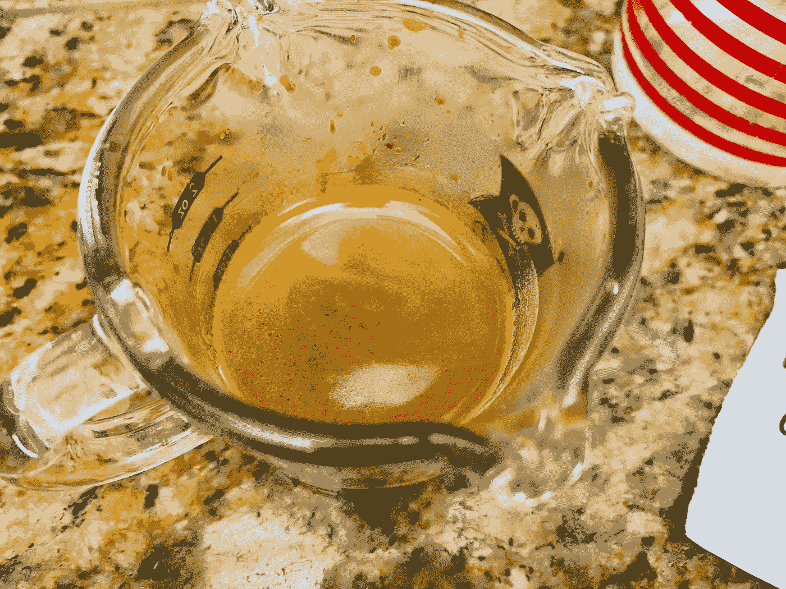

所以有相当多的变化，但我相信一些标准化有助于比较随着烘烤时间的变化。

# 绩效指标

我使用了两个指标来评估镜头之间的差异:[最终得分](https://link.medium.com/uzbzVt7Db7)和[咖啡萃取](https://link.medium.com/EhlakB9Db7)。

最终得分是 7 个指标(强烈、浓郁、糖浆、甜味、酸味、苦味和余味)记分卡的平均值。当然，这些分数是主观的，但它们符合我的口味，帮助我提高了我的拍摄水平。分数有一些变化。我的目标是保持每个指标的一致性，但有时粒度很难，会影响最终得分。

使用折射仪测量总溶解固体(TDS ),该数字用于确定提取到杯中的咖啡的百分比，并结合一杯咖啡的输出重量和咖啡的输入重量，称为提取率(EY)。

# 数据

我最终得到了 1200+个数据点，在编译下面的图之前，我必须清理这些数据。我扔掉了在咖啡馆拍的照片和一些奇怪实验的照片。

由于数字(Mac ),将数据表放在一起很有挑战性。我把我的数据储存在数字表中，每一列都是一杯浓缩咖啡。我使用了列而不是行，因为这使得在我的手机上查看这个表单更容易。然而，直到最近，最大列数还是几百列。所以我有几个表，我添加和移动了一些行来改进工作流，所以我必须创建一个公共表来收集所有其他表的重要部分。

并不是所有的镜头都有 EY，但我仍然想尽可能多地查看最终得分数据。下面是桌子一部分的大图。我有输入指标、输出指标和计算指标。我有彩色编码，可以很快看到分数之间的对比。我还记录当前镜头的笔记，以及下一个镜头要修改的内容。

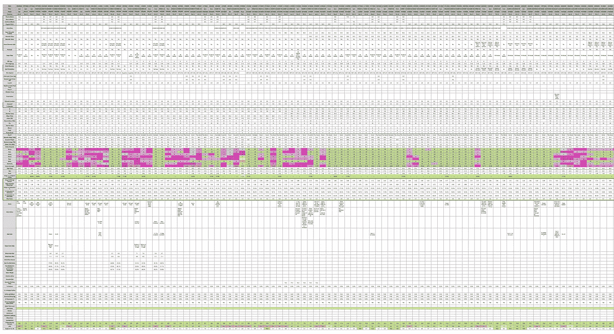

数据手册的尺寸示例。所有图片由作者提供

首先，我把一切都绘制成散点图，没有归一化。我只区分了断奏和常规，但除了在 EY，似乎没有太大的区别。在过去的六个月里，我没有定期进行断奏击球，这是我能够使用更长的预灌注时间来驱动 EY 更高的时间。最终得分似乎随着时间的推移而上升，EY 也是如此。

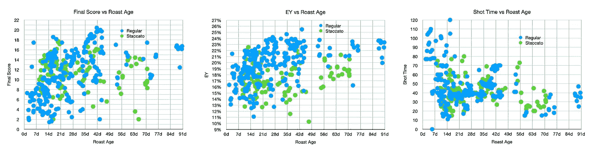

你可以观察到我没有超过 6 周的烘烤数据。我有一些数据点，因为我出城了一个月，没有带豆子。

提取时间在第一周至第二周很长，但之后不会有太大变化。过去两个月我确实注意到了，做一次非常努力的夯实并没有多大效果；镜头会跑得很快。

然后，我使用 Z 分数归一化法通过烘焙来归一化数据。这将使用平均值 0 和标准差 1 对同一分布上的所有分数进行归一化。因此，如果点开始向正方向移动，就意味着分布在移动。散点图的问题在于它们不能很好地讲述故事。

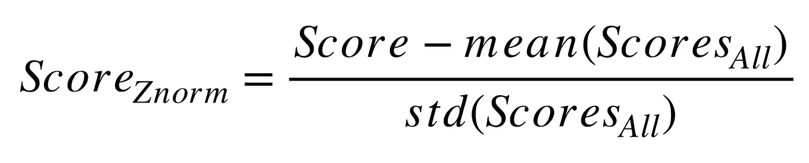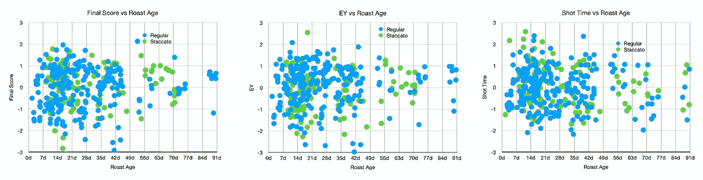

所以让我们转到**方框图**。对于那些不熟悉[盒子剧情](https://www.mathworks.com/help/stats/boxplot.html)的人来说，这是一个传奇:

这些是没有规格化的箱线图。它们显示出分数和 ey 随时间增加的趋势。这可能会产生误导，因为在这个数据之旅的开始，我会在两周内烤一次，喝一次。现在，我的烘焙在我酿造之前至少要放置两周。

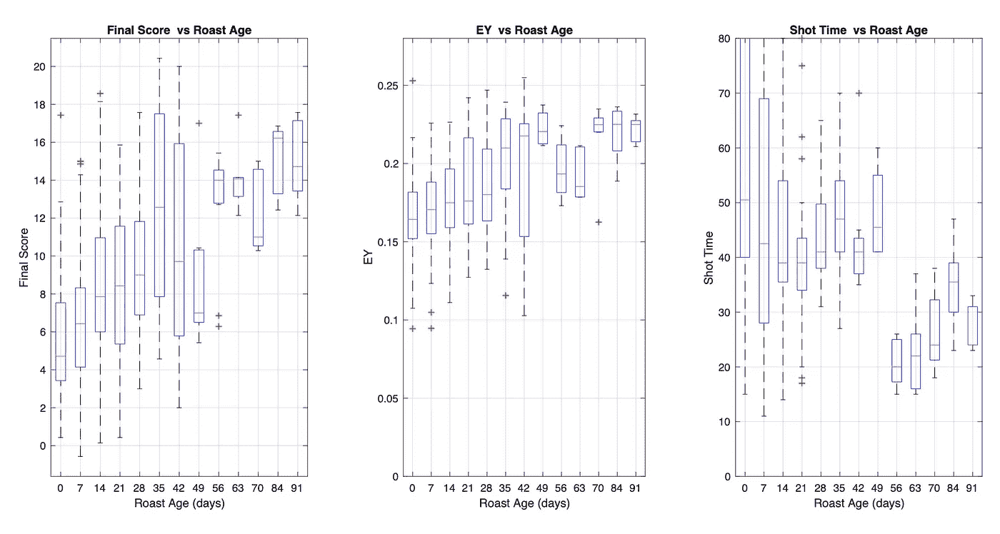

让我们通过每次烘烤来标准化数据。最终得分和 EY 的分布似乎都有所上升，但投篮时间的分布没有上升那么多。拍摄时间下降，尤其是在过去 7 周。

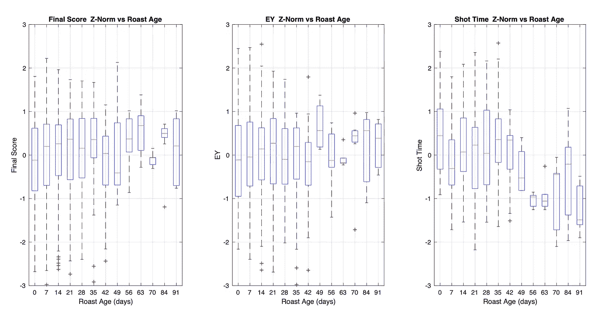

我们也可以做最小最大归一化来强制所有的分数在 0 到 1 之间。我们可以对每一次烘烤都这样做，然后将它们组合起来。分数越高越好。

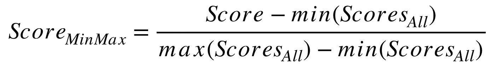

我们看到了一种趋势，即使用这种类型的标准化来组合数据，味道和 EY 会得到更高的分数。

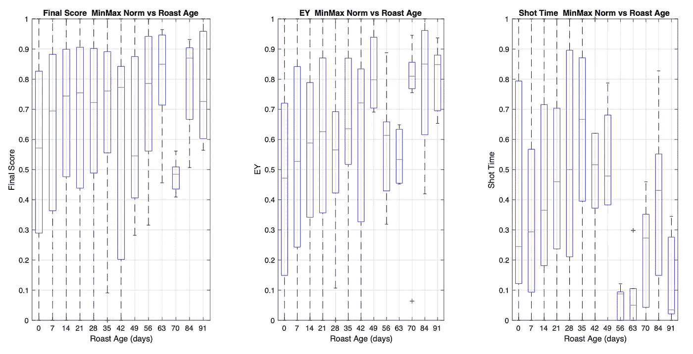

只看烘焙后每天每箱的中值，它们都遵循粗略的趋势，但是有一些噪音归因于烘焙后的天数不一致。不是每一份烤肉都有每天的数据点。然而，我想尝试看看我能做些什么来理解烘焙后的味道和萃取趋势。

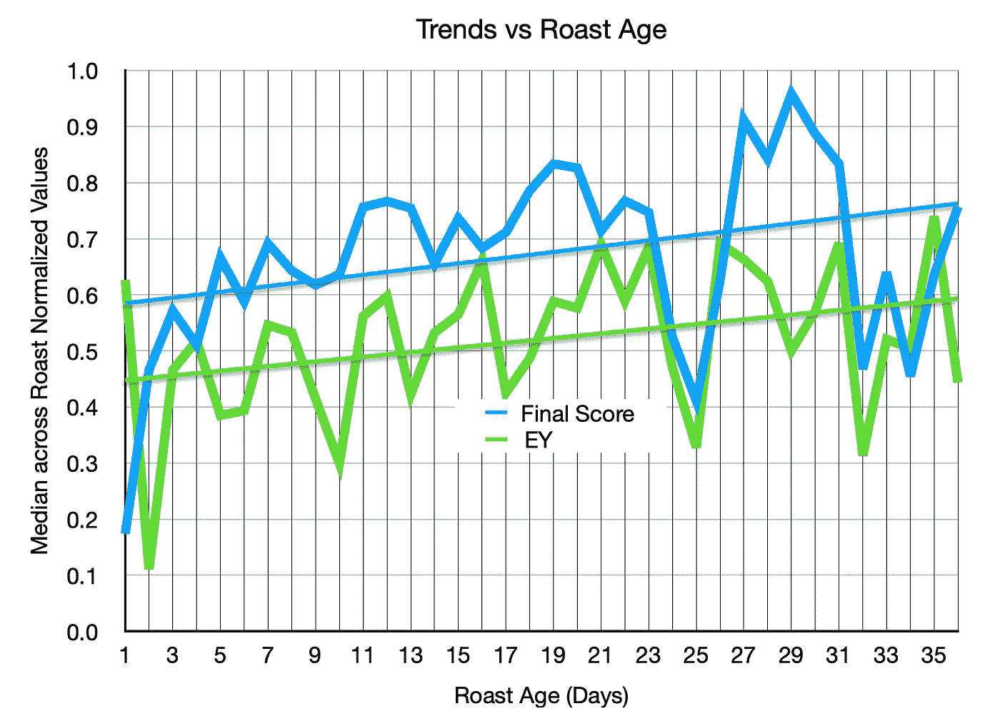

# 与 Q 分数相比

我的品味分数和 Q 分一致吗？幸运的是，我也有这个问题的一些数据。在过去的两年里，我也一直在收集关于我的考试和平均成绩的数据。我假设混合咖啡豆会得到单个咖啡豆等级的平均值，我想知道这个合并的 Q 值是否能给我一个很好的指示，让我知道一次烘焙是好是坏。

以下是我的烘焙数据表示例:

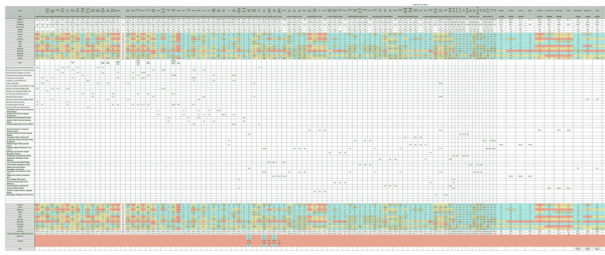

烘焙数据表示例

下面是一个例子，说明我是如何根据单个豆的分数来计算平均 Q 分数的。前两个没有名字或输出重量。

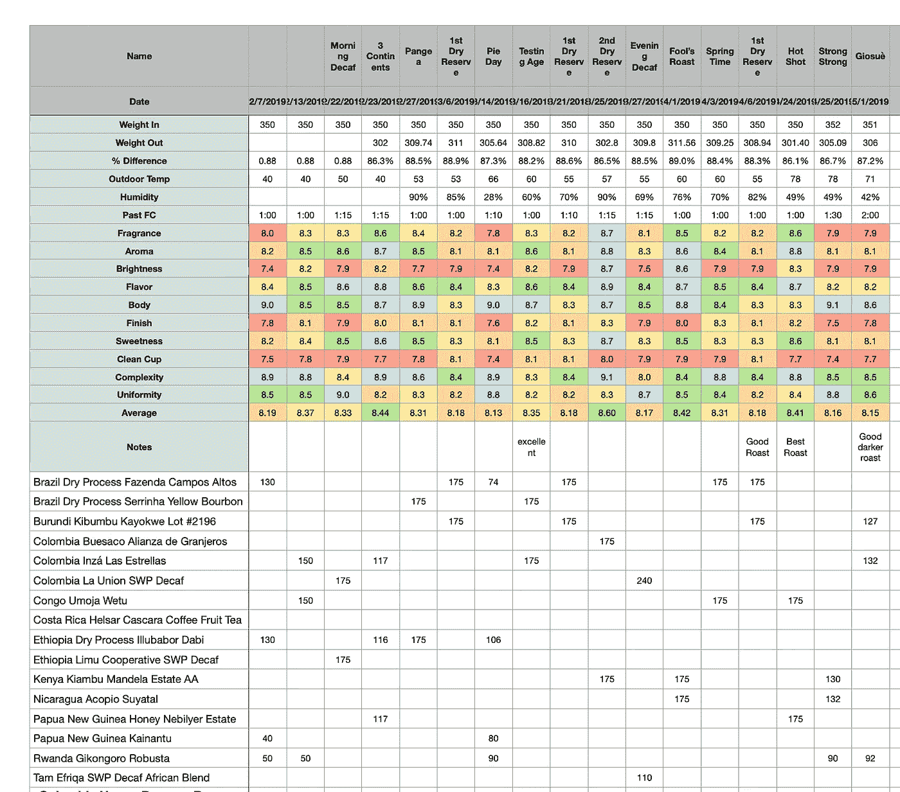

烘焙数据表的特写视图

我的混合烤肉平均 Q 值从 8.1 到 8.9 不等。下面是一个直方图，用来理解数据是如何分布的。

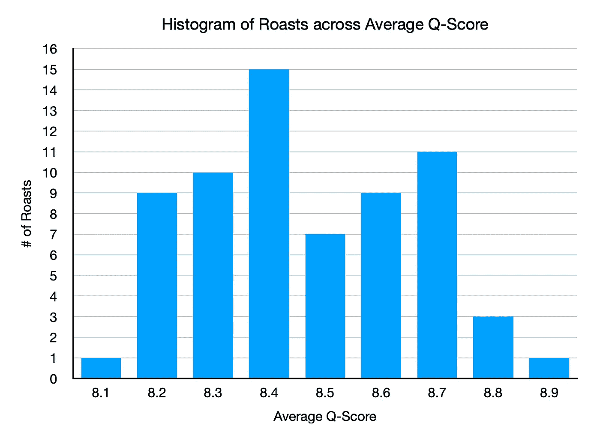

显然，我不能标准化每一次烘烤的拍摄数据，所以相反，我标准化了 3 到 5 次烘烤的拍摄数据:前 2 次烘烤(如果存在)，有问题的烘烤，以及后 2 次烘烤(如果存在)。我用最小最大归一化法对分数进行了归一化。

箱线图可以提供一些关于趋势的信息，但我在过去一年的购买中更关注 Q 值，所以它可能会因我的购买而有所偏差。

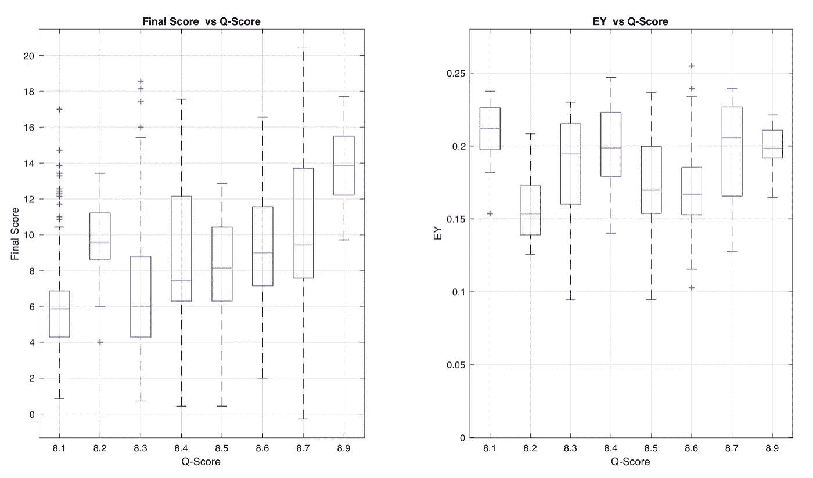

看看最小最大标准化，最终分数似乎有轻微上升趋势，但 EY 没有。

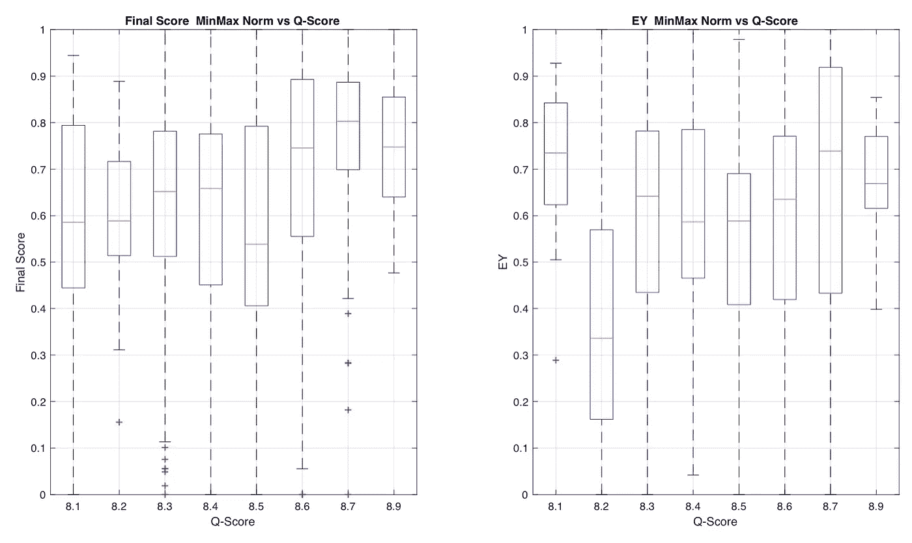

我们可以通过查看每个 Q-score bin 的平均分数来简化这种情况，它显示了一个非常轻微的趋势。然而，数据点的数量非常少，所以我不会太依赖它。我曾希望看到一个更清晰的趋势，但正如数据中的情况一样，许多变量可能会相互妨碍。

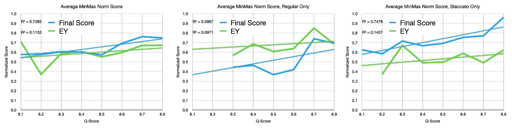

总的来说，随着烘焙时间的推移，我发现味道和提取率都有上升的趋势，我怀疑这两者之间存在相关性。我没有看到 Q 级和口味之间的强烈趋势，这可能是由于酿造技术的改进。如果更多的技术变量得到控制，我预计趋势会更加清晰。

最让我兴奋的是，我总是可以再次进行这种分析，我很好奇更多的数据如何能够更好地理解烤肉的味道何时达到顶峰。对我来说，风味的高峰期在 3 到 5 周之间，这是一个比烘焙师建议的典型的 2 到 3 周更长的时间。对于提取率，我没有看到随着时间的推移而下降。通常情况下，EY 会继续上涨，然后到达一个平台。

对于过去 5 周的烘焙，有一丝陈腐，特别是在较暗的烘焙和持续 3 个月的烘焙中，但拍摄仍然令人愉快，部分原因是较高的 EY 潜力抵消了一些陈腐的味道。

如果你愿意，可以在 Twitter 和 YouTube 上关注我，我会在那里发布不同机器上的浓缩咖啡视频和浓缩咖啡相关的东西。你也可以在 [LinkedIn](https://www.linkedin.com/in/robert-mckeon-aloe-01581595?source=post_page---------------------------) 上找到我。

# 我的进一步阅读:

[咖啡豆脱气](/coffee-bean-degassing-d747c8a9d4c9)

[解构咖啡:分割烘焙、研磨和分层以获得更好的浓缩咖啡](/deconstructed-coffee-split-roasting-grinding-and-layering-for-better-espresso-fd408c1ac535)

[浓缩咖啡的预浸:更好的浓缩咖啡的视觉提示](/pre-infusion-for-espresso-visual-cues-for-better-espresso-c23b2542152e)

[咖啡的形状](/the-shape-of-coffee-fa87d3a67752)

[搅拌还是旋转:更好的浓缩咖啡体验](https://towardsdatascience.com/p/8cf623ea27ef)

[香辣浓缩咖啡:热磨，冷捣以获得更好的咖啡](/spicy-espresso-grind-hot-tamp-cold-36bb547211ef)

[断续浓缩咖啡:提升浓缩咖啡](https://link.medium.com/huWPhau1Bab)

[用纸质过滤器改进浓缩咖啡](/the-impact-of-paper-filters-on-espresso-cfaf6e047456)

[浓缩咖啡中咖啡溶解度的初步研究](/coffee-solubility-in-espresso-an-initial-study-88f78a432e2c)

[断奏捣固:不用筛子改进浓缩咖啡](/staccato-tamping-improving-espresso-without-a-sifter-b22de5db28f6)

[浓缩咖啡模拟:计算机模型的第一步](https://towardsdatascience.com/@rmckeon/espresso-simulation-first-steps-in-computer-models-56e06fc9a13c)

[更好的浓缩咖啡压力脉动](/pressure-pulsing-for-better-espresso-62f09362211d)

[咖啡数据表](https://towardsdatascience.com/@rmckeon/coffee-data-sheet-d95fd241e7f6)

[被盗浓缩咖啡机的故事](https://towardsdatascience.com/overthinking-life/the-tale-of-a-stolen-espresso-machine-6cc24d2d21a3)

[浓缩咖啡过滤器分析](/espresso-filters-an-analysis-7672899ce4c0)