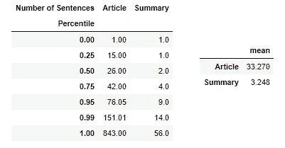
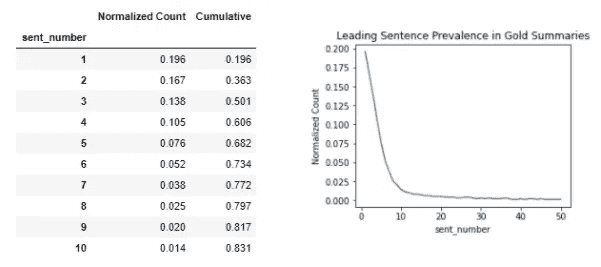
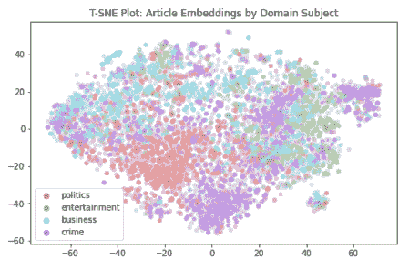
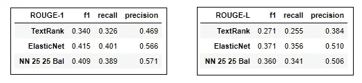
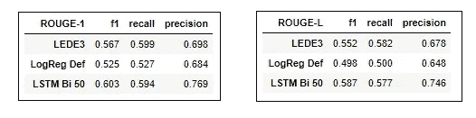

# 使用 BERT 的抽取摘要

> 原文：<https://towardsdatascience.com/extractive-summarization-using-bert-966e912f4142?source=collection_archive---------4----------------------->

## 一种利用 BERT 嵌入能力的监督方法

摘要总结是一项具有挑战性的任务，直到最近才变得实用。像 NLP 的许多东西一样，这种进步的一个原因是像 BERT 这样的 transformer 模型所提供的高级嵌入。这个项目使用 BERT 句子嵌入来建立一个提取摘要器，采用两种监督方法。第一种只考虑嵌入及其导数。这符合我们的直觉，一个好的总结者可以分析意思，应该纯粹根据文章的内部结构来选择句子。这种方法的基线是无监督的 *TextRank* 模型。另一种方法结合了序列信息，并利用了众所周知的新闻语料库特有的 Lead3 现象。这是一个观察，前三个句子通常能很好地概括文章。事实上，许多出版商都明确部署了这一策略。导联 3 用作第二种方法的基线。在这两种情况下，监督模型都优于 Rouge-1 和 Rouge-L F1 指标的基线。

***背景***

总结策略通常分为提取型、抽象型和混合型。提取策略选择最能代表文章要点的前 *N* 句。摘要试图用新词再现文章的要点。混合策略要么在确定一个抽象的中间状态后产生一个抽象的总结，要么可以根据文本的细节选择使用哪种方法(例如:指针模型)。

提取策略被设置为二元分类问题，其中目标是识别属于摘要的文章句子。摘要需要识别关键点，然后添加生成性元素。最后，混合策略需要结合这些元素，并提供一种机制来决定何时应该使用每种模式。

**指标**

摘要评估面临的挑战之一是它需要一组参考或黄金摘要的存在。对于大多数主题来说，这些都不是自然可得的，这也解释了为什么新闻文集和科学期刊主导了研究。科学论文有摘要，而新闻出版商通常在他们的网站上使用综述或横幅。摘要和翻译任务的自动评估是一个有趣但有争议的话题。这个马蜂窝在 TDS 上[这里](/evaluating-text-output-in-nlp-bleu-at-your-own-risk-e8609665a213)覆盖得很好。对于当前的目的，知道 Rouge-N 系列度量标准已经成为标准度量标准并具有以下特性就足够了:

Rouge-N 测量预测和 gold 汇总之间的 n-grams 重叠

胭脂召回通过黄金总结的长度使重叠正常化

Rouge precision 通过预测摘要的长度来归一化重叠，从而抵消回忆失败以说明简明。例如，一个非常长的预测摘要可以获得完美的回忆，尽管有许多多余的或误导性的单词

Rouge-1 F1(召回率和精确度的调和平均值)是主要的评估指标

Rouge-1 是一个更严格的衡量标准，也考虑到了顺序，通常与 Rouge-1 一起报告

***数据集***

康乃尔新闻编辑室[数据库](http://lil.nlp.cornell.edu/newsroom/index.html)包含 130 万篇文章摘要对，来源于 39 种出版物。该数据集代表一组不同的汇总策略，这些策略基于透明算法被标记为(提取的、抽象的、混合的)。

用于该项目的数据集仅过滤了提取的文章摘要对，并将该选择截断为 5000 个样本。

***管道***

*注意事项*

总结的一些重要注意事项是:

句子排名:每篇文章都需要返回一个非空的摘要，但可能会有一些文章的所有句子都没有越过概率阈值。事实上，摘要的长度通常是一个棘手的问题，但一个常见的实用解决方案是指定返回的句子数量作为固定的用户输入 k。在这种情况下，句子按照预测概率的降序排列，并选择前 *k* 个句子。当前项目将使用 *k=3。*

rouge:rouge 分数不是一个标准的评估指标，需要自定义实现

混淆矩阵:使用句子排序和 Rouge 的一个结果是模型之间的评估结果可能与标准混淆矩阵显著不同。例如，一个模型可能无法预测阈值以上的许多句子，但在返回前 3 个句子后仍然得分高或模糊。

*示意图*

预处理

火车

预测概率

选择前 3 个句子作为总结并连接

使用 rouge-score 包通过自定义实现计算 rouge 分数

***预处理***

*特性*

BERT 足够复杂，可以从语言的所有细微差别中解析出意思，并且有意忽略了停用词移除、词干提取和小写转换等步骤。

预处理包括:

将数据从 JSONL 加载到 Pandas 数据框架

使用 spaCy 将文本分割成句子，清理短句，并通过句子转换器包使用 BERT 嵌入

通过计算句子嵌入的平均值来计算冠词的含义

计算文章中每个句子的句数

*目标*

数据集的提取标记依赖于一种算法，该算法在相关类别中对文章策略进行宁滨之前，在连续体上对文章策略进行评分。结果，摘要并不都是*完全*摘录的，也不是所有的句子在文章文本中都有*精确*匹配。下面的算法用于识别摘要中的句子

计算每个摘要句子和文章句子之间的余弦相似度矩阵

将具有最大值的句子标记为 in-summary(设置为等于 *1* )

*文件级的培训-测试-拆分*

虽然句子是第一组模型中的样本单元，但是训练测试分离需要发生在文档级别，以确保文章级别的摘要可以被合理地连接起来用于 Rouge 评估。这需要一个训练-测试-分割的自定义功能。

***数据探索***

第一步是对文章和摘要的长度有一个高层次的概述，用句子来衡量。

句子中文本长度的统计(作者自己的图像)

Lead3 现象在数据集中非常明显，超过 50%的摘要中的句子来自前 3 篇文章的句子。随着与文章开头距离的增加，摘要收录的下降也同样明显。

引导句现象在语料库中高度可见(作者自己的图像)

主题域可以使用 t-sne 和简单的标签分配方法来可视化

计算“娱乐”、“犯罪”、“商业”和“政治”作为四个领域参考嵌入的 BERT 嵌入

计算每篇文章相对于四篇参考文献的余弦相似度

用最接近的参考文献(最高余弦相似度)标记文章

作者自己的形象

尽管有大量的信息丢失，但特定主题领域的密集程度是显而易见的，政治在左下角，犯罪在右下角，商业在左上角，娱乐在右上角。同样值得注意的是，政治和犯罪占据了底部，而商业和娱乐占据了顶部。广义的解释是，政治和犯罪共同关注社会和法律问题，而商业和娱乐有着共同的商业目标。主题域决不是预期可分离的，并且观察到的分散程度并不令人惊讶。

***方法 1***

这种方法的目标是仅使用句子嵌入及其派生来获得摘要，以便训练能够解析文章内部结构的监督模型。 *TextRank* 被选为该方法的基线。一系列逻辑回归模型和神经网络用以下总结结果进行训练:

最优 logistic 回归模型是 l1 _ 比值为 0.25、正则化倒数为 0.5 的弹性网。最佳神经网络是一个双层密集网络，每层 25 个神经元。(作者自己的图片)

整个测试过程中一个值得注意的特点是，微调，甚至是平衡数据的调整产生的益处很少。例如，所有尝试的逻辑回归模型得分在 41%和 42%之间。这并不奇怪，因为这些模型调整不太可能改变句子排名，这是他们各自胭脂分数差异的唯一来源。对于 Rouge-1 和 Rouge-L，这两个监督模型都轻松击败了文本排名基线，得分相当令人印象深刻。它们的优势在召回率和精确度方面也是一致的。一个令人惊讶的方面是，弹性网络模型略微优于神经网络。一个原因可能是仅提供句子嵌入和文章含义的特征集没有为神经网络的非线性提供足够的上下文信息来充分探索。在*进一步思考*中讨论了可能的补救措施。

***进场 2***

Lead3 是 Rouge metrics 的强大对手，本节通过包含顺序信息，利用了新闻语料库中已知的顺序结构。使用句子数量作为句子嵌入和文章含义的附加特征来训练逻辑回归模型。各种 LSTM 体系结构，自然地结合了顺序信息，在与上一节相同的嵌入特性上进行训练:

LEDE3 取前导三句。LogReg def 是 SK-learn 中的默认逻辑回归模型，LSTM Bi 50 是在 Keras 中实现的 50 神经元双向 LSTM 网络，没有填充，纪元为 1，并使用 Adam 优化器。(作者本人图片)

虽然逻辑回归模型滞后，但 LSTM 在 LEAD3 基线上享有优势。再深入分析一下，LSTM 的召回率与领先 3 相似，但在精确度方面有很大优势。这表明，在 LSTM 不同于 Lead3 的情况下，它在选择同样相关但更简洁的句子方面做得相对较好。

***进一步的想法***

在每个句子给出的信息很少的情况下，仅嵌入方法的结果令人惊讶地好。一个有趣的方法是通过创造性特征工程为模型提供更多关于文章内部结构的信息。这可能特别有利于从神经网络的非线性中提取更多信息。一种想法是，可以根据一些属性在语料库中标记句子，然后将文章级质心作为一个新的特征。有监督的方法可以基于词性标注为每个句子分配一个功能标签。无监督选项可以使用聚类算法来分割整个语料库上的句子嵌入空间。

进一步工作的更简单选项包括(I)使用在 *TextRank* 中获得的相似性矩阵作为监督模型的特征集，(ii)使用比这里使用的 5000 篇文章多得多的数据来训练模型，当然，(iii)添加注意机制或使用转换器来获得更细微的结果。

最后，值得记住的是，语料库仅被过滤为摘录摘要，下一步将包括对数据集中更广泛的策略类型采取相同的方法。

感谢您阅读我的文章。欢迎所有反馈，记得查看我的 [GitHub](https://github.com/gslicht/Extractive-Summarization-of-a-News-Corpus-Using-BERT) 的代码和更详细的分析。