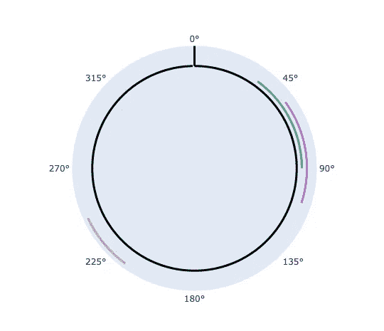
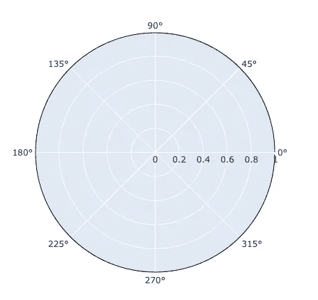
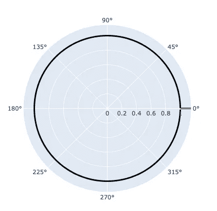
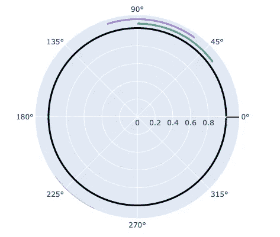
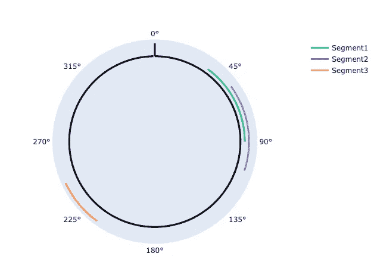

# 非凡的数据可视化—圆形图表

> 原文：<https://towardsdatascience.com/extraordinary-data-visualisation-circular-chart-fe2d835ef929?source=collection_archive---------33----------------------->


[数码师](https://pixabay.com/users/TheDigitalArtist-202249/)在 [Pixabay](https://pixabay.com/illustrations/cyber-network-technology-futuristic-3400789/) 拍摄的照片

## 一个圆形图表显示了用 Python Plotly 实现的比例和位置关系

使用饼图或圆环图来表示整体中不同组成部分的比例是非常常见的。然而，最近我遇到了这样的数据可视化需求:

*   该图表需要呈现几个组件
*   每一个组成部分都需要显示出相对于整个事物的比例

到目前为止，饼图或甜甜圈图仍然是完美的选择。但是，请注意其余的要求。

*   组件可能会重叠
*   除了显示比例外，每个组件将从基线的某个位置开始，并以某个端点结束。

有些情况需要这样的要求。例如，根据 DNA 片段与基线的相似性来表示 DNA 片段。

# 圆形图表

我们可以用一个圆形图表来形象化这种关系。



如上所示，圆形图表包括

1.  代表基线的圆
2.  表示起点/终点的指示。因为是圆，所以起点和终点其实是一样的。
3.  一些度作为刻度将指示位置，以及显示它是顺时针还是逆时针。直观来说，我会推荐用顺时针。
4.  最后，用不同颜色显示位置(起点和终点)和比例(径向长度)的组件

# 要可视化的数据


照片由 [MiraCosic](https://pixabay.com/users/MiraCosic-1326551/) 在 [Pixabay](https://pixabay.com/photos/astrology-divination-chart-993127/) 上拍摄

要可视化的数据如下。

```
gene_list = [
  [0.1, 0.25],
  [0.15, 0.3],
  [0.6, 0.68]
]
```

这是一个二维数组。每个子阵列代表基因的一个片段。这两个数字分别是起点和终点。

例如，第一个基因`[0.1, 0.25]`意味着该基因片段从基线的 10%开始，在 25%结束。所以长度是原来的 0.15。

现在，让我们看看如何使用 Plotly 来绘制这个圆形图表。

# 履行


由 [julianestanczyk](https://pixabay.com/users/julianestanczyk-16531407/) 在 [Pixabay](https://pixabay.com/photos/geometry-math-mathematics-science-5167943/) 上拍摄的照片

用 Plotly 画圆形图并不太难。

首先，我们需要导入 Plotly。如果还没有拿到库，可以简单的通过`pip install plotly`安装。

```
import plotly.graph_objects as go
import numpy as np
```

Plotly 支持极坐标系统，非常适合用来绘制我们的圆形图表。要在极平面中绘制圆，两个重要的参数是

*   圆的半径:`r`
*   角度:`*θ*`

在我们的例子中，我们需要使用半径`r`来区分我们的基圆和其他组件(圆段)。角度`*θ*` 很重要，因为我们需要它来显示起点和终点。换句话说，我们需要基圆的`*θ*` 为 0–360 度，而组件取决于它们相应的比例和位置。

我们定义一个函数来得到`*θ*` *。*

```
def get_theta(pct, num_points):
  start = pct[0] * 360
  length = (pct[1] - pct[0]) * 360
  step = 360 / num_points
  return np.arange(start, start + length + step, step)
```

在这个函数中，它有两个参数。第一个参数`pct`是一个包含两个元素的列表/元组。第一个元素是开始百分比，第二个元素是结束百分比。第二个参数`num_points`表示对于一个完整的 360 度圆，我们想要在图上呈现多少个点。越多的`num_points`我们将拥有越平滑的圆。在我的情况下，360 点就足够了，因为人眼将无法看到小角度。

让我们在这里定义两个常数:

```
num_points = 360
r_gap = 0.05
```

上面提到的`num_points`，我想用 360 分。`r_gap`表示我们希望基圆和每个线段之间有多大的间隙。

我们还需要知道图表的半径应该是多少，才能显示所有的线段。既然我们已经知道了`r_gap`。如果我们假设基圆有它的半径`1`，我们就可以计算出我们想要的最大半径。

```
# Get radial scale
max_r = 1 + (len(gene_list)) * r_gap
```

现在，让我们用 Plotly 初始化一个图形。

```
fig = go.Figure()
```

## 添加基圆

然后，添加基圆。它应该是黑色的。这里我们定义了半径`r=1`，这样线段就是`1 + r_gap * (index + 1)`。

```
# Create the base circle
fig.add_trace(go.Scatterpolar(
  r=[1] * num_points,
  theta=get_theta([0, 1], num_points),
  mode='lines',
  line_color='black',
  line_width=3,
  showlegend=False
))
```



## 添加零度指示器

现在，让我们在 0 度上画一个小“杠”来表示基圆从哪里开始。此外，在图表边缘和线段之间留出一些空间也有所帮助。

```
# Create the zero indicator
fig.add_trace(go.Scatterpolar(
  r=[1, max_r],
  theta=[0, 0],
  mode='lines',
  line_color='black',
  line_width=3,
  showlegend=False
))
```

请注意，这里我们只需要图上的两点:

*   (1，0 度)
*   (最大 r，0 度)



## 渲染线段

现在看起来好多了。让我们在 for 循环中渲染我们的片段。

```
# Loop the gene list to add all the gene cirles 
for index, seg in enumerate(gene_list):
  fig.add_trace(go.Scatterpolar(
    r = [1 + (index + 1) * r_gap] * num_points,
    theta = get_theta(seg, num_points),
    mode='lines',
    line_width=3,
    name='Segment' + str(index+1)
  ))
```



好的。看来还是有事情要做的。如图所示，有几个问题:

*   第三段几乎看不见，因为它几乎不在图表的边缘。
*   零度从 3 点钟位置开始，最好让它从 0 点钟位置开始。
*   图表是逆时针方向的，对于大多数人的习惯来说并不直观。
*   半径记号没有用。
*   网格没有用。

## 调整布局

让我们解决上述所有问题。

```
# Configure the layout based on the requirements.
fig.update_layout(
  polar=dict(
      angularaxis=dict(
        rotation=90,
        direction="clockwise",
        showticklabels=True,
        showgrid=False
      ),
      radialaxis=dict(
        range=[0, 1 + (len(gene_list) + 1) * r_gap],
        showticklabels=False,
        visible=False
      )
  )
)
```



现在，我们有了一个完美的圆形图表！

# 摘要


由 [Pixabay](https://pixabay.com/illustrations/solve-jigsaw-problem-concept-2636254/) 上的[absolute vision](https://pixabay.com/users/AbsolutVision-6158753/)拍摄的照片

在本文中，我展示了如何使用 Plotly 绘制一个圆形图表，表示数据的比例和位置关系。

所有代码都可以在我的 Google Colab 笔记本中找到:

[](https://colab.research.google.com/drive/1JyAF3saWjwb8DIr_u_cQA9Mm8jNSs688?usp=sharing) [## 圆形图表

### 用 Python 中的 Plotly 绘制圆形图表

colab.research.google.com](https://colab.research.google.com/drive/1JyAF3saWjwb8DIr_u_cQA9Mm8jNSs688?usp=sharing) 

虽然有时数据可视化库可能不提供一些现成的数字和图表，但我们仍然可以使用 Python 轻松地绘制出我们脑海中的任何东西。Plotly 就是这样一个令人惊叹的数据可视化库。

[](https://medium.com/@qiuyujx/membership) [## 通过我的推荐链接加入 Medium 克里斯托弗·陶

### 作为一个媒体会员，你的会员费的一部分会给你阅读的作家，你可以完全接触到每一个故事…

medium.com](https://medium.com/@qiuyujx/membership) 

**如果你觉得我的文章有帮助，请考虑加入灵媒会员来支持我和成千上万的其他作家！(点击上面的链接)**