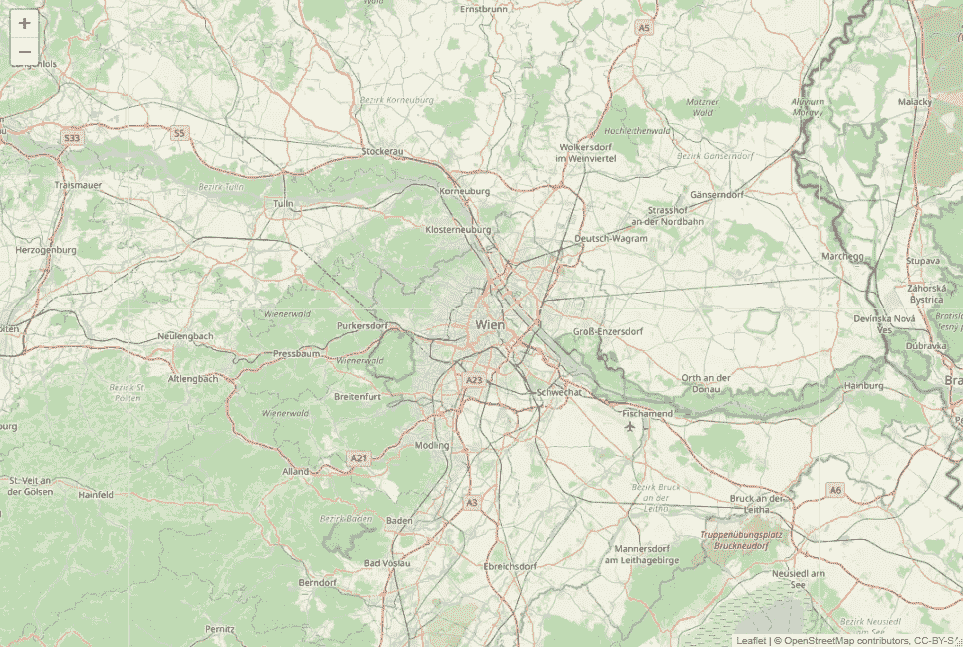
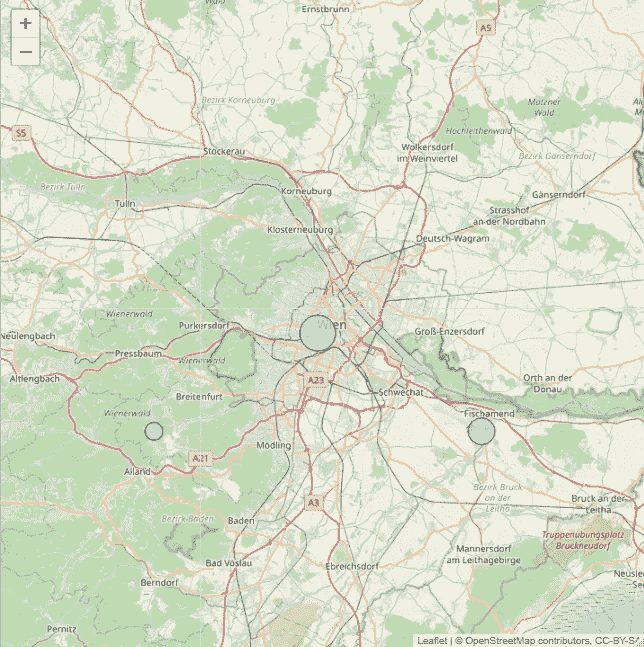
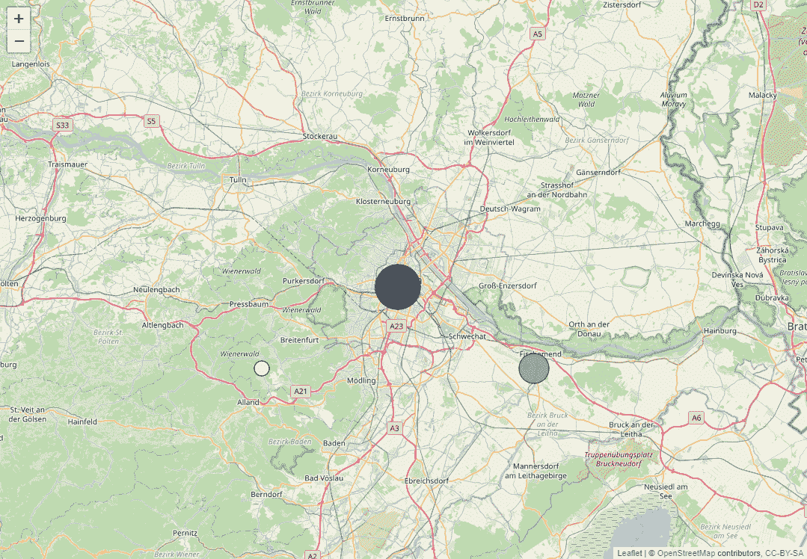
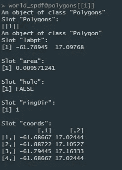
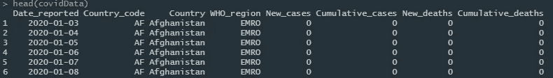
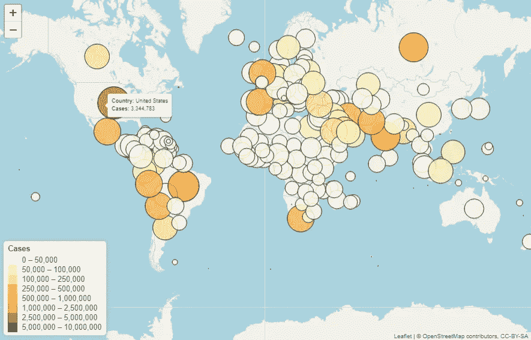
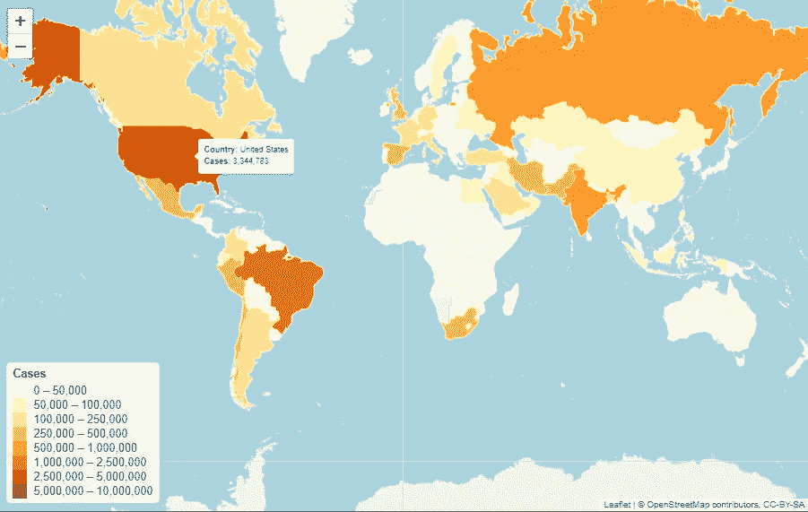
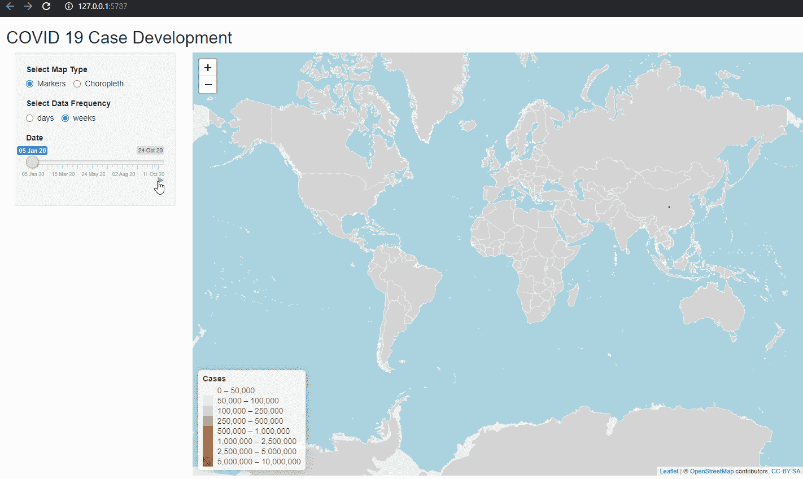
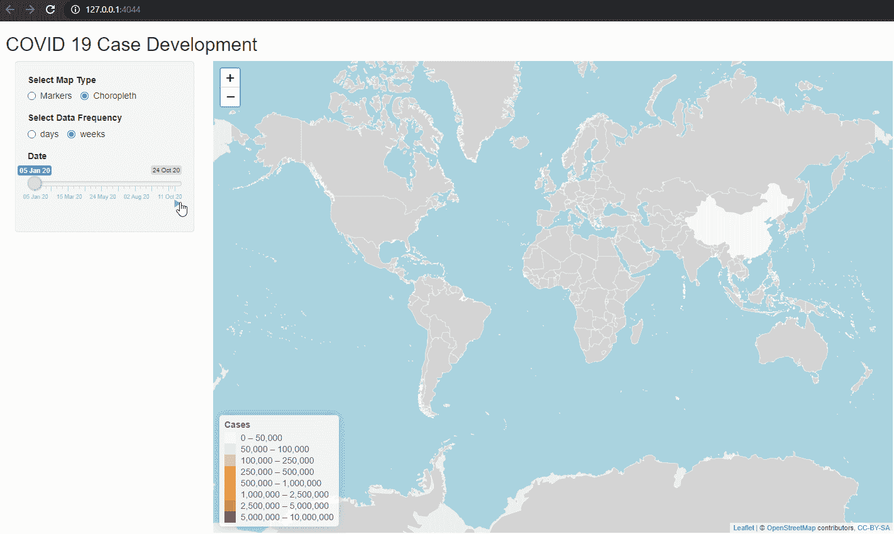

# 引人注目的 R 动画地图——简单介绍

> 原文：<https://towardsdatascience.com/eye-catching-animated-maps-in-r-a-simple-introduction-3559d8c33be1?source=collection_archive---------7----------------------->

## 使用**传单**和**闪亮**轻松制作美丽地图的动画。

由[提莫·维林克](https://unsplash.com/@timowielink?utm_source=medium&utm_medium=referral)在 [Unsplash](https://unsplash.com?utm_source=medium&utm_medium=referral) 上拍摄

作为数据科学家和数据分析师，我们每天都要处理不同种类的数据。我们都知道，数据和我们的发现的可视化是关键，尤其是在向同事或客户展示时。毕竟，用图表来讲述一个故事比用简单的数字或文本要容易得多。当您通过仪表板呈现数据时，不仅静态可视化变得重要，您还希望动态显示数据的变化。

在这篇文章中，我将展示如何使用 r 中的**活页**和**闪亮**库轻松制作基于地理空间数据的图表。

# 1.介绍

虽然在 R 中绘制地图有许多方法(例如使用 **ggplot2** 或 **tmap** )，但**传单**库是我个人最喜欢的，原因如下:

*   简单
*   高度定制化
*   漂亮的交互式地图
*   适用于所有主要的桌面和移动平台

**leaflet** R 库建立在 [leaflet.js](https://leafletjs.com/) 之上，这是领先的用于移动友好的交互式地图的开源 JavaScript 库。R 实现让我们只用几行代码就能生成简单的地图。例如，只需一行代码，您就可以显示以下地图，放大奥地利美丽的维也纳:

基本传单地图(图片由作者提供)

尽管创建这个地图非常简单，但是它还没有显示任何数据。最终我们想要的是这样的东西:

附有数据的基本传单地图(图片由作者提供)

我们想要用数据覆盖我们的地图(就像在上面的例子中，我们已经添加了一些圆圈标记)，或者甚至根据一些底层数据给我们的地图着色(所谓的 [Choropleth](https://en.wikipedia.org/wiki/Choropleth_map) )。最后，我们希望能够动画显示数据随时间的变化，以便将我们的地图包含在一个漂亮的仪表板中。

基本动画(图片由作者提供)

在接下来的部分，我将简要演示如何制作一个类似于上面的动画，以及如何创建一个动画的 Choropleth。

# 2.数据

首先，我们需要两种类型的数据:我们需要显示我们想要的地图和我们有兴趣显示的数据。

对于地图数据，我们使用**活页**有两个主要选项:

*   瓷砖
*   GeoJSON 或 TopJSON 文件形式的地理空间数据

我们已经看到了如何使用上面图表中的基本图块，简单地使用默认为 [OpenStreetMap](https://www.openstreetmap.org/) 图块的 *addTiles()* 函数。我们也可以通过使用 *addProviderTiles()* 函数来使用其他第三方图块集。有关可用图块的完整列表，请参见此处的。

我们还可以从 GeoJSON 或 TopJSON 文件中读取地理空间数据，并将它们转换为 r 中的空间对象。为了创建我们的 Choropleth，我们必须使用一个名为 *addPolygons()* 的函数，它要求我们使用这样的空间数据。虽然这整个过程一开始听起来复杂而吓人，但实际上非常简单。

在本文中，我们将重点展示国家级别的数据。我们可以很容易地从[www.thematicmapping.org](http://www.thematicmapping.org)获得所需的空间数据，它提供了“[世界边界数据集](http://thematicmapping.org/downloads/world_borders.php)”。下面的代码片段展示了如何从 r 下载、解压缩和加载这些数据。

生成的空间面数据框包含所有国家的信息，例如国家代码、名称、经度和纬度坐标。对象中包含的基本数据可以通过以下方式访问:

世界边界数据集概述(图片由作者提供)

对于绘制 Choropleth 来说，重要的是对象中包含的多边形数据。这基本上是用来绘制国家边界的数据。

多边形数据(图片由作者提供)

这是我们需要的所有数据，用来创建我们将要使用的基本地图。

我们将要显示的数据与当前的重要主题相关:正在进行的新冠肺炎疫情的案例数据。世界卫生组织以 csv 格式发布所有国家的每日病例统计数据，我们可以随时查阅。

世卫组织 Covid 数据集(图片由作者提供)

该数据集为我们提供了自 2020 年初以来的每日统计数据，并且每天都在更新。

# 3.基本地图

在这一节中，我将展示如何创建地图的基本版本，我们将在后面制作动画。

首先，我们将把空间数据与选定日期的 COVID 案例结合起来，定义将要显示的标签文本，并为数据和图表图例设置调色板。

现在，我们可以使用圆形标记来创建地图的第一个版本，以显示 COVID 案例。

基本圆形标记图(图片由作者提供)

这很简单！我们所要做的就是使用 *addCircleMarkers()* 函数，使用我们的数据集中包含的经度和纬度坐标作为圆的中点，并使它们的半径和颜色取决于案例的数量。我们还添加了出现在鼠标悬停时的标签文本以及左下角的图例。所有这些都不费吹灰之力！

创建 Choropleth 版本同样简单。不使用 *addCircleMarkers()* 函数，我们只需使用 *addPolygons()* 函数，并且不使用坐标，我们需要使用空间多边形数据框中包含的多边形。

基本 Choropleth 地图示例(图片由作者提供)

再说一遍，超级简单！在下一节中，我们将使用**闪亮的**为我们创建的两个版本的地图制作动画。

# 4.动画

**虽然**传单**本身无法帮助我们完成显示数据随时间变化的任务，但我们可以使用 **shiny** 中的简单设置来完成这一任务。我们所要做的就是使用一个 *sliderInput* 小部件为我们选择日期，并将 animate 参数设置为 TRUE。**

**这个输入部件在右下角有一个小的播放按钮，如果我们在这个部件中观察地图的变化，我们将得到我们的模拟！**

**为了避免每次改变时都要重新绘制整个地图的开销，我们可以使用 *leafletProxy()* 函数，它是专门为在闪亮的上下文中使用而设计的。它允许我们访问已经绘制的地图并改变其特征。**

**对于地图的标记版本，我们只需通过 *clearMarkers()* 清除现有标记，并在观察到所选日期发生变化时添加新标记。**

****

**闪亮的动画标记地图(图片由作者提供)**

**不幸的是，重新绘制多边形在计算上更加昂贵，并且会在我们的**闪亮的**应用程序中引入显著的延迟。在撰写本文时，**传单**库中还没有直接的方法允许我们简单地改变绘制的多边形的特征。然而，使用一点 JavaScript 就像这里详细描述的[一样](https://github.com/rstudio/leaflet/issues/496)将允许我们做我们想做的事情。**

****

**闪亮的动画 Choropleth 地图(图片由作者提供)**

**正如承诺的那样，你可以在下面找到**闪亮**应用的完整代码:**

# **5.结论**

**这就把我们带到了本文的结尾，在这篇文章中，我演示了如何使用**传单**和**闪亮的** R 库轻松创建引人注目的动画地图。希望这能让你自己通过几个简单的步骤创建令人惊奇的交互式地图，并在一个漂亮的仪表板上分享它！**

**如果您对我在本文中展示的内容有任何反馈或问题，请务必让我知道，并在这些不确定的时期保持安全！**