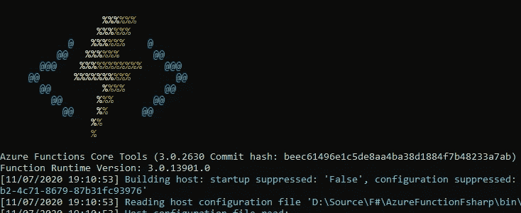
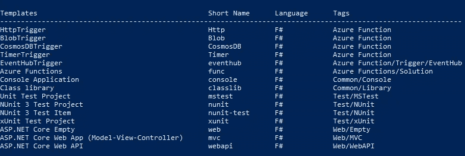
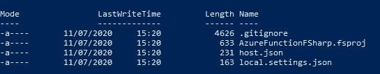
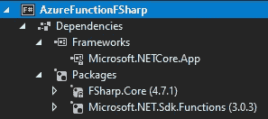
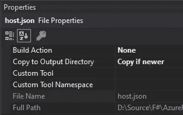
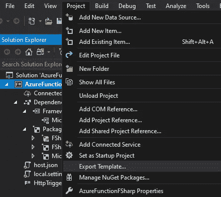
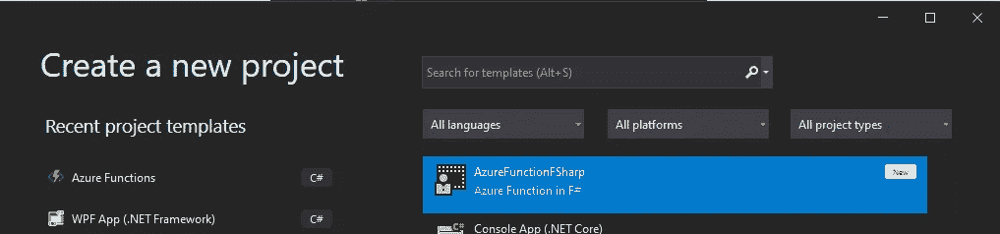
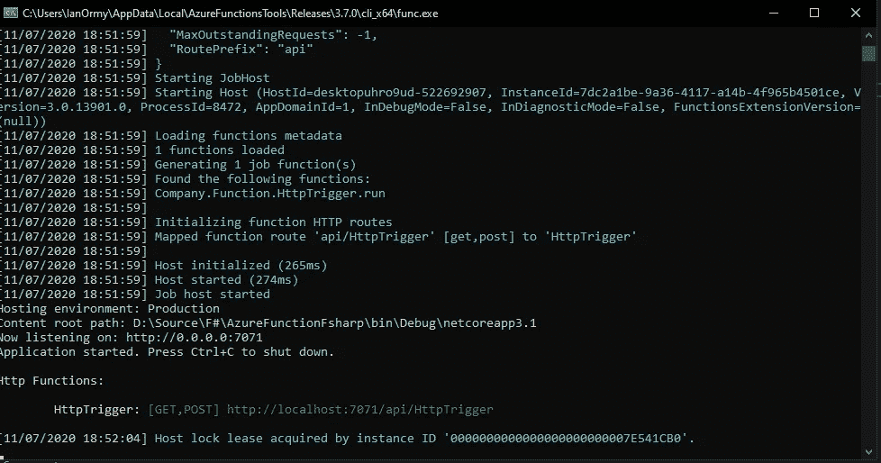

# F# Azure 函数

> 原文：<https://towardsdatascience.com/f-azure-functions-a5cce33dce58?source=collection_archive---------31----------------------->

## 在 F#中创建 Azure 函数



F#中的 Azure 函数

F#是一种很棒的语言，也是为你的 Azure 函数编程的好选择。不幸的是，微软并没有让实现它们变得容易。这当然比以前容易，但在开始时需要做一些准备工作。但是我认为这种努力是值得的！

## Azure CLI

要开始，您需要在计算机上安装 Azure CLI。如果您还不知道，请点击下面的链接:

[https://docs . Microsoft . com/en-us/CLI/azure/install-azure-CLI？view=azure-cli-latest](https://docs.microsoft.com/en-us/cli/azure/install-azure-cli?view=azure-cli-latest)

这将使您能够从 Windows 命令行或 PowerShell 提示符使用 Azure CLI。我更喜欢 PowerShell 提示符，因为这也能让您完成制表符。

在 PowerShell 提示符下，键入以下内容以获取当前为 F#安装的 Azure 模板列表:

```
dotnet new --list -lang F#
```

您应该会看到类似这样的内容:



F#的 Azure 模板

## 创建项目模板

首先，我们将根据提示为 Azure 函数创建项目模板:

```
dotnet new func -lang F# --name AzureFunctionFSharp
```

这将创建 4 个文件:



## 创建功能

在所有可用的 Azure 函数模板中，最容易使用的是 **HttpTrigger** 。要在提示符下创建它:

```
dotnet new http -lang F# --name HttpTrigger
```

这将创建 HttpTrigger.fs

## 创建解决方案

完成所有这些后，下一步是在 Visual Studio 2019 中创建解决方案文件。如果你打开项目文件**azurefunctionfsharp . fsproj**，你应该会发现几乎所有你已经添加的东西:



VS2019 中的初始项目

但是，您会注意到它没有我们的 **HttpTrigger.fs** 文件！只需将该文件添加到项目中。还需要添加 **hosts.json** 和**localhost . settings . JSON**。对于这最后两个文件，您必须确保它们的构建动作是 *None* 并且它们被复制到输出目录(如果较新的话):



为 JSON 文件构建属性

一旦你完成了，构建项目并保存解决方案。

## 附加 NuGet 包

我找到了 [FSharp。Data](http://fsharp.github.io/FSharp.Data/) NuGet 包在处理 F#项目时非常有用。您可以通过项目的**管理包**选项来添加它。

## 创建自定义模板

完成所有这些后，您可以将整个项目保存为自定义模板，供将来的项目使用。这将使你不必再次经历这一切。如果您在**解决方案浏览器**选项卡中选择您的项目，然后从项目菜单中选择**导出模板**，您可以将该项目导出为未来模板:



导出模板

下次你想创建一个 F# Azure Function 项目时，你可以使用你已经创建的自定义模板:



创建一个新的 F# Azure 函数项目

## 调试你的 F# Azure 函数

如果一切设置正确，您现在应该能够按 F5 键并调试您的项目。您应该会看到类似这样的内容:



Azure 功能在本地运行

然后，您可以使用类似于 [Postman](https://www.postman.com/) 的东西向 REST API 发送请求，并查看您的输出。

## 结论

正如我在开头所说，这不像在 C#中创建 Azure 函数那样简单，但肯定值得付出努力。希望微软会继续改进他们对 F# Azure 函数的支持，并在 Visual Studio 2019 或未来版本中放置一个合适的模板。与此同时，这是你自己可以做到的。