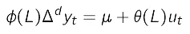
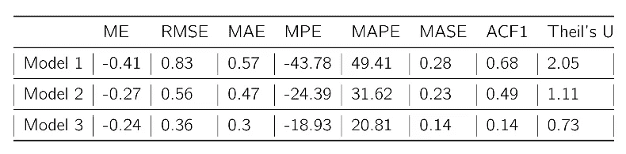

# 寻找最佳预测模型:不同单变量预测模型的比较

> 原文：<https://towardsdatascience.com/f-forecasting-5d23341462eb?source=collection_archive---------22----------------------->

## 使用 AR、MA、ARIMA 和 SARIMA 进行单变量预测的最简单、最全面的指南。


预测可能是一项艰巨的挑战，尤其是对那些只有很少或没有统计学背景的人来说。但我认为这比人们想象的要容易得多。在本文中，我将介绍基本的单变量预测模型，并相对轻松地预测一个变量。

# 基本模型

单变量预测有两种基本模型。第一种是利用预测变量的过去值的自回归模型和使用白噪声误差项的过去值的移动平均模型。

**自回归模型**看起来像这样


自回归模型

请注意，该模型仅使用预测变量(y)的过去(滞后)值。我们使用滞后的数量 *p* ， *p* 通过一些测试来确定。

**移动平均线模型**看起来是这样的


移动平均模型

像 AR 一样，MA 使用过去的值，但它使用误差项，而不是预测变量。我们使用 *q* 数量的滞后， *q* 由一些测试确定。

我们可以将自回归模型和移动平均模型结合在一个叫做 ARMA 的模型中。然而，通常情况下，我们的预测变量是非平稳的。这意味着该系列通常包含上升或下降趋势。为了减轻这一点，我们可以差分序列，以消除那些向上或向下的运动，使序列平稳。这样做，我们产生了 ARIMA 模型或自回归综合移动平均。一些时间序列变量可能具有季节性，如销售或收入，它们通常在假日期间激增。为了适应这种情况，我们有一个 ARIMA 的广义变体，称为 SARIMA，它也包含了季节滞后。

ARIMA**模型看起来是这样的**



滞后算子表示法中的 ARIMA 模型

在这个模型中，我们将系列*差 d 次*，直到它变得稳定*。*phi 和 theta 分量分别代表 AR 和 MA 模型。

萨里玛模型看起来像这样


滞后算子表示法中的 SARIMA 模型

这仅仅是 ARIMA 的一个概括，但是增加了季节差异、季节移动平均滞后和季节自回归滞后。

# 预赛

我们的目标是预测下个月的通货膨胀率。您应该拥有的是逗号分隔的值文件(。从 2000 年 1 月到 2020 年 4 月菲律宾的月通货膨胀率。档案名称为 InflationRateLecture.csv。如需完整系列，您可以从 Bangko Sentral ng Pilipinas 主要统计指标页面下载。您还应该在 Mac 或 PC 上安装 R 和 RStudio 的副本。如果这是你第一次使用 R，不要害怕，只要遵循下面的代码就可以了。

第一步是安装必要的软件包。对于这个例子，我们需要安装所需的包。这些命令如下:tidyverse 用于常规数据操作，urca、forecast、TSstudio 和 tseries 用于必要的预测命令。请随意探索您可以从中获得的各种功能。

生成一个新的脚本，以便您可以跟踪事情。首要任务是安装所需的软件包。我们可以在 tools 选项卡中手动查找包，或者您可以只运行下面的命令。请注意，根据您的互联网连接，安装可能需要一些时间。

```
install.packages("tidyverse")
install.packages("urca") 
install.packages("forecast") 
install.packages("tseries") 
install.packages("TSstudio")
```

安装完成后，您现在必须告诉 R 您将要使用这些包。我们通过调用 library()函数来实现这一点。把这想象成从图书馆里拿一本书，你想借并在一次特定的学习中使用。

```
library(tidyverse)
library(urca)
library(forecast)
library(tseries) 
library(TSstudio)
```

运行完所有这些命令后，您应该准备好运行所有必要的命令。如果在预测过程中关闭 R 会话，只需再次使用库命令来重新加载包。无需重新安装(除非有可用的软件包更新)。

## 加载数据集

加载数据集的一个简单方法是使用 file.choose()函数，它会打开一个对话框，类似于我们打开文件时习惯使用的对话框。将数据集存储在对象中很重要，这样我们以后就可以引用它。首先，我们加载数据集并将其存储在一个对象中。在本教程中，我将物体命名为“膨胀”,但是你可以随意命名。代码和数据集可以在这里找到

[https://drive . Google . com/drive/folders/11 rzi 8 p-qcvwlamdro 93 fnslqlxco 39 ef？usp =共享](https://drive.google.com/drive/folders/11RZI8p-qCvwLAmdro93FnslQLxCO39Ef?usp=sharing)

```
inflation <- read_csv(file.choose())
```

read_csv 是 tidyverse 内 R 中 readr 包的一部分。这用于读取 csv 文件，并能够在 r 中加载它。您应该注意到，应该会出现一个对话框，提示您选择文件。一定要选 InflationRateLecture.csv。

```
head(inflation)
nrow(inflation)
```

运行 head(inflation)命令会列出数据集的前 6 行。你应该看到 2000 年 1 月的通货膨胀率是 5.5，2000 年 2 月是 5.6，以此类推。nrow(inflation)给出数据集中的总行数。这表明数据集中有 244 个时间段(月)。您也可以通过查看环境选项卡并单击通货膨胀旁边的网格来查看数据集。

## 声明时序对象

目前，我们加载的数据集是一个框架。为了能够预测，我们需要一系列。如果你查看数据集，我们只对预测其中的“利率”变量感兴趣。因此，我们需要将“利率”变量转换成一个序列。

```
inf <- ts(inflation$Rate, start = c(2000,1,5), frequency = 12)
```

我们正在创建一个名为“inf”的新对象，这是我们将使用的系列。ts 命令创建该对象。命令中的第一个参数是变量。$告诉 R 我们想从数据集通货膨胀中获得利率变量。之后，我们指定开始日期为 2000 年 1 月 5 日。r 可以在这之后自动检测结束。最后，我们指定系列的频率。因为我们处理的是月度数据，所以频率应该是 12。如果是每季度一次，频率为 4，每周一次为 52，每两年一次为 2。

## 绘制时间序列图

将我们的系列形象化是很重要的。我们可以使用 autoplot 命令来做到这一点。

```
autoplot(inf) + ggtitle("Inflation Rate (Philippines), January 2000 to April 2020") + labs(x = "Time", y = "Inflation Rate")
```


通货膨胀率曲线图

该命令以相应的标题“通货膨胀率(菲律宾)，2000 年 1 月至 2020 年 4 月”绘制系列“inf”，其中 x 轴标记为时间，y 轴标记为通货膨胀率。对于这些规范，我们使用 ggtitle 和 labs 选项。如果你做的正确，你应该有一个类似上图的图。我们可以看到全球金融危机期间的通胀飙升，缩减恐慌，以及最近通过的第一套刺激方案。

# 预测构建模块

我们现在继续生成 ACF 和 PACF 图，并确定序列是否是非平稳的。

让我们首先生成通货膨胀率的 ACF 和 PACF。同样，ACF 和 ACF 可以告诉我们很多关于这个系列的特性。通常，它给出了序列的基本过程的一些指示，无论它是 AR、MA 还是 ARMA。此外，如果我们认为序列是非平稳的，我们将看到通货膨胀差值的 ACF 和 PACF。

```
ggAcf(inf) + ggtitle("ACF of Inflation")
ggPacf(inf) + ggtitle("PACF of Inflation")
```


ACF 和 PACF(水平)

图中的 ACF 是几何衰减的，而 PACF 记录了立即截止。如果我们回忆一下上节课关于 ACFand PACF 的内容，这与 AR 过程是一致的。虽然还不确定，但这给了我们一个潜在过程的线索。在 ACF 中，请注意第一个到第十一个滞后具有统计显著性(超出蓝色置信带)。我们还可以看到，一些部分自相关是重要的，如第一、第二和第十四。

## 系列差异

减轻非平稳性的一种方法是对序列求差分。为此，我们使用 diff()命令。

```
dinf <- diff(inf)
ggAcf(dinf) + ggtitle("ACF of Inflation (Differenced)") 
ggPacf(dinf) + ggtitle("PACF of Inflation (Differenced)")
```

第一个命令利用 diff()函数对序列进行差分，并创建一个对象“dinf ”,它是通货膨胀的差值。默认情况下，它会差一次，但我们可以将其设置为差两次或指定的任何次数。


ACF 和 PACF(差异)

类似于这些水平，我们可以看到 ACF 呈几何衰减，而在 PACF 中可以看到立即截止。这是支持 AR 过程的更多证据。但是，请注意，并不是很多滞后都很明显。这是一个信号，表明序列是“平稳的”,这迫使它显示协方差平稳的性质。我们将继续深入探讨这个问题。


水平与差异通货膨胀

比较通货膨胀的水平值和差值会得出一些有趣的结果。首先，使用简单的图形外观可以证明非平稳性。但是，在进行正式的统计测试之前，我们不能太确定。第二，请注意，在差分序列中仍然有野峰值(异常值)。这些可能是结构性突变的指标，我们需要考虑它们是否存在。

## 时间序列的分解

对我们拥有的时间序列进行适当的分解也很重要。这些成分是趋势、季节性和序列中的随机成分。幸运的是，R 中有一些命令可以自动为我们绘制图表。

```
ts_decompose(inf, type = "additive", showline = TRUE)
```


级数的分解

TSstudio 库中的 ts_decompose 命令为我们提供了该系列组件的可视化效果。此命令会将序列分割成序列的观察、趋势、季节和随机部分。请注意，可能在每年的八月或九月，会出现一些可观察到的季节性。原因我会留给你去想。TSstudio 中的分解命令更具交互性，允许您将光标悬停在图形(由 plot.ly，一个有趣的图形库生成)上，并深入研究该系列。随着时间的推移，我们将会更多地使用这种方法。

# 非平稳性测试

在测试非平稳性时，我们将使用三种最流行的测试。这些是扩展的迪基-富勒试验、菲利普-佩伦试验和 KPSS 试验。请记住 ADF 和 PP 测试是单位根测试。因此，他们的零假设是非平稳的，而他们的替代品是平稳的。相反，KPSS 检验是平稳性检验，其零假设是平稳性，而其替代假设是非平稳性。

## 扩充迪基-富勒试验

进行 ADF 测试的命令是 r 中的 adf.test()。我们将使用平稳性的两个备选假设对系列进行此测试。我们将在原始系列和差异系列上运行此操作。

```
adf.test(inf) 
adf.test(inf, k = 1)
adf.test(inf, k = 2)
adf.test(dinf)
```

请注意，当我们运行第一行时，有一个提示提示序列是静止的。我们测试第四行的时候也是这样。虽然通货膨胀的差异变量肯定是稳定的，但该水平的值可能具有很大的欺骗性。正如我们前面说过的，ADF 测试的限制是你必须指定滞后阶数。这些测试(第一次和第三次)在第六轮进行。如果我们使用一个更现实的滞后，比如 1 或 2，这个序列被确定为非平稳的。

## 菲利普斯-佩龙试验

对于 Phillips Perron 测试，我们使用 pp.test()命令。与 ADF 测试不同，我们不再需要指定滞后阶数，并且更加通用。

```
pp.test(inf)
pp.test(dinf)
```

PP 测试的结果相当有说服力。我们看到，在水平，该系列是不稳定的，因为我们无法拒绝零假设。一旦求差，数列就稳定了。因此，当我们开始建立一个预测模型时，我们需要对通货膨胀进行差分，以使其平稳化。

## **科维亚特科夫斯基-菲利普斯-施密特-申试验**

最后，我们转向 KPSS 检验。请记住，这个测试的零假设是平稳性，而另一个假设是非平稳性。KPSS 测试的命令是 kpss.test()。我们可以指定一个名为 null 的选项为“趋势”或“水平”或两者。在这种情况下，我们就让它保持缺省值，考虑两者。

```
kpss.test(inf)
kpss.test(dinf)
```

正如所料，我们发现水平序列不是平稳的。奇怪的是，检验还发现差分序列是非平稳的。尽管如此，我们也可以参考 ADF 和 PP 检验的结果来支持我们的主张，即差分序列是平稳的。

# 预测本身

现在让我们转到预测本身。首先，在进行样本外预测之前，我们先进行样本内预测。正如我们在第一部分中提到的，预测样本的原因是为了查看生成的模型的质量，并让我们将不同的预测模型及其估计值与实际实现值进行比较。我们将使用上一章讨论的预测质量指标。最后，在接近尾声时，我们将使用我们确定的最佳预测模型来预测下一年的通货膨胀。

## 将数据集分成训练集和测试集

首先，让我们将数据集分成两个样本，一个训练样本和一个测试样本。训练样本是我们必须预测的可用数据。测试样本是已经实现的数据(即我们已经知道系列值)，但我们坚持测试预测模型的质量。而以前，这一步曾经是一个痛苦，与 R，它是一件轻而易举的事。我们使用 ts_split 命令来做到这一点。

```
split_inf <- ts_split(inf, sample.out = 12)training <- split_inf$train 
testing <- split_inf$testlength(training)
length(testing)
```

我们使用 ts_split 函数创建了一个名为 split_inf 的对象，它本质上是 inf，但被分成两部分。对象 inf 分为两部分，其中测试集由命令 sample.out 给出。我们将 sample.out 设置为等于 12，即 12 个月或一年。因此，我们希望我们的测试(验证)周期等于一年。之后，我们创建两个对象(培训和测试),这将创建两个独立的系列。使用 length 命令，我们可以确定每个生成的序列中有多少个周期。您会注意到，定型数据集有 232 个周期，而测试数据集有 12 个周期(与 sample.out 选项指定的数量相同)。

## 诊断训练集

至少对实现什么模型有一些概念是很重要的。要做到这一点，我们需要尝试和诊断我们必须的训练数据集，看看我们是否可以提出关于哪个模型可能适合该系列的建议。为此，我们恳求使用 arima_diag()命令。

```
arima_diag(training)
```

运行这个程序，我们就能得到要跟踪的数字。由于这是使用 plot.ly 创建的，因此交互性很强。我们可以看到，它显示了训练数据集的值以及相关的 ACF 和 PACF。它还向我们展示了差异训练系列的图表。我们可以看到，ACF 正以几何级数下降，在 PACF 看到了一个直接的截止。这类似于我们对 ar 模型的预期模式。要确定要使用的滞后数量，请注意在 PACF 中，前两个滞后仍然很重要。在第二个滞后之后，大多数剩余的滞后是不重要的。现在，让我们猜测两个自回归滞后。还要注意，在 PACF 和 ACF 中，有红色的数据点。这些红色的数据点表明了季节性滞后的可能性。


ARIMA 诊断图

## 构建预测模型

让我们试着预测具有三种不同规格的三种模型。我们将尝试使用的三种模型是

安 ARIMA(2，1，1)

萨里玛(2，1，1)(1，0，0)

该模型使用 auto.arima()函数确定了最合适的值

对于第一个模型，我们将尝试使用 2 个自回归滞后，因为这是 PACF 所表明的。我们将对序列进行一次差分，因为我们知道在不同的水平上，序列是不稳定的，如 ADF、PP 和 KPSS 检验的结果所示。我们猜测我们有 1 移动平均线滞后。对于第二个模型，我们将使用与第一个相同的规范，只是我们添加了一个季节性自回归滞后。最后，对于第三个模型，我们使用 R 中内置的 auto.arima()函数来避免猜测选择哪个 lag 规范是最好的。

让我们转到模型 1。我们创建一个名为 arima211 的对象，并使用 arima()命令进行建模。arima()命令中的第一个选项是 training，这是我们将使用的系列。阶数选项指定了 ARIMA 的阶数，在这种情况下，我们指定了一个具有两个自回归滞后、一个平稳化差异(即序列是 1 阶的积分)和一个移动平均滞后的 ARIMA。autoplot()命令检查是否满足稳定性条件。这就是第二节中阐述的平稳性条件。由于我们处理的是逆根，所以所有的逆根都必须在单位圆内。最后，check_res 命令提供对残差的诊断，我们希望残差是白噪声。模型 2 的结构与此相同，只是我们在调用 arima()命令时添加了一个季节性订单。在这种情况下，我们添加 1 个季节性自回归滞后。模型 3 的结构与此相同，只是我们让 R 使用 auto.arima()命令来决定顺序。选项 search = TRUE 只是确保它可以选择一个 SARIMAmodel，如果它认为它是最佳的。

```
#For Model 1arima211 <- arima(training, order = c(2,1,1))
autoplot(arima211)
check_res(arima211)#For Model 2 sarima2111 <- arima(training, order = c(2,1,1), seasonal = list(order = c(1,0,0)))
autoplot(sarima2111)
check_res(sarima2111)#For Model 3auto <- auto.arima(training, seasonal = TRUE)
auto #We obtained a SARIMA(2,1,0)(2,0,1) based on auto.arima()
autoplot(auto)
check_res(auto)
```

如果你做对了，你应该会看到后面的数字。请注意，对于所有三个模型，根都在单位圆内，因此，模型已经通过了平稳性标准，表明不再有单位根。查看残差图，我们看到所有三个模型的残差通常都是白噪声。然而，我们确实注意到有一些滞后在置信带之外，但毫无疑问，模型 2 和模型 3 相对于模型 1 产生更多的白噪声误差，模型 1 在第 12 个滞后时具有相当显著的 ACF。这种红色滞后是季节性滞后，表明季节性模型更适合。


逆 AR 和 MA 根


残留诊断

## 生成预测和预测评估

现在我们到了关键时刻。现在让我们使用每个模型生成预测，并根据基线对它们进行评估。每个型号的命令结构相似。首先，我们创建三个对象，即 fcast1、fcast2 和 fcasta，它们代表每个模型的预测。每个对象都是使用 forecast()函数生成的，该函数有两个选项。首先是我们键入它将使用什么模型进行预测。第二个是要预测的周期数。由于测试数据集有 12 个周期长，我们将范围 *h* 设置为 12。接下来，我们使用 test_forecast()命令将预测值与实际值进行比较。该命令生成一个交互式图表，并将每个预测与实际值进行比较，同时还显示每个数据点的关键预测质量指标。最后，accuracy()命令生成我们在上一节中讨论的预测指标的完整平均值。accuracy()命令中的第一个选项是将每个模型生成的预测与测试或验证系列进行比较。

我们可以在下图中看到实际值与预测值的对比图。我们注意到，使用 auto.arima()命令生成的规范的模型 3 似乎是基于 fit 的最佳模型。请注意，当我们生成这些图表时，我们可以悬停在每个数据点上，它会给我们。

```
#For Model 1fcast1 <- forecast(arima211, h = 12)
test_forecast(actual = inf, forecast.obj = fcast1, test = testing)
accuracy(fcast1,testing)#For Model 2fcast2 <- forecast(sarima2111, h = 12)
test_forecast(actual = inf, forecast.obj = fcast2, test = testing)
accuracy(fcast2,testing)#For Model 3fcasta <- forecast(auto, h = 12)
test_forecast(actual = inf, forecast.obj = fcasta, test = testing)
accuracy(fcasta,testing)
```


预测与实际



预测指标

进一步使用 accuracy()命令，我们可以看到每个模型的预测统计比较。预测指标如下表所示，由 accuracy()命令生成。我们可以看到从模型 1 到模型 2 以及从模型 2 到模型 3 的改进。这表明添加季节滞后是至关重要的，基于这些指标，auto.arima()生成的模型似乎是最佳的。

# 样本外预测

既然我们知道了预测的最佳模型，我们现在将生成一个样本外预测。在这种情况下，我们不知道数列的实际值。我们只能利用我们所拥有的任何信息来预测未来。本质上，这是你一直期待的预测。

## 生成最佳拟合

与生成模型类似，我们创建一个对象，在其中存储选择的模型。我们不使用训练数据，而是使用 inf 的整个膨胀序列。然后，我们测试逆 AR 和 MA 根以及残差。

```
finalfit <- auto.arima(inf, seasonal = TRUE)
autoplot(finalfit)
check_res(finalfit)
```


最终装配诊断

我们发现所有的逆根都在 AR 和 MA 单位圆内。这样，我们满足了稳定性条件，不再有任何单位根。在残差诊断中，虽然仍有一些明显的滞后，但通常已经是白噪声了。

# 生成样本外预测

我们现在使用我们选择的模型进行预测。以下命令将生成预测。由于通货膨胀通常会被重新预测，让我们设定一个 4 个月的短期范围。然后，让我们看看它对 2020 年 5 月至 8 月通胀率的预测。summary()命令列出了未来四个月的点预测和置信区间。

```
fcastf <- forecast(inf, model = finalfit, h = 4)
plot_forecast(fcastf)
summary(fcastf)
```


2020 年 5 月至 8 月通胀率预测

我们可以看到，5 月(2.0%)、6 月(2.1%)、7 月(2.1%)和 8 月(2.1%)的预测值与 BSP 的通胀目标和其他预测估计值相当一致。还要注意，随着地平线变得越来越大，置信带也随之扩大。干得好，你刚刚预测了你的第一个关键经济变量。

# 结论

我们现在已经对样本外进行了预测，并获得了未来四个月的值。随着时间的推移，我们将会看到我们的预测是否确实可靠。可以说，预测是一个反复试验的过程，但我希望您看到指标和内置函数能够消除这一过程中的猜测。尽管如此，预测也是一门艺术，根据经济结构和直觉确定滞后和条件可能在改善预测方面发挥关键作用。当我们讨论多变量预测时，我们将会看到更多。

现在，建议您使用您现在已经学习过的许多工具进行试验，看看您是否能找到一个模型，它提供的预测质量指标甚至比使用 auto.arima()函数选择的模型还要好。这当然是可能的，它只是表明，虽然机器已经进步了这么多，但在一个充满数学和科学的地方，仍然有艺术的空间。一个人只需要寻找这样做的动机。

为了获得更多的实践经验，我制作了这篇文章的视频，可以在我的 YouTube 频道上找到。

# 参考

[1]布鲁克斯，C. *金融计量经济学导论*。(2019)剑桥大学出版社。

[2]汉密尔顿，j .时间序列计量经济学。(1994) *普林斯顿大学出版社，普林斯顿*。