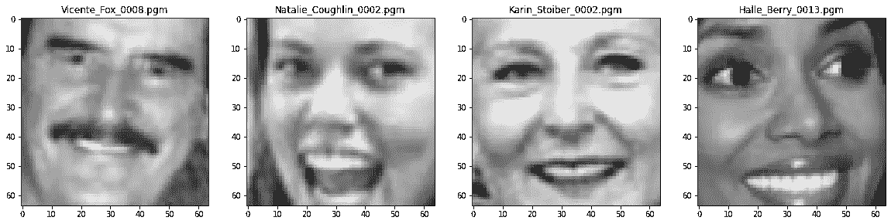
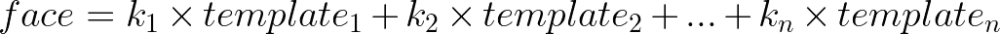
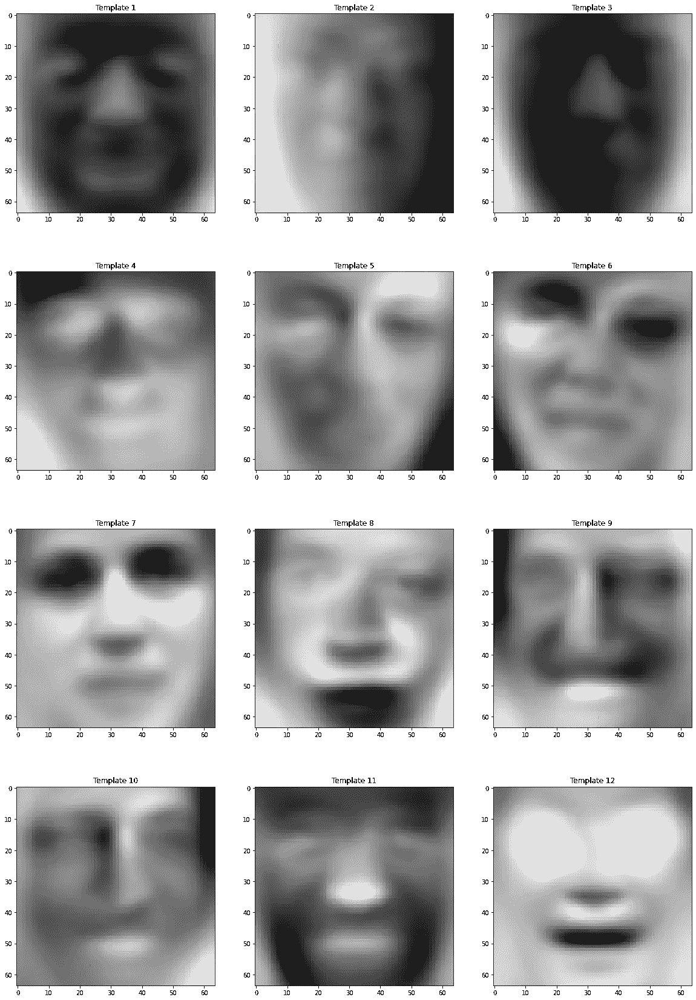
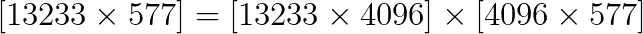
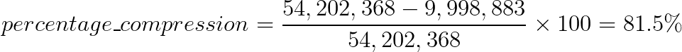
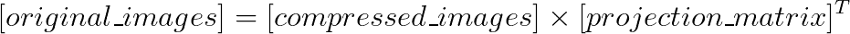
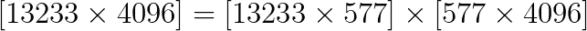
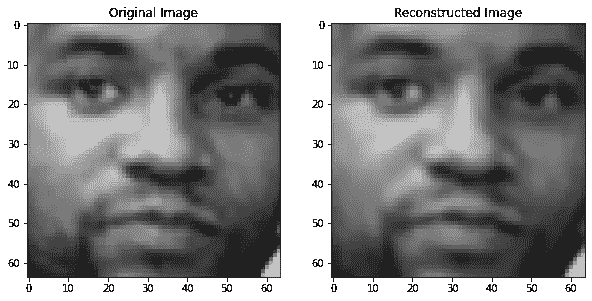
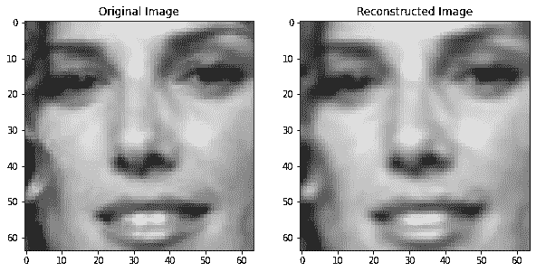
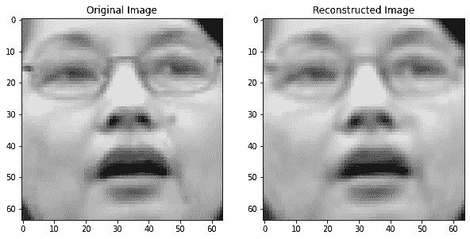

# 基于主成分分析的人脸数据集压缩

> 原文：<https://towardsdatascience.com/face-dataset-compression-using-pca-cddf13c63583?source=collection_archive---------27----------------------->

## 用于图像数据集压缩的主成分分析

照片由 [Unsplash](https://unsplash.com/?utm_source=unsplash&utm_medium=referral&utm_content=creditCopyText) 上的 [Grzegorz Walczak](https://unsplash.com/@grzegorzwalczak?utm_source=unsplash&utm_medium=referral&utm_content=creditCopyText) 拍摄

在我的上一篇文章中，我们采用了一种图形化的方法来理解主成分分析是如何工作的，以及如何将其用于数据压缩。如果您对这个概念不熟悉，我强烈建议您在继续之前阅读我以前的文章。我提供了以下链接:

 [## 主成分分析—可视化

### 使用主成分分析(PCA)的数据压缩

towardsdatascience.com](/principal-component-analysis-visualized-17701e18f2fa) 

在本文中，我们将了解如何使用 PCA 来压缩现实生活中的数据集。我们将在野外(LFW)，使用**标记的人脸，这是一个由 **13233** 张人脸灰度图像组成的大规模数据集，每张图像的尺寸为 **64x64** 。这意味着每个面的数据是 4096 维的(每个面要存储 64×64 = 4096 个唯一值)。我们将使用主成分分析将这一维度要求降低到几百个维度！**

# 介绍

主成分分析(PCA)是一种用于降低数据集维度的技术，利用了这些数据集中的图像具有共同点的事实。例如，在由脸部照片组成的数据集中，每张照片都有像眼睛、鼻子、嘴巴这样的面部特征。我们可以为每种类型的特征制作一个模板，然后将这些模板组合起来，生成数据集中的任何人脸，而不是逐个像素地对这些信息进行编码。在这种方法中，每个模板仍然是 64x64 = 4096 维，但是由于我们将重用这些模板(基函数)来生成数据集中的每个面，因此所需的模板数量很少。PCA 正是这样做的。让我们看看如何！

# 笔记本

您可以在此处查看 Colab 笔记本:

 [## PCA

colab.research.google.com](https://colab.research.google.com/drive/1QZYqjLm_rLxkgR6COMjjBicHSLMwKxF-) 

# 资料组

让我们从数据集中可视化一些图像。你可以看到每个图像都有一张完整的脸，并且像眼睛、鼻子和嘴唇这样的面部特征在每个图像中都清晰可见。现在我们已经准备好数据集，让我们压缩它。

# 压缩

**五氯苯甲醚是一个 4 步流程。**从包含 *n* 个维度的数据集开始(需要表示 *n* 个轴):

*   **步骤 1** :找到一组新的基函数(*n*-轴)，其中一些轴对数据集中的方差贡献最大，而其他轴贡献很小。
*   **第二步**:按照方差贡献度递减的顺序排列这些轴。
*   **第三步**:现在，选择要使用的顶部 *k* 轴，放下剩余的 *n-k* 轴。
*   **步骤 4** :现在，将数据集投影到这些 *k* 轴上。

这些步骤在我之前的文章中有很好的解释。在这 4 个步骤之后，数据集将从 *n* 维压缩到仅 *k* 维(*k**n*)。

## 第一步

找到一组新的基函数(*n*-轴)，其中一些轴贡献了数据集中的大部分方差，而其他轴贡献很小，这类似于找到我们稍后将组合以在数据集中生成人脸的模板。总共将生成 4096 个模板，每个模板的维度为 4096。数据集中的每个人脸都可以表示为这些模板的线性组合。

请注意，标量常数(k1，k2，…，kn)对于每个面都是唯一的。

## 第二步

现在，这些模板中的一些对面部重建贡献很大，而另一些贡献很小。这种贡献水平可以量化为每个模板对数据集贡献的方差百分比。因此，在这一步，我们将按照方差贡献的降序排列这些模板(最重要…最不重要)。

## 第三步

现在，我们将保留顶部的 *k 个*模板，删除其余的。但是，我们应该保留多少模板呢？如果我们保留更多的模板，我们的重建图像将非常类似于原始图像，但我们将需要更多的存储空间来存储压缩数据。如果我们保留的模板太少，我们重建的图像将与原始图像非常不同。

最佳解决方案是确定我们希望在压缩数据集中保留的方差百分比，并使用它来确定 *k* 的值(要保留的模板数量)。如果我们计算一下，我们发现要保留方差的 99%,我们只需要顶部的 577 个模板。我们将把这些值保存在一个数组中，并删除剩余的模板。

让我们来看看这些模板。

请注意，这些模板看起来都有点像人脸。这些被称为特征脸。

## 第四步

现在，我们将构建一个投影矩阵，将图像从原来的 4096 维投影到 577 维。投影矩阵将有一个形状 **(4096，577)** ，其中模板将是矩阵的列。

在我们继续压缩图像之前，让我们花点时间来理解压缩的真正含义。回想一下，这些面可以通过所选模板的线性组合来生成。由于每个面都是唯一的，因此数据集中的每个面都需要一组不同的常数(k1，k2，…，kn)来进行线性组合。

让我们从数据集中的图像开始，计算常数(k1，k2，…，kn)，其中 n = 577。这些常数连同所选择的 577 个模板可以被插入到上面的等式中以重建面部。这意味着我们只需要为每幅图像计算和保存这 577 个常数。我们可以使用矩阵同时计算数据集中每个图像的常数，而不是逐个图像地进行计算。

回想一下，数据集中有 13233 幅图像。矩阵 compressed_images 包含数据集中每个图像的 577 个常数。我们现在可以说，我们已经将图像从 4096 维压缩到 577 维，同时保留了 99%的信息。

# 压缩比

让我们计算一下数据集压缩了多少。回想一下，数据集中有 13233 幅图像，每幅图像的尺寸都是 64x64。因此，存储原始数据集所需的唯一值总数为
13233 x 64 x 64 = **54，202，368 个唯一值**。

压缩后，我们为每个图像存储 577 个常数。因此，存储压缩数据集所需的唯一值总数为
13233 x 577 = 7，635，441 个唯一值。但是，我们还需要存储模板，以便以后重建图像。因此，我们还需要为模板存储
577 x 64 x 64 = 2，363，392 个唯一值。因此，存储压缩数据集所需的唯一值总数为
7，635，441 + 2，363，392 = **9，998，883 个唯一值**。

我们可以将压缩百分比计算为:

# 重建图像

压缩后的图像只是长度为 577 的数组，因此无法可视化。我们需要将其重建回 4096 维，以形状数组(64x64)的形式查看。回想一下，每个模板的尺寸都是 64x64，每个常数都是一个标量值。我们可以使用下面的等式来重建数据集中的任何人脸。

同样，我们可以使用矩阵一次性重建整个数据集，而不是逐个图像地进行重建，当然会损失 1%的方差。

我们来看一些重建的人脸。

作者图片

我们可以看到，重建的图像已经捕获了关于人脸的大部分相关信息，并且忽略了不必要的细节。这是数据压缩的额外优势，它允许我们过滤数据中不必要的细节(甚至噪音)。

# 那都是乡亲们！

如果你成功了，向你致敬！在这篇文章中，我们了解了 PCA 如何用于压缩**在野外(LFW)**标记的人脸，这是一个由 13233 个人脸图像组成的大规模数据集，每个图像的尺寸为 **64x64** 。我们将该数据集压缩了 80%以上，同时保留了 99%的信息。可以查看我的 [**Colab 笔记本**](https://colab.research.google.com/drive/19iGq1iy4Uw1OOVyyHW9293E1iY8Njr8e?usp=sharing) 了解代码。我鼓励您使用 PCA 来压缩其他数据集，并评论您获得的压缩率。

有什么建议请留言评论。我定期写文章，所以你应该考虑关注我，在你的订阅中获得更多这样的文章。

如果你喜欢这篇文章，你可能也会喜欢这些:

 [## 机器学习—可视化

### 理解机器学习的视觉方法

towardsdatascience.com](/machine-learning-visualized-11965ecc645c)  [## 用 Pytorch 检测人脸标志点

### 想知道 Snapchat 或 Instagram 如何将惊人的滤镜应用到你的脸上吗？该软件检测你的关键点…

towardsdatascience.com](/face-landmarks-detection-with-pytorch-4b4852f5e9c4) 

访问我的网站，了解更多关于我和我的工作的信息:

 [## 阿卜杜勒·拉赫曼

### 让我们让电脑智能化吧！

arkalim.netlify.app](https://arkalim.netlify.app/)