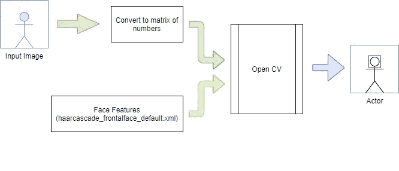
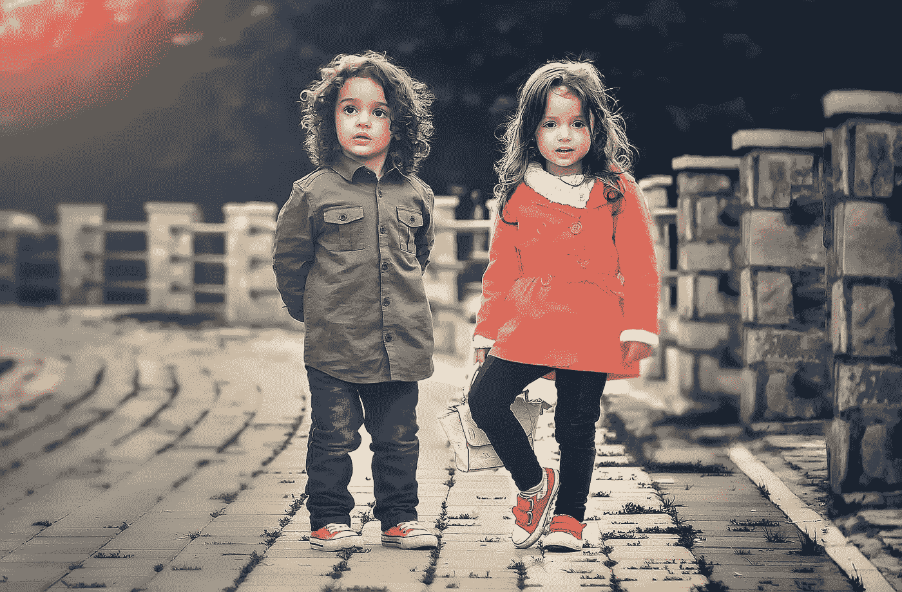
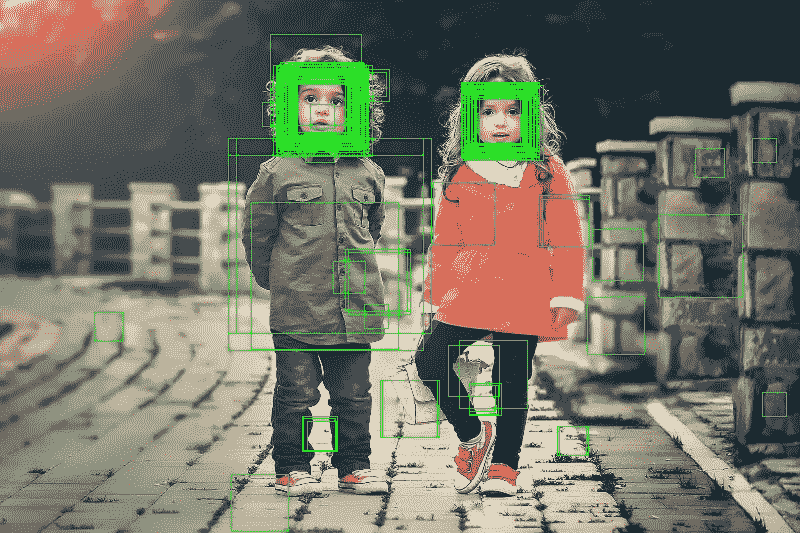

# 面向初学者的 10 行人脸检测

> 原文：<https://towardsdatascience.com/face-detection-in-10-lines-for-beginners-1787aa1d9127?source=collection_archive---------32----------------------->

## 使用 Python OpenCV 在图像和视频中检测人脸的介绍

我最近在为一个个人项目探索 OpenCV 的 Haar 级联对象检测模块。虽然网上有很多这方面的技术资料，但我这篇文章的重点是用通俗易懂的语言解释这些概念。我希望这将有助于初学者以简单的方式理解 Python 的 OpenCV 库。

在这个演示中，我们将拍摄一张图像并在其中搜索人脸。我们将使用预训练的分类器来执行该搜索。我计划分享更多关于我们将来如何训练我们自己的模型的文章。但是现在，让我们开始使用一个预先训练好的模型。

对于外行来说，OpenCV 是一个 Python 库，主要用于各种计算机视觉问题。

在这里，我们使用的是来自 opencv github [***资源库***](https://github.com/opencv/opencv/tree/master/data/haarcascades)****作为我们的模型。您可以下载这个 xml 文件，并将其放在与 python 文件相同的路径中。这里还有一堆其他的模型，你可能想以后尝试一下(例如:-眼睛检测，全身检测，猫脸检测等。)****

*在开始编写代码之前，让我们先看一下程序的高级流程。*

**

*下面描述的整个过程的图表[输入、面部检测过程和输出]*

# *输入:*

*该算法需要两个输入:*

1.  *输入图像矩阵(我们将读取一个图像并将其转换为数字矩阵/numpy 数组)*
2.  *脸部特征(可在*Haar cascade _ frontal face _ default . XML***文件中找到)***

# **人脸检测过程:**

**OpenCV 的哈尔级联分类器基于*滑动窗口*方法。在这种方法中，一个窗口(默认大小为 20×20 像素)在图像上滑动(逐行)以寻找面部特征。每次迭代后，图像按一定的因子缩小(调整大小)(由参数' ***比例因子*** '决定)。每次迭代的输出被存储，并且在较小的、调整大小的图像上重复滑动操作。在最初的迭代过程中可能会出现误报，这将在本文后面详细讨论。这种缩小和开窗过程一直持续到图像对于滑动窗口来说太小为止。比例因子的值越小，精度越高，计算费用越高。**

# **输出:**

**我们的输出图像将在每个检测到的人脸周围包含一个矩形。**

****代码&解释:****

**让我们从 python 代码开始。对于这个实验，我们将需要以下 Python 包:**

```
**pip install numpy
pip install opencv-python**
```

**让我们把我们的 python 文件叫做‘face _ detector . py’,**把它放在与我们从上面分享的 github 链接下载的 xml 文件**相同的路径中。**

```
**# File Name: face_detector.py
# Import the OpenCV library
import cv2**
```

**现在让我们看看承诺的 10 行！**

**我们准备了 2 个输入[ *输入图像* & *面部特征 XML*]，如上面流程图中所示。**

**我用贝丝·哈米蒂的这张美丽的照片(下面的链接)作为我的输入图像(kids.jpg)。**

****

**照片由 [Pexels](https://www.pexels.com/photo/people-girl-design-happy-35188/?utm_content=attributionCopyText&utm_medium=referral&utm_source=pexels) 的[贝丝·哈米蒂](https://www.pexels.com/@bess-hamiti-83687?utm_content=attributionCopyText&utm_medium=referral&utm_source=pexels)拍摄**

**1 我们首先加载 xml 分类器和输入图像文件。由于输入文件相当大，我已经用与原始分辨率相似的尺寸调整了大小，这样它们就不会显得太大。然后，我把图像转换成灰度图像。灰度图像被认为提高了算法的效率。**

```
**face_cascade = cv2.CascadeClassifier("haarcascade_frontalface_default.xml")
image = cv2.imread("kids.jpg")
image = cv2.resize(image, (800,533))
gray_image = cv2.cvtColor(image, cv2.COLOR_BGR2GRAY)**
```

**读取的图像存储为多维 numpy 数组，如下所示。**

```
**print(type(gray_image))
<class 'numpy.ndarray'>**
```

**在下一步中，我们将 gray_image 作为输入传递给 *detectMultiScale* 方法。**

*****detect multi scale***方法将为我们执行检测。它采用以下参数:**

****scaleFactor :** 该参数指定图像缩小的因子，例如:-如果该值为 1.05，则图像缩小 5%。如果该值为 1.10，则图像缩小 10%。比例因子 1.10 比比例因子 1.05 需要更少的计算。**

****最小邻居:**这是一个阈值，指定每个矩形应该有多少个邻居才能被标记为真正。换句话说，让我们假设每次迭代标记某些矩形(即，将图像的一部分分类为面部)。现在，如果随后的迭代也将相同的区域标记为阳性，则增加了该矩形区域为真阳性的可能性。如果某个区域在一次迭代中被识别为人脸，但在任何其他迭代中没有被识别为人脸，则它们被标记为假阳性。换句话说，minNeighbors 是一个区域被确定为一个面的最小次数。**

**让我们做一个实验来更好地理解它。我们将使用不同的 minNeighbors 参数值运行我们的代码。**

**对于 **minNeighbors = 0，****

**所有的矩形都被检测为面。对于一些矩形，有许多重叠的矩形，这意味着这些矩形在多次迭代中被检测为阳性。我们设置阈值来提高算法的准确性。**

****

**minNeighbors = 0 的阳性[图片来自 [Pexels](https://www.pexels.com/photo/people-girl-design-happy-35188/?utm_content=attributionCopyText&utm_medium=referral&utm_source=pexels) 的[贝丝·哈米蒂](https://www.pexels.com/@bess-hamiti-83687?utm_content=attributionCopyText&utm_medium=referral&utm_source=pexels)**

****明邻= 2****

**当 minNeighbors = 2 时，大多数重叠矩形不再存在。然而，我们仍然有一些误报。**

****

**minNeighbors = 2 的阳性[照片由[贝丝·哈米蒂](https://www.pexels.com/@bess-hamiti-83687?utm_content=attributionCopyText&utm_medium=referral&utm_source=pexels)从[像素](https://www.pexels.com/photo/people-girl-design-happy-35188/?utm_content=attributionCopyText&utm_medium=referral&utm_source=pexels)拍摄]**

**如果我们将这个阈值增加到 4 或 5，我们可以看到不再有假阳性。让我们将这个值设置为 5，然后继续。**

```
**faces=face_cascade.detectMultiScale(gray_image,scaleFactor=1.10,minNeighbors=5)**
```

*****detect multi scale***方法返回一个 numpy 数组，其中包含面的矩形的尺寸和位置。**

**x，y-矩形左上角的位置**

**w，h-矩形的宽度和高度**

**我们现在用绿色(0，255，0) (BGR 色码)画一个矩形，边界厚度= 1。**

**该窗口等待 2 秒(2000 毫秒)并自动关闭。**

```
**for x,y,w,h in faces:
    image=cv2.rectangle(image, (x,y), (x+w, y+h), (0, 255, 0),1)
    cv2.imshow("Face Detector", image)
    k=cv2.waitKey(2000)
cv2.destroyAllWindows()**
```

**或者，我们也可以通过添加下面一行来保存图像。**

```
**cv2.imwrite("kids_face_detected.jpeg", image)**
```

**我们的输出图像现在在每个检测到的人脸周围包含一个绿色矩形。**

****

**误报 minNeighbors = 5[图片来自 [Bess Hamiti](https://www.pexels.com/@bess-hamiti-83687?utm_content=attributionCopyText&utm_medium=referral&utm_source=pexels) 来自 [Pexels](https://www.pexels.com/photo/people-girl-design-happy-35188/?utm_content=attributionCopyText&utm_medium=referral&utm_source=pexels)**

**我希望这篇文章能让您对如何在 python 中使用 OpenCV 进行人脸检测有一个基本的了解。我们也可以扩展这段代码来跟踪视频中的人脸。如果你感兴趣的话，我已经在我的 GitHub 储存库[这里](https://github.com/arindomjit/Face_Detector)上传了上面讨论的和用于跟踪网络摄像头视频中的人脸的完整代码。祝你有美好的一天！**

**[](https://medium.com/@b.arindom/build-a-voice-controlled-mouse-keyboard-in-5-minutes-952bc8f101fc) [## 在 5 分钟内制作一个声控鼠标/键盘

### Python 中语音识别和 GUI 自动化的初学者指南

medium.com](https://medium.com/@b.arindom/build-a-voice-controlled-mouse-keyboard-in-5-minutes-952bc8f101fc) [](/generate-qrcode-with-python-in-5-lines-42eda283f325) [## 用 Python 生成 5 行二维码

### 也许在你的简历中使用它来链接到你的网站或 LinkedIn 个人资料

towardsdatascience.com](/generate-qrcode-with-python-in-5-lines-42eda283f325) [](https://medium.com/swlh/artificial-neural-networks-for-absolute-beginners-a75bc1522e1d) [## 绝对初学者的神经网络

### 用简单的英语介绍感知器

medium.com](https://medium.com/swlh/artificial-neural-networks-for-absolute-beginners-a75bc1522e1d) 

**参考文献&延伸阅读:**

[1]级联分类器，[https://docs . opencv . org/2.4/modules/obj detect/doc/Cascade _ classification . html](https://docs.opencv.org/2.4/modules/objdetect/doc/cascade_classification.html)

[2] 5KK73 GPU 分配，[https://sites . Google . com/site/5kk 73 GPU 2012/Assignment/viola-Jones-face-detection](https://sites.google.com/site/5kk73gpu2012/assignment/viola-jones-face-detection#TOC-Image-Pyramid)

[3] OpenCV Github 页面，[https://Github . com/OpenCV/OpenCV/tree/master/data/Haar cascades](https://github.com/opencv/opencv/tree/master/data/haarcascades)**