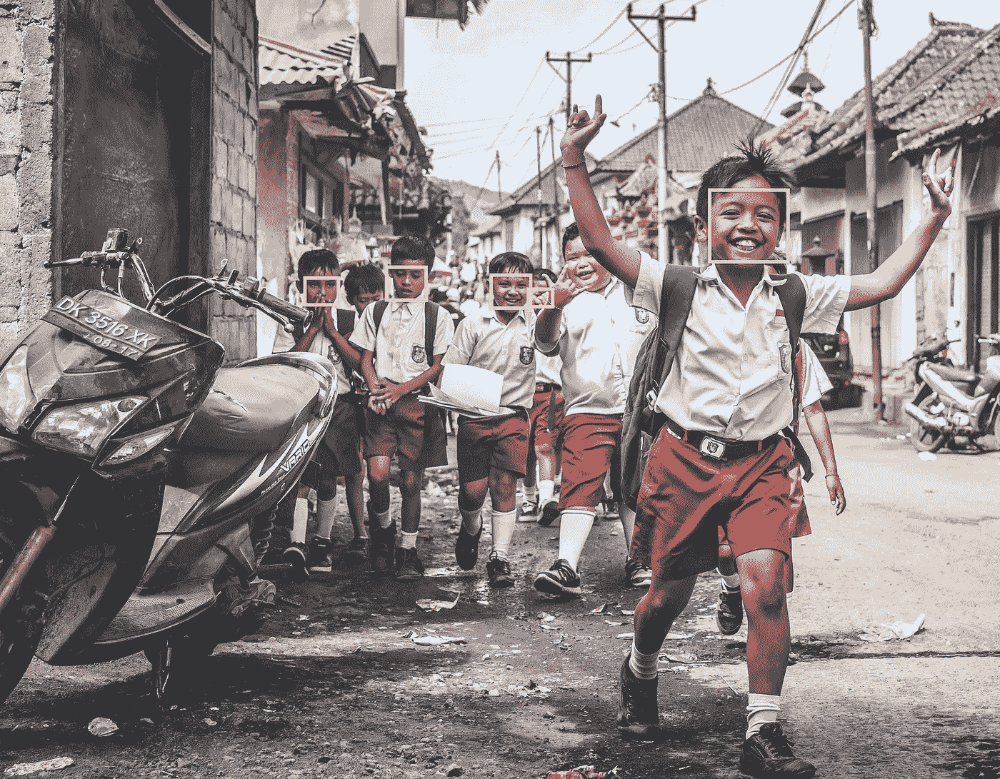
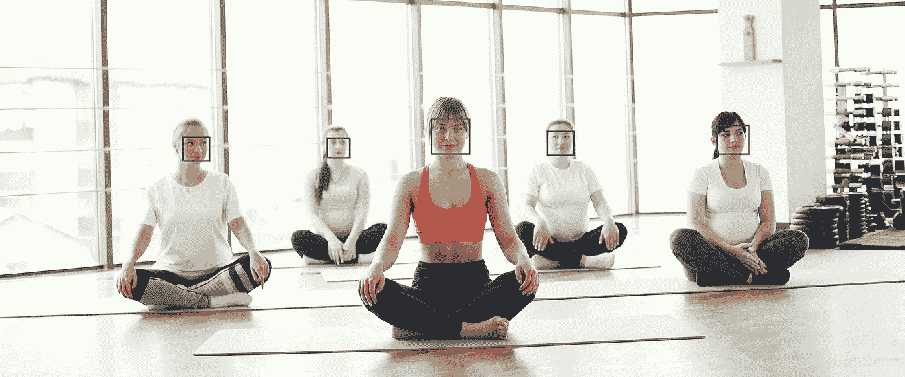

# 仅用 5 行代码实现人脸检测

> 原文：<https://towardsdatascience.com/face-detection-in-just-5-lines-of-code-5cc6087cb1a9?source=collection_archive---------19----------------------->

## 使用世界上最简单的人脸识别 python 库来识别和操作人脸。



从印度尼西亚一群孩子的图像中检测人脸。图片由 Pixabay 提供。

F **王牌检测**是深度学习的计算机技术师。它识别数字图像或视频场景中的人脸。它被用于多种应用，如**面部识别、解锁智能手机、智能广告、情感推断**等等。

**深度学习**是人工智能(AI)中**机器学习**的子集，它拥有能够从非结构化或无标签的数据中进行无监督学习的网络。

> “计算机现在能够看、听和学习。欢迎来到未来！”—戴夫·沃特斯

在这个初学者教程中，我们将学习如何安装和配置 python 环境，使用集成开发环境(ide)来调试和运行我们的 python 代码。然后我们将使用广泛流行的人脸检测和操作库**由 [Adam Geitgey](https://github.com/ageitgey) 开发的人脸识别**。我们将在检测到的 faces🕵.周围定制不同颜色和边框形状的图像它是使用 dlib 最先进的具有深度学习功能的人脸识别技术构建的。该模型在 Wild 基准中的标记人脸上具有 99.38%的准确率。

**TL；博士**本教程是为**绝对初学者**准备的，即使你是刚毕业的学生或者是期待使用 python 开始机器学习的人。像 **Web 和移动开发者**或**后端开发者**这样的技术堆栈开发者也可以轻松地阅读这篇文章。那么，让我们开始新的简短的代码之旅。

# 环境配置和安装

首先我们需要下载 [**Python**](https://www.python.org/downloads/) 的最新稳定版本。

通常有两种著名的方法来配置 python 环境并在我们的计算机上安装软件包——pip 或 condo。

python 包包含模块所需的所有文件。模块是可以包含在项目中的 Python 代码库。

1.  [**PIP**](https://www.w3schools.com/python/python_pip.asp)**-**一个用于 Python 包的包管理器。
2.  [**Anaconda**](https://docs.anaconda.com/anaconda/user-guide/getting-started/)**-**一个完整的 python 环境解决方案，运行不同版本，管理所有 python 包。使用 Anaconda Navigator，您可以安装和管理计算机中的所有软件包。

您可以关注其中任何一个或两个。

# **代码编辑器和 IDE**

除了基本的 python **REPL** (命令行界面)，我们可以在这两个专业编辑器中运行我们的 python 程序

1.  [**py charm**](https://www.jetbrains.com/pycharm/)**-**下载热门面向专业开发者的 Python IDE 并开始。它就像其他著名的 IDE 一样，启动和使用都很简单。
2.  [**Jupyter 笔记本**](https://jupyter.org/) **-** 被程序员和专业培训师广泛使用的基于网络的代码编辑器。

使用康达安装 Jupyter 笔记本电脑

```
conda install -c conda-forge notebook
```

或者使用 pip 安装，然后运行 Jupiter notebook 来运行它-

```
pip install notebook
jupyter notebook
```

这足以让我们开始编写第一个 Python 程序并运行它。你可以使用上面的任何一个编辑器。在我们的教程中，我们将使用 PyCharm 编写带有 pip 包管理器的代码来安装包。

所以，让我们开始在任何给定的图像和照片中检测人脸。你不兴奋吗？😀

giphy.com 的 Gif

首先，让我们安装代码运行所需的库。我们将只安装和导入 2 个库。

1.  [**枕**](https://pypi.org/project/Pillow/) **-** 友好的 PIL 叉(Python 影像库)。
2.  [](https://pypi.org/project/face-recognition/#description)****-检测图像中的人脸。****

```
**pip install Pillowpip install face-recognition**
```

****您可以创建一个 python 类型的新文件(扩展名为**)。py** )或者 Jupyter 笔记本中的新笔记本开始编码— **face_detection.py** 。如果它需要其他相关的库，你也可以使用 pip 或 conda 简单地安装它们。****

****让我们在代码中导入上述库-****

```
****import** PIL.Image
**import** PIL.ImageDraw
**import** face_recognition**
```

## ****第一行****

****让我们在代码文件所在的文件夹中选择一个名为 GroupYoga.jpg 的图片(你可以选择任何图片),或者给出图片的正确路径。我们应该从 face_recognition 库中将我们的图像加载到 **load_image_file()** 方法，该方法会将它转换成该图像的 [**NumPy**](https://numpy.org/) 数组。我们把它赋给变量名 **given_image** 。****

```
**given_image = face_recognition.load_image_file(**'GroupYoga.jpg'**)**
```

## ****第二行****

****使用同一个库中的 **face_locations()** 方法，我们将计算给定 _image 中的人脸数量，并将打印图像中找到的所有人脸的长度。****

```
**face_locations = face_recognition.face_locations(given_image)

number_of_faces = len(face_locations)
print(**"We found {} face(s) in this image."**.format(number_of_faces))**
```

## ****第 3 行****

****现在，为了在图像上绘制任何形状，我们将使用 PIL.Image 中的 **fromarray()** 方法将图像转换为枕头库对象。****

```
**pil_image = PIL.Image.fromarray(given_image)**
```

## ****第 4 行****

****现在，我们将运行一个 for-in 循环来打印四个像素位置，如检测到的人脸的上、左、下和右。****

```
****for** face_location **in** face_locations:top, left, bottom, right = face_location
    print(**"A face is detected at pixel location Top: {}, Left: {}, Bottom: {}, Right: {}"**.format(top, left, bottom, right))**
```

## ****第 5 行****

****我们将绘制一个绿色的矩形框，宽度为 10。您也可以将形状更改为多边形或椭圆形。所以，在上面的循环中写下面的两个绘制方法。****

```
**draw = PIL.ImageDraw.Draw(pil_image)
draw.rectangle([left, top, right, bottom], outline=**"green"**, width=10)**
```

****现在，只需使用变量 **pil_image** 来显示我们的新图像，其中检测到的人脸周围使用矩形边框。****

```
**pil_image.show()**
```

****新的临时映像将在您的计算机上自动打开(如果一切设置正确)。它应该是类似下图的东西-****

********

****检测到做瑜伽的女人的脸。图片由 Pexels 提供。****

****答对了。🎉****

> ****如果您遇到任何编译时或运行时问题以及环境配置问题，您可以在下面的回复部分写下，或者与我联系。****

****现在，让我们把上面所有的小代码片段收集到一个文件中，这个文件可以在任何 python 环境中运行。让我们使用学校孩子的形象(作为文章封面的特色)****

****face_detection.py 中的完整代码****

****如果您运行上面的文件(PyCharm 或 Notebook 中的 run 按钮)，如果一切正常(我指的是编译或运行时错误)，您将在编辑器的控制台得到下面的输出-****

****PyCharm 中的控制台输出****

****就是这样。我们最简单的人脸检测🎭代码已准备好从任何给定的照片中识别人脸。您可以通过更改颜色、边框类型和宽度来自定义上面的代码。我建议尝试定制，并探索其他方法和选项。****

> ******Face _ recognition**library 还可以用来在人脸上进行**数码化妆**，在一群人中检查**相似的人脸**，围绕这些检测到的人脸开发一些**游戏**。****

****我相信你会发现它是互联网上所有技术文章中最简单的人脸检测教程之一。您可以通过下面的参考资料来了解这个库的更多细节。对于这个库的其他应用，下次我会写一些其他的文章。****

******资源:******

****[](https://pypi.org/project/face-recognition/) [## 人脸识别

### 查找图片中的面孔查找出现在图片中的所有面孔:查找和处理图片中的面部特征获取…

pypi.org](https://pypi.org/project/face-recognition/) [](https://github.com/ageitgey/face_recognition) [## 年龄/面部识别

### You can also read a translated version of this file in Chinese 简体中文版 or in Korean 한국어 or in Japanese 日本語. Recognize and…

github.com](https://github.com/ageitgey/face_recognition) 

在 Medium 上关注我，让我们在 LinkedIn([@ kapilraghuwansh](https://www.linkedin.com/in/kapilraghuwanshi/)I)和 Twitter ( [@techygeeek](https://twitter.com/techygeeeky) y)上保持联系，以获取更多此类有趣的科技文章。🤝****