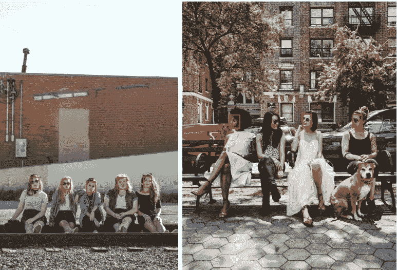
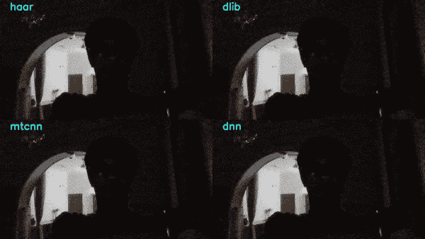

# 人脸检测模型:使用哪一个，为什么？

> 原文：<https://towardsdatascience.com/face-detection-models-which-to-use-and-why-d263e82c302c?source=collection_archive---------1----------------------->

## 在 Python 中实现不同人脸检测模型的完整教程之后，通过比较，找出用于实时场景的最佳模型。


在 [Unsplash](https://unsplash.com/?utm_source=medium&utm_medium=referral) 上由 [Jerry Zhang](https://unsplash.com/@z734923105) 修改的照片。

人脸检测是计算机视觉最基本的方面之一。这是许多进一步研究的基础，如识别特定的人，在脸上标记关键点。最近，由于种族定性事件，新闻报道很多，如这里的[和这里的](https://www.theguardian.com/technology/2020/jun/09/ibm-quits-facial-recognition-market-over-law-enforcement-concerns)[和](https://www.washingtonpost.com/technology/2020/06/11/microsoft-facial-recognition/)所述，有色人种比白人更容易被误解。因此，像 IBM、微软和亚马逊这样的主要科技公司已经禁止他们的系统被警方使用。然而，本文不会详细讨论这些方面，我们只会尝试使用预先训练的模型在人脸上绘制边界框，如 Haar cascades，dlib 正面人脸检测器，MTCNN，以及使用 OpenCV 的 DNN 模块的 Caffe 模型。然后我们将对它们进行比较，找出哪一个最适合实时应用程序。

# 目录

*   介绍
*   装置
*   为模型编码
*   比较图像结果
*   视频比较结果以及达到的帧速率
*   结论

# 介绍

我们将使用 Haar、dlib、多任务级联卷积神经网络(MTCNN)和 OpenCV 的 DNN 模块。如果您已经了解它们，或者不想了解它们的技术细节，可以跳过这一部分，直接进入代码。否则，让我们学习它们是如何工作的。

## 哈尔瀑布

早在 2001 年，保罗·维奥拉(Paul Viola)和迈克尔·琼斯(Micheal Jones)在他们的论文“使用简单特征的增强级联进行快速物体检测”中提出了这些方法它的工作速度非常快，就像简单的 CNN 一样，可以从图像中提取很多特征。然后通过 Adaboost 选择最佳特性。这样就把原来的 160000+的特征减少到了 6000 个特征。但是在滑动窗口中应用所有这些特性仍然需要很多时间。因此，他们引入了一系列分类器，对特征进行分组。如果窗口在第一阶段失败，则该级联中的这些剩余特征不会被处理。如果通过，则测试下一个特征，并重复相同的过程。如果一个窗口可以通过所有的特征，那么它被分类为面部区域。更详细的阅读，可以参考[这里](https://docs.opencv.org/3.4/db/d28/tutorial_cascade_classifier.html)。

哈尔级联需要大量的正负训练图像来训练。幸运的是，这些级联与 OpenCV 库以及经过训练的 XML 文件捆绑在一起。

## 正面人脸检测器

Dlib 是一个 C++工具包，包含用于解决现实世界问题的机器学习算法。虽然它是用 C++编写的，但它有 python 绑定来在 python 中运行。它还有一个很棒的面部标志关键点检测器，我在以前的一篇文章中使用它来制作一个实时凝视跟踪系统。

[](/real-time-eye-tracking-using-opencv-and-dlib-b504ca724ac6) [## 使用 OpenCV 和 Dlib 的实时眼睛跟踪

### 在本教程中，学习通过 python 中的网络摄像头创建一个实时凝视探测器。

towardsdatascience.com](/real-time-eye-tracking-using-opencv-and-dlib-b504ca724ac6) 

dlib 提供的正面人脸检测器使用通过梯度方向直方图(HOG)提取的特征，然后通过 SVM。在 HOG 特征描述符中，梯度方向的分布被用作特征。此外，Dlib 提供了一个更先进的基于 CNN 的人脸检测器，但是，它不能在 CPU 上实时工作，这是我们正在寻找的目标之一，因此在本文中被忽略。尽管如此，如果你想了解它，你可以参考这里的。

## MTCNN

它是由张等人于 2016 年在他们的论文“[使用多任务级联卷积网络](https://arxiv.org/abs/1604.02878)的联合人脸检测和对齐”中介绍的它不仅检测面部，还检测五个关键点。它使用三级 CNN 的级联结构。首先，它们使用完全卷积网络来获得候选窗口及其包围盒回归向量，并且使用最大值抑制(NMS)来重叠高度重叠的候选窗口。接下来，这些候选者被传递到另一个 CNN，该 CNN 拒绝大量的假阳性并执行边界框的校准。在最后阶段，执行面部标志检测。

## OpenCV 中的 DNN 人脸检测器

它是一个基于单触发多盒探测器(SSD)的 Caffe 模型，使用 ResNet-10 架构作为其主干。它是在 OpenCV 3.3 之后在其深度神经网络模块中引入的。也可以使用量子化张量流版本，但我们将使用 Caffe 模型。

# 装置

Dlib 和 MTCNN 都是 pip 可安装的，而 Haar Cascades 和 DNN 人脸检测器需要 OpenCV。

```
pip install opencv-python
pip install dlib
pip install mtcnn
```

如果您使用的是 Anaconda，那么请使用 conda 命令安装它们:

```
conda install -c conda-forge opencv
conda install -c menpo dlib
conda install -c conda-forge mtcnn
```

# 为模型编码


照片由[法比安·格罗斯](https://unsplash.com/@grohsfabian?utm_source=medium&utm_medium=referral)在 [Unsplash](https://unsplash.com?utm_source=medium&utm_medium=referral) 拍摄

在这一节中，我将解释所有这些不同模型的代码。Dlib 和 MTCNN 的基于 HOG 的描述符的权重已经预先与它们的安装捆绑在一起。Haar cascade XML 文件以及 DNN 模块的人脸检测器的权重和图层文件可以从我的 Github [repo](https://github.com/vardanagarwal/Proctoring-AI/tree/master/face_detection/models) 下载。

## 哈尔瀑布

```
import cv2classifier = cv2.CascadeClassifier('models/haarcascade_frontalface2.xml')
img = cv2.imread('test.jpg')
faces = classifier.detectMultiScale(img)# result
#to draw faces on image
for result in faces:
    x, y, w, h = result
    x1, y1 = x + w, y + h
    cv2.rectangle(img, (x, y), (x1, y1), (0, 0, 255), 2)
```

如你所见，使用哈尔级联很容易做出预测。只需使用`cv2.CascadeClassifier`初始化模型，然后使用`cv2.detectMultiScle`进行检测。然后循环所有的脸，并把它们画到图像上。

## 基于 Dlib HOG 的正面人脸检测器

```
import dlib
import cv2detector = dlib.get_frontal_face_detector()
img = cv2.imread('test.jpg')
gray = cv2.cvtColor(img, cv2.COLOR_BGR2GRAY)
faces = detector(gray, 1) # result
#to draw faces on image
for result in faces:
    x = result.left()
    y = result.top()
    x1 = result.right()
    y1 = result.bottom()
    cv2.rectangle(img, (x, y), (x1, y1), (0, 0, 255), 2)
```

与所有其他模型不同，Dlib 适用于灰度图像。它返回一个“dlib 模块的矩形对象”,该对象不仅包含坐标，还包含其他信息，如面积和中心。

## MTCNN

```
import cv2
from mtcnn.mtcnn import MTCNNdetector = MTCNN()
img = cv2.imread('test.jpg')
faces = detector.detect_faces(img)# result
#to draw faces on image
for result in faces:
    x, y, w, h = result['box']
    x1, y1 = x + w, y + h
    cv2.rectangle(img, (x, y), (x1, y1), (0, 0, 255), 2)
```

从`mtcnn.mtcnn`加载 MTCNN 模块并初始化。函数`detect_faces`用于查找结果。这将返回一个 JSON 风格的字典，其中包含人脸的坐标以及它们的预测置信度和检测到的面部标志的坐标。

## DNN 模块正面人脸检测器

```
import cv2
import numpy as npmodelFile = "models/res10_300x300_ssd_iter_140000.caffemodel"
configFile = "models/deploy.prototxt.txt"
net = cv2.dnn.readNetFromCaffe(configFile, modelFile)
img = cv2.imread('test.jpg')
h, w = img.shape[:2]
blob = cv2.dnn.blobFromImage(cv2.resize(img, (300, 300)), 1.0,
(300, 300), (104.0, 117.0, 123.0))
net.setInput(blob)
faces = net.forward()
#to draw faces on image
for i in range(faces.shape[2]):
        confidence = faces[0, 0, i, 2]
        if confidence > 0.5:
            box = faces[0, 0, i, 3:7] * np.array([w, h, w, h])
            (x, y, x1, y1) = box.astype("int")
            cv2.rectangle(img, (x, y), (x1, y1), (0, 0, 255), 2)
```

使用`cv2.dnn.readNetFromCaffe`加载网络，并将模型的层和权重作为参数传递。这可以在 OpenCV DNN 的 [Github 页面上找到。](https://github.com/opencv/opencv/tree/master/samples/dnn)

> 为了达到最佳精度，在尺寸调整为`*300x300*`的 BGR 图像上运行该模型，相应地对每个蓝色、绿色和红色通道应用值`*(104, 177, 123)*`的平均减法。

绿色的价值有很大的差异。在 [pyimagesearch](https://www.pyimagesearch.com/) 和[learn openv](https://www.learnopencv.com/)的文章中，我发现他们都使用了 117 而不是 177，所以我在`cv2.dnn.blobFromImage`函数中使用了 117。最后，返回一个 4-D 数组，该数组包含置信度和缩小到 0 到 1 范围的坐标，从而通过将它们乘以原始宽度和高度，可以获得对原始图像的预测，而不是模型预测的 300x300。

# 比较图像结果

我创建了两个包含 10 张图片的小型数据库，其中一个是从 Unsplash 创建的，另一个是从 Google 创建的，以了解这些技术在大小图片上的表现。让我们一个一个地检查一下。

## 不溅

在我开始之前，我想给我使用过的[布鲁斯·迪克森](https://unsplash.com/@madskillsdixon)、[克里斯·库里](https://unsplash.com/@chriscurry92)、[克里斯·莫瑞](https://unsplash.com/@seemurray)、[伊森·约翰逊](https://unsplash.com/@ezj)、[杰里·张](https://unsplash.com/@z734923105)、[杰西卡·威尔逊](https://unsplash.com/@jesswilsonww24)、[罗兰·塞缪尔](https://unsplash.com/@rosam2020)和[蒂姆·莫斯霍尔德](https://unsplash.com/@timmossholder)提供图片致谢。由于图像的平均尺寸约为 5000x5000，因此在处理之前，高度和宽度都减少了一半。


结果

正如预期的那样，Haar cascades 表现最差，也有很多假阳性。Dlib 和 MTCNN 的表现相当均衡，一家领先另一家，反之亦然。DNN 模块有一个全有或全无类型的表现。仔细观察，我们可以看到它在小尺寸的图像上表现不佳，这可能是由于在开始之前将其大小调整为 300x300，所以让我们看看如果采用原始大小，它会如何表现。为此，只需将`cv2.dnn.blobFromImage()`中的`(300, 300)`分别更改为原始宽度和高度，并移除调整大小功能。



完整图像的结果

因此，通过拍摄全尺寸图像，结果得到了相当大的改善，然而，这种方式下，DNN 模块无法对面部尺寸较大的情况做出任何预测。示例:


没有检测到人脸

## 谷歌图片

这些来自 Unsplash 的图像非常大，所以我决定也检查一些小图像，看看它们的性能。所有拍摄的图像都有修改后的可重复使用许可。平均尺寸为 220x220，并且它们是按原样处理的，除了 DNN 模块，在该模块中图像被调整到 300x300 的尺寸，并且如果使用原始尺寸的图像，结果并不好。

这给 Dlib 面部检测器带来了一个问题，因为它不能检测小于 80x80 大小的面部，并且由于图像非常小，面部甚至更小。因此，为了测试，图像被放大了 2 倍，但这在使用 Dlib 时是一个巨大的问题，因为面部尺寸不能非常小，并且对图像进行上采样会导致更多的处理时间。


结果

正如所料，哈尔再次表现最差。MTCNN 给出了完美的结果，除了几张图片，总共不能识别两张脸。DNN 紧随其后，无法识别 3 张面孔。Dlib 漏掉了更多的面孔，我们也不应该忘记它已经将图像放大了 2 倍。

因此，在进入视频部分之前，让我们回顾一下我们从本部分的结果中学到的东西。

*   Haar 是相当过时的，并且通常给出最差的结果。
*   OpenCV 的 DNN 模块的面部检测模型工作得很好，但是如果图像的尺寸非常大，那么它会引起问题。一般来说，我们不处理这种 3000x3000 的图像，所以这应该不是问题。
*   Dlib 不能检测小于 80x80 的人脸，所以如果处理小图像，请确保放大它们，但这会增加处理时间。
*   所以考虑到以上两点，如果我们要处理极端的脸尺寸，MTCNN 将是最好的选择，可以说是领先竞争到现在。

**注意:**由于 Dlib 的作者戴维斯·金(Davis King)手动注释的人脸，Dlib 的预测有时会遗漏下巴或前额，因此如果您正在进行的任务无法负担此费用，请不要使用 Dlib。

# 比较视频中的模型

在开始之前，为什么不澄清我们将在哪些目标上测试我们的模型:

*   面部的不同角度
*   头部移动
*   面部遮挡
*   不同的照明条件
*   达到的帧速率

传递给模型的每个帧的大小是 640x360，它们按原样被处理，除了 DNN 模型被减小到 300x300。

## 面部和头部运动的不同角度


结果(压缩以减小大小)

OpenCV 的 DNN 模块在这里打了一个本垒打。它能够检测到高达疯狂角度的侧脸，并且很大程度上不受快速头部运动的影响。其他人不是它的对手，在大角度和快速移动时失败了。

## 面部遮挡


结果(再次根据大小进行压缩)

同样，OpenCV 的 DNN 的面部检测模块是这里的明显赢家。让我提供确切的结果。这个视频一共 642 帧。DNN 模块能够检测出其中 601 个人的脸！相比之下，第二名是哈尔，是的哈尔，它在其中的 479 张照片中出现了这张脸，紧随其后的是 MTCNN，有 464 张照片。Dlib 远远落后，只在 401 帧中检测到人脸。

## 不同的照明条件

这里的目标是看看这些模型在光线很弱的情况下以及当光源在人的正后方时表现如何。



结果

让我们给它应有的荣誉，因为只有哈尔·卡斯卡特是唯一能够在黑暗中在几帧内检测到人脸的模型，而 DNN 模型在那段时间提供了假阳性。当灯打开时，DNN 模块又开始工作，提供完全准确的预测。Dlib 的输出有点不稳定，但比 Haar cascade 要好，Haar cascade 能够预测的帧数更少，也给出了一些假阳性。真正令人惊讶的是 MTCNN。它甚至没有在一帧图像中检测到人脸，这表明如果要使用它，照明条件需要良好。

## 帧频

报告的值是使用英特尔 i5 第七代处理器获得的，传递的图像大小为 640x360，但 DNN 模块除外，它传递的图像大小为 300x300，这是迄今为止的做法。

哈尔 — 9.25 fps

**Dlib** — 5.41 fps

**MTCNN** — 7.92 fps

**OpenCV 的 DNN 模块** — 12.95 fps

# 结论

*   Haar Cascade 分类器在大多数测试中给出了最差的结果，同时还有许多假阳性。
*   Dlib 和 MTCNN 的结果非常相似，略微优于 MTCNN，但 Dlib 无法识别非常小的人脸。此外，如果图像的大小非常极端，并且保证照明良好，遮挡最小，并且主要是正面人脸，MTCNN 可能会在我们比较图像时给出最佳结果。
*   对于一般的计算机视觉问题，OpenCV 的 DNN 模块的 Caffe 模型是最好的。它可以很好地处理遮挡、快速头部运动，还可以识别侧脸。此外，它还提供了所有游戏中最快的 fps。

所有的代码和文件都可以在我的 Github [repo](https://github.com/vardanagarwal/Proctoring-AI/tree/master/face_detection) 上找到。该目标是找到最适合在线监考场景中的人脸检测的人脸检测模型。如果你有兴趣了解更多，你可以阅读这篇文章。

[](/automating-online-proctoring-using-ai-e429086743c8) [## 使用人工智能实现在线监考自动化

### 基于视觉和音频的半自动监考功能，以防止在线考试中的作弊和监控…

towardsdatascience.com](/automating-online-proctoring-using-ai-e429086743c8)