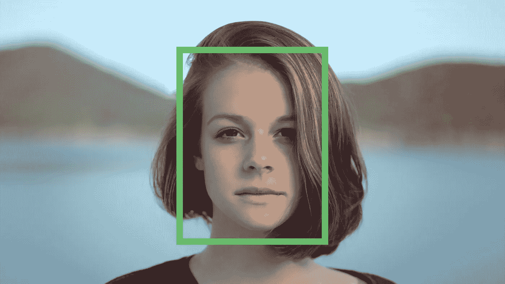
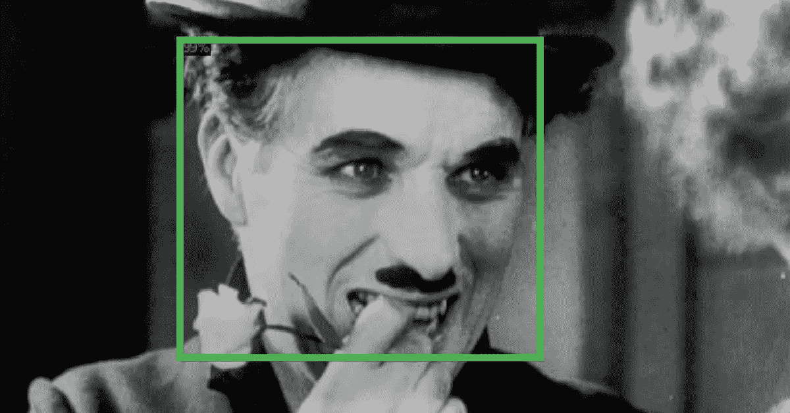
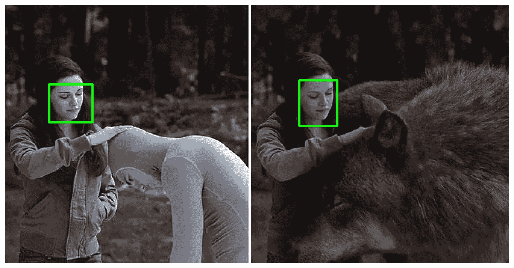
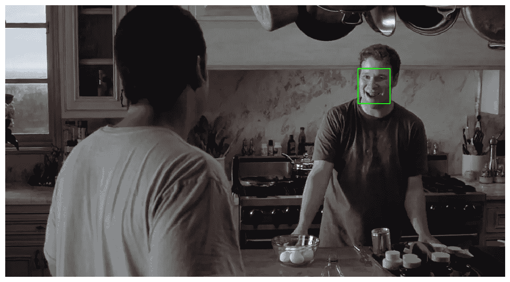
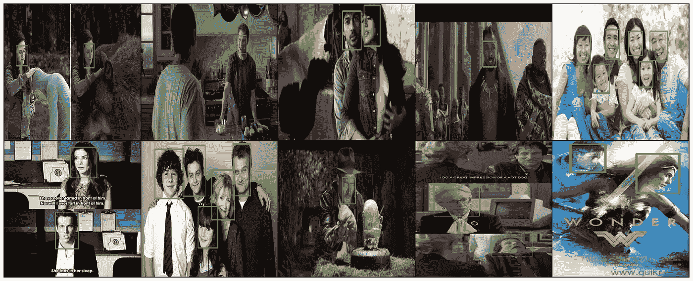
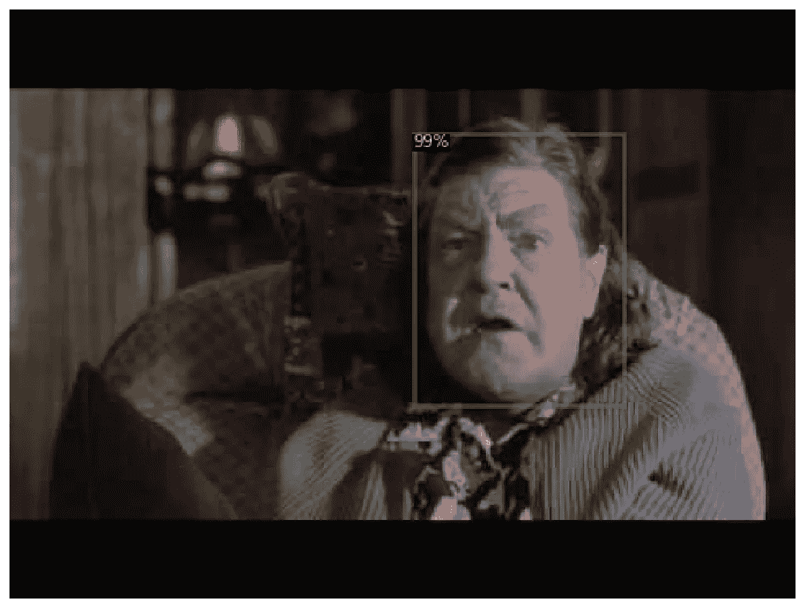
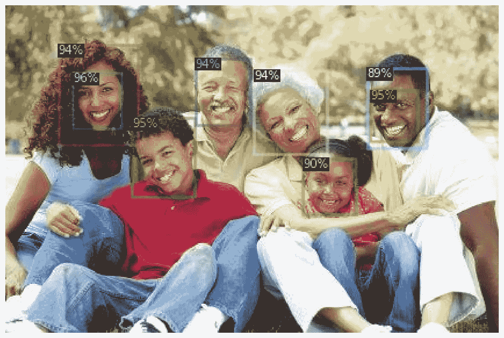
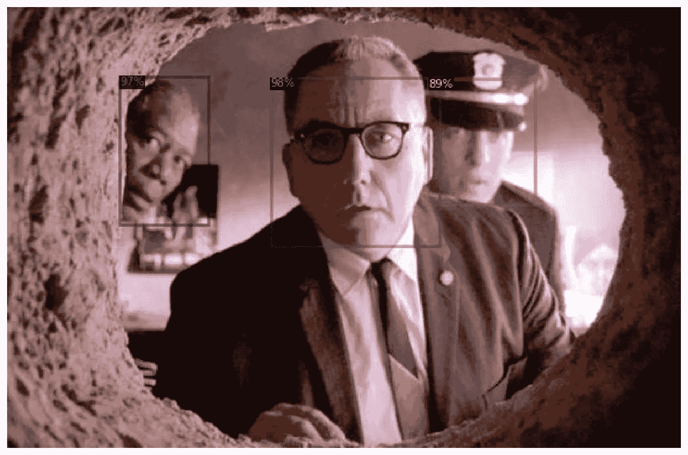
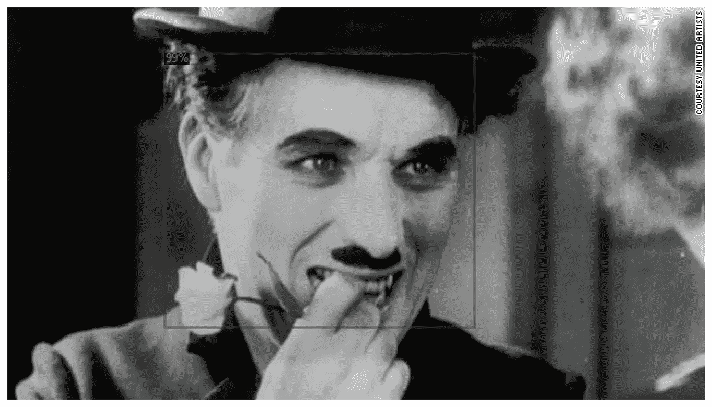

# 使用 Python 使用 Detectron2 和 PyTorch 在自定义数据集上进行人脸检测

> 原文：<https://towardsdatascience.com/face-detection-on-custom-dataset-with-detectron2-and-pytorch-using-python-23c17e99e162?source=collection_archive---------4----------------------->

## 在自定义人脸检测数据集上微调预训练对象检测模型



原始照片由[克里斯托弗·坎贝尔](https://unsplash.com/@chrisjoelcampbell)

> *TL；DR 了解如何为 Detectron2 和 PyTorch 准备自定义人脸检测数据集。微调预先训练的模型，以在图像中找到人脸边界。*

观看教程的视频版本

人脸检测是在图像中寻找人脸(边界)的任务。这对于以下方面很有用

*   安全系统(识别一个人的第一步)
*   自动对焦和笑脸检测功能，让您拍出精彩照片
*   检测年龄、种族和情绪状态进行标记(是的，我们已经生活在那个世界中)

从历史上看，这是一个很难解决的问题。大量的人工特征工程、新颖的算法和方法被开发出来，以提高艺术水平。

如今，几乎每个计算机视觉包/框架中都包含了人脸检测模型。一些表现最好的使用深度学习方法。例如，OpenCV 提供了多种工具，如[级联分类器](https://docs.opencv.org/4.2.0/db/d28/tutorial_cascade_classifier.html)。

*   [在浏览器中运行完整的笔记本(Google Colab)](https://colab.research.google.com/drive/1Jk4-qX9zdYGsBrTnh2vF52CV9ucuqpjk)
*   [阅读 Pytorch 书籍](https://github.com/curiousily/Getting-Things-Done-with-Pytorch)

[](https://leanpub.com/getting-things-done-with-pytorch) [## 用 PyTorch 完成任务

### “成功创造人工智能将是人类历史上最大的事件。不幸的是，这也可能是最后一次，除非…

leanpub.com](https://leanpub.com/getting-things-done-with-pytorch) 

在本指南中，您将学习如何:

*   使用 Detectron2 为人脸检测准备自定义数据集
*   使用(接近)最先进的对象检测模型来查找图像中的人脸
*   你可以把这项工作扩展到人脸识别。

以下是本指南结尾部分的一个示例:



# 检测器 2


[Detectron2](https://github.com/facebookresearch/detectron2) 是一个用于构建最先进的对象检测和图像分割模型的框架。它是由脸书研究小组开发的。Detectron2 是对第一版的完全重写。

在引擎盖下，Detectron2 使用 PyTorch(与最新版本兼容)，并允许[极快的训练](https://detectron2.readthedocs.io/notes/benchmarks.html)。你可以在脸书研究公司的介绍性博客文章中了解更多信息。

《侦探 2》的真正威力在于[模型动物园](https://github.com/facebookresearch/detectron2/blob/master/MODEL_ZOO.md)里有大量预先训练好的模型。但是如果你不能在你自己的数据集上进行微调，那又有什么好处呢？还好，那超级容易！我们将在本指南中了解如何做到这一点。

# 安装检测器 2

在撰写本文时，Detectron2 仍处于 alpha 阶段。虽然有正式版本，我们将从主分支克隆和编译。这应该等于版本 0.1。

让我们从安装一些需求开始:

```
!pip install -q cython pyyaml == 5.1 
!pip install -q -U 'git+https://github.com/cocodataset/cocoapi.git#subdirectory=PythonAPI'
```

并下载、编译和安装 Detectron2 软件包:

```
!git clone [https://github.com/facebookresearch/detectron2](https://github.com/facebookresearch/detectron2) detectron2_repo 
!pip install -q -e detectron2_repo
```

> *此时，您需要重启笔记本运行时才能继续！*

```
%reload_ext watermark %watermark -v -p numpy,pandas,pycocotools,torch,torchvision,detectron2CPython 3.6.9
IPython 5.5.0
numpy 1.17.5
pandas 0.25.3
pycocotools 2.0
torch 1.4.0
torchvision 0.5.0
detectron2 0.1
```

# 人脸检测数据

数据集在公共领域可免费获得[。由](https://dataturks.com/projects/devika.mishra/face_detection) [Dataturks](https://dataturks.com/) 提供，托管在 [Kaggle](https://www.kaggle.com/dataturks/face-detection-in-images) 上。以下是描述的摘录:

> *用边界框标记的图像中的人脸。大约有 500 张图片，大约有 1100 张脸通过边框手动标记。*

我已经下载了包含注释的 JSON 文件，并上传到 Google Drive。让我们来看看:

```
!gdown --id 1K79wJgmPTWamqb04Op2GxW0SW9oxw8KS
```

让我们将文件加载到熊猫数据框中:

每行包含一个面注释。注意，多条线可能指向单个图像(例如，每个图像有多个面)。

# 数据预处理

数据集只包含图像 URL 和注释。我们得下载图像。我们还将规范化注释，以便稍后在 Detectron2 中更容易使用它们:

让我们将数据放入数据框中，以便更好地查看:

```
409 1132
```

我们总共有 409 张图片(比承诺的 500 张少很多)和 1132 条注释。让我们将它们保存到磁盘中(以便您可以重复使用):

# 数据探索

让我们看看一些带注释的数据示例。我们将使用 OpenCV 加载图像，添加边界框，并调整其大小。我们将定义一个助手函数来完成这一切:

让我们先展示一些带注释的图片:



这些都是好的，注释清晰可见。我们可以用火炬视觉创建一个图像网格。请注意，这些图像有不同的大小，因此我们将调整它们的大小:



您可以清楚地看到一些注释丢失了(第 4 列)。这对你来说是真实的数据，有时你必须以某种方式处理它。

# 使用 Detectron 2 进行人脸检测

现在是时候使用定制数据集来完成微调模型的步骤了。但是首先，让我们保存 5%的数据用于测试:

传统的火车*测试*分割在这里不起作用，因为我们想要在文件名之间进行分割。

接下来的部分以一种更通用的方式编写。显然，我们只有一张阶级脸。但是添加更多内容应该与向数据框添加更多注记一样简单:

接下来，我们将编写一个函数，将数据集转换为 Detectron2 使用的格式:

我们将每个注释行转换成一个带有注释列表的记录。您可能还注意到，我们正在构建一个与边界框形状完全相同的多边形。这是 Detectron2 中的图像分割模型所必需的。

您必须将数据集注册到数据集和元数据目录中:

不幸的是，默认情况下，测试集的评估器并不包含在内。我们可以通过编写自己的训练器来轻松解决这个问题:

如果没有提供文件夹，评估结果将存储在`coco_eval`文件夹中。

微调 Detectron2 模型与编写 PyTorch 代码完全不同。我们将加载一个配置文件，更改一些值，然后开始训练过程。但是，嘿，如果你知道你在做什么，那真的很有帮助😂

在本教程中，我们将使用屏蔽 R-CNN X101-FPN 模型。它在 [COCO 数据集](http://cocodataset.org/#home)上进行了预训练，取得了非常好的性能。缺点是训练慢。

让我们加载配置文件和预训练的模型权重:

指定我们将用于培训和评估的数据集(我们已注册这些数据集):

对于优化器，我们将施一点魔法来收敛一些好的东西:

除了标准的东西(批量大小、最大迭代次数和学习率)，我们还有几个有趣的参数:

*   `WARMUP_ITERS` -学习率从 0 开始，到预设的迭代次数
*   `STEPS` -学习率将减少`GAMMA`的检查点(迭代次数)

最后，我们将指定在测试集上进行评估的类的数量和时间段:

使用我们的定制训练器进行训练:

# 评估对象检测模型

与评估标准分类或回归模型相比，评估对象检测模型稍有不同。

你需要知道的主要指标是 IoU(交集除以并集)。它测量两个边界之间的重叠——预测边界和实际边界。它可以得到 0 到 1 之间的值。


使用 IoU，可以定义阈值(例如> 0.5)来分类预测是真阳性(TP)还是假阳性(FP)。

现在，您可以通过计算精确度-召回曲线下的面积来计算平均精确度(AP)。

现在 AP@X(例如 AP50)只是某个 IoU 阈值的 AP。这将使您对如何评估对象检测模型有一个实用的理解。

如果你想了解更多有关该主题的信息，我建议你阅读 Jonathan Hui 的目标检测教程的[图(平均精度)。](https://medium.com/@jonathan_hui/map-mean-average-precision-for-object-detection-45c121a31173)

我已经为您准备了一个预培训模型，因此您不必等待培训完成。让我们下载它:

```
!gdown --id 18Ev2bpdKsBaDufhVKf0cT6RmM3FjW3nL 
!mv face_detector.pth output/model_final.pth
```

我们可以通过加载模型并设置 85%确定性的最小阈值来开始进行预测，在该阈值时，我们将认为预测是正确的:

让我们用训练好的模型运行评估器:

# 在图像中查找人脸

接下来，让我们创建一个文件夹，并将所有带有预测注释的图像保存在测试集中:

让我们来看看:



还不错。一点也不差。我建议你也自己探索更多的图像！

请注意，一些面有多个确定度不同的边界框(在第二个图像上)。也许训练模型更长时间会有帮助？增加或扩充现有数据怎么样？

# 结论

恭喜你！您现在已经了解了 Detectron2 用于物体检测的基础知识！鉴于我们的数据集很小，你可能会对结果感到惊讶。这就是大型预训练模型的力量😍

*   [在你的浏览器(Google Colab)中运行完整的笔记本](https://colab.research.google.com/drive/1Jk4-qX9zdYGsBrTnh2vF52CV9ucuqpjk)
*   [阅读 Pytorch 书籍](https://github.com/curiousily/Getting-Things-Done-with-Pytorch)

您学习了如何:

*   使用 Detectron2 为人脸检测准备自定义数据集
*   使用(接近)最先进的对象检测模型来查找图像中的人脸
*   你可以把这项工作扩展到人脸识别。

# 参考

*   [图像中的人脸检测](https://www.kaggle.com/dataturks/face-detection-in-images)
*   [GitHub 上的检测器 2](https://github.com/facebookresearch/detectron2/)
*   [用于物体检测的 mAP(平均精度)](https://medium.com/@jonathan_hui/map-mean-average-precision-for-object-detection-45c121a31173)

[](https://leanpub.com/getting-things-done-with-pytorch) [## 用 PyTorch 完成任务

### “成功创造人工智能将是人类历史上最大的事件。不幸的是，这也可能是最后一次，除非…

leanpub.com](https://leanpub.com/getting-things-done-with-pytorch) 

*最初发表于*[*【https://www.curiousily.com】*](https://www.curiousily.com/posts/face-detection-on-custom-dataset-with-detectron2-in-python/)*。*