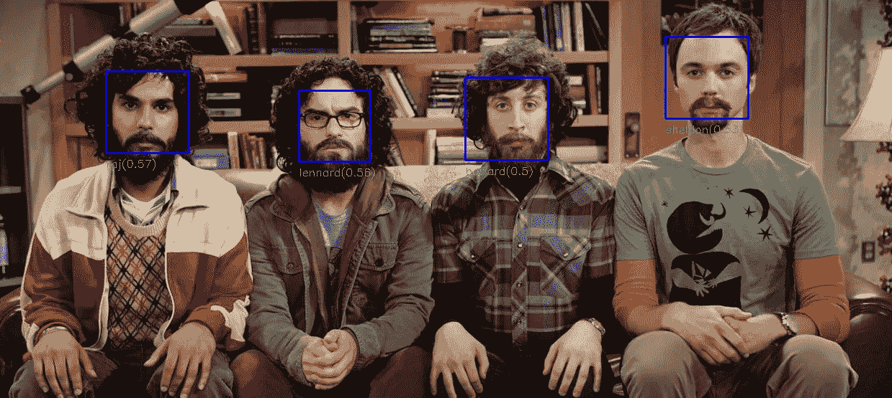
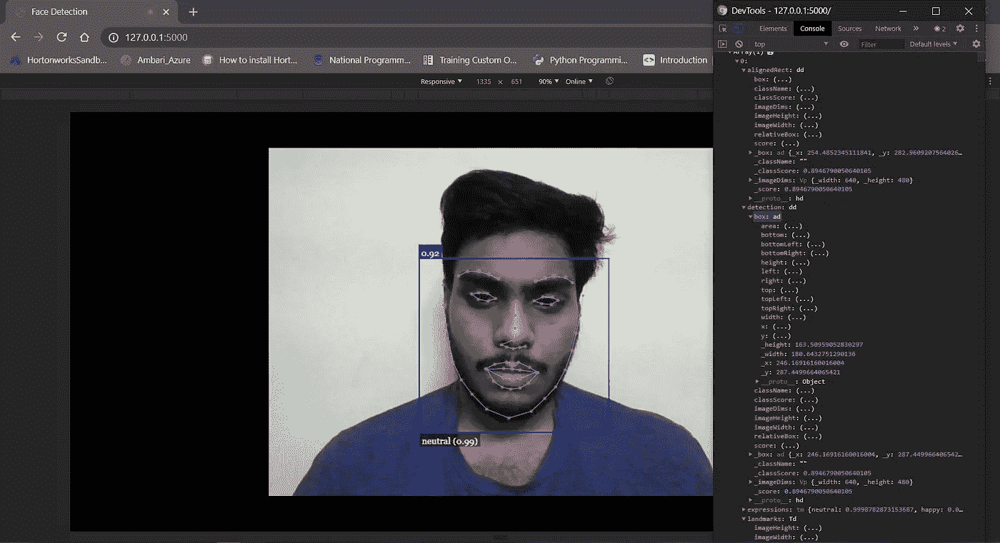

# 使用 Face-Api.js 和 Flask 进行人脸检测

> 原文：<https://towardsdatascience.com/face-detection-using-face-api-js-and-flask-b641f19228cc?source=collection_archive---------21----------------------->

## 在 Flask Python 服务器中使用 Face-Api.js，通过使用 SocketIO 将 TF.js 资源与 Flask 集成，减少计算资源并提高 FPS



[https://github.com/justadudewhohacks/face-recognition.js](https://github.com/justadudewhohacks/face-recognition.js)

T 网上有很多面向 Python 的人脸检测系统，像 Dlib、OpenCV，还有其他深度学习的物体检测系统。我们可能已经使用 OpenCV 使用帧从网络摄像头捕捉视频，并使用 Dlib，MTCNN 等进行面部标志检测。但是我总是受够了在一个项目中，我不能把它添加到 UI 中，或者由于 CPU 的负载有太多的帧跳跃。


谷歌搜索

大多数人使用 Flask 作为部署他们的 ML/DL 模型的 goto 框架，从 HTML 创建 UI 和从 python 服务器管理后端的美妙之处非常迷人。但是，每当你试图在你的网络应用程序中加入摄像头人脸检测时，你就会被 Opencv imshow()的一个对话框卡住，并破坏 UX。TF.js 的开发使我们能够在浏览器本身上开发复杂的模型。但是像我们这样对 Node.js 和其他 web 开发术语知之甚少的 python 爱好者必须知道如何在我们的 Flask playground 中使用这些工具

在本文中，我们将创建一个 Flask web 应用程序，将人脸识别集成到浏览器中

**优势**

*   将数据和推理的视频流嵌入到浏览器内容中
*   更少的资源利用和改进的 FPS
*   不需要将项目从 Python 转移到 Node.js

# 了解 Face-Api.js

当我在寻找 Flask 的人脸检测解决方案时，我在浏览器中遇到了一个用于人脸检测和人脸识别的 JavaScript API，它是由 Vincent Mühler 开发的，他在为人脸检测和识别的 TF.js 实现创建 API 方面做了大量工作。这些 API 可用于从网络摄像头视频中提取数据，也可用于在视频帧上绘制地标。

[](https://github.com/justadudewhohacks/face-api.js) [## justadudehohacks/face-API . js

### 在 tensorflow.js 核心之上实现的浏览器和 nodejs 的 JavaScript 人脸识别 API

github.com](https://github.com/justadudewhohacks/face-api.js) 

# 创建面部标志检测烧瓶应用程序

我们的项目需要安装以下依赖项

*   瓶

```
pip install Flask
conda install -c anaconda flask
```

*   烧瓶浸泡

```
pip install Flask-SocketIO
conda install -c conda-forge flask-socketio
```

我们的 Flask 应用程序创建包括 3 个部分

*   步骤 1:使用 Face-Api.js 创建用于地标检测的静态网页
*   步骤 2:将网页添加到 flask 服务器中，并将来自网页的推断异步传递到 Flask 后端进行处理

# 使用 Face-Api.js 创建用于地标检测的静态网页

在这一步中，我们将使用 Face-Api.js 来创建静态网页以进行人脸检测，并在控制台上记录推理。

我使用的文件结构如下

```
|--static
|     |--js
|     |     |--face-api.min.js
|     |     |--index.js
|     |--styles
|     |     |--style.js
|     |--models
|     |     |-- // All the models from Face-Api.js
|--template
|     |--index.html
|-app.py
```

最新的 **face-api.min.js** 可以在[这里](https://github.com/justadudewhohacks/face-api.js/tree/master/dist)下载，要包含在模型**文件夹**中的权重可以在[这里](https://github.com/justadudewhohacks/face-api.js/tree/master/weights)下载

我们将创建一个带有视频标签的基本 HTML 文件来显示输出，并将所有脚本和 CSS 文件添加到 **template/index.html** 中的文档中

为了改进基本 UI，在**中添加了 CSS static/styles/style . CSS**

魔术来了…使用 Face-Api.js 进行人脸地标检测。所有代码都添加在 **static/js/index.js** 中

上面的代码用于加载模型和初始化 Face-api.js

然后，我们将访问网络摄像头，并开始传输视频数据

加载 face API 后，调用 **startVideo()** 函数

加载视频数据后，我们将向视频流添加监听器，并添加 face-api.js 推断

就是这样…现在，您可以使用 [VS Code Live 服务器](https://marketplace.visualstudio.com/items?itemName=ritwickdey.LiveServer)或[Chrome Web 服务器](https://chrome.google.com/webstore/detail/web-server-for-chrome/ofhbbkphhbklhfoeikjpcbhemlocgigb?hl=en)查看网页……选择文件夹并启动服务器，在 Chrome 选项卡中输入 URL



Face-Api.js 推理演示

耶！！我们已经完成了使用 face-api.js 进行人脸地标检测的第一步

来自 Giphy.com

但是，我们仍然无法用 python 获得这些数据。所以让我们开始第 2 步…

# 设置 Flask 服务器

让我们创建一个基本的 flask 应用程序来查看网页。创建一个基本的 Flask 应用程序来渲染我们在 **app.py** 创建的网页

这可能会查看网页，但仍然没有办法在网页和 flask 应用程序之间发送和接收推断数据。所以我们将使用套接字进行连续的数据传输

**输入插座**

Socket IO 对于在网页和服务器之间创建客户端-服务器套接字非常有用。连接以及发送和接收数据的复杂性由 SocketIO 函数承担，这样我们就可以专注于数据的主要处理

[](https://socket.io/) [## 插座。超正析象管(Image Orthicon)

### 插座。IO 2.0 在这里以最快和最可靠的实时引擎为特色~/Projects/tweets/index . js var IO =…

socket.io](https://socket.io/) 

**在 Flask 应用程序中创建 web 套接字**

安装完 Flask-SocketIO 依赖项后，我们可以按如下方式更新 **app.py**

上面的代码为我们的应用程序创建了一个服务器端套接字。所以我们需要为我们的 web 应用程序创建一个客户端套接字

您可能知道，在 Flask 中连接静态文件使用 **url_for()** 。给 index.html**添加 SocketIO 依赖项，并链接文件夹中的其他静态文件，相应地更新代码**

要在 Javascript 端创建套接字，首先要初始化套接字并测试连接

由于 flask 服务器的创建，face-api.js 不能像我们之前初始化的那样直接定位模型权重，因此需要更新 **index.js** 中 **models** ' **文件夹**的位置

要使用 socket 发送数据，请在 **setInterval()** 中添加以下代码，这将不断地向 Flask 发送数据流。

就这些…你从浏览器得到的数据会被发送到 flask 后端，并在终端上打印出来。您可以相应地进行后期处理

总结一下代码实现

完成 App.py

完整的 Index.html

完整的 Index.js

使用烧瓶进行人脸检测的演示

自制人脸检测演示视频

我希望这是一个有趣的阅读给你们。感谢 [thirumalainambi Yadav](https://medium.com/u/6d96c1fc74c1?source=post_page-----b641f19228cc--------------------------------) 对项目 JS 部分的支持。

## 参考

**Face-API . js by**[**Vincent mühler**](https://medium.com/u/ffd42e31db07?source=post_page-----b641f19228cc--------------------------------)**from**[https://justadudewhohacks . github . io/Face-API . js/docs/globals . html](https://justadudewhohacks.github.io/face-api.js/docs/globals.html)

**SocketIO 示例程序从**到[此处](https://medium.com/@abhishekchaudhary_28536/building-apps-using-flask-socketio-and-javascript-socket-io-part-1-ae448768643)

完整的项目代码可以在下面的 Github 库中找到

[](https://github.com/naidukarthi2193/face_api_python) [## naidukarthi 2193/face _ API _ python

### 使用 Face-Api.js 和 Flask 进行人脸检测。为 naidukarthi 2193/face _ API _ python 开发做出贡献，创建一个…

github.com](https://github.com/naidukarthi2193/face_api_python) 

感谢阅读

来自 Giphy.com

**用于联系**

给我发邮件到 karthikraj . v 17 @ sieg ST . AC . in

或者通过以下链接联系我

[](https://www.linkedin.com/in/naidukarthi2193/) [## karthikraj Naidu——Android 开发者——MeitY | LinkedIn 国家信息中心

### 查看 Karthikraj Naidu 在世界上最大的职业社区 LinkedIn 上的个人资料。Karthikraj 列出了 3 项工作…

www.linkedin.com](https://www.linkedin.com/in/naidukarthi2193/) [](https://github.com/naidukarthi2193) [## naidukarthi2193 —概述

### 解散在 GitHub 上注册您的个人资料，这是托管代码、管理项目和构建软件的最佳场所…

github.com](https://github.com/naidukarthi2193)