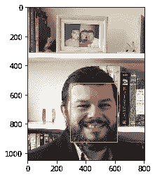
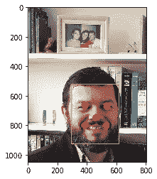
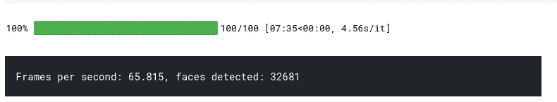

# 使用 MTCNN 的人脸检测——注重速度的人脸提取指南

> 原文：<https://towardsdatascience.com/face-detection-using-mtcnn-a-guide-for-face-extraction-with-a-focus-on-speed-c6d59f82d49?source=collection_archive---------4----------------------->

## 在这篇文章中，我将展示如何使用 MTCNN 从图片或视频中提取人脸和特征，以及如何提高速度 x100


MTCNN 边界框示例

# 什么是 MTCNN

MTCNN 是由 [Github 用户 ipacz](https://github.com/ipazc/mtcnn) 编写的 python (pip)库，实现了[张、等人的论文“多任务级联卷积网络的联合人脸检测与对齐”IEEE 信号处理快报 23.10(2016):1499–1503。交叉引用。Web](https://arxiv.org/abs/1604.02878](https://arxiv.org/abs/1604.02878 "https://arxiv.org/abs/1604.02878) 。

在这篇论文中，他们提出了一个深度级联多任务框架，使用“子模型”的不同功能来增强它们的关联强度。

MTCNN 在 CPU 上执行得相当快，尽管 S3FD 在 GPU 上运行更快——但这是另一篇文章的主题。

这篇文章使用了以下两个来源的代码，看看它们，它们也很有趣:

*   [https://machine learning mastery . com/how-to-perform-face-detection-with-classic-and-deep-learning-methods-in-python-with-keras/](https://machinelearningmastery.com/how-to-perform-face-detection-with-classical-and-deep-learning-methods-in-python-with-keras/)
*   [https://www . ka ggle . com/times ler/fast-mt CNN-detector-55-fps-at-full-resolution](https://www.kaggle.com/timesler/fast-mtcnn-detector-55-fps-at-full-resolution)

# MTCNN 的基本用法

请通过以下方式随意访问整个笔记本:

[https://github . com/JustinGuese/mt CNN-人脸提取-眼睛-嘴巴-鼻子-加速](https://github.com/JustinGuese/mtcnn-face-extraction-eyes-mouth-nose-and-speeding-it-up)

```
git clone [https://github.com/JustinGuese/mtcnn-face-extraction-eyes-mouth-nose-and-speeding-it-up](https://github.com/JustinGuese/mtcnn-face-extraction-eyes-mouth-nose-and-speeding-it-up)
```

幸运的是，MTCNN 是一个 pip 包，这意味着我们可以使用

```
pip install mtcnn
```

现在切换到 Python/Jupyter Notebook，我们可以通过导入和快速验证来检查安装:

```
import mtcnn
# print version
print(mtcnn.__version__)
```

之后，我们准备使用 matplotlib [imread 函数](https://bit.ly/2vo3INw)加载测试图像。

```
import matplotlib.pyplot as plt
# load image from file
filename = "glediston-bastos-ZtmmR9D_2tA-unsplash.jpg"
pixels = plt.imread(filename)
print("Shape of image/array:",pixels.shape)
imgplot = plt.imshow(pixels)
plt.show()
```

现在，您的输出看起来很像这样:

```
{'box': [1942, 716, 334, 415], 'confidence': 0.9999997615814209, 'keypoints': {'left_eye': (2053, 901), 'right_eye': (2205, 897), 'nose': (2139, 976), 'mouth_left': (2058, 1029), 'mouth_right': (2206, 1023)}}
{'box': [2084, 396, 37, 46], 'confidence': 0.9999206066131592, 'keypoints': {'left_eye': (2094, 414), 'right_eye': (2112, 414), 'nose': (2102, 426), 'mouth_left': (2095, 432), 'mouth_right': (2112, 431)}}
{'box': [1980, 381, 44, 59], 'confidence': 0.9998701810836792, 'keypoints': {'left_eye': (1997, 404), 'right_eye': (2019, 407), 'nose': (2010, 417), 'mouth_left': (1995, 425), 'mouth_right': (2015, 427)}}
{'box': [2039, 395, 39, 46], 'confidence': 0.9993435740470886, 'keypoints': {'left_eye': (2054, 409), 'right_eye': (2071, 415), 'nose': (2058, 422), 'mouth_left': (2048, 425), 'mouth_right': (2065, 431)}}
```

这告诉我们什么？其中大部分是不言自明的，但它基本上返回坐标，或者 MTCNN 算法检测到人脸的矩形的像素值。上面的“框”值返回整张脸的位置，后面跟着一个“置信度”级别。

如果你想做更高级的提取或算法，你将可以访问其他面部标志，也称为“关键点”。也就是说，MTCNN 模型还定位了眼睛、嘴巴和鼻子！

# 在面周围画一个方框

为了更好地演示这一点，让我们使用 matplotlib 在面部周围画一个方框:

```
# draw an image with detected objects
def draw_facebox(filename, result_list):
# load the image
data = plt.imread(filename)
# plot the image
plt.imshow(data)
# get the context for drawing boxes
ax = plt.gca()
# plot each box
for result in result_list:
# get coordinates
x, y, width, height = result['box']
# create the shape
rect = plt.Rectangle((x, y), width, height, fill=False, color='green')
# draw the box
ax.add_patch(rect)
# show the plot
plt.show()# filename = 'test1.jpg' # filename is defined above, otherwise uncomment
# load image from file
# pixels = plt.imread(filename) # defined above, otherwise uncomment
# detector is defined above, otherwise uncomment
#detector = mtcnn.MTCNN()
# detect faces in the image
faces = detector.detect_faces(pixels)
# display faces on the original image
draw_facebox(filename, faces)
```



# 在脸部周围展示眼睛、嘴巴和鼻子

现在让我们来看看前面提到的 MTCNN 模型返回的“关键点”。

我们现在将使用这些来绘制鼻子，嘴和眼睛。
我们将在上面的代码中添加以下代码片段:

```
# draw the dots
for key, value in result['keypoints'].items():
# create and draw dot
dot = plt.Circle(value, radius=20, color='orange')
ax.add_patch(dot)
```

上面的完整代码如下所示:

```
# draw an image with detected objects
def draw_facebox(filename, result_list):
# load the image
data = plt.imread(filename)
# plot the image
plt.imshow(data)
# get the context for drawing boxes
ax = plt.gca()
# plot each box
for result in result_list:
# get coordinates
x, y, width, height = result['box']
# create the shape
rect = plt.Rectangle((x, y), width, height,fill=False, color='orange')
# draw the box
ax.add_patch(rect)
# draw the dots
for key, value in result['keypoints'].items():
# create and draw dot
dot = plt.Circle(value, radius=20, color='red')
ax.add_patch(dot)
# show the plot
plt.show()# filename = 'test1.jpg' # filename is defined above, otherwise uncomment
# load image from file
# pixels = plt.imread(filename) # defined above, otherwise uncomment
# detector is defined above, otherwise uncomment
#detector = mtcnn.MTCNN()
# detect faces in the image
faces = detector.detect_faces(pixels)
# display faces on the original image
draw_facebox(filename, faces)
```



# 高级 MTCNN:加速(\~x100)！

现在让我们进入有趣的部分。如果你要处理数百万张图片，你需要加快 MTCNN 的速度，否则，你要么会睡着，要么你的 CPU 会在它完成之前就烧了。

但是我们到底在说什么呢？如果你运行上面的代码，大约需要一秒钟，这意味着我们每秒钟处理一张图片。如果你在 GPU 上运行 MTCNN 并使用加速版本，它将达到每秒 60-100 张图片/帧。这是 T2 的 100 倍！

例如，如果您要提取一部电影的所有人脸，每秒钟将提取 10 张人脸(电影的一秒钟平均有大约 24 帧，因此每秒钟一帧)，那么它将是 10 * 60(秒)* 120(分钟)= 72，000 帧。

也就是说，如果处理一帧图像需要一秒钟，则需要 72，000 * 1(秒)= 72，000 秒/60 秒= 1，200 米= **20 小时**

对于加速版的 MTCNN，这项任务将需要 72，000(帧)/ 100(帧/秒)= 720 秒= **12 分钟**！

要在 GPU 上使用 MTCNN，您需要设置 CUDA、cudnn、pytorch 等等。关于那部分，Pytorch 写了一个很好的教程。

安装完成后，我们将进行必要的导入，如下所示:

```
from facenet_pytorch import MTCNN
from PIL import Image
import torch
from imutils.video import FileVideoStream
import cv2
import time
import glob
from tqdm.notebook import tqdmdevice = 'cuda' if torch.cuda.is_available() else 'cpu'filenames = ["glediston-bastos-ZtmmR9D_2tA-unsplash.jpg","glediston-bastos-ZtmmR9D_2tA-unsplash.jpg"]
```

看到我们如何在上面的代码中定义设备了吗？如果你不想或者不能设置 CUDA，你也可以在 CPU 上运行任何东西。

接下来，我们将定义提取器:

```
# define our extractor
fast_mtcnn = FastMTCNN(
stride=4,
resize=0.5,
margin=14,
factor=0.6,
keep_all=True,
device=device
)
```

在这个片段中，我们传递了一些参数，例如，我们只使用了图像大小的一半，这是加速的主要影响因素之一。

最后，让我们运行人脸提取脚本:

```
def run_detection(fast_mtcnn, filenames):
frames = []
frames_processed = 0
faces_detected = 0
batch_size = 60
start = time.time()for filename in tqdm(filenames):v_cap = FileVideoStream(filename).start()
v_len = int(v_cap.stream.get(cv2.CAP_PROP_FRAME_COUNT))for j in range(v_len):frame = v_cap.read()
frame = cv2.cvtColor(frame, cv2.COLOR_BGR2RGB)
frames.append(frame)if len(frames) >= batch_size or j == v_len - 1:faces = fast_mtcnn(frames)frames_processed += len(frames)
faces_detected += len(faces)
frames = []print(
f'Frames per second: {frames_processed / (time.time() - start):.3f},',
f'faces detected: {faces_detected}\r',
end=''
)v_cap.stop()run_detection(fast_mtcnn, filenames)
```



上图显示了在 NVIDIA Tesla P100 上运行的代码输出，因此根据源材料、GPU 和处理器，您可能会体验到更好或更差的性能。

这个故事在我的博客[https://www . data fortress . cloud/blog/face-detection-using-mt CNN/](https://www.datafortress.cloud/blog/face-detection-using-mtcnn/)上也有。