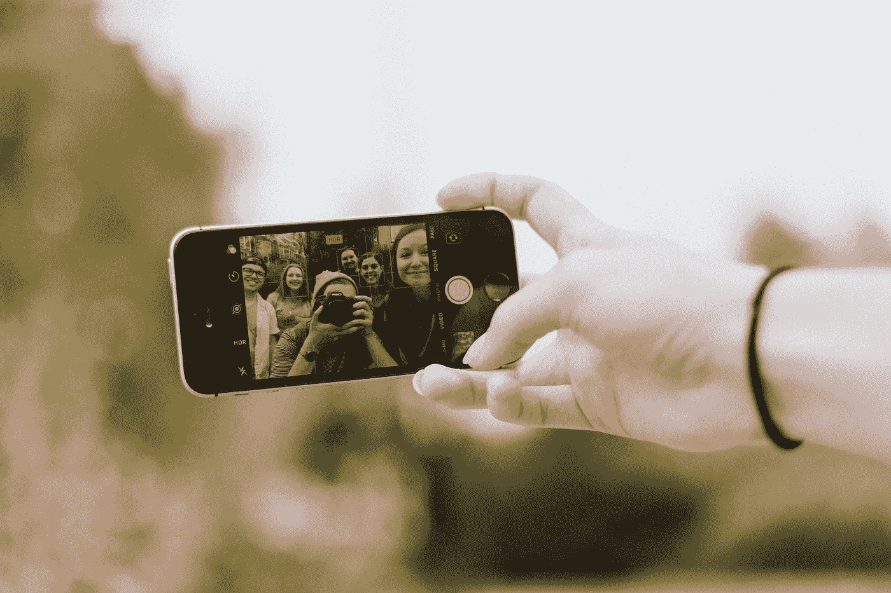
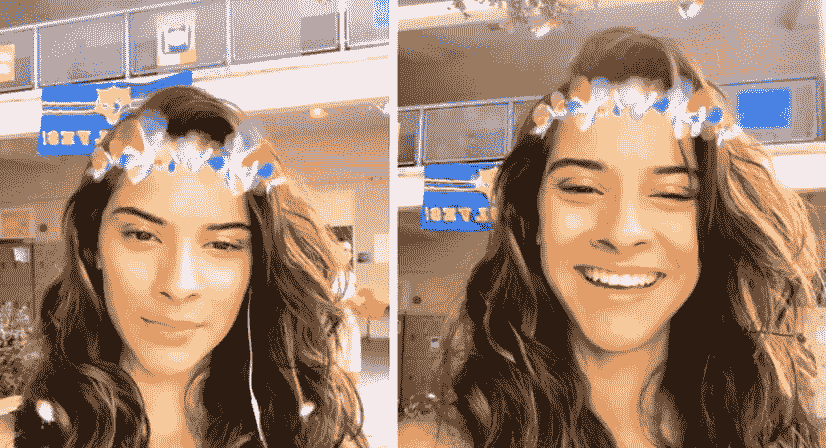
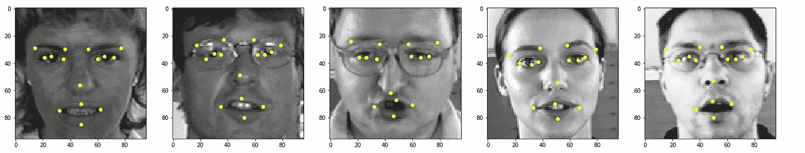

# TensorFlow 中端到端回归的人脸标志点检测

> 原文：<https://towardsdatascience.com/face-landmark-detection-with-cnns-tensorflow-cf4d191d2f0?source=collection_archive---------13----------------------->

## 🤖[深度学习](https://equipintelligence.medium.com/list/deep-learning-techniques-methods-and-how-tos-01015cf5f917)

## 从零开始构建一个模型，不需要使用其他包！



照片由[普里西拉·杜·普里兹](https://unsplash.com/@priscilladupreez?utm_source=medium&utm_medium=referral)在 [Unsplash](https://unsplash.com?utm_source=medium&utm_medium=referral) 拍摄

人脸检测系统在当今这个要求安全性、可访问性或快乐的世界里有很大的用途！今天，我们将建立一个可以在一张脸上画出 15 个关键点的模型。

面部标志检测模型形成了我们在社交媒体应用中看到的各种功能。你在 Instagram 上找到的人脸滤镜是一个常见的用例。该算法对准图像上的掩模，保持面部标志作为基点。



Instagram 的自拍滤镜需要知道你的眼睛、嘴唇和鼻子在图像上的确切位置。

我们用 Keras ( TF backend)开发一个模型吧！首先，我们需要一些数据来训练我们的模型。

> **请注意！**本博客教你用 Keras 建立一个超级简单的人脸地标检测模型。对于实际的生产模型，这可能没有用。

您可以在另一个选项卡中运行交互式 Colab 笔记本，以跟踪和理解每个步骤。

[](https://colab.research.google.com/drive/11PoRdorcI5C8SFPEZbO2XNGPCTGIwDfP#scrollTo=IsWsGrm8BvgN&forceEdit=true&sandboxMode=true) [## 人脸 _ 地标 _ 检测

colab.research.google.com](https://colab.research.google.com/drive/11PoRdorcI5C8SFPEZbO2XNGPCTGIwDfP#scrollTo=IsWsGrm8BvgN&forceEdit=true&sandboxMode=true) 

# 数据

我们使用的是由 [Omri Goldstein](https://www.kaggle.com/drgilermo) 在 [Kaggle](https://www.kaggle.com/) 上标注了标志点数据集的[人脸图像。该数据集包含大约 7000 张图像(96 * 96 ),其面部标志可以在`facial_keypoints.csv`文件中找到。](https://www.kaggle.com/drgilermo/face-images-with-marked-landmark-points)

但是这里我们有一个问题。**大多数图像没有一套完整的 15 个点。所以我们只需要那些有 15 个面部关键点的图像。**

使用这个[脚本](https://gist.github.com/shubham0204/7eb0435dc0142ce4fc560629111e0648)，我做了一些清理，并将修改后的数据保存在我的[数据集档案](https://github.com/shubham0204/Dataset_Archives) GitHub repo 中。Colab 笔记本使用`wget`命令下载 ZIP 存档文件。

```
!wget https://github.com/shubham0204/Dataset_Archives/blob/master/face_landmarks_cleaned.zip?raw=true -O data.zip!unzip data.zip
```

我们还标准化了图像和坐标(关键点)。我已经改变了输出`y_train`和`y_test`的形状，因为它们将成为`Conv2D`层而不是`Dense`层的预期输出。

预处理数据。

> **亲提示**:我找到了另一个用于人脸地标检测的数据集，名为 [UTKFace](https://susanqq.github.io/UTKFace/) 。它包含 68 个面部关键点以及年龄和性别等其他特征。也试试吧！

# 讨论模型

让我们讨论一下我们模型的结构。实际上，我用这个模型做了一些实验。我们需要一个模型，它拍摄一张尺寸为`( 96 , 96 )` 的图像，并输出一个形状数组`( 30, )` ( 15 个关键点* 2 个坐标)

1.  第一个模型拍摄了一幅图像，并将其通过预先训练好的 [VGG 模型](https://neurohive.io/en/popular-networks/vgg16/)。接下来，VGG 的输出被展平并通过多个`Dense`层。*问题在于，即使在损失最小的情况下，该模型也能为每张图像预测出相同的关键点*。
2.  第二种型号是您可以在 Colab 笔记本中找到的型号。我们不使用`Dense`层。相反，我们通过`Conv2D`层传递图像，并给出形状`( 1 , 1 , 30 )`的输出。因此，`Conv2D`层给了我们输出。*使用这种模型，对于每幅图像以及甚至不存在于数据集中的图像，预测都是不同的！*

我们的模型看起来像，

模型。

在执行回归任务时，我们使用的是[均方误差](https://en.wikipedia.org/wiki/Mean_squared_error)。如果你有大量的数据，小的学习率总是好的。

> **为什么我们要使用批量标准化图层？**
> 
> 阅读这篇[博客](/batch-normalization-in-neural-networks-1ac91516821c)了解更多。

## 训练和推理

我们以 50 个为一批，对模型进行大约 250 个时期的训练。训练之后，我们将在测试数据集上生成一些预测。

生成预测。

> **注意**:记住输入图像的方向。在旋转 90 度的图像上训练的模型不能对直立图像产生正确的预测。

如果没有对模型或训练参数做任何修改，250 个历元后的模型应该是这样的，



结果。

印象深刻吧。仅此而已！您刚刚从头开始构建了一个面部标志检测模型。在笔记本中，我添加了一个代码单元，你可以用网络摄像头拍摄图像，并在上面运行模型。

# 想要更多吗？

# 结束了

我看完结果后的第一反应！

很久以后我发表了作品(同时我正忙于写数学……)。感谢阅读！