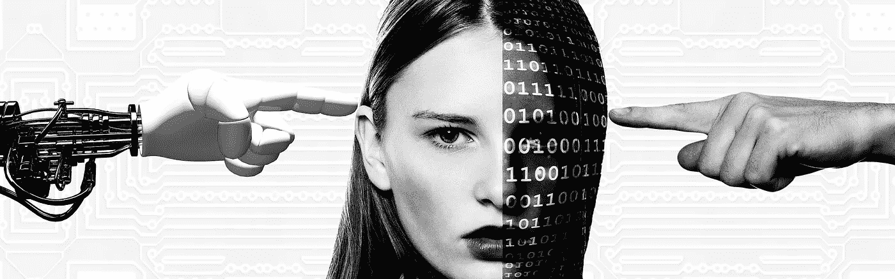
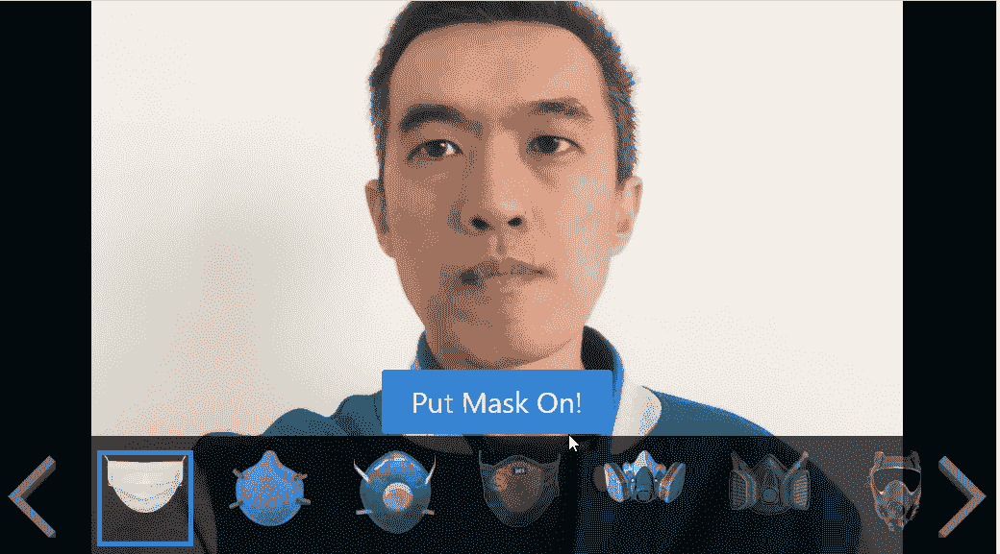
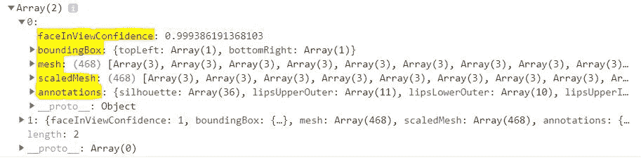
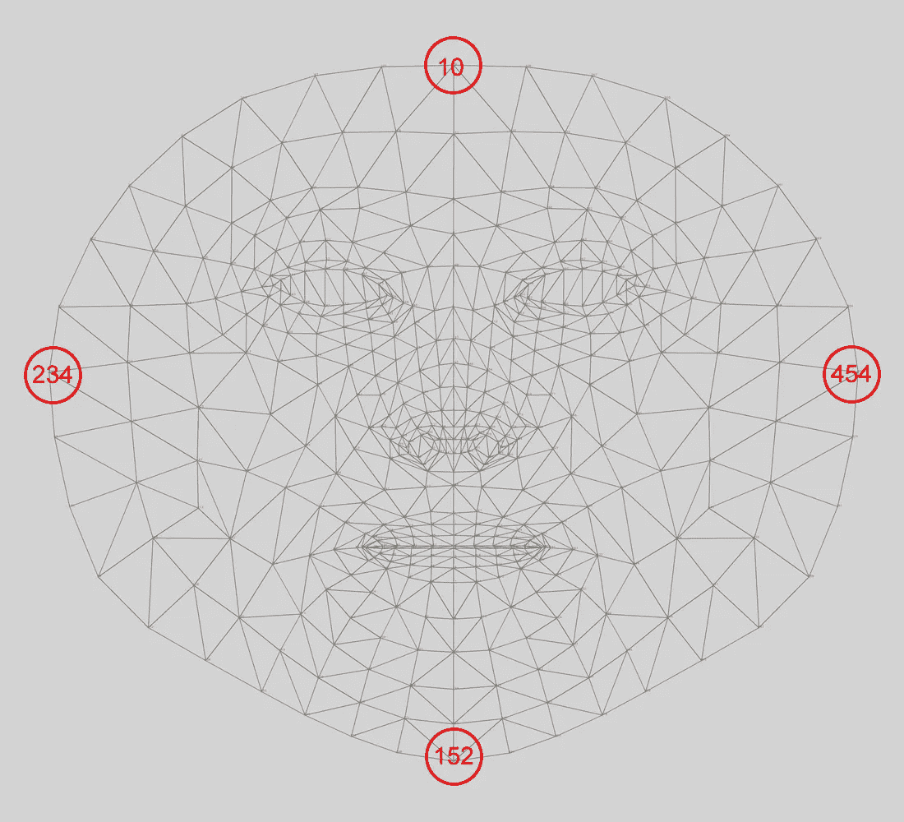
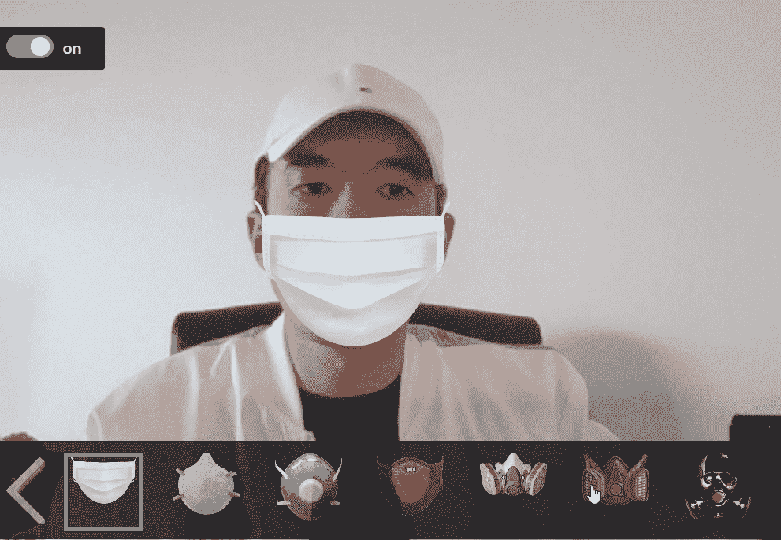

# 基于 MediaPipe 人脸网格的人脸标志点检测

> 原文：<https://towardsdatascience.com/face-landmarks-detection-with-mediapipe-facemesh-555fa2e10b06?source=collection_archive---------11----------------------->

## 用 tfjs facemesh 模型，我做了一个面具网络应用，你可以在上面试你最喜欢的面具



来源:[pixabay.com](https://pixabay.com/illustrations/hand-robot-human-machine-face-1571851/)

Tensorflow.js 在 3 月份发布了 [MediaPipe Facemesh](https://github.com/tensorflow/tfjs-models/tree/master/facemesh) 模型，这是一个轻量级的机器学习管道，可以预测 **486 个 3D 面部标志**来推断人脸的近似表面几何形状。

在疫情期间，我呆在家里玩这个 facemesh 模型。我想提醒人们戴口罩的重要性。于是我搭建了一个虚拟的口罩试衣间，它可以在一个图像或者网络摄像头流中检测到人脸地标，把选中的口罩戴在你的脸上。



点击下面的链接亲自尝试一下:

[](https://bensonruan.com/face-mask-for-trump-with-face-landmark-detection/) [## 特朗普的面具-带有面部标志检测-本森技术

### 疾病控制和预防中心(CDC)建议美国人在公共场合戴口罩，以防止…

bensonruan.com](https://bensonruan.com/face-mask-for-trump-with-face-landmark-detection/) 

# 履行

戴口罩是关心社区的一种表现。它可以防止佩戴者无意中将疾病传染给他人。虚拟面具试衣间利用了一种称为**面部标志检测**的先进技术，可以在图像或视频流中识别人脸。

如果你有兴趣建立一个面部标志检测应用程序，请在下面跟随我，了解我是如何实现它的。

## #步骤 1:包括 tfjs 和 facemesh 模型

首先，简单的在 html 文件的< head >部分包含脚本`Tensorflow.js`及其`facemesh`模型。

```
<script src="[https://cdn.jsdelivr.net/npm/@tensorflow/tfjs-core](https://cdn.jsdelivr.net/npm/@tensorflow/tfjs-core)"></script><script src="[https://cdn.jsdelivr.net/npm/@tensorflow/tfjs-converter](https://cdn.jsdelivr.net/npm/@tensorflow/tfjs-converter)"></script><script src="[https://cdn.jsdelivr.net/npm/@tensorflow-models/facemesh](https://cdn.jsdelivr.net/npm/@tensorflow-models/facemesh)"></script>
```

或者您可以通过 npm 安装它，以便在 TypeScript / ES6 项目中使用

```
npm install @tensorflow-models/facemesh//import in js
const facemesh = require('@tensorflow-models/facemesh');
```

## #步骤 2: HTML 图像和视频元素

接下来我们需要做的是添加 html ``或`<video>`元素作为源，这样我们就可以在图像或网络摄像头视频流上执行面部标志检测。

```
<video id="webcam" autoplay playsinline width="640" height="480"></video>
```

为了让你的网络摄像头进入浏览器，我使用了 npm JavaScript 模块`webcam-easy.js`，它提供了一个易于使用的模块，可以访问网络摄像头并拍照。要了解更多细节，请参考我之前的博客:

[](https://medium.com/swlh/how-to-access-webcam-and-take-picture-with-javascript-b9116a983d78) [## 如何使用 JavaScript 访问网络摄像头并拍照

### 介绍网络摄像头-简易 npm 模块

medium.com](https://medium.com/swlh/how-to-access-webcam-and-take-picture-with-javascript-b9116a983d78) 

## #步骤 3:加载面网格模型

为了执行人脸地标检测，我们首先需要通过调用`facemesh.load(modelParams)`的 API 来加载预先训练好的 Facemesh 模型。FaceMesh 附带了一些可选的模型参数:

*   **maxContinuousChecks** (默认值:5)

—在不运行边界框检测器的情况下要运行多少帧。仅当 maxFaces > 1 时相关

*   **检测置信度**(默认值:0.9)

—丢弃预测的阈值

*   **maxFaces** (默认值:10)

—输入中检测到的最大面数。应设置为性能的最小数字

*   **iouThreshold** (默认值:0.3)

—一个浮点值，表示在非最大值抑制中决定框是否重叠过多的阈值。必须在[0，1]之间

*   **得分阈值**(默认值:0.75)

—根据非最大抑制中的分数决定何时移除框的阈值

```
facemesh.load().then(mdl => { 
    model = mdl;
    console.log("model loaded");
    cameraFrame =  detectFaces();
});
```

## #步骤 4:面部标志检测

接下来，我们通过调用`model.estimateFaces(inputElement)`的 API，开始通过 Facemesh 模型馈送图像或网络摄像头流来执行面部标志检测。它接受一个输入图像元素(可以是张量、DOM 元素图像、视频或画布),并返回面部标志关键点、边界框和置信度的数组。

`estimateFaces` API 附带了模型的几个参数:

*   **输入**

**—** 要分类的图像。可以是张量、DOM 元素图像、视频或画布。

*   **返回张量**(默认值:假)

—是否返回张量而不是值

*   **flipHorizontal** (默认值:假)

—是否水平翻转/镜像面部关键点。对于面向网络摄像机流的用户来说应该是真的

```
let inputElement = isVideo? webcamElement : imageElement;
let flipHorizontal = isVideo;
model.estimateFaces(inputElement, false, flipHorizontal).then(predictions => {
    console.log(predictions);
    drawMask(predictions);
});
```

预测的返回看起来像:



对于每一个面部标志关键点，它包含 x，y 轴的位置和深度。

```
0: Array(3)
    0: 202.05661010742188
    1: 207.98629760742188
    2: -5.985757827758789
    length: 3
```

## #第五步:戴上面具

在上面的函数中，我们得到了 468 个人脸地标关键点。对于我们的面罩应用，我使用了其中的 4 个标志:

*   额头:10
*   左脸颊:234
*   下巴:152
*   右脸颊:454



然后，我们可以使用这些关键点来计算我们应该在哪里覆盖人脸面具 PNG 图像。我们需要计算以下 3 个数字:

*   遮罩图像左上角的(x，y)位置
*   遮罩图像的宽度
*   遮罩图像的高度

下面是我如何得到蒙版图像:使用右脸颊标志的 x 轴值-左脸颊标志的 x 轴值

```
maskWidth =(dots[rightCheekIndex].left - dots[leftCheekIndex].left);
```

对于高度和左上角位置，半遮罩和全遮罩之间存在差异。

*   全面罩

—左上角:{x:额头 x 轴值；y:左脸颊 y 轴值}

—身高:[下巴 y 轴值]—[额头 y 轴值]

*   半截面罩

—左上角:{x，y:左界标的 x，y 轴值}

—身高:[下巴 y 轴值]—[左脸颊 y 轴值]

```
switch(maskType) {
  case 'full':
    maskCoordinate= { top: dots[foreheadIndex].top, left: dots[leftCheekIndex].left};
    maskHeight = (dots[chinIndex].top - dots[foreheadIndex].top) ;
    break;
  case 'half':
    maskCoordinate = dots[leftCheekIndex];
    maskHeight = (dots[chinIndex].top - dots[leftCheekIndex].top) ;
    break;
}
```

最后一步是将人脸蒙版 PNG 图像叠加到人脸上。

```
maskElement = $("");
maskElement.appendTo($("#canvas"));
maskElement.css({
    top: maskCoordinate.top, 
    left: maskCoordinate.left, 
    width: maskWidth ,
    height: maskHeight,
    position:'absolute'
});
```

代码就这么多了！现在选择你最喜欢的面膜，自己试一试吧！



# GitHub 知识库

您可以通过下面的链接下载上述演示的完整代码:

[](https://github.com/bensonruan/Face-Mask) [## 面罩

### 图像和实时网络摄像头人脸检测，使用虚拟面罩保护自己免受 COVID19 攻击。利用张量流…

github.c](https://github.com/bensonruan/Face-Mask) 

# 结论

Facemesh 模型是为移动设备上的前置摄像头设计的，在这种情况下，视图中的人脸往往会占据画布的相对较大部分。MediaPipe Facemesh 可能很难识别远处的人脸。

由于每个人都担心冠状病毒的传播，面部检测和识别系统可能是比传统的生物识别门禁系统更安全、更清洁的选择。这项技术不仅可以降低交叉感染的风险，还可以提高交通效率 10 倍以上，从而节省时间，减少拥堵。

最后，我希望每个人在疫情期间保持健康，呆在家里，让我们利用最新的机器学习技术来帮助我们对抗病毒。

感谢您的阅读。如果你喜欢这篇文章，请在脸书或推特上分享。如果你有任何问题，请在评论中告诉我。在 [GitHub](https://github.com/bensonruan/) 和 [Linkedin](https://www.linkedin.com/in/benson-ruan/) 关注我。