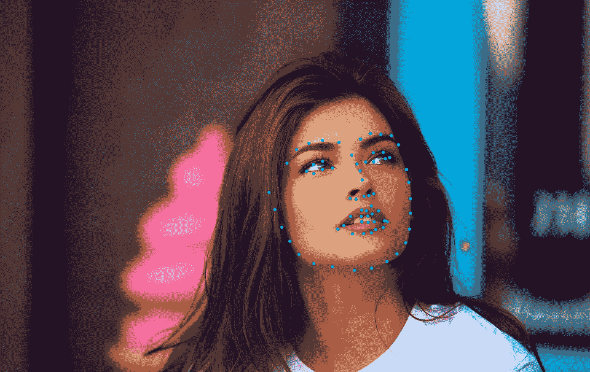
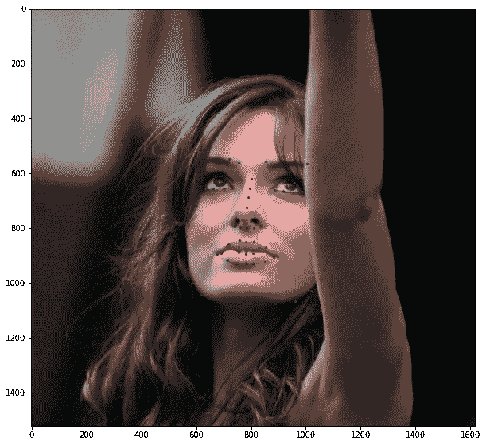
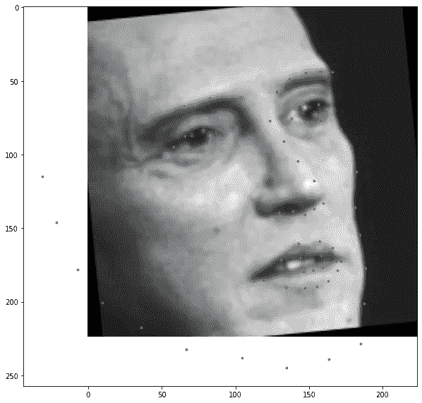
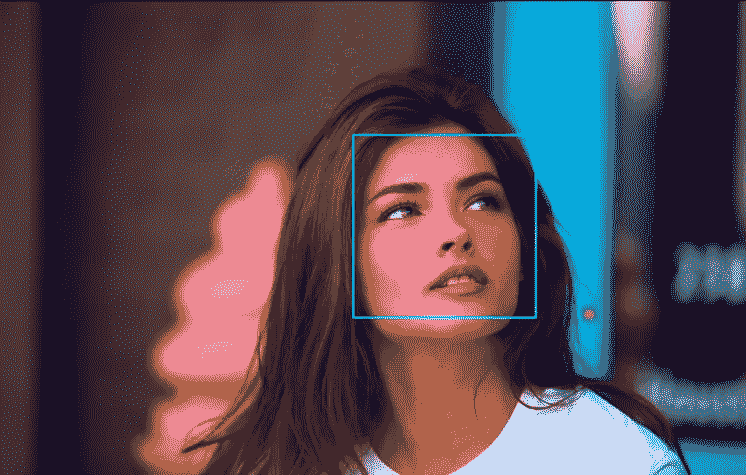
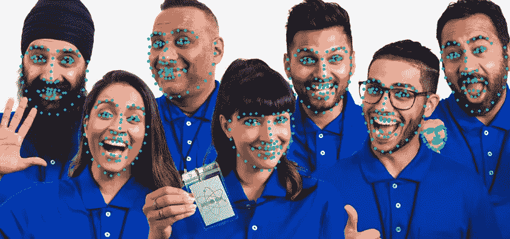

# 用 PyTorch 检测人脸标志点

> 原文：<https://towardsdatascience.com/face-landmarks-detection-with-pytorch-4b4852f5e9c4?source=collection_archive---------9----------------------->

## 计算机真的能看懂人脸吗？

[Ayo Ogunseinde](https://unsplash.com/@armedshutter?utm_source=unsplash&utm_medium=referral&utm_content=creditCopyText) 从 [Unsplash](https://unsplash.com/s/photos/girls?utm_source=unsplash&utm_medium=referral&utm_content=creditCopyText) 拍摄的照片上的地标检测样本

想知道 Instagram 如何将令人惊叹的滤镜应用到你的脸上吗？该软件检测你脸上的关键点，并在上面投射一个面具。本教程将指导您如何使用 Pytorch 构建这样一个软件。

# Colab 笔记本

完整的代码可以在下面的交互式 Colab 笔记本中找到。

 [## 人脸标志检测

colab.research.google.com](https://colab.research.google.com/drive/1TOw7W_WU4oltoGZfZ_0krpxmhdFR2gmb) 

# 资料组

在本教程中，我们将使用官方的 [DLib 数据集](http://dlib.net/files/data/ibug_300W_large_face_landmark_dataset.tar.gz)，其中包含了 **6666 张不同尺寸**的图像。此外，*labels _ ibug _ 300 w _ train . XML*(随数据集提供)包含每张脸的 **68 个地标的坐标。下面的脚本将下载数据集并将其解压缩到 Colab Notebook 中。**

这是数据集中的一个示例图像。我们可以看到，面部占据了整个图像的很小一部分。如果我们将完整的图像输入神经网络，它也会处理背景(无关信息)，使模型难以学习。因此，我们需要裁剪图像，只填充人脸部分。

数据集的样本图像和地标

## 数据预处理

为了防止神经网络过度拟合训练数据集，我们需要随机转换数据集。我们将对训练和验证数据集应用以下操作:

*   由于人脸在整个图像中只占很小的一部分，所以请裁剪图像并仅使用人脸进行训练。
*   将裁剪后的面调整为(224x224)图像。
*   随机更改调整后的面部的亮度和饱和度。
*   以上三种变换后随机旋转人脸。
*   将图像和地标转换为火炬张量，并在[-1，1]之间归一化。

# 数据集类

现在我们已经准备好了转换，让我们编写数据集类。*labels _ ibug _ 300 w _ train . XML*包含图像路径、界标和边界框的坐标(用于裁剪面部)。我们将这些值存储在列表中，以便在培训期间轻松访问。在本教程中，将对灰度图像训练神经网络。

**注意:** `landmarks = landmarks - 0.5`是为了使地标以零为中心，因为以零为中心的输出更易于神经网络学习。

预处理后数据集的输出将类似于这样(图像上标出了地标)。

预处理数据样本

# 神经网络

我们将使用 ResNet18 作为基本框架。我们需要修改第一层和最后一层，以适应我们的目的。在第一层中，我们将使输入通道计数为 1，以便神经网络接受灰度图像。类似地，在最终层中，输出通道计数应该等于 **68 * 2 = 136** ，以便模型预测每个面的 68 个标志的(x，y)坐标。

# 训练神经网络

我们将使用预测界标和真实界标之间的均方误差作为损失函数。请记住，学习率应该保持较低，以避免爆炸梯度。每当验证损失达到新的最小值时，将保存网络权重。训练至少 20 个纪元才能获得最佳表现。

# 根据看不见的数据预测

使用下面的代码片段来预测看不见的图像中的地标。

> 上面的代码片段在 Colab Notebook 中不起作用，因为 Colab 还不支持 OpenCV 的某些功能。要运行上述单元，请使用您的本地机器。

**OpenCV Harr Cascade** **分类器**用于检测图像中的人脸。使用 Haar 级联的对象检测是一种基于机器学习的方法，其中用一组输入数据训练级联函数。OpenCV 已经包含了许多预先训练好的人脸、眼睛、行人等分类器。在我们的例子中，我们将使用人脸分类器，为此您需要下载[预训练的分类器 XML 文件](https://github.com/opencv/opencv/blob/master/data/haarcascades/haarcascade_frontalface_default.xml)，并将其保存到您的工作目录中。

人脸检测

然后，输入图像中检测到的人脸被裁剪，调整大小到 **(224，224)** ，并被馈送到我们训练过的神经网络，以预测其中的地标。

裁剪人脸上的标志点检测

然后，裁剪后的面部中的预测界标被覆盖在原始图像的顶部。结果如下图所示。印象深刻，对吧！

决赛成绩

类似地，多个面部上的标志检测:

在这里，你可以看到 **OpenCV Harr 级联分类器**已经检测到多个人脸，包括一个误报(一个拳头被预测为一个人脸)。所以，网络已经在那上面画了一些地标。

# 那都是乡亲们！

如果你成功了，向你致敬！你刚刚训练了你自己的神经网络来检测任何图像中的面部标志。尝试在您的网络摄像头上预测面部标志！！

有什么建议请留言评论。我定期写文章，所以你应该考虑关注我，在你的订阅中获得更多这样的文章。

如果你喜欢这篇文章，你可能也会喜欢这些:

 [## 机器学习-可视化

### 理解机器学习的视觉方法

towardsdatascience.com](/machine-learning-visualized-11965ecc645c)  [## 主成分分析-可视化

### 使用主成分分析(PCA)的数据压缩

towardsdatascience.com](/principal-component-analysis-visualized-17701e18f2fa) 

访问我的[网站](http://arkalim.github.io/)了解更多关于我和我的工作。