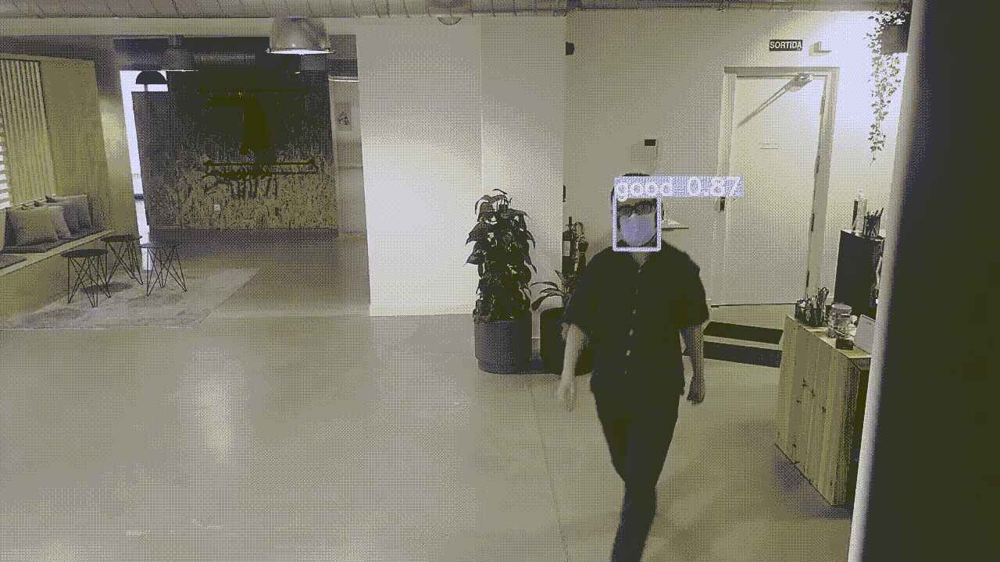
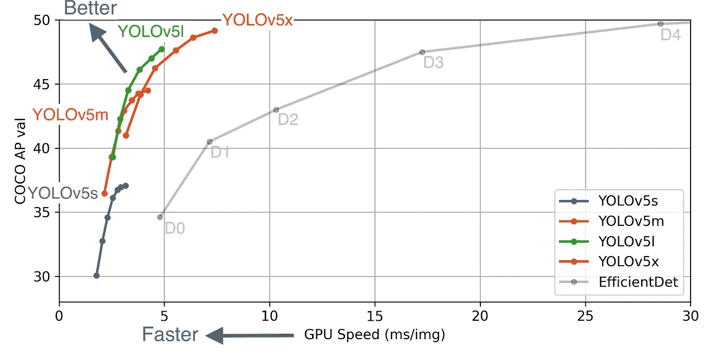
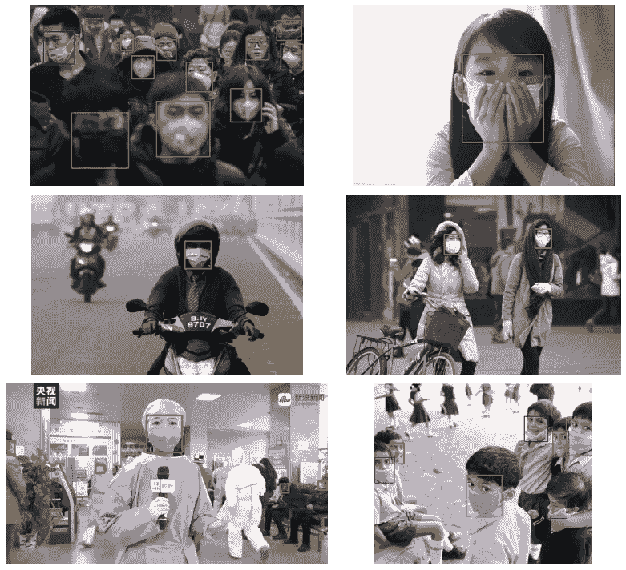
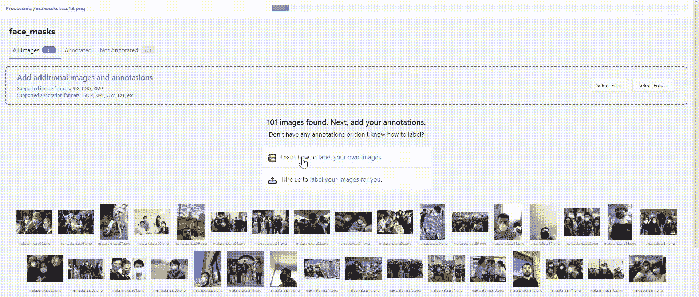
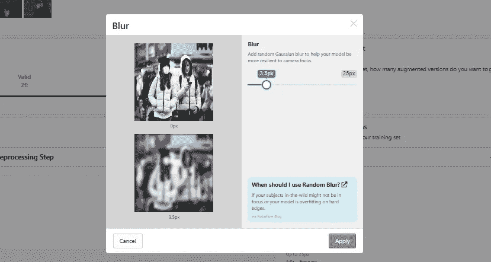
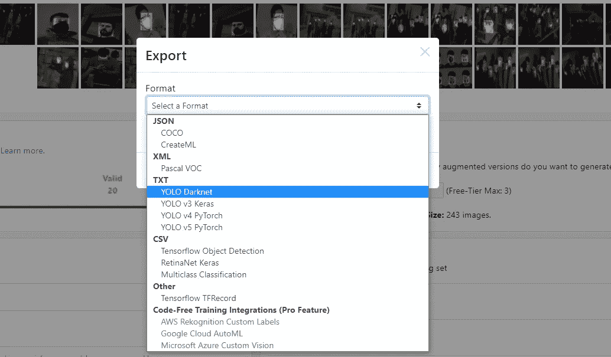
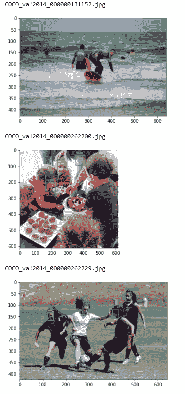
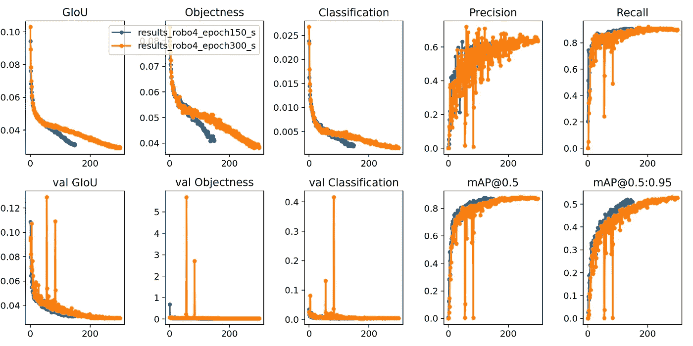
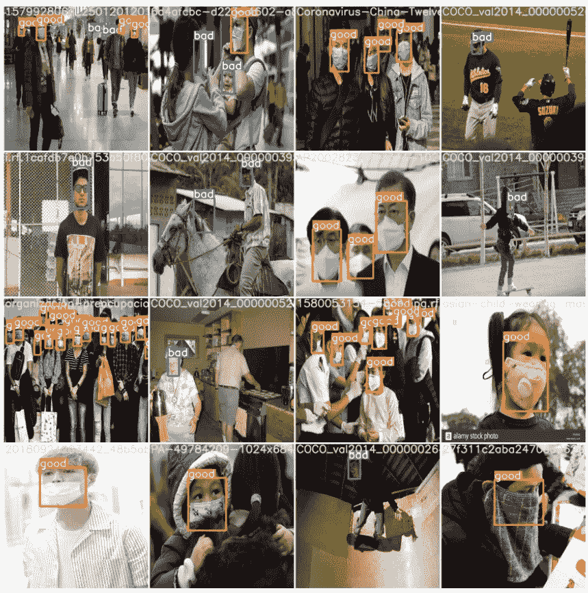

# 使用 YOLOv5 进行人脸面具检测

> 原文：<https://towardsdatascience.com/face-mask-detection-using-yolov5-3734ca0d60d8?source=collection_archive---------4----------------------->

## 实践教程

## 新冠肺炎:指南建立一个面具检测器使用 YOLOv5 和运行推理视频流



YOLOv5 推论(视频由作者提供)

在本帖中，我们将逐步指导如何训练一个 [**约洛夫 5**](https://github.com/ultralytics/yolov5) **模型来检测视频流中的人是否戴着面具。**

我们将从物体检测模型背后的一些基本概念开始，并激励使用 **YOLOv5** 来解决这个问题。

从那里，我们将回顾我们将用于训练模型的数据集，并查看如何对其进行调整，使其符合 [darknet 格式](https://github.com/AlexeyAB/Yolo_mark/issues/60#issuecomment-401854885)。

然后，我将向您展示如何使用下载的数据集训练 YOLOv5 模型，并对图像或视频文件进行推理。

**在这里** **找到本节使用的代码** [**的笔记本。**](https://github.com/AlexanderNixon/Machine-learning-reads/blob/master/Face-Mask-Detection-YOLOv5.ipynb)

这个项目是和弗兰·佩雷斯一起完成的，他也是这个社区的贡献者。我建议你读一些他的精彩文章！

## 背景

“YOLO”，指的是“*你只看一次*”，是 Joseph Redmon 用 2016 年的出版物“[你只看一次:统一的、实时的物体检测](https://arxiv.org/pdf/1506.02640.pdf)”推出的一系列**物体检测**模型。

从那时起，几个更新的版本已经发布，其中，前三个是由约瑟夫·雷德蒙发布的。6 月 29 日，Glenn Jocher 发布了最新版本 **YOLOv5** ，[声称相对于其前作有重大改进](https://blog.roboflow.com/yolov5-is-here/)。

最有趣的改进，是它的“*惊人地快速推断”。*正如 Roboflow *、*在特斯拉 P100 中运行的[这篇文章](https://blog.roboflow.com/yolov5-is-here/)中所发布的，YOLOv5 实现了每幅图像高达 0.007 秒的推理时间，**意味着 140 FPS** ！



YOLO 车型对比([图片来源](https://github.com/ultralytics/yolov5))

## 为什么是 YOLO？

使用一个 [**对象检测**](https://en.wikipedia.org/wiki/Object_detection) 模型，比如 YOLOv5，很可能是解决这个问题的最简单和最合理的方法。这是因为我们将计算机视觉流水线限制为一个单一步骤**、**，因为物体检测器被训练来检测:

*   **包围盒**和一个
*   **对应标签**

这正是我们试图解决这个问题的目的。在我们的例子中，边界框将是检测到的人脸，相应的标签将指示这个人是否戴着面具。

或者，如果我们想建立自己的深度学习模型，它会更复杂，因为它必须是 2 **-fold** :我们需要一个模型来检测图像中的人脸，另一个模型来检测找到的边界框中是否存在人脸面具。

除了复杂性之外，这样做的缺点是推断时间会慢得多，尤其是在有许多人脸的图像中。

## 数据呢？

我们现在知道可以用哪个模型来解决这个问题。下一个自然的，也可能是最重要的方面是… *数据呢？？*

幸运的是，在 **Kaggle** 中有一个公开可用的数据集，名为[人脸面具检测](https://www.kaggle.com/andrewmvd/face-mask-detection)，这将使我们的生活变得更加轻松。

数据集包含 853 幅图像及其对应的注释文件，指示一个人是*正确佩戴*、*错误佩戴*还是*没有佩戴*。

以下是数据集中的一个示例:



来自[面罩数据集](https://www.kaggle.com/andrewmvd/face-mask-detection)的样本图像(图片由作者提供)

在这种情况下，我们将简化上面的内容来检测一个人是否戴着面具(我们将在 Roboflow 部分看到如何戴面具)。

# 关于自定义数据的培训

我们现在知道了开始工作所需的一切，所以是时候动手了！

## 项目布局

我们需要做的第一件事是从 [ultralytics/yolov5](https://github.com/ultralytics/yolov5) 中克隆存储库，并安装所有需要的依赖项:

```
!git clone [https://github.com/ultralytics/yolov5](https://github.com/ultralytics/yolov5) # clone repo
!pip install -U -r yolov5/requirements.txt # install dependencies
```

我们需要从存储库中获取的主要文件的结构如下:

```
yolov5           # project root
├── models       # yolov5 models
├── train.py     # training script
└── detect.py    # inference script
```

这📁 **models** 文件夹包含几个`.yml`文件，包含不同的建议型号。在其中我们可以找到 4 种不同的型号，按从小到大的顺序排列(根据参数的数量): *yolov5-s* 、 *yolov5-m* 、 *yolov5-l* 和 *yolov5-x、*详细对比*、*、[见此处](https://github.com/ultralytics/yolov5#user-content-pretrained-checkpoints) *。*

`train.py`和`detect.py`将是我们将分别调用来训练模型和预测新图像/视频的脚本。

## Roboflow

为了训练模型，一个必要的步骤是改变`.xml`注释文件的格式，使其符合[暗网格式](https://github.com/AlexeyAB/Yolo_mark/issues/60#issuecomment-401854885)。在链接的 github 线程中，我们会看到每个图像都必须有一个与之相关联的`.txt`文件，其行的格式为:

`<object-class> <x> <y> <width> <height>`

每行代表图像中每个对象的注释，其中`<x> <y>`是边界框中心的坐标，`<width> <height>`是各自的宽度和高度。

例如，一个`img1.jpg`必须有一个关联的`img1.txt`，包含:

```
1 0.427234 0.123172 0.191749 0.171239
0 0.183523 0.431238 0.241231 0.174121
1 0.542341 0.321253 0.191289 0.219217
```

好消息是，多亏了 Roboflow，这一步变得非常简单。 [Roboflow](https://roboflow.com/) 能够轻松*在注释格式*之间转换，以及扩充我们的图像数据和*将其分成训练和验证*集，这将非常方便！

这可以通过 5 个简单的步骤来完成:

*   上传图像和注释



Roboflow，上传注释(图片由作者提供)

*   选择您想要的训练、验证和测试比例(训练和验证就足够了)
*   添加一个从现有滤镜中选择的增强步骤，例如*模糊*、*亮度*、*旋转*等。



增强(图片由作者提供)

*   最后，生成新的图像并导出为 **YOLO Darknet** 格式



选择输出格式(按作者排列的图像)

我们现在应该为每个分割、**训练**和**验证**(以及**测试**如果包括在内)都有一个单独的文件夹，其中每个文件夹都应该包含`.jpg`增强图像、相应的`.txt`注释文件和一个`._darknet.labels`文件，这些文件的标签按其相应的顺序排列:

```
mask_weared_incorrect # label 0
with_mask             # label 1
without_mask          # label 2
```

## 改变标签

这将取决于你希望你的模型如何表现，但是如上所述，我决定通过限制标签为**遮罩**或**无遮罩**来简化问题。此外，标签`mask_weared_incorrect`在数据集中出现的次数很少，因此模型很可能在分类上表现不佳。

这个简单的脚本可以做到:

现在，注释文件中的数字标签将映射到:

```
without_mask          # label 0
with_mask             # label 1
```

## 数据平衡[可选]

数据集有点不平衡，有更多的`with_mask`标签，因此我们可以做的是增加没有戴面具的人的图像。这也将有助于显著提高模型的性能，因为我们将使用的数据集非常小。

**在这里** **找到本节使用的代码** [**的笔记本。**](https://github.com/AlexanderNixon/Machine-learning-reads/blob/master/Face-Mask-Detection-YOLOv5.ipynb)

我们可以做到这一点的一个方法是从 [COCO 数据集](https://cocodataset.org/#home)下载图像，然后我们自己注释它们。COCO 数据集有一个官方 API， [pycocotools](https://pypi.org/project/pycocotools/) ，我们可以用它来下载带有`person`标签的图像:

以上内容将为我们提供一个字典列表，其中包含图片的详细信息和 url，我们可以使用以下内容下载到本地:

下一步将是获得这些图像的面部边界框。为此，一种简单的方法是使用预先训练的模型来检测人脸，并以适当的格式标记它们。

为此，您需要先安装`pytorch`，然后再安装`facenet-pytorch`:

```
conda install pytorch torchvision torchaudio cpuonly -c pytorch
pip install facenet-pytorch
```

我还使用`cv2`来检查注释是否正确。要获得暗网格式的注释，我们需要转换由`facenet-pytorch`进行的检测。我们可以通过下面的函数做到这一点:

然后，您可以使用以下脚本获取下载图像的注释:

其还打印检测到的注释，以验证它们是正确的。以下是一些例子:



## 最后一档

在训练模型之前，我们需要创建一个`data.yml`，指定训练和验证图像的位置和**标签**的数量以及训练数据的标签名称。该文件的结构应该是:

```
train: train/images
val: valid/imagesnc: 2
names: ['bad', 'good']
```

## 培养

为了训练模型，我们必须运行`train.py`，它采用以下参数:

*   **img:** 输入图像尺寸
*   **批量:**批量大小
*   **时期:**时期的数量
*   **数据:**路径到`data.yml`文件
*   **cfg:** 模型在预先存在的中进行选择📁**型号**
*   **权重:**初始权重路径，默认为`yolov5s.pt`
*   **名称:**重命名输出文件夹
*   **设备**:是否在 *cpu* 或 *gpu 上训练。*

在我的例子中，我用 GPU 训练了模型，但否则你必须添加参数`--device cpu`才能在 CPU 上本地运行。其余的，你只需要注意指定的路线:

```
python ~/github/yolov5/train.py --img 416 --batch 16 --epochs 150 --data data.yaml --cfg yolov5s.yaml --weights ‘’ --name robo4_epoch150_s --adam
```

一旦训练完成，您可以通过检查生成的日志以及保存为`.png`文件的损失图来了解您的模型的表现。

训练损失和性能指标被记录到 Tensorboard 和一个`runs/exp0/results.txt`日志文件中，在训练完成后被标为`results.png`。

这里我们看到`yolov5s.pt`被训练到 150 个历元(蓝色)，和 300 个历元(橙色):



培训损失(图片由作者提供)

一旦第一个时期完成，我们将有一个显示地面实况和测试图像预测结果的图像镶嵌图，看起来像:



示例生成的马赛克(图片由作者提供)

在 ultralytics 的 colab 笔记本上有一个[详细教程，在那里你会发现上面有更详细的解释，你可以自己运行！](https://colab.research.google.com/github/ultralytics/yolov5/blob/master/tutorial.ipynb#scrollTo=N3qM6T0W53gh)

## 推理

现在我们已经在一个人脸面具图像的数据集上训练了这个模型，它已经准备好在单个图像和**视频流**上运行推理了！

要运行推理，我们必须调用`detect.py`，并调整以下参数:

*   **权重:**训练好的模型的权重
*   **来源:**输入运行推理的文件/文件夹，`0`用于网络摄像头
*   **输出:**保存结果的目录
*   **iou-thres**:NMS 的 IOU 阈值，默认为`0.45`
*   **conf-thres** :对象可信度阈值

最后两个您可能需要根据生成的结果稍微调整一下:

*   **iou-thres** 定义为给定对象获得的**交集/并集**度量的阈值。默认为`0.45`，一般来说一个**借据**高于`0.5`被认为是一个好的预测。参见[Adrian rose Brock**的这篇伟大的文章**](https://www.pyimagesearch.com/2016/11/07/intersection-over-union-iou-for-object-detection/)**，了解关于这一指标的更多细节。**
*   ****conf-thres** 是确定模型对给定边界框包含对象的置信度的度量。它等于 **IoU** 乘以一个代表物体概率的因子。这一指标主要阻止模型预测背景。阈值越高，*误报越少。*然而，如果我们将其设置得太高，模型将错过许多正确的检测，因为它的可信度较低。**

**经过几次尝试和出错后，以下设置似乎能对此问题产生最佳结果:**

```
python ~/github/yolov5/detect.py --weights raw/roboflow4/weights/last_robo4_epoch300_s.pt --source ./office_covid.mp4 --output raw/roboflow4/inference/output --iou-thres 0.3 --conf-thres 0.6
```

**为了测试这个模型，我用手机拍摄了一段视频。这些是结果:**

****

**对视频流的推理测试(图片由作者提供)**

**在这里，您可以看到该模型能够准确地检测面罩。**

## **改进建议**

*   **更多**数据训练多样性**。该模型在某些条件下很难检测到面具，例如，它往往会混淆长胡子和面具。这可以通过在训练图像中增加更多的多样性以及可能运行额外的数据增强技术来减轻。**
*   **比较不同的 YOLOv5 型号，根据指标并考虑培训时间，检查哪种型号性能最佳。更大的型号 [YOLOv5x](https://github.com/ultralytics/yolov5/releases) 将需要更长的训练时间。**

**非常感谢你花时间阅读这篇文章，希望你喜欢:)**