# 每秒 400 张图片，对 3.3 亿张人脸进行人脸识别

> 原文：<https://towardsdatascience.com/face-recognition-on-330-million-images-at-400-images-per-second-b85e594eab66?source=collection_archive---------17----------------------->

## 人脸检测，在 OK.Ru 的 3.3 亿张人脸上进行人脸识别。

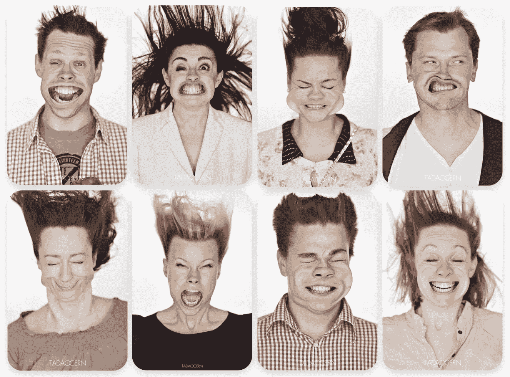

[https://habr.com/ru/company/odnoklassniki/blog/350566/](https://habr.com/ru/company/odnoklassniki/blog/350566/)

本文由[亚历山大托博尔](https://habr.com/ru/users/alatobol/)用俄语原创，发表于 2018 年 3 月 7 日，habr.com。

2018 年，每个学生甚至每个高中生都做了一个带有人脸识别的宠物项目。如果数据集不是一百万人，而是:

*   **330** 百万用户账户
*   每天有 20 万张照片被上传
*   **0.2** 秒是您可以在每幅图像上花费的最长时间
*   您的硬件有限

在本文中，我们分享了我们在社交网络 [OK 中开发和部署人脸识别系统的经验。Ru](https://ok.ru/) 。

在本文中，我们分享:

*   算法背后的数学
*   实施的细节
*   部署的结果
*   我们用来推广我们的解决方案的公关活动“StarFace”。

# 问题

ok.ru 有 3.3 亿用户账户，总共包含 300 亿张图片。

ok.ru 的用户每天上传 2000 万张照片。其中 900 万张照片至少有一张脸。我们总共有 2300 万张脸。平均每张图片有 2.5 张脸。

用户可以在照片上给人贴标签，但他们不会这么做。我们的团队决定建立一个解决方案，自动标记图像中的人。如果用户知道其他人何时与她一起上传图像，这将是更好的用户体验。

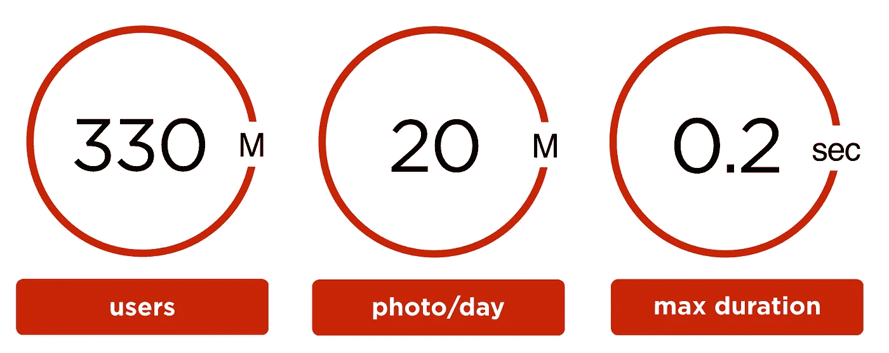

我们希望用户在上传照片的同时确认面部标签。因此，在最坏的情况下，处理时间不会超过 200 毫秒。

# 人脸识别管道

## 图像上的人脸识别

用户从客户端上传图像:浏览器、装有 iOS 或 Android 的手机。在这之后，图像通过面部检测器。

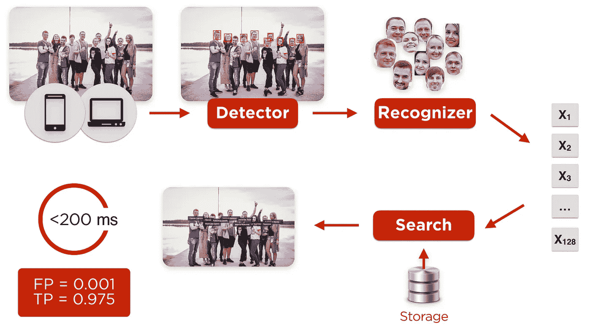

人脸识别

要运行自动面部识别，我们需要建立每个用户的面部轮廓并填充数据库。

## 面部轮廓的创建

一般来说，要建立面部轮廓，只有一张照片就足够了。个人资料图片并不总是足够的。用户喜欢把集体照片或名人的照片放在那里。

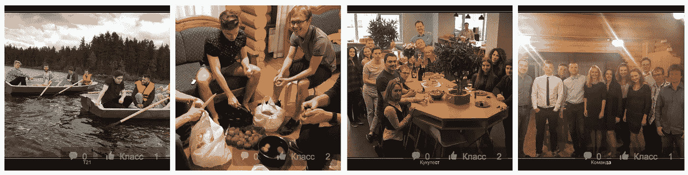

硬侧写

让我们考虑一个只有群组图片的用户。如果我们知道他的性别和年龄，并且已经建立了朋友档案，我们就可以推断出档案的所有者。

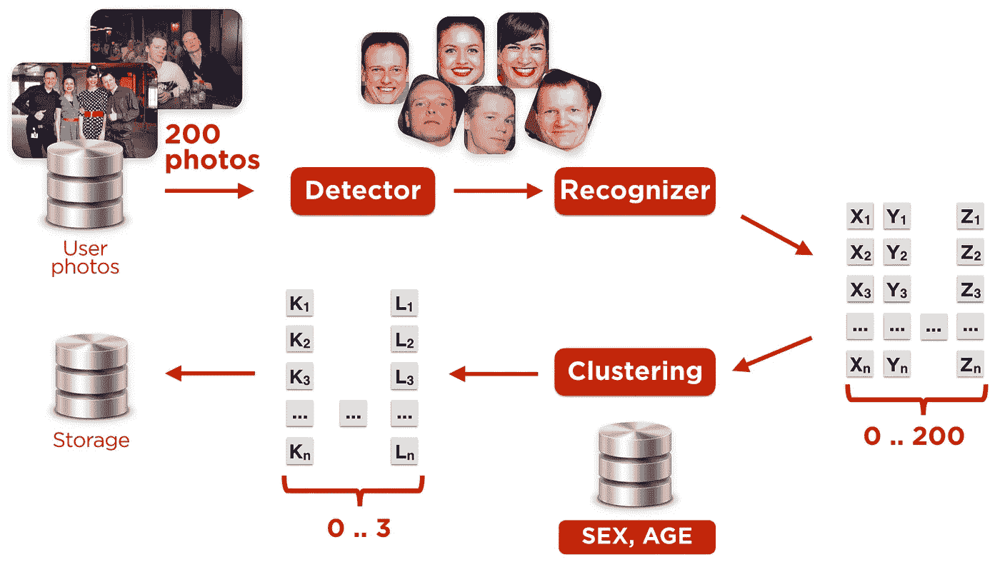

建立用户配置文件的过程

## 为了建立档案，我们:

第一步:只使用高质量的图片。

如果用户有很多高质量的照片，我们使用最好的 100 张。为了评估我们检查的图像的质量

*   用户标记了任何人吗？
*   照片有关于相机类型的元信息吗？
*   在某个时候，用户将这张图片作为个人资料图片。

**第二步:在图像中寻找人脸。**

如果图像中有其他人，也没什么大不了的。

**第三步:计算每张人脸的嵌入向量。**

**步骤 4:执行嵌入向量的聚类。**

聚类的目标是找出哪个嵌入集对应于用户。照片里有亲朋好友。我们使用 DBScan 进行聚类。

**第五步:找到“主”集群**

对于每个聚类，我们使用以下公式计算其权重:

1.  集群的大小。
2.  形成群集的图像的质量。
3.  如果照片上有脸部标签。
4.  在用户简档和图像中匹配年龄和性别。
5.  聚类的质心到朋友的聚类之间的距离。

我们使用线性回归来计算参数的系数。
正确计算年龄和性别是一项单独的任务，我们将在后面介绍。

要将集群称为“领导者”，我们需要他的权重比最近的集群的权重大一个裕量。我们在列车组上计算这个余量。如果我们没有找到“领导者”，我们重复这个过程，但使用更广泛的图像集合。有些用户我们有两个集群。有些家庭有一个已加入的个人资料。

**第六步:计算用户的“主”嵌入。**

用户的主要嵌入是前导聚类的质心。有许多方法可以用来建立质心。经过大量的实验，我们决定使用最简单的:所有嵌入集群的平均值。

如果一个用户有几个集群，我们为每个集群计算一个“主嵌入”。

在我们的实验中，我们处理了 80 亿张图片，处理了 330 个用户档案，并为其中的 3 亿张图片建立了嵌入功能。平均来说，我们用每个用户 26 张照片来创建一个档案。一般来说，我们可以每人使用一张图片。但是每个配置文件使用的图像越多，我们就越有信心我们建立的配置文件符合实际用户。
我们重复了几次重建 3 亿份档案的过程。原因是关于朋友的面部简档的信息提高了用户简档的质量。

在我们的实验中，我们处理了 80 亿张图片，处理了 330 个用户档案，并为其中的 3 亿张图片建立了嵌入功能。平均来说，我们用每个用户 26 张照片来创建一个档案。一般来说，我们可以每人使用一张图片。但是每个配置文件使用的图像越多，我们就越有信心我们建立的配置文件符合实际用户。

我们重复了几次重建 3 亿份档案的过程。原因是关于朋友的面部简档的信息提高了用户简档的质量。

# **人脸检测器**

2013 年推出的第一版人脸检测器 OK。它是基于第三方提供商的解决方案。该算法类似于[维奥拉-琼斯](https://en.wikipedia.org/wiki/Viola%E2%80%93Jones_object_detection_framework)。在接下来的几年里，这个解决方案变得过时了——基于 [MTCNN](https://arxiv.org/abs/1604.02878) 的现代方法显示出两倍的性能。我们决定跟随趋势，使用卷积神经网络(MTCNN)的级联。

对于旧的检测器，我们使用了 100 台“旧的”CPU 服务器。几乎所有现代人脸检测算法都使用卷积神经网络(CNN)，它在 GPU 上的性能最好。我们没有选择购买足够的 GPU:加密货币矿工购买了所有可用的 GPU。

> 译者的评论:2018 年夏天是加密货币的热潮。GPU 价格上涨了几次，即使有这么高的价格，也很难买到 GPU。

我们决定在旧的 CPU 上运行新的检测器。

为了检测用户上传的图像上的人脸，我们使用了 30 台机器组成的集群。我们在云中 1000 台低优先级虚拟机上执行的人脸检测和嵌入生成(对用户帐户的迭代)。

(我们的云解决方案的细节在文章[one-cloud—осуровнядата-центраводноклассниках](https://habrahabr.ru/company/odnoklassniki/blog/346868/)中有描述，作者是[оleg anastasiev](https://habrahabr.ru/users/m0nstermind/)。材料是俄文的！)

当我们分析我们的人脸检测器的性能时，我们发现了一个极端情况:级联的第一级允许太多的候选人进入第二级。探测器开始变慢。

例如，在这些照片中，每张照片需要 1.5 秒。

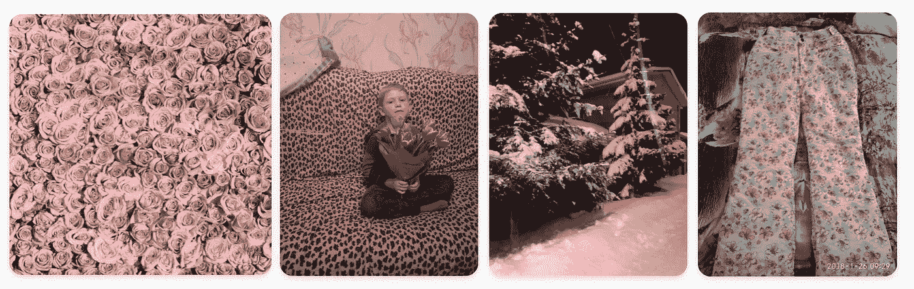

级联第一阶段后有很多候选人的例子。

为了解决这个问题，我们使用了通常照片没有太多人的假设。我们修改了渠道，在第一阶段后保留不超过 200 名最有信心的候选人。这种优化将最坏的预测提高了四倍。从 1.5 秒到 350 毫秒。

还有一些优化。例如，我们在第一阶段后用[斑点检测](https://www.learnopencv.com/blob-detection-using-opencv-python-c/)替换[非最大抑制](https://www.pyimagesearch.com/2014/11/17/non-maximum-suppression-object-detection-python/) (NMS)。修改后的推理时间减少了 1.4 倍，而质量没有损失。

我们需要承认在这个领域有很多进步，有像[face box](https://arxiv.org/abs/1708.05234)这样的作品。将来我们可能会更新我们的人脸检测解决方案。

# 人脸识别(嵌入提取)

我们试验了 [Wide ResNet](https://arxiv.org/abs/1605.07146) 、 [Inception-ResNet](https://arxiv.org/abs/1602.07261) 、 [Light CNN](https://arxiv.org/abs/1511.02683) 网络架构。《盗梦空间》( Inception-Resnet)略胜一筹，目前，它是我们的选择。

为了进行人脸识别，我们需要一个神经网络。一种选择是在网上找一个预先训练好的模特。另一种是我们自己训练它。

要训练网络，您需要训练和验证数据集。人脸识别是一项经过充分研究的任务。有数据集:MSCeleb，VGGFace/VGGFace2，MegaFace。问题是在它们上面训练出来的网络泛化能力不好。

我们门户网站上的面孔与研究数据集中的面孔截然不同:

1.  年龄分布不同。我们的影像里有孩子。
2.  不同的民族分布。
3.  我们有低质量和低分辨率的图片。我们有集体照。

为了克服第三点，我们可以使用图像增强。下采样和 JPEG 压缩转换将完成这项工作。

> 来自译者的评论:[albuminations](https://albumentations.ai/docs/api_reference/augmentations/transforms/)library 有许多可以模拟图像低质量的转换。

经过几次迭代后，我们集中于以下步骤:

**第一步:从~100k 的开放档案中下载照片。**
我们随机选择档案，尽量减少他们之间的好友联系。因此，我们假设每个人只会出现在一个个人资料中。

第二步:构建人脸嵌入。

我们使用 [Facenet](https://github.com/davidsandberg/facenet) 预训练网络。

**第三步:对每个账户进行人脸聚类。**

1.  我们不知道一个账号对应的图片上会出现多少人。因此，我们不应该使用“聚类数”作为聚类算法的输入。
2.  在理想情况下，我们期望得到非常相似的用户嵌入，形成一个密集的球体。实际上，情况并非如此。例如，我们可以为一个戴眼镜的人和一个不戴眼镜的人准备一件衣服。因此，基于质心的方法对我们不起作用。我们需要使用基于密度的。

基于这两个原因，我们使用了 [DBScan](http://scikit-learn.org/stable/modules/clustering.html#dbscan) 。我们手动选择超参数并进行可视化验证，这是非常标准的。对于主要的超参数“eps”，我们引入了一个基于账户人数的启发式方法。

**第四步:聚类过滤**

数据集中噪声的主要来源以及我们如何处理它们:

1.  对应不同人的聚类合并成一个聚类。这可能是由于 Face-Id 网络的限制或 DBScan 的基于密度的性质造成的。解决方案:如果两个或更多的脸来自同一个图像，我们删除这个集群。因此，喜欢自拍拼贴画的人没有成为我们数据集的一部分。修复减少了几次错误合并的数量，所以是值得的。
2.  几个集群可能对应同一个人。一个戴眼镜和不戴眼镜的人。一个人化妆与否。我们提出了以下解决方案:我们测量集群之间的距离。如果它低于一个阈值，我们合并集群。如果没有，我们删除其中一个集群。
3.  人脸检测器出错，检测到不是人脸的东西。幸运的是，这很容易解决。

**第五步:根据我们得到的数据对网络进行微调，然后回到第二步。**

重复 3-4 次，直到收敛。网络逐渐变得更好。在最后一次迭代中，网络变得如此之好，以至于我们的试探法不再增加价值。

我们认为多样性越多越好，并用其他东西扩展了我们新获得的 OKFace 数据集(370 万张脸，77000 人)。

我们的实验表明添加最多的是 [VGGFace2](http://www.robots.ox.ac.uk/~vgg/data/vgg_face2/) 。它大而多样(角度和闪电)。像往常一样，它由在谷歌上找到的名人照片组成。它在标签中有大量的噪声。幸运的是，通过 OKFace 上训练的网络来清理它，是一项相对简单的任务。

# 损失函数

嵌入学习的最佳损失函数是一个公开的问题。对于我们的工作，我们选择使用尽可能类似于生产中使用的损失函数。

我们使用余弦相似性来比较嵌入*“x”*和来自候选嵌入(用户和他的朋友) *c1，…，cn 的质心。*如果 cos(x，ci) ≥ mp，我们宣称确实是照片上的用户。

因此，我们希望:

*   对于“正确的”候选者 *t，cos(x，ct)* 大于余量值 *mp。*
*   对其他人来说，应该比 *mp 小。*

我们用下面的损失函数来惩罚对期望结果的偏离。在我们的实验中，这个效果最好。

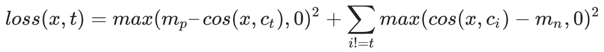

质心 *c1，…，cn* 是网络的参数，在梯度下降的训练过程中学习。

这个损失函数有它的问题。第一，当你从零开始训练它时，它没有很好地收敛。第二，调谐两个参数“ *mp* ”和“ *mn* ”比较繁琐。尽管如此，用这个损失函数进行微调允许我们获得比用其他函数更好的性能:[中心损失](https://www.researchgate.net/publication/308190438_A_Discriminative_Feature_Learning_Approach_for_Deep_Face_Recognition)，[对比中心损失](https://arxiv.org/abs/1707.07391)， [A-Softmax (SphereFace)](https://www.semanticscholar.org/paper/SphereFace%3A-Deep-Hypersphere-Embedding-for-Face-Re-Liu-Wen/366adbacaeea8c35435bf41134b78bb7aba73315) ， [LMCL (CosFace)](https://arxiv.org/abs/1801.09414) 。

# 值得吗？

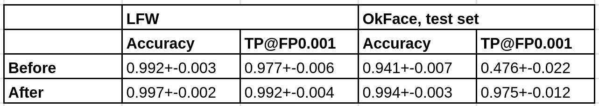

数字是 10 次测量的平均值和标准偏差。

对我们来说，一个重要的指标是 TP@FP:当假阳性的数量固定时，我们正确识别的人的百分比。(表中为 0.1%)

由于每 1000 人中有一个错误的限制，并且没有微调，我们只能正确地识别出一半的人。

# 错误人脸检测的最小化

有时人脸检测器会在没有人脸的地方发现人脸。(占检测结果的 4%)。

列车组产生这种“噪音”是不可取的。当我们要求用户“把名字”放在玫瑰花束上或地毯中间时，这是一种糟糕的用户体验。

最直接的解决方法是在人脸检测器的训练集中添加一组不包含人脸的图像。

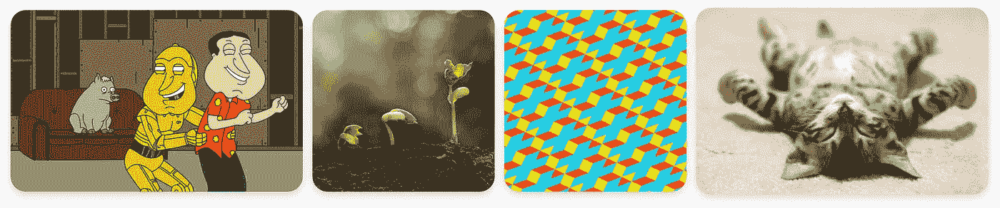

我们决定用不同的方法解决这个问题。

1.  从网上收集一些不包含人脸的图片。
2.  创建随机作物，构建嵌入，并对它们进行聚类。我们有 14 个集群。
3.  如果人脸的嵌入位置靠近“非人脸”聚类的质心，我们可以得出结论，建议的人脸不是人脸。
4.  庆祝我们的方法。

所描述的模式可以被实现为在嵌入之上具有 14 个隐藏单元的双层网络。

奇怪的是，人脸识别网络只向嵌入空间的几个区域发送各种非人脸图像。

# 每个人都撒谎或者如何在一个社交网络中找到这个人的真实年龄和性别

通常，用户不会显示他们的年龄或者写错号码。为了推导出用户的正确价值，我们使用了朋友图。通常，用户的年龄位于其朋友年龄的最大聚类中。我们从名字和姓氏推断出的性别。

维塔利·胡多巴绍夫在他的演讲中讲述了细节[узнатьаквозрастчеловекавсоциальнойсети，дажееслионннетан](https://ok.ru/video/313332866731)。讲座是用俄语进行的。)

所有的内部基础设施都没问题。Ru 在 Java。因此，我们管道的所有组件都包装在 Java 中。人脸检测器和人脸识别器用 Java API 在 TensorFlow 中进行推理。人脸检测器在 CPU 上工作。它足够快，并且在现有硬件上运行良好。对于识别器，我们安装了 72 个 GPU。在 GPU 上运行 Inception Resnet 比在 CPU 上运行效率更高。

为了存储嵌入，我们使用 Cassandra。我们所有用户的嵌入总容量约为 300Gb，因此为了快速访问，我们添加了缓存。我们将缓存实现为离堆。

(细节由[安德烈·潘金](https://habrahabr.ru/users/apangin/):[использованиеразделяемойпамятив爪哇и堆外кеширование](https://habrahabr.ru/company/odnoklassniki/blog/148139/) 的文章描述。俄语)

我们建立的管道每天可以处理多达 10 亿张照片进行迭代。同时，我们处理用户上传的图片。每天约 2000 万。

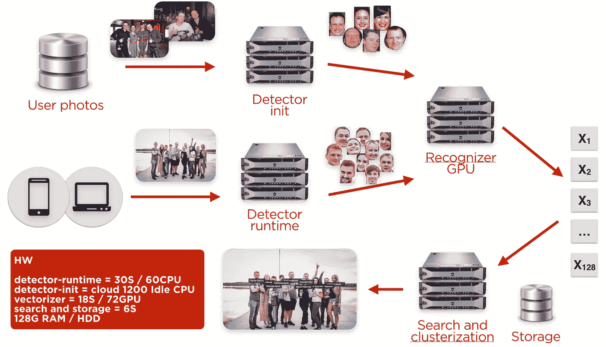

# 结果

我们实现了一个基于社交网络真实数据训练的系统。它是用有限的资源训练出来的，表现出很好的效果。

建立在真实 OK.ru 数据上的数据集的识别质量是 TP=97.5%，FP=0.1%。处理一幅图像的平均时间是 120 毫秒，第 99 个百分点低于 200 毫秒。这个系统是自我完善的。使用标签的图像越多，用户的人脸嵌入轮廓越好。

现在，上传之后，我们在图片上找到的用户会收到一个通知。他们可以确认建议的自动标签，或者如果他们不喜欢该图片，可以将其删除。

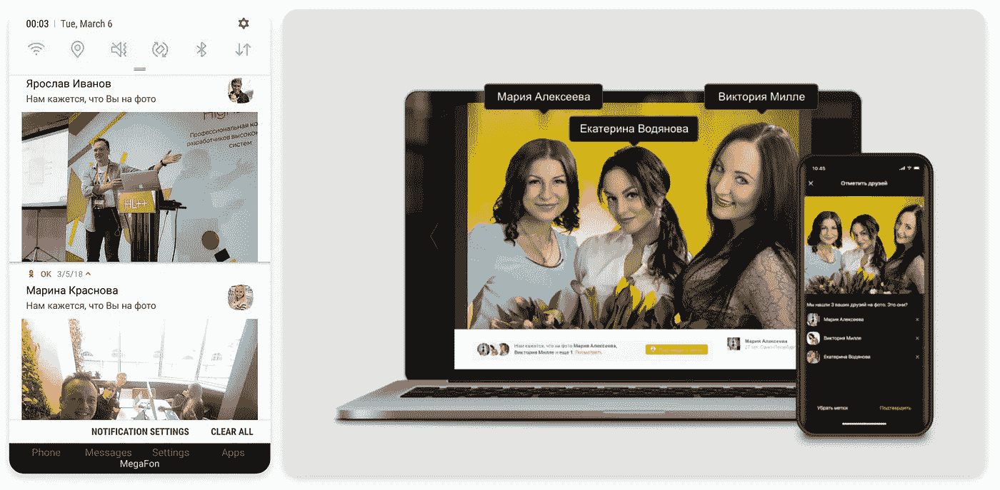

自动识别使更新提要的浏览量增加了两倍，点击量增加了三倍。用户对新功能的兴趣是显而易见的。我们计划用一个更好的用户界面和像 Starface 这样的新应用程序来进一步改进它。

关于 UX 的视频。(俄语)

# Flashmob StarFace

为了向用户介绍新功能，OK.ru 发起了一项挑战。用户上传他们与在 OK.ru 拥有活跃账户的俄罗斯体育、商业、媒体、著名博主和记者的照片。用户可以获得个人资料照片的徽章或订阅付费服务。([详情](https://insideok.ru/blog/odnoklassniki-zapustili-raspoznavanie-lic-na-foto-na-osnove-neyrosetey)。用俄语。)

在快闪活动的最初几天，用户上传了超过 10，000 张名人照片。用户上传了一张与明星的自拍，海报附近的照片，以及 PS 过的图片。

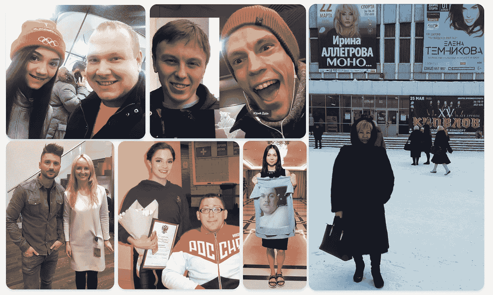

# 计划

管道中最耗时的部分是检测器。下一步是替换它或转移到 GPU。

我们可以尝试结合不同的人脸识别模型。如果它提升了模型的准确性，那就值得探索。

从用户的角度来看，下一步是识别视频中的人。我们还计划告知用户他们的“克隆档案”

欢迎在"[щи，илираспознане330млнлицнасосости400тотото/то](https://habr.com/ru/company/odnoklassniki/blog/350566/)