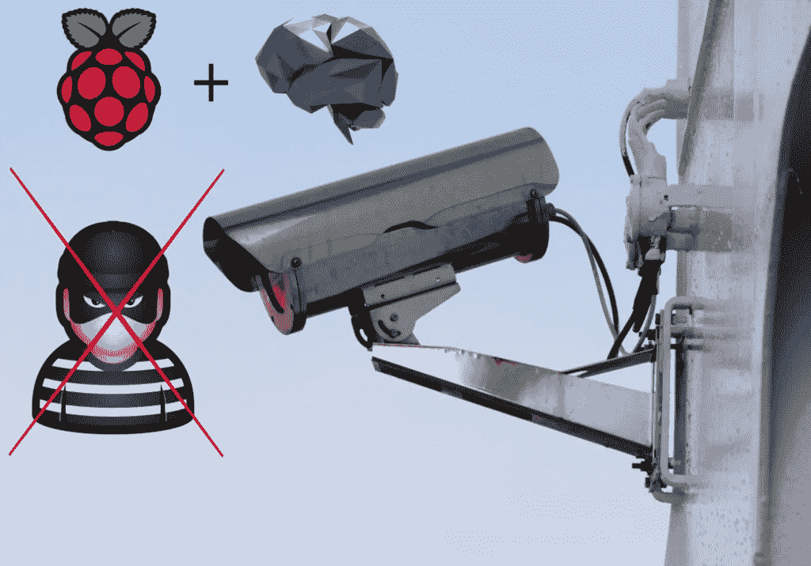
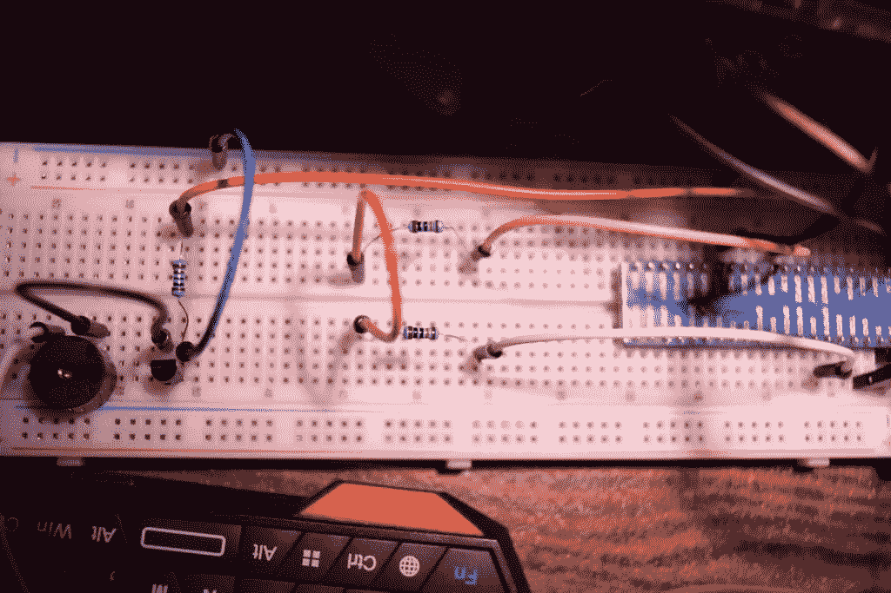
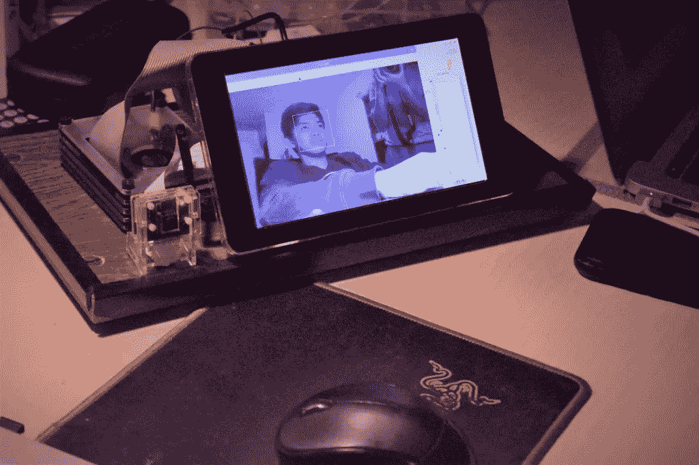

# 人脸识别/树莓派:你自己的安全警报系统

> 原文：<https://towardsdatascience.com/face-recognition-raspberry-pi-your-own-security-alarm-system-7c73d8af725b?source=collection_archive---------11----------------------->

(权利:自己的形象)

> 这个项目的目标是有你自己的安全系统在你的办公桌使用人脸识别和报警，我们将从头开始建立！

对于人脸识别，请参考这里的文章，我们在这篇文章的机器学习方面进行了深入研究，并参考[这篇文章](https://aitechfordummies.com/home/blog-post/rpi-make-your-own-alarm-and-buzzer/)中我们处理电子组件的更多细节。

## 硬件:警报响铃

在上一篇文章中，我们使用一个按钮来组织电路，并向晶体管发送电流，以打开和关闭蜂鸣器，这一次，我们需要一种更具编程性的方式来完成这项工作。这实际上可以简单地通过连接两个电阻来实现，如下图所示(图 1)。

图 1(权利:自己的形象)

下一件事是修改 face_recognition.py 的代码，在每次检测到 10 帧的未知人脸时添加警报蜂鸣器，这可以通过下面的代码来完成。

**检测到已知人脸时会刷新阈值**。

## 软件:人脸识别

对于人脸识别，一般的想法是结合 HaarCascade 人脸检测和局部二进制模式直方图(LBPH)方法。如前所述，我们不会在本文中深入探究这些主题，因为我们在这里解释它们。

由于 LBPH 需要从 HaarCascade 检测中提取灰度裁剪的人脸，我们将使用该检测来拍摄用户的多张照片，以便我们稍后识别用户。这是这部分的源代码，我们很快会解释。

我们拍摄 5 张照片，由人脸检测模型检测。如果可能的话，这些图片应该尽可能地互不相同。

现在到了人脸识别部分，这里是 face_detection.py 和 face_recognition.py 的源代码。

面部检测是标准的:我们输出裁剪的灰度面部和边界框。而对于认知，我们可以评论和任意做出多种事情:

*   我们估计置信度为 65。这个标量实际上是一个违反直觉的值，因为它表达了图片之间的差异，(在 LBPH 的文章中解释了)，因此它越高，我们越不自信。
*   我们还决定将任何相似度不小于 65 的人(与数据库中的任何人)视为未知。
*   在连续 10 次未知检测之后，我们将认为被检测的人是不在数据库中的人，因此是局外人，所以我们拉响警报。

## 结果:两部分的结合

如前所述，您需要做的是运行 get_faces.py。

图 2(权利:自己的形象)

在运行 get_faces.py 之后，你应该准备好让你的脸被识别了。如果您想向数据库中添加更多的人，只需再次重复 get_faces.py 步骤。

现在，通过运行 main.py 脚本，应该可以部署整个项目了。现在，当小偷来到你的电脑或房间时，你就会知道了！这是我们自己的结果(视频 1 ),供您参考。

[https://aitechfordummies . com/WP-content/uploads/2020/03/video . MP4](https://aitechfordummies.com/wp-content/uploads/2020/03/video.mp4)

完整的源代码和说明可以在这个[库](https://github.com/miki998/IoT_security_system)上找到。

感谢阅读，如果你喜欢，请记得说出来，或者看看我们的其他文章。你可以在我们的[网站](http://aitechfordummies.com)上找到我们的文章！此外，点击这个[链接](https://direct-link.net/91830/aitechfordummies)(指向联盟计划)真的会帮我解决问题！您只需完成一些快速任务(只需等待和激活通知)，所有这些将真正帮助我了解更多未来的硬件相关内容！