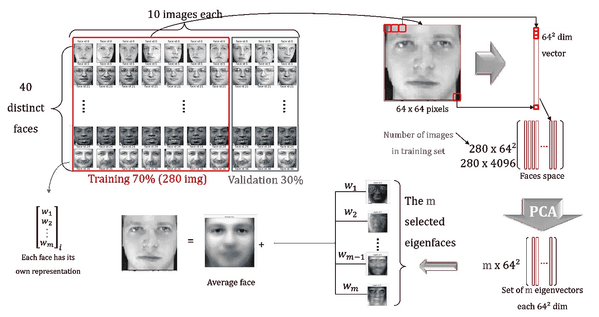

# 人脸识别

> 原文：<https://towardsdatascience.com/face-recognition-using-deep-learning-b9be73689a23?source=collection_archive---------5----------------------->

基于 PCA 和深度学习的人脸识别

我们将学习如何使用带有三重损失函数的预训练神经网络进行人脸识别。

# 介绍

由于计算机的强大功能提高了效率，图像内容分析和模式识别是当今迅速扩展的应用领域。

尽管文献中提出的系统在执行人脸识别任务时变得更加健壮、可靠和高效，但是该领域中的几个真正的技术和应用方面经常被省略，或者被非常简化，使得对其性能的正式和完整的使用远不是最终的解决方案。

在这项工作中，在人脸识别领域已经证明了良好结果并提供了良好方法的几项科学贡献正在考虑进行一些修改，以便选择最有效的解决方案，并确保与最先进的技术相比，识别性能非常有趣

我们想开发一个人脸识别系统，将在课堂上作为出勤系统使用，以标记讲师和学生的存在。

# 数据集

我们将使用两个不同的数据集，一个用于 PCA 方法，另一个用于 CNN 方法的自定义人脸数据集。

## Olivetti 数据集

[https://scikit-learn.org/0.19/datasets/olivetti_faces.html](https://scikit-learn.org/0.19/datasets/olivetti_faces.html)

Olivetti 是剑桥美国电话电报公司实验室在 1992 年到 1994 年间制作的人脸图像数据集。它包含 40 个不同的人的 10 个不同的图像和 400 个面部图像。

除了图像具有相同背景和相同尺寸的事实之外，图像被转换为灰度级，并且像素值从 0 缩放到 1。

这个数据集将是我们接下来研究的主要参考。测试和训练子集将从中产生。

Olivetti 数据集的不同面

当显示每个文件夹的 10 张图片时，我们可以看到这 10 张图片包含了被摄对象不同的面部表情和光照。

Olivetti 数据集中每个受试者 10 张脸

由于我们的机器学习模型需要向量，我们使用 numpy reshape 函数将我们的数据从(400，64，64)图像阵列转换为(400，4096)向量。

然后，我们将数据分为训练和测试:每个对象 70%或 7 张图像作为训练，每个对象 30%或 3 张图像作为测试子集。

## 制作数据集

我用我的照片和我的三个同事的照片，以及我最喜欢的连续剧“La Casa De Papel”中的一些知名演员，制作了一个由 10 个主题组成的数据集，每个主题大约有 10 张照片。

一个由 10 个受试者组成的数据集，每个受试者有大约 10 张图片

# 方法学

我们的目的是制作一个需要尽可能少的训练数据的人脸识别系统。这种约束背后的主要原因是，对于管理者来说，用每个学生的一个或几个图片来训练模型比必须为同一个人制作具有许多图像的大型数据集更有用。

我们将比较两种主要的人脸分类模型，PCA 降维和预训练的 CNN。

要执行面部识别，将遵循以下步骤:

*   检测图像中包含的所有人脸(人脸检测)。
*   裁剪人脸并提取其特征。
*   应用合适的面部识别算法将面部与学生和讲师的数据库进行比较。
*   提供记录所识别的服务人员的文件。

# 利用主成分分析和不同分类器进行人脸识别

以下研究的目的是使用六种不同的分类模型来执行面部识别，以了解哪一种模型是用作考勤系统的最佳候选模型。

## [主成分分析](https://fr.wikipedia.org/wiki/PCA)

第一步是通过移除这些人脸之间的任何共同特征来标准化训练集的所有人脸，以便每个人脸只留下其独特的特征。这将通过从每个面部移除平均面部(数据集上的像素的平均值)来完成。

我们的图像向量将包括每个图像的 64×64 = 4096 个分量。这些向量将通过对齐像素将二维图像转换成一个向量来创建。

从数字的角度来看，为了表示这样的图像，大量的组件可能被夸大了。为了减少数据的大小，我们将应用 PCA 方法来只选择图像的主要成分。

由于我们的人脸数据中有许多维度，PCA 的使用使得能够恢复或移除最相关的分量，并寻找捕获最大方差的方向，从而我们可以仅获得 m 个最有代表性的分量。

当对我们的数据使用分类器时，将根据获得的最佳准确度来选择分量的数量 m。该过程包括循环几个分量，并为每个指定数量的主分量构建 PCA 模型。然后，我们将构建一个分类器，并根据混淆矩阵计算准确度，以获得可以从中选择最佳组件数量的图。

一旦选择了 m 个[特征脸](https://fr.wikipedia.org/wiki/Eigenface*)，我们就可以使用这些特征脸从训练集中复制任何一张脸，如图所示。

在从训练集中去除平均人脸后，我们将 2D 图像转换成矢量。然后我们应用主成分分析挑选 m 个最有代表性的成分。一旦选择了 m 个特征脸，就有可能使用这些特征脸从训练集中再现任何脸。

来自训练集的每个人脸可以被投影为 m 个所选特征脸的加权和，这是特征向量空间中给定人脸加上平均人脸的表示。与每个特征脸相关联的权重表示该特征脸对原始脸的再现的贡献。

一旦训练集的所有人脸被转换成它们相应的权重向量，我们就能够通过在特征空间中表示它们来再现训练人脸。

但是，如果我们想要识别一个新面孔，并将其与训练集中的相应主题进行匹配，该怎么办呢？

## **识别一张陌生的脸**

为了识别未知的人脸，我们执行已经应用于训练图像的相同步骤。我们首先对这张脸进行归一化(去掉平均脸)并将其转换成一个矢量。然后，我们将人脸向量归一化到我们在使用 PCA 之前计算的特征空间上，这意味着将未知人脸表示为 m 个特征脸的组合。

一旦我们获得了未知人脸的权重向量，下一步将使用欧几里德距离作为度量，将其与我们训练集的所有权重向量进行比较。

如果两个向量之间的距离大于某个阈值，我们会说这是一张未知的脸，否则，我们会看到对应于最小距离的人，并将他识别为这个人。

用主成分分析法识别未知人脸

## 使用不同的分类器

一种更稳健的技术是使用分类器(如 SVM 或 KNN ),而不是将输入与训练集中最接近的人脸进行匹配。

图像降维后将引入的分类器有:

[**线性判别分析**](https://en.wikipedia.org/wiki/Linear_discriminant_analysis) **:** 它是统计学、模式识别、机器学习中使用的一种方法，用来寻找表征或区分两类或两类以上对象或事件的特征的线性组合。所得到的组合可以用作线性分类器，或者更常见的是，在稍后的分类之前用于维度减少。

[**逻辑回归**](https://en.wikipedia.org/wiki/Logistic_regression) **【一对一】:**由于我们在一个数据集中会有许多不同的类或主题，我们每次构建模型时都会将属于一个类的数据视为正值，而将属于其余类的数据视为负值。我们将重复这个过程，直到我们建立了尽可能多的模型。

[**高斯 NB**](https://en.wikipedia.org/wiki/Naive_Bayes_classifier) **:** 这是一种基于应用贝叶斯定理，以条件独立性为“朴素”假设的学习算法。在不检查特征的似然性是否为高斯的情况下，我们将采用这一假设，并查看结果在准确性方面是否可接受。

[**KNN**](https://en.wikipedia.org/wiki/K-nearest_neighbors_algorithm)**:**它是一种非参数学习算法，被称为“懒惰”，也就是说它不使用任何数据点来生成模型。训练在分类和测试阶段完成，因为算法仅寻找与其他数据点的特征相似性。K 是邻居的数量，它必须是奇数以避免票数相等。

[**决策树**](https://en.wikipedia.org/wiki/Decision_tree) **:** 由于图像分类只是模式识别中的一个特例，决策树可以用于此目的。

[**SVM**](https://en.wikipedia.org/wiki/Support-vector_machine)**:**支持向量机是这样制造的，它们可以执行两类分类。它们可以适用于以非常有效的方式执行 K 分类。

分类工作流程

## 主成分分析中成分数量的选择

下图显示了主成分数量与 SVM 径向基函数(RBF)核分类器精度的关系。

**SVM 径向基函数(RBF)核分类器相对于 PCA 组件数量的准确性**

似乎只用 40 个元件，我们就能获得用 100 个或更多元件获得的同样精度。这意味着我们可以减少计算时间，同时保持模型的相同性能。在下文中，我们将使用 40 个组件。

## 分类器比较

在 PCA 阶段之后，使用选定数量的成分，我们将我们的数据引入第 3 节中列出的六个不同的分类器，并计算每个分类器的准确度。

比较不同分类器的准确度

根据上述结果，线性判别分析和逻辑回归似乎具有最好的性能，并且可以被认为是对于我们的分类问题的最佳选择。然而，需要许多数据点来预测具有不同亮度的不同图片。

## 结论

在 Olivetti 数据集上获得了 93%的最大准确度，即使图像被相对良好地定位和照明。对于不允许出错的考勤系统来说，这种低性能是不能容忍的。此外，对于这项技术，我们需要许多图像(大约 10 张)来训练模型。

另一方面，让我们不要忘记，我们的考勤系统必须能够服务于一个大的大学，学生的数量会随着时间的变化而变化。但是，每次必须向数据库中添加新学生时，都需要重新训练 PCA 模型。

# 使用深度度量学习的面部识别

另一种执行面部识别的方法包括使用名为 Inception 的深度[卷积神经网络](https://en.wikipedia.org/wiki/Convolutional_neural_network)架构，该架构负责在[ImageNet](http://www.image-net.org/)2014 年大规模视觉识别挑战赛(ILSVRC14)中设置分类和检测的新技术状态。

盗梦空间的名称来源于林等人的《网络论文》中的网络，并结合了电影《盗梦空间》中著名的网络迷因《我们需要更深入》。

在这项工作中，我们将使用一个初始架构的变体。该模型包括具有 128 个隐藏单元的全连接层，随后是卷积基础之上的 L2 归一化层。

最上面的两层负责从图像中创建 128 维嵌入。

深度度量架构，CNN 被训练成将图像转换成 128 d 矢量。

## 深度度量学习架构

目的是让 CNN 学会将每个图像转换成一个向量，使得相同身份的所有人脸之间的欧几里德距离很小，而来自不同身份的一对人脸之间的距离很大。

更准确地说，给定一对不同身份的图像，我们希望距离至少大一定程度，但是给定两幅相同身份的图像，我们希望它们的编码相似，因为它们都表示同一个人。

应保持的余量α必须符合以下公式:

**d(A，P)+ α ≤d(A，N)**

为了训练神经网络，我们从数据集生成三个一组的图像。然后，在定义了我们想要最小化的三元组损失函数之后，我们使用梯度下降来调整 CNN 的参数，以便学习对相同类别的两个图像给出小距离而对不同类别的图像给出大距离的编码。

训练 CNN 的三联体技术

要最小化的三重损失函数定义如下:

我们将使用 keras-Openface 项目中可用的预训练模型，并调整神经网络的权重，以便检查我们的 alpha-margin (α=0.2)，而不是从头开始训练 CNN 模型，这将需要数百万张图像。

## 面部检测

在将我们的图像输入神经网络之前，必须找到可用的人脸，并对其进行裁剪和对齐。

[**dlib**](http://dlib.net/) 库提供了**猪+SVM** 人脸检测器，还提供了一个预训练的 **CNN** 人脸检测器，可以使用 GPU 或使用 CPU 运行。

如下图所示，对于包含 9 张人脸的相同样本图像，我们使用 CPU 尝试了两种人脸检测器。两个提取器给出了相同的结果，但是 CNN 需要大约 2 分钟，而猪只需要 6 秒钟。安装 CUDA，编译 dlib 库在 GPU 上运行后，CNN 能够运行快 10 倍。

CNN 面部检测器性能

人脸检测将使用 Dlib 的 CNN 模型进行，因为文档坚持认为与 HOG 人脸检测器相比，CNN 具有较高的准确性。

用对齐的人脸图像训练预训练模型。但通常并不是照片中的所有人脸都没有正确对齐。因此，在将裁剪后的人脸图像输入神经网络之前，必须对其进行对齐，以实现人脸识别任务的高精度。

同样，dlib 有一个预先训练的模型，用于预测和找到一些面部标志，然后将它们转换到参考坐标。

图像预处理

## 使用 CNN 和距离度量来比较面部

最后，我们可以使用 CNN 从对齐的图像中提取 128 维的人脸向量。在 128 维空间中，欧几里德距离直接对应于人脸相似性的度量。

在使用预训练的 CNN 变换所有数据集图像之后，我们通过相同的过程输入我们想要识别的图像，以获得相似的 128-d 向量(嵌入)。人脸的相似性可以用欧氏距离来度量。

下图以图形方式显示了此过程的工作原理，并举例说明了该算法在相似和不同人脸之间测量的距离。

锚阳性对之间的距离小于其锚阴性对之间的距离(0.59 < 1.43)

## 最佳距离阈值

为了能够辨别两张脸是否属于同一个人，必须确定距离阈值。为了找到阈值的最佳值，将使用我们的数据库图像测试不同的值。我们将绘制不同阈值距离值的准确度图，并选择最佳值。

从下图中，将选择值 d=0.72，因为它给出了最佳精度(96.8%)。

不同阈值距离人脸识别的 F1 分数和准确率

## 使用分类器

不使用最小距离来确定检测到了哪些面部，而是使用 KNN 或 SVM 分类方法更有效，其中 K 将被取为等于 5。

用来自数据集的 50%的标记图像来训练分类器，并且在剩余的图像上进行测试，并且与 SVM 分类器进行比较。

使用 KNN 和 SVM 分类器的精度

在研究的其余部分，将使用 KNN 分类器。

## 数据可视化

由于可视化具有 128 维的嵌入图像不是一件非常容易的任务，我们将使用**t-分布式随机邻居嵌入(**[**t-SNE**](https://en.wikipedia.org/wiki/T-distributed_stochastic_neighbor_embedding)**)**，这是一种由 Laurens van der Maaten 和 Geoffrey Ginton 开发的用于非线性降维的机器学习算法。这种方法将允许我们在二维的低维空间中看到我们的图像的分布。

在下图中， [t 分布随机邻居嵌入](https://en.wikipedia.org/wiki/T-distributed_stochastic_neighbor_embedding) (t-SNE)应用于 128 维嵌入向量，以便将数据集汇总到 2D 空间。除了少数异常值之外，身份聚类被很好地分开。

受试者的 t-SNE 显像

# 结论以及与其他先进模型的比较

我们已经看到 PCA 作为考勤系统的准确率非常低，并且它需要许多人脸作为输入数据进行训练。此外，每次我们有一个新的学生，模型必须从零开始重新训练，参数(PCA 的组件数量)必须再次确定哪个不适合项目的要求。

另一方面，预训练的用于面部识别的 Inception CNN 模型用我们的数据集进行了调整，给出了非常好的性能(在我们的自定义数据集上有 97%的准确率)，特别是当我们添加了 KNN 方法时。此外，这个 CNN 不需要有很多图片，因为我们可以在只有一个参考(训练)图片和另一个测试图片的 128 维空间中测量人脸之间的距离。此外，一旦被训练，当新生入学时，不需要再次寻找 CNN 的参数。

出于这个项目的目的，许多其他 CNN 模型都在同一个数据集上进行了训练和测试，但是在前面的章节中只描述了初始模型。使用 ResNet 网络(29 卷积层预训练模型)获得了最好的准确性，并且它将是被选择使用的模型，因为它能够在我们的测试数据集中正确地检测所有人脸。

ResNet 网络是一个更深入的预训练网络，Inception 在一个包含超过 13000 张图像的公共数据集上实现了 99%的准确性，该数据集被称为“野生标记的人脸”。

下表显示了过去 5 年中一些最好的面部识别模型。我们可以看到，我们的模型可以与在相同数据集上测试的最先进的验证方法相媲美。

比较不同验证方法在野生数据集的标记人脸上测试的结果。最后一行是在第一部分取自“深度人脸识别:一项调查”时添加的——王美，魏宏·邓(2019)

# 密码

项目:在考勤系统中使用 CNN 进行人脸识别:

 [## GUI.zip

### 编辑描述

drive.google.com](https://drive.google.com/file/d/1F79R1GR_e4vkMm2bnsOyEbRo1qX3gAg6/view?usp=sharing) 

在 Olivetti 数据集上使用 PCA 进行人脸识别；

 [## Olivetti Dataset.ipynb 上的人脸识别

### 编辑描述

drive.google.com](https://drive.google.com/file/d/1522lW68pAW7ichHHzB9nV7u34gz5Rl-S/view?usp=sharing)