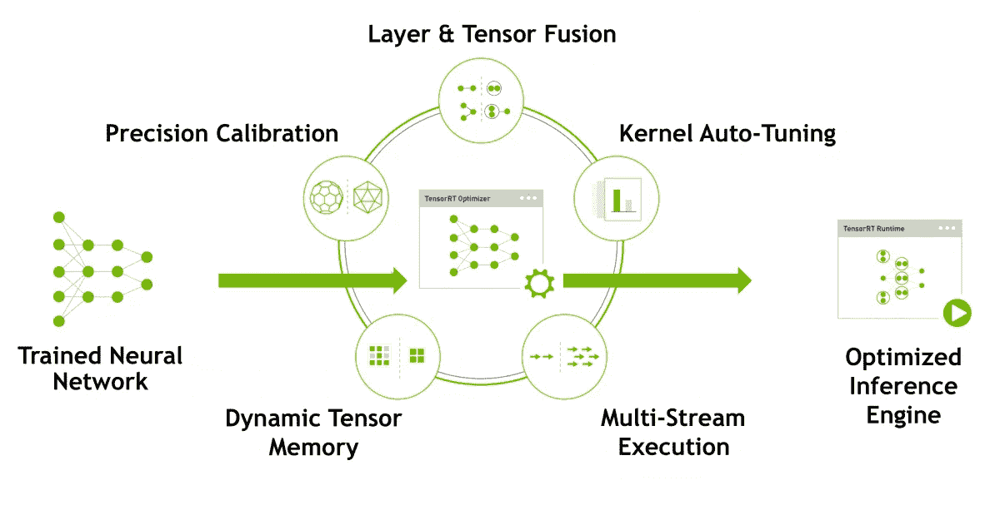

# 基于 TensorRT 的 Jetson Nano 人脸识别

> 原文：<https://towardsdatascience.com/face-recognition-using-tensorrt-on-jetson-nano-set-up-in-less-than-5min-7c00bf730085?source=collection_archive---------6----------------------->

## Jetson Nano 上 FP16 precision 中的 mtCNN 和 Google FaceNet

说到*人脸识别*有很多选项可以选择。虽然大多数都是基于云的，但我决定构建一个基于硬件的人脸识别系统，它不需要互联网连接，这使得它对机器人、嵌入式系统和汽车应用特别有吸引力。

**→** [**链接到 Github 库**](https://github.com/nwesem/mtcnn_facenet_cpp_tensorRT)

# 更新

存储库已更新(2020 年 9 月 18 日)，现在一切都可以与 Jetpack 4.4、Cuda 10.2、cudnn 8.0、TensorRT 7.x 和 OpenCV 4.1.1 兼容。

# NVIDIA Jetson Nano

来源:[https://developer . NVIDIA . com/embedded/jetson-nano-developer-kit](https://developer.nvidia.com/embedded/jetson-nano-developer-kit)

NVIDIA Jetson Nano 是一款面向计算密集型嵌入式应用的单板计算机，包括一个 128 核 Maxwell GPU 和一个四核 ARM A57 64 位 CPU。此外，单板计算机非常适合计算机视觉领域 **神经网络的**部署**，因为它以 5–10W 的功耗提供 472 GFLOPS 的 FP16 计算性能[来源](https://elinux.org/Jetson_Nano)。有许多教程可以确保轻松开始使用 Jetson 平台，例如 [Hello AI-World 教程](https://github.com/dusty-nv/jetson-inference)或 [Jetbot](https://github.com/NVIDIA-AI-IOT/jetbot) ，这是一个基于 Jetson Nano 的小型 DIY 机器人。**

# NVIDIA TensorRT

TensorRT 通过合并层和张量，为特定 GPU 选择最佳内核，并在保持精度的同时降低矩阵乘法的精度(FP16，INT8)，实现了在您最喜欢的 ML 框架(TensorFlow，Keras，PyTorch 等)中训练的优化机器学习模型。注意，对于 INT8 精度，需要额外的校准步骤来保持精度。由于这显著(至少在大多数情况下)减少了推理时间并提高了资源效率，因此这是在机器人、嵌入式系统(使用 GPU)、自动驾驶和数据中心部署机器学习模型的最终步骤。

来源:[https://developer.nvidia.com/tensorrt](https://developer.nvidia.com/tensorrt)

FP16 是什么意思？也被称为**半精度**。大多数框架中的机器学习模型使用 32 位精度进行训练。在 FP16 的情况下，经过训练的模型的精度会降低 16 位，或者对于 NVIDIA Jetson AGX Xavier，您甚至可以将模型转换为 int 8(8 位)。根据 NVIDIA 的推断，经过训练的模型的时间可以加快 100 多倍。

# mtCNN

[多任务级联卷积网络](https://arxiv.org/pdf/1604.02878.pdf) (mtCNN)是一种基于深度学习的人脸和地标检测方法，对头部姿势、光照和遮挡不变。在保持实时能力的同时，通过由粗到细的三阶段过程来计算面部和标志位置，这在面部识别场景中尤其重要。

使用 mtCNN 进行人脸和地标检测([来源](https://pypi.org/project/mtcnn/))

# 谷歌脸谱网

[谷歌的 FaceNet](https://arxiv.org/pdf/1503.03832.pdf) 是一个深度卷积网络，将 160x160 RGB 图像中的人脸嵌入到 128 维的潜在空间中，并允许对嵌入的人脸进行特征匹配。通过在数据库中保存人脸的嵌入，您可以执行特征匹配，这允许识别人脸，因为当前可见人脸嵌入的欧几里德距离将比其他嵌入更接近已知嵌入。

([来源](/a-facenet-style-approach-to-facial-recognition-dc0944efe8d1))

# 设置和代码

由于 Jetpack 附带了 Cuda、CudNN、TensorRT 和 OpenCV，因此这个项目的设置和构建不到 5 分钟。所以，不要害怕尝试它

**→** [**链接到 Github 仓库**](https://github.com/nwesem/mtcnn_facenet_cpp_tensorRT)

据我所知，这是 TensorRT 中第一个结合了 mtCNN 和 Google FaceNet 的开源 cpp 实现，我邀请您合作，从效率和功能方面改进该实现。

这个项目的设置包括:
- Jetson Nano 开发工具包
- Raspberry Pi Camera v2(或 Jetson Nano 支持的任何 USB 相机)
- *可选:* PWM 风扇，用于 CPU 和 GPU 的适当冷却
- *可选*:相机的某种相机支架

# 表演

最后，这是 Jetson Nano 在 640x480 (480p)中的人脸识别性能的概述:使用 mtCNN 进行人脸检测的
~ 60 毫秒+/- 20 毫秒
~ 22 毫秒+/-2 毫秒用于 facenet 推理