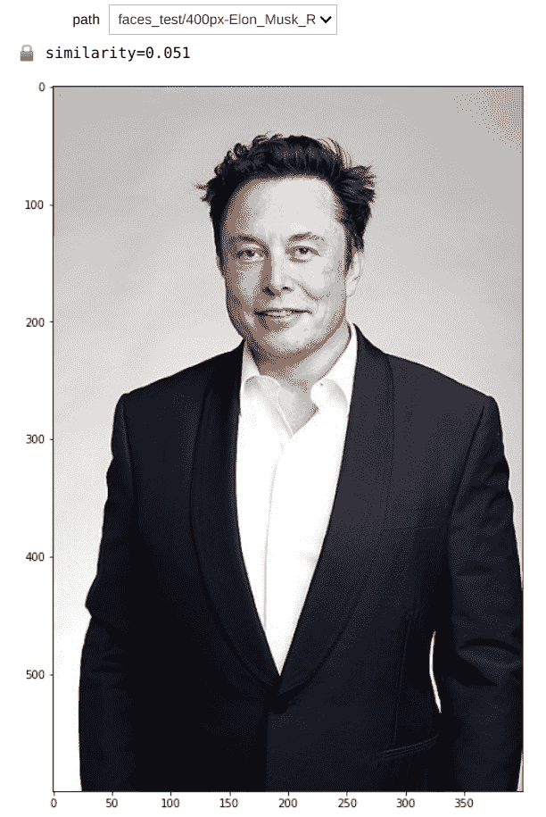

# 使用 2D 数据进行面部解锁

> 原文：<https://towardsdatascience.com/face-unlock-with-2d-data-684b11e5aee1?source=collection_archive---------62----------------------->


Eric TERRADE 在 [Unsplash](https://unsplash.com/s/photos/gioconda?utm_source=unsplash&utm_medium=referral&utm_content=creditCopyText) 上拍摄的照片。世界上最有名的脸！

## *深度学习方法*

所有代码都可以在[这里](https://github.com/FrancescoSaverioZuppichini/Face-Unlock)找到。这篇文章的互动版本可以从[这里](https://github.com/FrancescoSaverioZuppichini/Face-Unlock/blob/main/face_detection.ipynb)下载

今天我们要用深度学习来创建一个人脸解锁算法。为了完成我们的拼图，我们需要三个主要部分。

*   一种人脸查找算法
*   一种在向量空间中嵌入人脸的方法
*   比较编码人脸的函数

# 查找面孔

首先，我们需要一种在图像中找到人脸的方法。我们可以使用一种叫做 [MTCNN](https://arxiv.org/abs/1604.02878) (多任务级联卷积网络)的端到端方法。

就一点点技术背景，之所以叫*级联*是因为它是由多级组成的，每一级都有它的神经网络。下图显示了该框架。


图片来自[https://arxiv.org/abs/1604.02878](https://arxiv.org/abs/1604.02878)

我们依赖于来自 facenet-pytorch [repo](https://github.com/timesler/facenet-pytorch) 的 MTCNN 实现。

## 数据

我们需要图像！我把自己、莱昂纳多·迪卡普里奥和马特·德蒙的一些照片放在一起。

遵循 PyTorch 最佳实践，我使用`ImageFolder`加载数据集。我创建了`MTCNN`实例，并使用`transform`参数将其传递给数据集。

我的文件夹结构如下:

`MTCNN`自动裁剪和调整输入的大小，我使用了一个`image_size=160`，因为模型将利用该尺寸的图像进行训练。我还添加了`18`像素的空白，以确保我们包括了整张脸。

```
(tensor([[[ 0.9023, 0.9180, 0.9180, ..., 0.8398, 0.8242, 0.8242], [ 0.9023, 0.9414, 0.9492, ..., 0.8555, 0.8320, 0.8164], [ 0.9336, 0.9805, 0.9727, ..., 0.8555, 0.8320, 0.7930], ..., [-0.7070, -0.7383, -0.7305, ..., 0.4102, 0.3320, 0.3711], [-0.7539, -0.7383, -0.7305, ..., 0.3789, 0.3633, 0.4102], [-0.7383, -0.7070, -0.7227, ..., 0.3242, 0.3945, 0.4023]], [[ 0.9492, 0.9492, 0.9492, ..., 0.9336, 0.9258, 0.9258], [ 0.9336, 0.9492, 0.9492, ..., 0.9492, 0.9336, 0.9258], [ 0.9414, 0.9648, 0.9414, ..., 0.9570, 0.9414, 0.9258], ..., [-0.3633, -0.3867, -0.3867, ..., 0.6133, 0.5352, 0.5820], [-0.3945, -0.3867, -0.3945, ..., 0.5820, 0.5742, 0.6211], [-0.3711, -0.3633, -0.4023, ..., 0.5273, 0.6055, 0.6211]], [[ 0.8867, 0.8867, 0.8945, ..., 0.8555, 0.8477, 0.8477], [ 0.8789, 0.8867, 0.8789, ..., 0.8789, 0.8633, 0.8477], [ 0.8867, 0.9023, 0.8633, ..., 0.9023, 0.8789, 0.8555], ..., [-0.0352, -0.0586, -0.0977, ..., 0.7617, 0.7070, 0.7461], [-0.0586, -0.0586, -0.0977, ..., 0.7617, 0.7617, 0.8086], [-0.0352, -0.0352, -0.1211, ..., 0.7227, 0.8086, 0.8086]]]), 0)
```

完美，数据集返回一个张量。让我们想象一下所有的输入。它们已经被 MTCNN 图像标准化，最后一排的最后三张图像是我自己的自拍:)


我们数据集中的人脸，后三张是我自己的照片！:)作者图片

# 把…嵌入

我们的数据管道准备好了。为了比较人脸并找出两个是否相似，我们需要在向量空间中对它们进行编码，其中，如果两个人脸相似，与它们相关联的两个向量也相似(接近)。

我们可以使用在著名的人脸数据集之一上训练的一个模型，例如 [vgg_face2](http://www.robots.ox.ac.uk/~vgg/data/vgg_face2/) ，并使用分类头之前的最后一层(潜在空间)的输出作为编码器。

在这些数据集之一上训练的模型必须已经学习了关于输入的重要特征。最后一层(就在完全连接的层之前)对高级特征进行编码。因此，我们可以使用它来将我们的输入嵌入到一个向量空间中，希望在这个空间中，相似的图像彼此靠近。

具体来说，我们将使用在`vggface2`数据集上训练的 inception resnet。嵌入空间有`512`个维度。

```
torch.Size([8, 512])
```

太好了，我们有了`8`图像和`8`向量

# 类似

为了比较我们的向量，我们可以使用`cosine_similarity`来查看它们彼此有多接近*。余弦相似度将输出[-1，1]之间的值。在两个比较向量相同的简单情况下，它们的相似度是 1。所以越接近 1，越相似。*

*我们现在可以找到数据集中每对之间的所有距离。*

**

*显示数据集中所有面及其余弦相似性的热图。作者图片*

*很明显，我和马特或利奥不太相似，但他们有一些共同点！*

*我们可以更进一步，对嵌入进行主成分分析，并将图像投影到二维平面上*

**

*使用主成分分析将图像投影到 2D 平面上。作者图片*

*对这张图片要有所保留。我们将 512 维压缩为 2 维，因此我们丢失了大量数据。*

*好了，我们有办法找到人脸，看看他们是否彼此相似，现在我们可以创建我们的人脸解锁算法。*

*我的想法是取允许的人的`n`张图像，在嵌入空间中找到中心，选择一个阈值，看中心和一张新图像的余弦相似度是小于还是大于它。*

*来测试一下吧！*

**

*锁定。图片来自[https://www . timesofisrael . com/in-court-NSO-group-控告-Facebook-说谎-无视-国际法/](https://www.timesofisrael.com/in-court-nso-group-accuses-facebook-of-lying-disregarding-international-law/)*

**

*锁定。图片来自[https://en . Wikipedia . org/wiki/Elon _ Musk #/media/File:Elon _ Musk _ Royal _ society . jpg](https://en.wikipedia.org/wiki/Elon_Musk#/media/File:Elon_Musk_Royal_Society.jpg)*

*人们说我和《纸牌屋》里的里奥很像*

**

*锁定。图片来自[https://falauniversidades . com . br/ator-la-casa-de-papel-elite-afastado-por-depressao-Miguel-herran/](https://falauniversidades.com.br/ator-la-casa-de-papel-elite-afastado-por-depressao-miguel-herran/)*

*相似度得分比之前的图像高，所以我猜是真的！*

*让我们试试我自己的新自拍照*

**

*解锁。作者图片*

*成功了，我加入。*

# *结论*

*我们已经看到了一种仅使用 2D 数据(图像)来创建面部解锁算法的有吸引力的方式。它依靠神经网络在高维向量空间中对裁剪的人脸进行编码，其中相似的人脸彼此靠近。然而，我不知道模型是如何训练的，可能很容易骗过它(即使在我的实验中，算法运行良好)。*

*如果模型在没有数据增强的情况下被训练会怎样？那么，很可能，简单地翻动同一个人就能破坏潜在表征。*

*一个更强大的训练程序将是一个无人监管的程序(类似于 [BYOL](https://arxiv.org/abs/2006.07733) )，它严重依赖于数据增强。*

*感谢您的阅读。*

*弗朗西斯科*

*不明确的*

*【http://github.com】最初发表于[](https://gist.github.com/a484f089227c8d76ba015b0d7c9e15d7)**。***