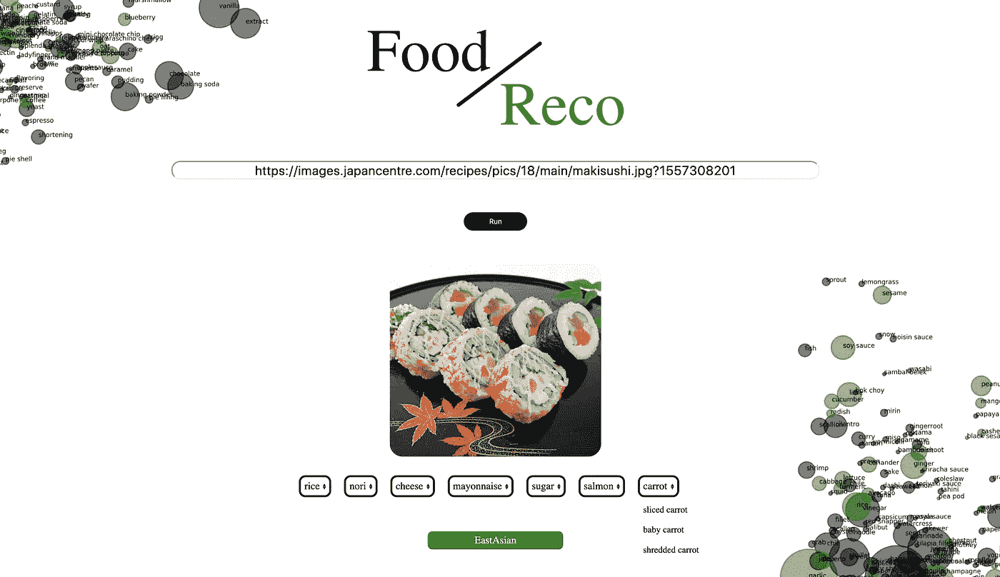
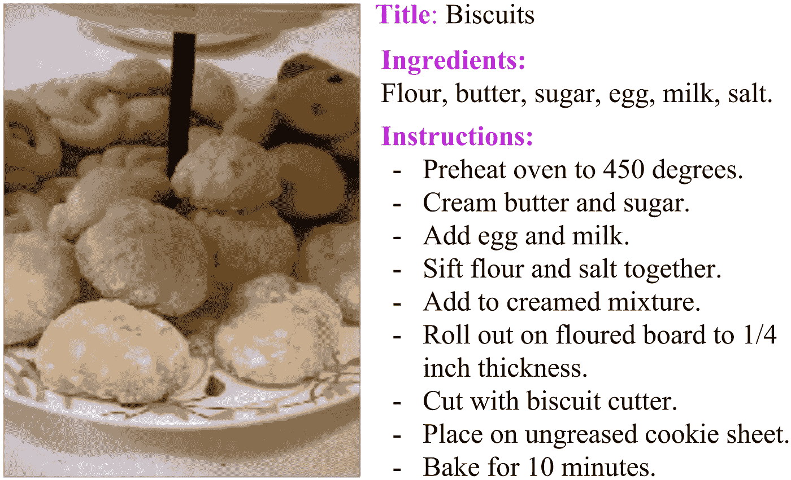
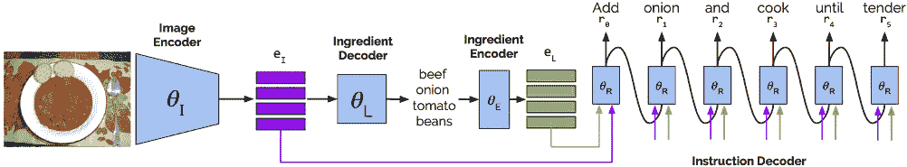
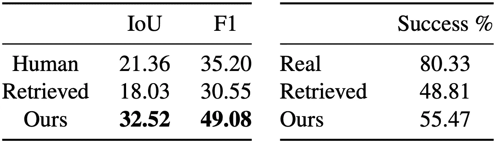

# 脸书逆烹饪算法

> 原文：<https://towardsdatascience.com/facebook-inverse-cooking-algorithm-88aa631e69c7?source=collection_archive---------76----------------------->

## 比人类更好地从图像中预测完整的食谱

**图 1** 预测寿司餐中运行逆烹饪算法后的配料[3]

这种食谱检索算法是由脸书人工智能研究所开发的，它能够直接从图像中预测配料、烹饪说明和食谱标题(图 2) [1]。

**图 2** 逆向烹饪算法生成菜谱的例子【1】

过去，算法一直使用基于嵌入空间中图像相似性的简单配方检索系统。这种方法高度依赖于学习嵌入的质量、数据集大小和可变性。因此，当输入图像和静态数据集不匹配时，这些方法就会失败[1]。

反向烹饪算法不是直接从图像中检索食谱，而是提出了一个流水线，其中有一个中间步骤，首先获得配料集。这使得指令的生成不仅要考虑图像，还要考虑配料(图 1) [1]。

**图 3** 用多个编码器和解码器生成烹饪指令的逆向烹饪食谱生成模型[1]

这种方法的主要成就之一是在试图从图像中预测成分时，呈现出比基线配方检索系统[2]和普通人[1]更高的准确性。

**图 4** 左图:通过检索方法[2]、脸书方法(我们的)和人类获得的成分的 IoU 和 F1 分数。右图:根据人类判断的配方成功率[1]

反向烹饪算法包含在一个食物推荐系统应用程序中，此处[发布](/building-a-food-recommendation-system-90788f78691a)。基于 web 应用程序中预测的成分，向用户提供了几个建议，例如:不同的成分组合(图 1)。

# 参考

[1] A. Salvador，M. Drozdzal，X. Giro-i-Nieto 和 A. Romero，《逆向烹饪:从食物图像生成食谱》，*计算机视觉与模式识别，* 2018。

[2] A. Salvador，N. Hynes，Y. Aytar，J. Marin，F. Ofli，I. Weber 和 A. Torralba，“学习烹饪食谱和食物图像的跨模态嵌入”，*计算机视觉和模式识别，* 2017。

[3]走向数据科学，“构建美食推荐系统”，2020。【在线】。可用:[https://towards data science . com/building-a-food-recommendation-system-90788 f 78691 a](/building-a-food-recommendation-system-90788f78691a)。[2020 年 5 月 18 日获取]。