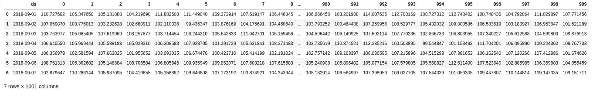

# Python 中时间序列预测的脸书预言家

> 原文：<https://towardsdatascience.com/facebook-prophet-for-time-series-forecasting-in-python-part1-d9739cc79b1d?source=collection_archive---------9----------------------->


预言家预测

Prophet 是一个开源的时间序列预测算法，由脸书设计，易于使用，无需任何统计或时间序列预测方面的专家知识。Prophet 通过找到一条最佳平滑线来构建模型，该线可以表示为以下部分的总和**:**

**y(t) = g(t) + s(t) + h(t) + ϵₜ**

*   总体增长趋势。g(t)
*   每年的季节性。s(t)
*   每周季节性。s(t)
*   假日效应 h(t)

在这篇博文中，我们将会看到下面列出的`**fbprophet**` 库中一些有用的函数，并附有一个例子。

1.  `**Prophet.fit**`
2.  `**Prophet.predict**`
3.  `**Prophet.plot**`
4.  `**Prophet.plot_components**`
5.  `**Prophet.add_seasonality**`
6.  `**Prophet.add_regressors**`
7.  `**Prophet.seasonalities**`
8.  `**Prophet.predictive_samples**`

让我们从描述我们将在演示中使用的样本数据集开始。

# 数据描述

我们将使用包含列(`**date**`、`**target**`、`**regr1**`、`**regr2**`)的合成每日时间序列数据(如下所示)，共 180 天，其中`**target**`是我们希望每天预测的值，`**regr1**`、`**regr2**`是影响目标值的外部因素。

让我们通过绘制目标列和回归列来直观地查看数据。

```
# Importing Libraries
import pandas as pd

# loading the time series data into a dataframe
df = pd.read_csv('ts_with_2regressors.csv')
df['date'] = pd.to_datetime(df['date'], format='%Y-%m-%d') # plotting the time series data
df.plot(x='date', y='target', figsize=(20, 5), title='Time series Data')
```


样本时间序列数据

```
# plotting the regressors
ax = df.plot(x='date', y='target', figsize=(20, 5), title='Regressors Effect')ticks, _ = plt.xticks()y_min = df.target.min()
y_max = df.target.max()plt.vlines(x=list(df[df['regr1'] == 1]['date'].values), ymin=y_min, ymax=y_max, colors='purple', ls='--', lw=2, label='regr1')plt.vlines(x=list(df[df['regr2'] == 1]['date'].values), ymin=y_min, ymax=y_max, colors='green', ls=':', lw=2, label='regr2')plt.legend(bbox_to_anchor=(1.04, 0.5), loc="center left")plt.show()
```


回归因素效应

我们可以看到，时间序列数据中的尖峰是由回归变量造成的(`**regr1**`、`**regr2**`)。在接下来的章节中，我们将看到如何获取这些回归变量并对其建模。

# **先知安装:**

和所有 python 库一样，您可以使用 pip 安装`**fbprophet**`。先知的主要依赖是`**pystan**`。

```
# Install pystan with pip before using pip to install fbprophetpip install pystan
pip install fbprophet
```

现在让我们看看如何使用上述功能:

# 生成预测:

*   Prophet 遵循 sklearn 模型 API。我们创建了 Prophet 类的一个实例，然后调用它的 fit( `**Prophet.fit**`)和 predict( `**Prophet.predict**`)方法。
*   Prophet 的输入总是一个包含两列的数据帧:`***ds***`和`***y***`。`**ds**`(日期戳)列应该是熊猫所期望的格式，理想的是`**YYYY-MM-DD**`表示日期，或者`**YYYY-MM-DD HH:MM:SS**`表示时间戳。`**y**`列必须是数字，代表我们希望预测的测量值。
*   *为了演示，我们将使用前 150 天的* `***target***` *值作为训练数据，并预测所有 180 天的目标。*

**注意**:对于这一步，我们将只考虑`**date**`和`**target**`列

```
# Creating train and predict dataframe
df = df.rename(columns={'date':'ds', 'target':'y'})
df_train = df[['ds', 'y']].iloc[:150]
df_predict = df[['ds']] # Fitting a Prophet model
model = Prophet()
model.fit(df_train)
forecast = model.predict(df_predict)forecast.head()
```


预测标题 GIF

```
# plotting the actual and forecast values

ax = (df.plot(x='ds',y='y',figsize=(20,5),title='Actual Vs Forecast'))
forecast.plot(x='ds',y='yhat',figsize=(20,5),title='Actual vs Forecast', ax=ax)
```


实际与预测

从上面的输出我们可以看到，prophet 非常适合数据，但它仍然无法捕捉数据中的突然跳跃。这些跳跃基本上是由 prophet 在默认情况下无法检测到的外部变量引起的。我们将在接下来的章节中看到如何对 Prophet 建模以捕捉这些外部因素。

# 绘制预测图:

*   我们可以通过调用`**Prophet.plot**` & `**Prophet.plot_components**`方法并传入预测数据帧来绘制预测和组件，如下所示
*   预测图是一个包含历史数据点散点图的单一图表，由黑点表示，预测/拟合曲线由蓝线表示。该图还包含对应于不确定性带的浅蓝色阴影区域。
*   分量图是一组对应于各种时间序列分量(`**trend**`、`**seasoanilities**`)和外部影响的图。

```
# Plotting the generated forecast
fig1 = model.plot(forecast, uncertainty=True)
```


预测产量图

```
# Plotting the forecast components.
fig2 = model.plot_components(forecast)
```


预测组件图

如开始提到的`**Prophet**`根据训练数据估计了`**trend**`和`**weekly_seasonality**`。

现在让我们理解上面的两个图:

# **预测产量图:**

*   **X 轴**代表历史和未来日期的日期值(`**ds**` **)** 。
*   **Y 轴**代表历史和未来日期的目标值(`**y**`、`**yhat**`)。
*   图中的`**black dotted points**`代表历史训练数据点。
*   `**blue line**` 代表对历史和未来的预测。
*   此外还有代表不确定性范围的`**light blue region**` (我们将在接下来的章节中看到更多相关内容。)

# 预测组件图:

*   **X 轴**代表历史和未来日期的日期值(`**ds**` **)** 。
*   **Y 轴**代表相应预测成分的预测估计值(`**trend**`、`**seasonality**`)
*   Graph1: `**trend**` 所有日期的值(历史和未来)。
*   Graph2: `**weekly_seasonality**` 基于训练数据的一周中每一天的每周配置文件。

正如我们所见，使用 prophet 可以很容易地对您的时间序列数据建立合理的预测模型。

# 添加自定义季节

*   在 Prophet 中，我们可以使用函数`**Prophet.add_seasonality**`对定制的季节性进行建模。
*   默认情况下，Prophet 会根据可用的训练数据自动模拟附加的`**daily**`、`**weekly**`、`**yearly**`季节性。
*   我们可以使用函数`**Prophet.seasonalities**`得到推断的季节性的细节
*   现在让我们用上面的方法来模拟一个`**monthly**`季节性。

```
# Modelling a custom monthly seasonality
model2 = Prophet()
model2.add_seasonality(name='custom_monthly', period=30.5, fourier_order=10)model2.fit(df_train)
forecast2 = model2.predict(df_predict)print(model2.seasonalities)
```


```
fig1 = model2.plot(forecast2, uncertainty=True)
```


```
fig2 = model2.plot_components(forecast2, uncertainty=True)
```


从上图中我们可以看到，Prophet 已经对 custom_monthly 季节性进行了建模，与默认预测相比，预测也有所修改。

# 添加外部回归变量

到目前为止，prophet 模型还不能对训练数据中的一些点进行建模。我们知道，由于外部回归因素(`**regr1**`、`**regr2**`)，这些值偏离了常规值。

现在让我们看看如何捕捉这些价值并对它们建模。

*   与季节性相似，prophet 也有一种方法，使用函数`**Prophet.add_regressors**`捕捉/模拟对目标值有影响的外部因素。
*   在我们使用的样本数据中，我们提到了影响目标值的两个外部回归量。
*   为了模拟和预测回归变量的影响，训练和预测数据框架都应该包含回归变量数据。
*   现在让我们来看看如何使用上述函数对这些回归变量进行建模。

**注意**:回归变量应该是数值，如果回归变量包含字符串数据，您必须执行一次热编码。

```
# adding regressor data in historical and future datesdf_train3 = (df[['ds', 'y', 'regr1', 'regr2']]
             .iloc[:150]
             .copy())
df_predict3 = df[['ds', 'regr1', 'regr2']].copy()# modelling external regressors prior to model fittingmodel3 = Prophet()
model3.add_regressor('regr1')
model3.add_regressor('regr2')

# fit and predcit
model3.fit(df_train3)
forecast3 = model3.predict(df_predict3)# Plot the forecast
fig1 = model3.plot(forecast3, uncertainty=True)
```


具有外部回归变量的先知模型

```
# plot model components
fig2 = model3.plot_components(forecast3, uncertainty=True)
```


具有外部回归的先知模型组件

从上面的输出中，我们可以观察到该模型已经很好地捕捉到了两个外部影响，从输出图中，我们可以看到目标值相对于回归变量有大约 5%和 20%的提升。

# 先知后验样本

*   默认情况下，prophet 每天生成 1000 个后验样本，以估计不确定性范围的上限和下限。在某一天，后验样本的平均值几乎等于预测值`**yhat**`
*   Prophet 可以使用函数`**Prophet.predictive_samples**`访问历史和未来某一天的后验样本
*   我们可以使用参数`**uncertainty_samples**`在 prophet 实例化时修改样本数量
*   现在让我们用预测数据帧中 1 周的后验样本生成一个数据帧。

```
# Select one week from prediction df
df_1wk = df_predict3.iloc[:7]
df_1wk
```


```
# fetching the posterior samples.
samples = model3.predictive_samples(df_1wk)df_samples = pd.DataFrame(data=samples['yhat'], index=df_1wk['ds']).reset_index()df_samples
```



现在让我们计算一天后验样本的平均值，并将其与当天的预测值进行比较。

```
# Forecast 
forecast3[forecast3['ds'] == '2018-09-02'][['ds', 'yhat']]
```


```
# Mean of the posterior samples.
df_samples[df_samples['ds'] == '2018-09-02'].set_index('ds').mean(axis=1)
```


我们可以看到后验样本的平均值几乎等于某一天的预测值。

# 结论:

我们的演示到此结束。希望你会发现这篇文章内容丰富。您可以在以下存储库中找到数据和 Jupyter 笔记本:

[](https://github.com/upraneelnihar/ML-Projects/tree/master/Time_series) [## upraneelnihar/ML-项目

### 此文件夹包含与各种时间序列任务相关的 jupyter 笔记本:Time _ series _ analysis _ FB prophet . ipynb:This…

github.com](https://github.com/upraneelnihar/ML-Projects/tree/master/Time_series) 

请尝试使用 prophet 为您的时间序列数据建模，并在评论部分分享您的想法。