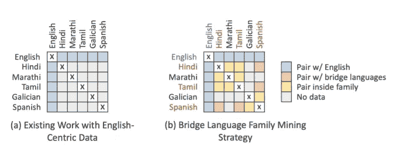
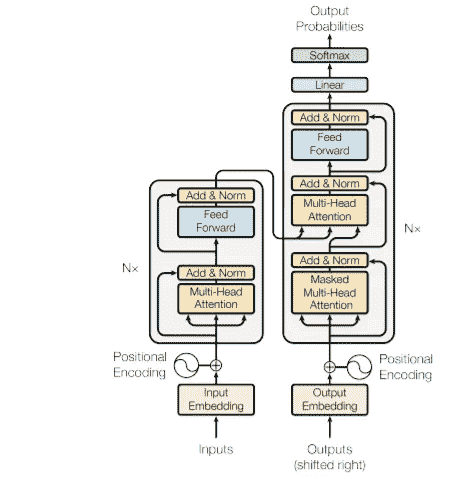
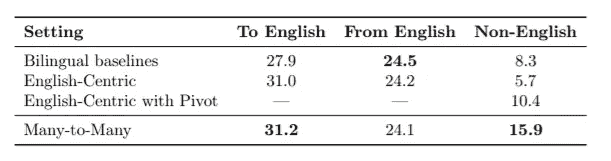
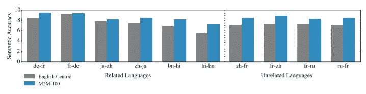

# 脸书树立了语言翻译的新里程碑

> 原文：<https://towardsdatascience.com/facebook-sets-a-new-milestone-in-language-translation-4c9ae0a5a347?source=collection_archive---------40----------------------->

## 了解 M2M-100，一种多语言机器翻译模型，可在 100 种语言对之间进行翻译。

格伦·卡丽在 [Unsplash](https://unsplash.com?utm_source=medium&utm_medium=referral) 拍摄的照片

L 语言翻译是一项具有挑战性的自然语言处理任务，需要大量的数据来训练模型。然而，在过去几年中已经取得了很大进展。最近，脸书发布了一个新的多语言机器翻译(MMT)模型，为这项挑战树立了一个新的里程碑[1]。

这是第一个在任意两种语言之间翻译时*不依赖英语数据*的模型。使用 [*BLEU*](https://en.wikipedia.org/wiki/BLEU) 指标，它也以 10 分的优势击败了以前以英语为中心的模型。凭借其创造性的数据挖掘方法和数量惊人的计算资源，他们建立了一个真正令人印象深刻的模型。

在本文中，我们将研究模型的架构，并强调它们用来创建数据集的最重要的方法。

# 创建数据集

大模型需要大量的数据。为了训练这个模型，来自脸书的研究人员使用了 75 亿个句子！可想而知，要为 100 种语言找到一个高质量的句对句翻译对是很难的。

## 所有语言翻译都重要吗？

有些译本非常罕见。例如，土耳其语到缅甸语，或者阿尔巴尼亚语到斯瓦希里语。这些语言之间的高质量翻译数据也很难找到。脸书大学的研究人员通过将语言分成具有相似特征的语系来简化翻译任务。例如，斯拉夫语和德语是两个独立的语系。在每一个语系中，他们确定了一个语系中最常见的过渡语言。这些桥接语言被用作在两种不同语系的语言之间进行翻译的中间步骤。

以英语为中心的数据与桥梁策略。修改自[1]

例如，不是有一个直接的阿尔巴尼亚语到斯瓦希里语的翻译，而是有阿尔巴尼亚语-希腊语(桥)-斯瓦希里语(桥)。这有助于减少数据集的大小，并证明有助于训练每个模型的特定模型参数[1]。

通过这种方法，他们简化了翻译任务，同时没有牺牲太多的性能损失。总共，它使用 100 种语言产生 2200 个方向的翻译。这比平移方向的最大可能数量 9900 (100 x 99)小得多。

## 数据挖掘技术

很难找到直接的句子到句子的翻译。然而，更容易找到以不同语言出版的相同文件。但是，为了创建相应的句子对，我们需要在文档中“关联”不同语言的句子。

为了找到相应的句子对，脸书的研究人员使用了 CCMatrix [2]和 CCAligned [3]。

CCMatrix 通过比较两种语言中所有可能的、独特的句子来工作[1]。这种方法计算量很大，CAligned 可能是一个更有效的选择，因为它预先选择了要一起比较的文档[1]。

# M2M 100 建筑

该模型的架构基于众所周知的[变压器架构](http://jalammar.github.io/illustrated-transformer/)。由于任务的复杂性，他们增加了标准架构的规模。M2M-100 的参数如下:

*   24 个编码器和 24 个解码器层(因不同实验而异)
*   嵌入尺寸大小为 1024
*   FFN(前馈网络)尺寸为 8192

变压器架构的架构。修改自[4]

变压器采用序列对序列架构。给定输入序列，模型将产生另一个输出序列。这个模型的问题在于它是为双语数据设计的[1]。为了适应多对多语言的情况，在编码器和解码器层添加了特殊的标记来表示源语言和目标语言[1]。

该模型的另一个改进是添加了特定于语言的参数。这提高了模型的性能，但也增加了总参数的数量。

# 结果

最终的 M2M-100 模型包含 150 亿个参数。他们还有一个更小的版本(只有？)15 亿个参数。

测试数据集上的结果显示了 M2M 模型的优势。

多对多和以英语为中心的模型的 BLEU 分数。

以英语为中心的模型和多对多模型在从任意语言到英语的翻译中表现相似，反之亦然(前两列)。然而，对于非英语翻译，例如瑞典语到斯瓦希里语，或者德语到波兰语，M2M 模型实现了显著更高的 BLEU 分数。这就是这种模式的精髓和新颖之处。

此外，该模型在由人类评估语义准确性(得分从 1 到 10)时表现更好。对于每一对语言，每个评估者给每个模型 50 个句子打分。我们可以从下面的图中看到，M2M-100 对于非英语翻译来说要好得多。

翻译质量的人工评估(语义准确性)。M2M-100 vs 以英语为中心的模式。修改自[1]。

# 是开源的吗？

你可以在这里找到他们的开源实现[。](https://github.com/pytorch/fairseq/tree/master/examples/m2m_100?fbclid=IwAR2O-IplQzV20cv2cDLxYWVgz7WraQ2CFISXJbOPUaEyXX2Y4OaKm5R6Vuo) *但是，要注意:*数据集和模型是*巨大的*。它是在多汁的脸书服务器上训练的，而不是在普通人的个人电脑上。尽管他们提供了模型检查点，但是您需要至少 64GB 的内存来将其存储在内存中。

# 结论

M2M-100 是语言翻译任务的又一个里程碑。当英语作为中间翻译步骤被去除时，翻译的质量显著提高。不幸的是，这种型号很难使用，即使是在好的电脑上，因为它需要 64 GB 的内存。

# 关于我

我是阿姆斯特丹大学的人工智能硕士学生。在我的业余时间，你可以发现我摆弄数据或者调试我的深度学习模型(我发誓这很有效！).我也喜欢徒步旅行:)

如果你想了解我的最新文章和其他有用的内容，以下是我的其他社交媒体资料:

*   [领英](https://www.linkedin.com/in/kacperkubara/)
*   [GitHub](https://github.com/KacperKubara)

# 参考

[1] [超越以英语为中心的多语言机器翻译](https://scontent-ams4-1.xx.fbcdn.net/v/t39.8562-6/122141102_1284164108584699_8596121596808227915_n.pdf?_nc_cat=108&ccb=2&_nc_sid=ae5e01&_nc_ohc=TtvMzFbJ4NEAX90frd_&_nc_ht=scontent-ams4-1.xx&oh=3b1a88ced973a76d2d85a32dd008f77f&oe=5FBF6A34)

[2] [CCMatrix:挖掘网络上数十亿高质量的平行句](https://arxiv.org/pdf/1911.04944.pdf)

[3][c aligned:跨语言网络文档对的大规模集合](https://arxiv.org/pdf/1911.06154.pdf)

你所需要的只是注意力

[5] [第一个不依赖英文数据翻译 100 种语言的 AI 模型](https://ai.facebook.com/blog/introducing-many-to-many-multilingual-machine-translation/)(来自论文的博文)