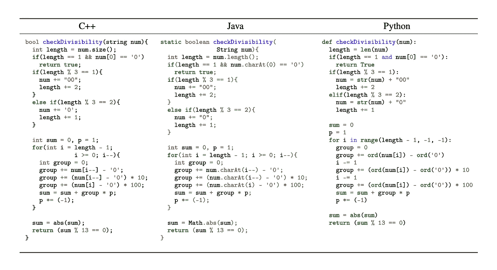
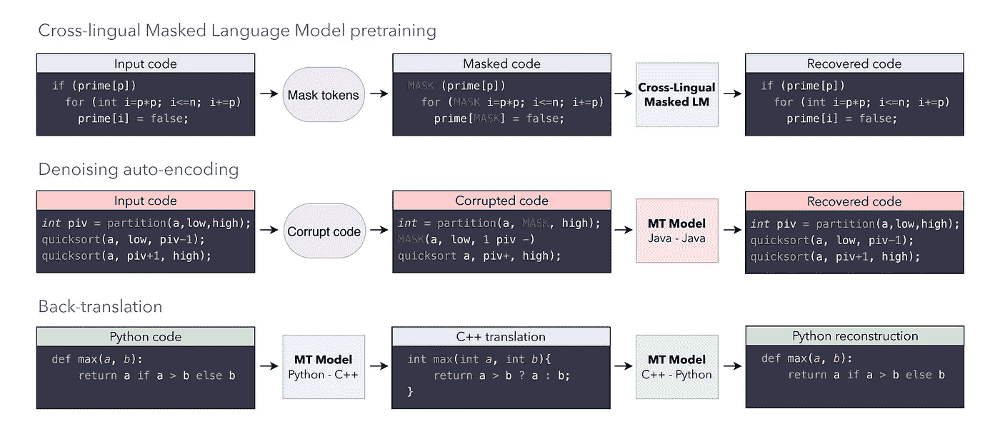
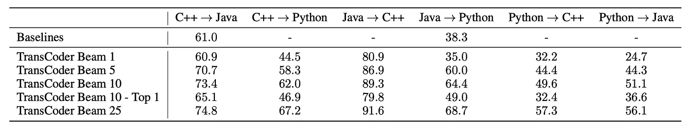

# 脸书的代码转换器——一个人工智能源代码到源代码的编译器

> 原文：<https://towardsdatascience.com/facebooks-transcoder-an-ai-source-to-source-compiler-23ea77f3234b?source=collection_archive---------28----------------------->

来源:https://arxiv.org/pdf/2006.03511.pdf

## 使用超过 280 万个开源 GitHub 存储库，TransCoder 在三种流行语言(C++、Java 和 Python)之间翻译代码。

澳大利亚联邦银行花了近 5 年时间和 7 . 5 亿美元将他们所有的代码平台从 COBOL 转换成 Java。

 [## 银行争相修复旧系统，因为它的“牛仔”骑到日落

### 纽约(路透社)-比尔·欣肖不是一个典型的 75 岁老人。他在家庭中分配时间，他有 32 个…

www.reuters.com](https://www.reuters.com/article/us-usa-banks-cobol/banks-scramble-to-fix-old-systems-as-it-cowboys-ride-into-sunset-idUSKBN17C0D8) 

用最新的编程语言或技术来更新系统需要花费数百万美元和数年时间。脸书人工智能研究所(FAIR)的团队开发了一种人工智能模型，代码转换器。FAIR 旨在通过自动化解决这一问题，借助先进的深度学习架构，在当今使用的 3 种流行编程语言之间进行翻译。

# 编程语言的现状

 [## 堆栈溢出开发者调查 2020

### 每个月，大约有 5000 万人访问 Stack Overflow 来学习、分享和建立他们的职业生涯。行业估计…

insights.stackoverflow.com](https://insights.stackoverflow.com/survey/2020#most-popular-technologies) 

今天使用的编程语言有数百种，从最早的 COBOL、Fortran 到现代的高级编程语言，如 C++、Java 和 Python。今天，T2 最流行的技术包括 JavaScript、Python、Java、C#和 C++。

Fortran、Lisp 和 COBOL 是至今仍在广泛使用的一些最古老的编程语言，尽管不再受到开发人员的青睐。COBOL 仍然是金融业依赖的主要语言，还有大型机系统。在全球范围内， [95%的 ATM 刷卡和 80%的当面交易都使用 COBOL](https://thenewstack.io/cobol-everywhere-will-maintain/) 。Fortran 正被用于科学编程和高性能计算。这些遗留系统将来需要重新开发，以防止资源过时或贬值。

代码转换器将有助于以经济高效的方式，在最少的人工干预下，将他们的平台转换成现代语言。

# 模型

目前，代码转换工具是基于规则的，以将源代码标记化并将其转换为抽象语法树(AST ),在抽象语法树上使用手工规则。然后，AST 被转换以生成目标语言的代码。写规则的过程很耗时。

使用无监督学习的方法，人工智能模型训练了超过 280 万个开源 GitHub 知识库，以将代码片段从一种语言映射到另一种语言。来自不同语言的编程关键字被标记化并检查相似性。

代码转换器使用序列到序列(seq2seq)模型，编码器和解码器采用转换器架构。该模型实现了交叉编程语言模型预训练、去噪自动编码和回译——遵循无监督机器翻译的原则。

来源:https://arxiv.org/pdf/2006.03511.pdf

# 结果

FAIR 在所有 3 种语言中使用了 852 个并行函数，并通过单元测试来检查翻译的准确性。

结果如下，Java 到 C++的翻译具有最高的准确率，为 91.6%。

来源:https://arxiv.org/pdf/2006.03511.pdf

# 未来

人工智能的出现令人兴奋，同时也令人恐惧。人工智能将改善人类的整体体验，成为我们生活的一部分，就像帮助我们在社会中更好地相互联系和沟通。

未来，随着翻译的改进，程序员可以使用单一代码库轻松改进和构建健壮的跨平台软件，如应用程序和游戏。人工智能也可以被训练从头开始编写代码，就像莱斯大学研究人员开发的[BAYOU](https://www.techrepublic.com/article/developers-rejoice-now-ai-can-write-code-for-you/)。

 [## 开发者们，欢呼吧:现在人工智能可以为你写代码了

### 莱斯大学的研究人员创造了一个名为 BAYOU 的深度学习软件编码应用程序，可以帮助人类…

www.techrepublic.com](https://www.techrepublic.com/article/developers-rejoice-now-ai-can-write-code-for-you/) 

但是随着源到源翻译的改进，智能机器将提高自动化程度，并可能取代一些工作，特别是在测试方面。编程的未来在等着我们！

# 参考资料:

1.  [编程语言的无监督翻译](https://arxiv.org/pdf/2006.03511.pdf)
2.  [银行争相修复旧系统，因为它的“牛仔”骑到日落](https://www.reuters.com/article/us-usa-banks-cobol/banks-scramble-to-fix-old-systems-as-it-cowboys-ride-into-sunset-idUSKBN17C0D8)
3.  [最受欢迎的技术— 2020 年开发者调查](https://insights.stackoverflow.com/survey/2020#most-popular-technologies)
4.  [开发者们，欢呼吧:现在人工智能可以为你写代码了](https://www.techrepublic.com/article/developers-rejoice-now-ai-can-write-code-for-you/)

来源:[编程语言的无监督翻译](https://arxiv.org/pdf/2006.03511.pdf)

在 [LinkedIn](http://linkedin.com/in/rohithsajja) 和 [GitHub](http://github.com/rohith5955) 上关注我，或者访问我的网站 rohitssajja . me