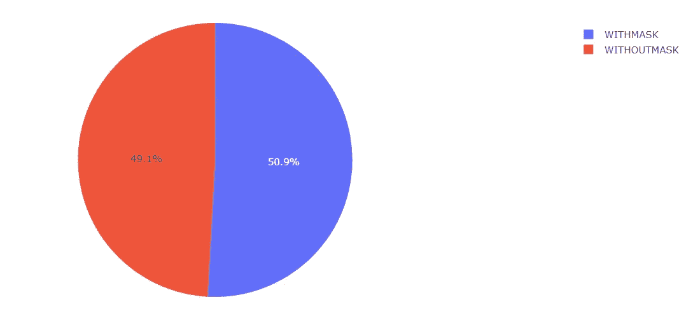
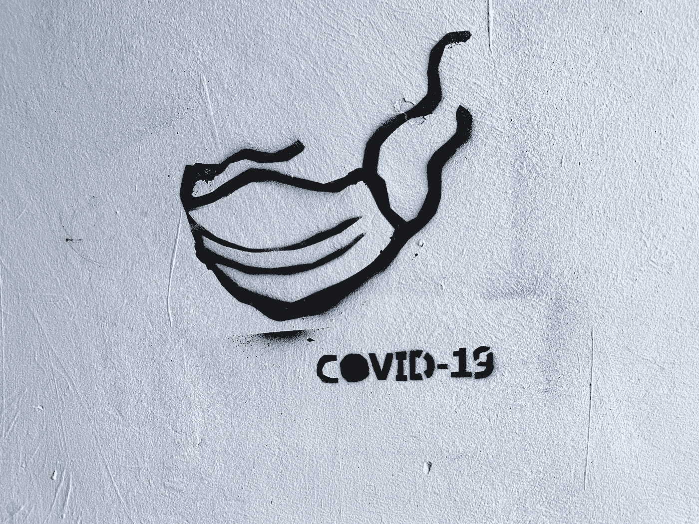
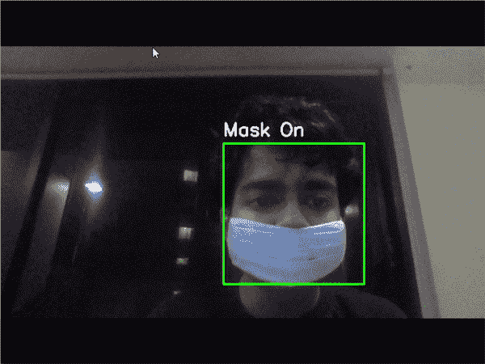

# 基于 Tensorflow 和 OpenCV 的人脸检测

> 原文：<https://towardsdatascience.com/facemask-detection-using-tensorflow-and-opencv-824b69cad837?source=collection_archive---------45----------------------->

格伦·卡丽在 [Unsplash](https://unsplash.com?utm_source=medium&utm_medium=referral) 拍摄的照片

**简介:**

在新冠肺炎危机中，戴口罩对于公共卫生和控制疫情的传播是绝对必要的。如果我们有一个系统可以监控我们周围的人是否遵守这些安全措施，会怎么样？

借助深度学习的力量，这个系统可以检测出一个人是否戴了面具。感谢 [prajnasb](https://github.com/prajnasb/observations) 编译我用于训练的数据集。我们从这里开始…

 [## hod 101s/面罩检测

### 在 COVID19 危机中，戴口罩对于公共卫生和控制传染病的传播是绝对必要的

github.com](https://github.com/HOD101s/Face-Mask-Detection) 

**了解我们的数据:**

在网上找到的所有资料中，由 [prajnasb](https://github.com/prajnasb/observations) 发布的数据很容易处理，所以我继续使用同样的方法。任何具有大量戴口罩和不戴口罩的人的图像的数据集都适用于这个问题。

照片由[马纳斯·阿查里亚](https://medium.com/@manasbass.99)拍摄

我们的数据相当平衡，667 幅图像属于无 _ 掩码类，690 幅图像属于有 _ 掩码类。

**处理我们的数据:**

由于 keras 强大的处理库，**图像增强**和**数据管道化**的过程变得非常容易。这里我使用了 keras 在其图像预处理函数下提供的[**imagedata generator**](https://www.tensorflow.org/api_docs/python/tf/keras/preprocessing/image/ImageDataGenerator)。使用 ImageDataGenerator，我们可以构建图像数据扩充管道，在训练期间实时执行扩充，从而节省内存，使其成为扩充数据的一个非常方便的解决方案。

这里我构建了两个数据生成器:一个用于训练和验证数据，另一个用于测试数据。训练和验证数据只是水平翻转，所以也没有应用大的扩充。完整的功能列表可在[文档](https://www.tensorflow.org/api_docs/python/tf/keras/preprocessing/image/ImageDataGenerator)中找到。一个单独的测试数据生成器已经完成，因为我没有对它进行任何扩充。

**模型架构和训练:**

我已经利用了**迁移学习**，感谢 tensorflow [应用程序 api](https://www.tensorflow.org/api_docs/python/tf/keras/applications) ，这是一个非常简单的任务。使用[**MobileNetV2**](https://www.tensorflow.org/api_docs/python/tf/keras/applications/MobileNetV2)**模型来构建我的分类器网络。**

**通过使用迁移学习，我正在利用预先训练的 MobileNetV2 的特征检测能力，并将其应用于我们相当简单的模型。MobileNetV2 之后是我们的 DNN，由 GlobalAveragePooling、Dense 和 Dropout 层组成。由于我们的问题是一个二元分类问题，最后一层有 2 个神经元和 softmax 激活。**

**一个通用的 Adam 优化器和 Categorical _ crossentropy loss 可以很好地收敛到我的网络的最佳权重。**

**到第六个纪元时，我在所有测试、训练和验证集上都获得了 100%的结果。**

****部署:****

****

**照片由[Adam niecioruk](https://unsplash.com/@adamsky1973?utm_source=medium&utm_medium=referral)在 [Unsplash](https://unsplash.com?utm_source=medium&utm_medium=referral) 上拍摄**

**在这里，我使用了流行的 OpenCV 库来获取我的网络摄像头馈送，并在我的模型中运行它。**

**我们从人脸检测开始。为此，我使用了[哈斯级联分类器](https://docs.opencv.org/3.4/db/d28/tutorial_cascade_classifier.html)算法。接下来，我切下面部图像，对其进行归一化和缩放，然后输入到我的分类模型中。**

**用于训练网络的图像尺寸为 224 x 224，因此我们需要按照 *prepImg(pth)* 中所述，通过整形和归一化，以类似的方式准备我们的输入图像。**

****

**Gif 由 [Manas Acharya](https://medium.com/@manasbass.99)**

**OpenCV 实现只是以下内容的连续循环:**

*   **检测面部**
*   **切片人脸图像**
*   **通过分类器**
*   **获取并显示预测**

****结论:****

**我们已经准备好了一个工作模型，它可以检测一个人是否戴着面罩，并提示这个人戴上面罩！鉴于事情的发展方式，口罩将成为我们社会和公众健康的一个更重要的组成部分，在这种情况下，该系统将是确保遵守安全指南的必要条件。**

**如果您有任何建议或想法想要讨论，您可以通过 LinkedIn 与我联系。精益求精！**

** [## Manas Acharya -机器学习工程师- KubixSquare | LinkedIn

### 机器学习和数据科学爱好者，曾在前端 Web 领域担任全栈开发人员…

www.linkedin.com](https://www.linkedin.com/in/manas-acharya/)  [## 使用 Tensorflow 和 OpenCV 构建石头剪刀布人工智能

### 古老的游戏被重新想象和更新……

towardsdatascience.com](/building-a-rock-paper-scissors-ai-using-tensorflow-and-opencv-d5fc44fc8222)**