# 基于面部数据的深度学习:情感、年龄和性别预测

> 原文：<https://towardsdatascience.com/facial-data-based-deep-learning-emotion-age-and-gender-prediction-47f2cc1edda7?source=collection_archive---------10----------------------->


在 [Unsplash](https://unsplash.com/s/photos/machine-learning?utm_source=unsplash&utm_medium=referral&utm_content=creditCopyText) 上 [Sai Kiran Anagani](https://unsplash.com/@_imkiran?utm_source=unsplash&utm_medium=referral&utm_content=creditCopyText) 拍摄的照片

## 我们如何利用深度学习从面部数据中提取信息？

深度学习在计算机视觉领域有着巨大的应用。计算机视觉的一些最重要的应用是在处理面部数据的领域。人脸检测和识别广泛应用于安全领域。如果您想探索这两个领域，请随意浏览:

1.  [人脸检测](https://levelup.gitconnected.com/a-small-gui-application-based-on-computer-vision-and-python-imaging-libraries-using-opencv-e07b3f8c06c1):在这篇文章中，我谈到了一个基于人脸检测的应用
2.  人脸识别:这篇文章讲述了我们如何使用人脸识别来实现一个安全机制。

在上面的文章中，我已经尝试对这些机制是如何工作的给出了一个完整的解释。

在本文中，我们将讨论基于面部的深度学习的另外两个最重要的应用，情感检测或面部表情检测，以及从面部图像预测年龄和性别。

所以，让我们直接开始吧。

## 情感检测

首先，让我们谈谈情绪检测或预测。

对于这一部分，我们将使用 [Kaggle 的 CKPlus 数据集](https://www.kaggle.com/shawon10/ckplus)。

**数据预处理**

该数据集总共有 981 幅图像。这些图像根据七种不同的表情被分为七个标签:愤怒、轻蔑、厌恶、恐惧、快乐、悲伤和惊讶。每个表达式都有一个文件夹。因此，有七个文件夹存储 981 幅图像。

首先，我们使用 listdir()按顺序列出类或文件夹。

```
**import** **os**
files=os.listdir(fldr)
>>
['fear', 'contempt', 'happy', 'anger', 'surprise', 'disgust', 'sadness']Exp=['fear', 'contempt', 'happy', 'anger', 'surprise', 'disgust', 'sadness']
```

因此，我们将表达式按顺序保存在一个列表中，我们将参考该列表来创建标签。

接下来，我们对图像进行预处理。

```
**import** **cv2**
**from** **google.colab.patches** **import** cv2_imshow
i=0
last=[]
images=[]
labels=[]
**for** fle **in** files:
  idx=Exp.index(fle)
  label=idx

  total=fldr+'/'+fle
  files_exp= os.listdir(total) **for** fle_2 **in** files_exp:
    file_main=total+'/'+fle_2
    print(file_main+"   "+str(label))
    image= cv2.imread(file_main) image = cv2.cvtColor(image, cv2.COLOR_BGR2RGB)
    image= cv2.resize(image,(48,48))
    images.append(image)
    labels.append(label)
    i+=1
  last.append(i)
```

上面的代码片段使用 OpenCV 打开并读取图像，将其尺寸调整为(48 x 48)尺寸。我已经把它转换成 RGB 图像，所以，它有三个通道。每个图像的大小为(48 x 48 x 3)。我们将在“图像”列表中添加图像，并在“标签”列表中添加相应的标签。让我们来可视化几个预处理后的例子。


```
**import** **tensorflow** **as** **tf**
**from** **sklearn.model_selection** **import** train_test_split
**import** **numpy** **as** **np**
images_f=np.array(images)
labels_f=np.array(labels)images_f_2=images_f/255
labels_encoded=tf.keras.utils.to_categorical(labels_f,num_classes=num_of_classes)
X_train, X_test, Y_train, Y_test= train_test_split(images_f_2, labels_encoded,test_size=0.25)
```

使用上面的代码片段，我们将标签和图像转换为 NumPy 数组，并通过除以 255 来规范化图像数组。我使用了一键编码将标签编码成向量。我们将使用 25%的测试分割。

**型号**

```
**from** **tensorflow.keras.layers** **import** Dropout
**from** **tensorflow.keras.layers** **import** Flatten,BatchNormalization
**from** **tensorflow.keras.layers** **import** Dense, MaxPooling2D,Conv2D
**from** **tensorflow.keras.layers** **import** Input,Activation,Add
**from** **tensorflow.keras.models** **import** Model
**from** **tensorflow.keras.regularizers** **import** l2
**from** **tensorflow.keras.optimizers** **import** Adam**def** Convolution(input_tensor,filters):

    x = Conv2D(filters=filters,kernel_size=(3, 3),padding = 'same',strides=(1, 1),kernel_regularizer=l2(0.001))(input_tensor)
    x = Dropout(0.1)(x)
    x= Activation('relu')(x) **return** x
**def** model(input_shape):
  inputs = Input((input_shape))

  conv_1= Convolution(inputs,32)
  maxp_1 = MaxPooling2D(pool_size = (2,2)) (conv_1)
  conv_2 = Convolution(maxp_1,64)
  maxp_2 = MaxPooling2D(pool_size = (2, 2)) (conv_2)
  conv_3 = Convolution(maxp_2,128)
  maxp_3 = MaxPooling2D(pool_size = (2, 2)) (conv_3)
  conv_4 = Convolution(maxp_3,256)
  maxp_4 = MaxPooling2D(pool_size = (2, 2)) (conv_4)
  flatten= Flatten() (maxp_4)
  dense_1= Dense(128,activation='relu')(flatten)
  drop_1=Dropout(0.2)(dense_1)
  output= Dense(7,activation="sigmoid")(drop_1) model = Model(inputs=[inputs], outputs=[output]) model.compile(loss="categorical_crossentropy", optimizer="Adam",
	metrics=["accuracy"])
  **return** model
```

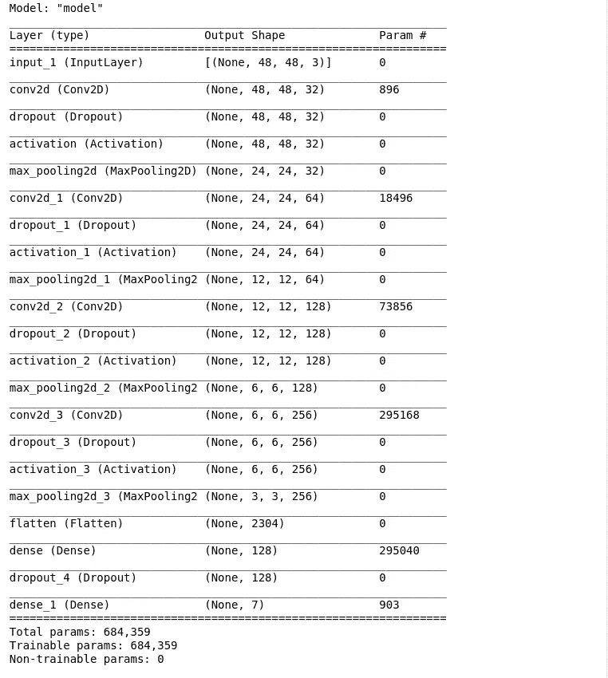

我们将使用上述模型来预测表达式。

```
History=Model.fit(X_train,Y_train,batch_size=32,validation_data=(X_test,Y_test),epochs=1000,callbacks=[callback_list])
```

上面的片段将训练模型。

该模型对测试数据给出了 100%的准确度。

> 注意:每当一个模型在测试数据上给出 100%的准确率时，我们需要检查训练准确率，如果那也是 100%的话。这意味着模型实际上是过度拟合的，测试集与训练集的分布非常接近。因此，它显示了巨大的成果。我认为在这种情况下，最好使用交叉验证来获得模型实际工作方式的正确直觉。

让我们继续评估。

**评价**

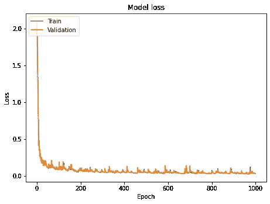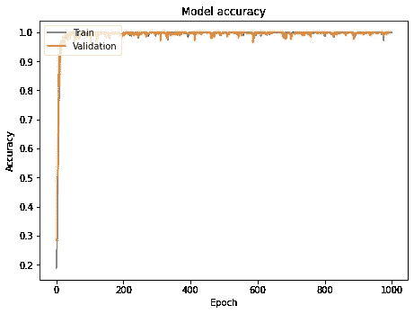

两条曲线显示了模型的学习。第一条曲线显示了损失函数的下降，第二条曲线显示了精度随时期的增长。

```
Pred=Model.predict(X_test)
Pred
>>
array([[1.68134073e-09, 5.25928086e-11, 5.46700324e-11, ...,         7.71565616e-01, 8.71616357e-05, 4.54742303e-06],        [5.06911943e-11, 5.20724059e-17, 2.85400745e-07, ...,         2.65912314e-12, 7.78120279e-01, 2.07833662e-14],        [5.95332267e-07, 7.41830490e-07, 1.73864496e-08, ...,         4.54492539e-01, 9.06203127e-07, 1.08237209e-05],        ...,        [1.56573861e-07, 3.44979071e-07, 3.86641860e-01, ...,         3.84031367e-08, 4.99448021e-08, 6.93729362e-13],        [1.91495033e-07, 7.53485918e-01, 1.24115175e-07, ...,         2.53645931e-06, 6.98523905e-09, 2.22882386e-06],        [5.07813091e-14, 1.79454021e-12, 1.35435105e-14, ...,         9.94049311e-01, 2.74002265e-09, 1.31444740e-08]], dtype=float32)
```

我们获得如图所示的预测，让我们检查分类报告和混淆矩阵。

分类报告:

```
i=0 Y_test_l=[] 
Pred_l=[] 
**while**(i<len(Pred)):   
  Y_test_l.append(int(np.argmax(Y_test[i])))     
  Pred_l.append(int(np.argmax(Pred[i])))   
  i+=1report=classification_report(Y_test_l, Pred_l)
```

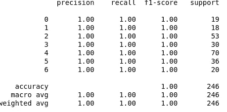

混淆矩阵:

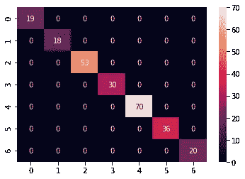

我们已经看到了我们模型的混淆矩阵和分类报告。

```
**def** test_image(ind,images_f,images_f_2,Model):
  cv2_imshow(images_f[ind])
  image_test=images_f_2[ind]
  print("Label actual:  " + Exp[labels[ind]]  )
  pred_1=Model.predict(np.array([image_test]))
  *#print(pred_1)*
  pred_class=Exp[int(np.argmax(pred_1))]
  print("Predicted Label: "+ pred_class)
```

上面的片段将让我们看看一些图像、它们的真实标签和预测标签。

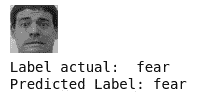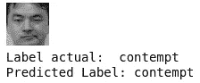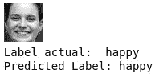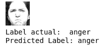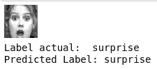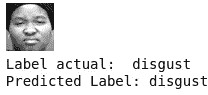

所以，我们已经看到了如何使用深度学习来预测情绪。让我们来看看年龄和性别预测。

## 年龄和性别预测

我们将使用 Kaggle 的 [UTKFace 数据集](https://www.kaggle.com/jangedoo/utkface-new?)来预测年龄和性别。

**数据预处理**

这里我使用了包含 9780 个文件的数据集。它有 9780 张年龄从 0 岁到 116 岁的男性和女性的人脸图片。每张图片都有标签显示相应的年龄和性别。男性由 0 给出，女性由 1 给出。

```
**import** **cv2**
ages=[]
genders=[]
images=[]**for** fle **in** files:
  age=int(fle.split('_')[0])
  gender=int(fle.split('_')[1])
  total=fldr+'/'+fle
  print(total)
  image=cv2.imread(total) image = cv2.cvtColor(image, cv2.COLOR_BGR2RGB)
  image= cv2.resize(image,(48,48))
  images.append(image)
  ages.append(age)
  genders.append(gender)
```

上面的代码片段有助于获取数据和准备训练集。“图像”列表包含所有 9780 幅图像，每幅图像的大小为(48 x 48 x 3)。“年龄”列表具有相应的年龄,“性别”列表具有相应的性别。

让我们看看预处理后的图像。


第一幅图像的年龄为 62 岁，性别为 0，第二幅图像的年龄为 67 岁，性别为 0

现在，我们需要检查我们的集合的分布。

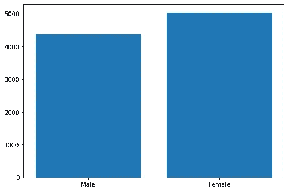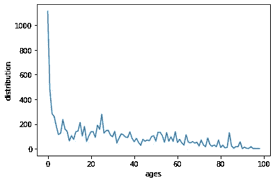

第一个条形图显示了性别分布。它看起来很平衡。第二个线形图显示了不同年龄样本的变化。我们可以看到年龄小于 40 的样本比年龄大于 40 的样本数量要多得多。这造成了训练集分布的偏斜。

我们已经看到，在这种情况下，我们实际上需要使用相同的模型来预测年龄和性别。因此，要为我们的训练集创建实际的标签，我们需要做一些处理。

```
labels=[]i=0
**while** i<len(ages):
  label=[]
  label.append([ages[i]])
  label.append([genders[i]])
  labels.append(label)
  i+=1
```

上面的代码片段按索引方式获取每个图像样本的年龄和性别，并将每个样本转换成一个列表，并将它们附加到标签列表中。这样做是为了创建一维标签向量。

因此,“标签”列表的形状将是:

> [[[年龄(1)]，[性别(1)]，
> 
> [[年龄(2)]，[性别(2)]，………………。[[年龄(n)]，[性别(n)]]]

接下来，我们将标签和图像列表转换成 NumPy 数组，规范化图像，并创建训练和测试数据分割。我们将使用 25%的测试分割。

```
images_f=np.array(images)
labels_f=np.array(labels)
images_f_2=images_f/255
X_train, X_test, Y_train, Y_test= train_test_split(images_f_2, labels_f,test_size=0.25)
```

目前，我们的 Y_train 和 Y_test 的形式为:

```
Y_train[0:5]
>>array([[[36],
        [ 0]], [[50],
        [ 0]], [[65],
        [ 0]], [[ 3],
        [ 0]], [[25],
        [ 1]]])
```

我们需要对它们进行转换，使 Y_train[0]表示性别标签向量，Y_train[1]表示年龄标签向量。

```
Y_train_2=[Y_train[:,1],Y_train[:,0]]
Y_test_2=[Y_test[:,1],Y_test[:,0]]
```

这个简单的代码片段为我们做了工作。

```
Y_train_2[0][0:5]
>>array([[0],
       [0],
       [0],
       [0],
       [1]])
Y_train_2[1][0:5]
>>array([[36],
       [50],
       [65],
       [ 3],
       [25]])
```

现在，我们准备开始设计我们的模型。

**型号**

```
**from** **tensorflow.keras.layers** **import** Dropout
**from** **tensorflow.keras.layers** **import** Flatten,BatchNormalization
**from** **tensorflow.keras.layers** **import** Dense, MaxPooling2D,Conv2D
**from** **tensorflow.keras.layers** **import** Input,Activation,Add
**from** **tensorflow.keras.models** **import** Model
**from** **tensorflow.keras.regularizers** **import** l2
**from** **tensorflow.keras.optimizers** **import** Adam
**import** **tensorflow** **as** **tf****def** Convolution(input_tensor,filters):

    x = Conv2D(filters=filters,kernel_size=(3, 3),padding = 'same',strides=(1, 1),kernel_regularizer=l2(0.001))(input_tensor)
    x = Dropout(0.1)(x)
    x= Activation('relu')(x) **return** x
**def** model(input_shape):
  inputs = Input((input_shape))

  conv_1= Convolution(inputs,32)
  maxp_1 = MaxPooling2D(pool_size = (2,2)) (conv_1)
  conv_2 = Convolution(maxp_1,64)
  maxp_2 = MaxPooling2D(pool_size = (2, 2)) (conv_2)
  conv_3 = Convolution(maxp_2,128)
  maxp_3 = MaxPooling2D(pool_size = (2, 2)) (conv_3)
  conv_4 = Convolution(maxp_3,256)
  maxp_4 = MaxPooling2D(pool_size = (2, 2)) (conv_4)
  flatten= Flatten() (maxp_4)
  dense_1= Dense(64,activation='relu')(flatten)
  dense_2= Dense(64,activation='relu')(flatten)
  drop_1=Dropout(0.2)(dense_1)
  drop_2=Dropout(0.2)(dense_2)
  output_1= Dense(1,activation="sigmoid",name='sex_out')(drop_1)
  output_2= Dense(1,activation="relu",name='age_out')(drop_2)
  model = Model(inputs=[inputs], outputs=[output_1,output_2])
  model.compile(loss=["binary_crossentropy","mae"], optimizer="Adam",
	metrics=["accuracy"])

  **return** model
```

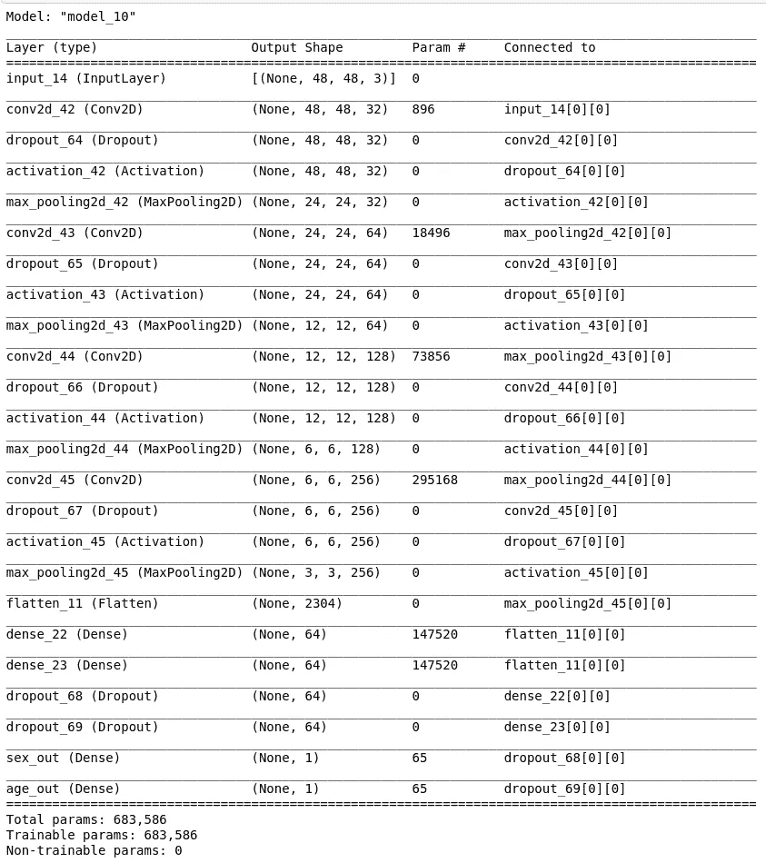

我们将使用上述模型来预测性别和年龄

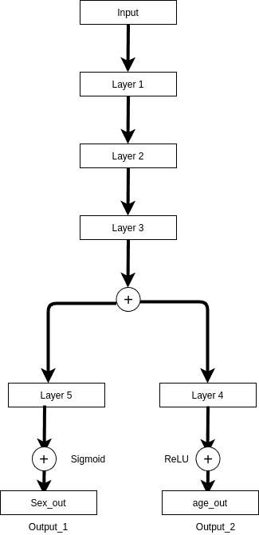

以上是我们模型的示意图。在“展平”层之后，我们将使用两个不同的致密层和对应于相应输出的漏失。现在，性别预测是一个分类问题，而年龄预测是一个回归问题，所以，我们将使用 sigmoid 作为性别预测的输出激活，ReLU 作为年龄预测的激活函数。类似地，我们将使用“二元交叉熵”作为性别的损失函数，使用“平均绝对误差”作为年龄的损失函数。

```
**from** **tensorflow.keras.callbacks** **import** ModelCheckpoint **import** **tensorflow** **as** **tf** fle_s='Age_sex_detection.h5'
checkpointer = ModelCheckpoint(fle_s, monitor='val_loss',verbose=1,save_best_only=**True**,save_weights_only=**False**, mode='auto',save_freq='epoch')
Early_stop=tf.keras.callbacks.EarlyStopping(patience=75, monitor='val_loss',restore_best_weights=**True**),
callback_list=[checkpointer,Early_stop]
History=Model.fit(X_train,Y_train_2,batch_size=64,validation_data=(X_test,Y_test_2),epochs=500,callbacks=[callback_list])
```

上面的片段将训练模型。

该模型给出了 82%的性别分类准确率。

**评价**

让我们看看模型的损失曲线。

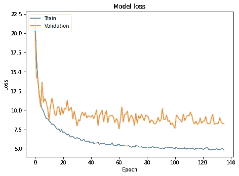

这是我们的模型生成的损失曲线。

让我们看看对年龄预测的评估:

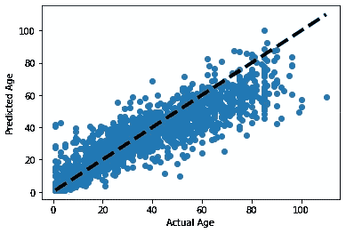

上述曲线显示了黑色的模型跟踪线性回归线，蓝点显示了测试样品的分布。所以，我们可以看到我们的预测线几乎穿过了分布的中间。在 80 岁以上，样本很少，所以，可能由于这个原因，我们的模型表现得不是很好。

性别预测评估:

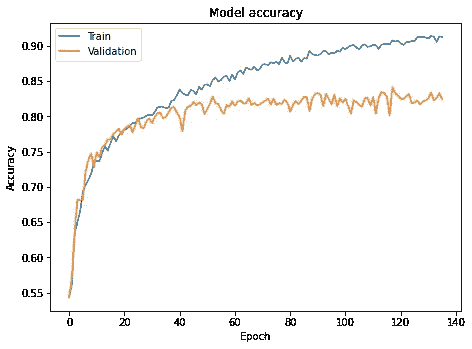

上面的曲线显示了性别准确性随时代的增加。

性别分类的分类矩阵:

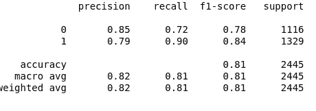

我们的模型获得了女性 0.84 和男性 0.78 的 F1 分数。所以，它对女性的分类比男性好。

让我们来看看我们集合中的一些样本及其相应的预测年龄和性别。

```
**def** test_image(ind,images_f,images_f_2,Model):       cv2_imshow(images_f[ind])   
image_test=images_f_2[ind]   pred_1=Model.predict(np.array([image_test]))  
*#print(pred_1)*   
sex_f=['Male','Female']   
age=int(np.round(pred_1[1][0]))   
sex=int(np.round(pred_1[0][0]))   
print("Predicted Age: "+ str(age))   
print("Predicted Sex: "+ sex_f[sex])
```

上面的代码片段有助于生成我们的示例:

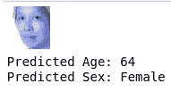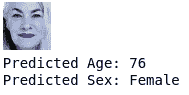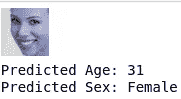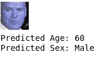

对于最后一个样本，实际年龄标签是 62，预测年龄标签是 60。

因此，我们可以使用面部数据来预测性别和年龄。

## 结论

在本文中，我们已经看到了如何从面部图像中预测情感、性别和性。

GitHub 链接在这里是。

希望这篇文章有所帮助。