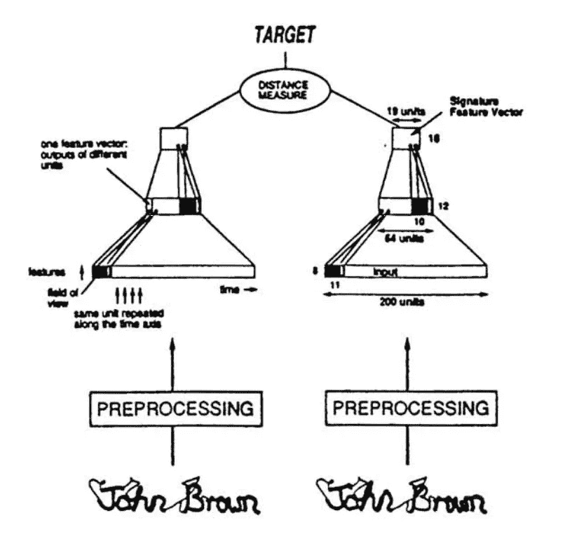
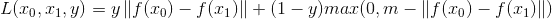
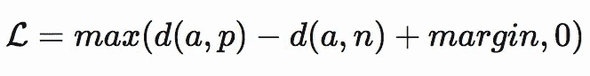

# 使用连体网的面部再识别

> 原文：<https://towardsdatascience.com/facial-re-identification-using-siamese-nets-d36df39da7c0?source=collection_archive---------20----------------------->

## 端到端教程

面部再识别(FRID)是根据一个人的面部来验证其身份的问题。例如，一个政府机构可以根除 ID 卡的使用，而简单地使用 FRID 系统来处理出席，而不用担心陌生人窃取某人的 ID 来进入系统。

这个问题的关键是一个分类问题，其中模型必须将人脸图像分类为数据库中的人。正因为如此，使用具有接近 100%测试准确率的许多先进的图像分类器可能很有诱惑力。结案了对吗？只需微调 ResNet50 甚至 ResNet101 模型，即可从人脸图像中对人名进行分类。这样做时会出现一些基本问题:

*   我从哪里获得数据？对于您想要分类的每个人，最多会有一两张图像可用，并且该图像将是护照风格的照片，与正在分类的图像非常不同。图像分类器仅在至少有 50 幅图像时工作良好，以在测试图像上实现高置信度，这比可用图像多 49 幅图像。
*   **我如何确保对成千上万的课程有很高的信心？**用于图像分类的最大数据集有 300 到 1000 个类别。然而，公司组织有 100 到 50，000 人，因此有 100 到 50，000 个班级。
*   **当新员工被录用时，我该怎么做？**深度学习网络的本质是，没有办法只是向模型中添加一个新类，然后让它做得很好。添加一个新的类意味着用添加的类重新训练整个网络。这既浪费了计算资源又浪费了时间，任何人都不会有多余的计算资源和时间，尤其是数据科学家。

所有这些问题都可以用一种新的模型来回答:连体网络。

# 直觉

让我们首先介绍暹罗网络。当人们将人类直觉应用到深度学习模型中时，大多数深度学习进步都发生了，例如当 ResNet 中首次使用残差块时，或者当人们更加努力地尝试将人类抽象融入计算机时，基于风格的损失变得更加流行时。暹罗网络是这些进步中的另一个，它严重依赖于人类对计算机应该如何解决问题的直觉。

暹罗网络背后的核心直觉是试图学习面部的表征。这种表征类似于人类储存在大脑中的关于面部特征的信息，如面部特征的大小、肤色、眼睛颜色等。人类可以理解，如果它看到另一张具有相似特征的脸，那么新的脸很有可能属于同一个人。另一方面，如果人类看到新的面部与其先前看到的面部不匹配，那么人类再次制作新面部的表示以存储在其存储器中。

这正是暹罗网络的运作方式。一个函数将人脸的输入图像转换成包含人脸特征表示的向量。然后，我们希望这个向量与同一张脸的向量相似，而与另一张脸的向量非常不同。

简而言之，该模型学习如何提取人脸的重要特征，从而将人脸与其他人脸区分开来。一旦获得特征映射，就可以将其与数据库中要匹配的其他人脸的特征映射进行比较。

图片由([签名验证使用“暹罗”时间延迟神经网络](http://papers.nips.cc/paper/769-signature-verification-using-a-siamese-time-delay-neural-network.pdf))提供

# 三重态损失和其他细节

任何神经网络最重要的部分是它是如何训练的。训练是一个庞大的、看似无用的功能被调整以完成其任务的方式。暹罗网络最初是成对训练的，类似于模型的用例。同一人脸的两个向量之间的距离最大化，不同人脸的两个向量之间的距离最小化。

然而，这种方法使训练过程变得复杂，并且在计算要求方面也是低效的。训练这种所谓的对比损失意味着，对于每个训练样本，模型必须计算四个向量，然后对每对图像执行两组模型优化。出现的另一个问题是，训练样本将是高度不平衡的，因为其中人脸相同的对的数量将会少得多，而其中人脸不同的对的数量将会更多。

为了降低对比损失的计算要求，也为了部分解决数据问题，创建了三元组损失。三重态损失分四步进行:

1.  从数据集中采样三个图像，锚、正面和反面。主播是任何一张脸，正面是和主播同一张脸的图像，反面是不同脸的图像。
2.  计算每个图像的向量
3.  使用一个距离函数来找出锚点和正负图像之间的距离。
4.  将损失值计算为锚点和负片图像之间的距离与锚点和正片图像之间的距离之差。

以下等式显示了三重态损耗的数学表示，以及一些重要的微妙之处。

上述损失和等式之间的第一个差异是在差异和`0.0`之间添加了`Max()`函数。这是为了确保损失函数不会降到零以下。

第二个更重要的区别是增加了一个边距，用`m`表示。这个余量确保模型不会学习为所有的面输出相同的向量，不管这些面是否匹配。请注意，如果锚和正值之间的距离等于锚和负值之间的距离，如果没有保证金项，损失将最小化为零。

# 那么这怎么解决问题呢？

*   该模型只需要每个身份的最多两张脸来训练它，这与现实世界中可用的数据类型非常相似，因为一个人必须至少有一张被识别的人的图像和一张该人的实时图像。
*   由于该模型不依赖于从人脸中分类不同的身份，所以它不必处理可能的成千上万的人脸来分类，它只需要执行精确的比较。
*   出于同样的原因，新添加的雇员并不意味着网络的重新训练，该模型将简单地计算新雇员的面部嵌入，以添加到面部嵌入的数据库中。

# 履行

对于这篇博文中的实现，我们将使用`tensorflow==2.1`和 gpu(如果有的话),因为这样一个网络的训练是一个繁重的计算。我将在英伟达 GTX 1080 TI 上训练我的模型，所以我将使用`tensorflow-gpu==2.1`和`CUDA==10.2`。

由于强大的特征提取器网络的发展，对于几乎每种情况，通常很少需要从零开始设计定制的卷积神经网络。我们将使用 ResNet50 模型的行业标准来提取我们的特征。因此，唯一需要增加的是在 tf 中设计一个定制的损失函数。Keras API 来训练我们的模型。

有两种不同的方法将自定义损失函数合并到 tf 中。Keras:创建一个函数来计算传递给`model.compile()`方法的损失，或者创建一个损失层并使用`Layer.add_loss()`方法。

创建自定义损失函数的两种方法之间的唯一区别是，在第一种方法中，损失函数必须是`loss_fn(y_true, y_pred)`的格式，而第二种方法可以是任何格式。

由于三重态损耗无法用`y_true, y_pred`格式表示，因此将使用第二种方法。

在上面的代码中，`triplet_loss`是损失函数，它接受锚、正面和负面图像。`@tf.function`的注释简单地使用`tf.Autograph`来绘制函数，并允许更快的计算。

`TripletLoss`层继承自`tf.keras.layers.Layer`，使用`add_loss`方法将三重损失函数添加到该层的损失中。然后，图层返回输入而不更改它们。

使用`add_loss`方法不仅将损失张量添加到层的损失中，而且当使用`model.fit()`训练模型时，所有的层损失也被自动优化，这允许我们在以下代码中编译没有任何整体损失函数的模型:

上面的代码显示了模型的完整代码以及它是如何被训练的。

# 结果

在位于 http://vis-www.cs.umass.edu/lfw/的[LFW(野外标记的人脸)数据库上训练该模型，该模型能够以 90%的准确率正确“预测”匹配的人脸，并能够以 95%的准确率区分两张人脸是否不同。](http://vis-www.cs.umass.edu/lfw/)

在过去的几年里，已经发表了多篇论文，对普通的三重损失进行了重大改进，并在更困难的数据集上进行了改进，如 https://megapixels.cc/duke_mtmc/的杜克 MTMC。

在接下来的几篇文章中，我将分析最近在重新识别方面的进展。