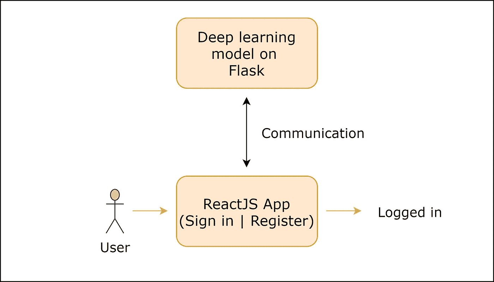
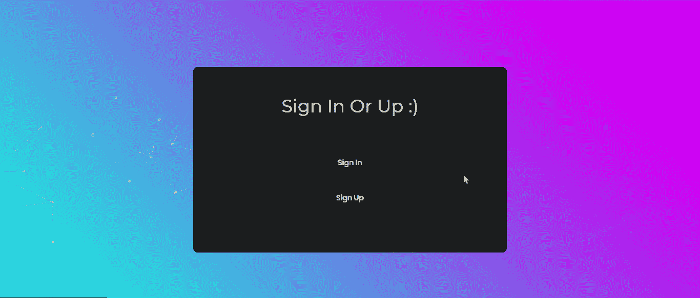

# 使用深度学习+ ReactJS 的面部识别登录系统

> 原文：<https://towardsdatascience.com/facial-recognition-login-system-using-deep-learning-reactjs-61bff981eb74?source=collection_archive---------14----------------------->

## 深度学习|反应

## 构建一个面部识别应用程序，可以作为登录阶段集成到任何系统中！


[安德烈·萨金塞夫](https://unsplash.com/@zvandrei?utm_source=medium&utm_medium=referral)在 [Unsplash](https://unsplash.com?utm_source=medium&utm_medium=referral) 上拍照

你一定在应用程序或网站中见过面部识别登录系统。如果您是应用程序开发人员或网站开发人员，您可能希望在您的系统中添加面部识别作为登录阶段。在这里，我们将从头开始构建一个非常容易适应的登录系统，您可以将其集成到任何应用程序或系统中进行登录。

我们将分两步建立这个系统。这些步骤包括创建一个包含我们深度学习模型的 Flask 服务器，并创建一个用于登录的 ReactJS 应用程序。ReactJS 应用程序可以在 Flask 服务器的帮助下与我们的深度学习模型进行通信。它可以发送人的图像，并且模型可以返回图像中人的真实身份。一旦我们开始编码，这些都将变得清晰。让我们进入编码部分，创建我们的登录系统。看看下图，消除对我们将要建立的系统的任何疑虑。



系统的简单流程

# 创建深度学习模型

*面部识别*和*面部验证*是两回事。面部识别涉及通过检测面部来识别图像中的人，而面部验证确定给定的两幅图像是否是同一个人。在这里，为了构建我们的登录系统，我们将需要一个模型，该模型可以从图像中检测人脸，并将*面部细节*转换为 128 维向量，我们稍后可以使用该向量进行面部识别或验证。

我们可以使用由[Hiroki tanai](https://github.com/nyoki-mtl)提供的 FaceNet 模型，这样我们就不必从头构建一个模型，也不必担心超参数。这个 FaceNet 模型已经在 [MS-Celeb-1M 数据集](https://www.microsoft.com/en-us/research/project/ms-celeb-1m-challenge-recognizing-one-million-celebrities-real-world/)上被训练，并且期望大小为 160x160 像素的彩色图像。模型可以从这里下载: [Keras FaceNet 预训练模型](https://drive.google.com/open?id=1pwQ3H4aJ8a6yyJHZkTwtjcL4wYWQb7bn)。

首先，让我们为包含深度学习模型的 Flask 服务器导入重要模块。

```
# Import all the necessary files!
import os
import tensorflow as tf
from tensorflow.keras import layers
from tensorflow.keras import Model
from tensorflow.python.keras.backend import set_session
from flask import Flask, request
from flask_cors import CORS
import cv2
import json
import numpy as np
import base64
from datetime import datetime
```

我们的 API 工作的一些重要步骤。你可以在这里了解更多关于我们为什么在 Flask [中使用会话的信息。](https://github.com/tensorflow/tensorflow/issues/28287#issuecomment-495005162)

```
graph = tf.get_default_graph()app = Flask(__name__)
CORS(app)sess = tf.Session()
set_session(sess)
```

最后，我们将加载我们的模型。

```
model = tf.keras.models.load_model('facenet_keras.h5')
```

让我们创建一个函数，将给定的图像转换成 128 维向量。这个函数将图像路径和我们的模型作为参数，并输出包含图像信息的向量。

```
def img_to_encoding(path, model):
  img1 = cv2.imread(path, 1)
  img = img1[...,::-1]
  dim = (160, 160)
  # resize image
  if(img.shape != (160, 160, 3)):
    img = cv2.resize(img, dim, interpolation = cv2.INTER_AREA)
  x_train = np.array([img])
  embedding = model.predict(x_train)
  return embedding
```

让我们创建一个存储人们身份的示例数据库。如果你愿意，你可以预先存储一些身份。您可以将一个人的图像作为参数提供给 *img_to_encoding* 方法以及模型，您将获得 128 维的向量，您可以将该向量作为一个值存储到数据库字典中，其中人的名字是关键字。

```
database = {}
database["Klaus"] = img_to_encoding("images/klaus.jpg", model)
database["Levi"] = img_to_encoding("images/captain_levi.jpg", model)
database["Eren"] = img_to_encoding("images/eren.jpg", model)
database["Armin"] = img_to_encoding("images/armin.jpg", model)
```

让我们创建一个函数，使用数据库返回图像中人的身份。它将如上所示为数据库中的所有条目和新图像计算距离，并找到最小距离。如果最小距离大于阈值，它将显示此人未注册，否则它将返回具有最小距离的身份。

```
def who_is_it(image_path, database, model):
    encoding = img_to_encoding(image_path, model)
    min_dist = 1000
    #Looping over the names and encodings in the database.
    for (name, db_enc) in database.items():
        dist = np.linalg.norm(encoding-db_enc)
        if dist < min_dist:
            min_dist = dist
            identity = name
    if min_dist > 5:
        print("Not in the database.")
    else:
        print ("it's " + str(identity) + ", the distance is " + str(min_dist))
    return min_dist, identity
```

最后，我们希望我们的 Flask 服务器完成两项任务:1)如果用户没有注册，就在数据库字典中注册用户 2)从图像中识别用户的身份。我们将为我们的 API 创建路由。首先，我们将创建一个从图像中识别用户并返回身份的路由。此路由将从 React 应用程序接收用户一次捕获的图像的 base64 数据，如果用户已注册，它将返回用户的身份，或者它将发送用户未注册的提示，以便我们的 React 应用程序知道是否登录。*注:如果你想知道使用 TensorFlow 会话背后的原因，请前往* [*此处*](https://github.com/tensorflow/tensorflow/issues/28287#issuecomment-495005162) *。*

```
app.route('/verify', methods=['POST'])
def verify():
    img_data = request.get_json()['image64']
    img_name = str(int(datetime.timestamp(datetime.now())))
    with open('images/'+img_name+'.jpg', "wb") as fh:
        fh.write(base64.b64decode(img_data[22:]))
    path = 'images/'+img_name+'.jpg'
    global sess
    global graph
    with graph.as_default():
        set_session(sess)
        min_dist, identity = who_is_it(path, database, model)
    os.remove(path)
    if min_dist > 5:
        return json.dumps({"identity": 0})
    return json.dumps({"identity": str(identity)})
```

上面我们为我们的目的创建了一个临时图像文件，在检查了用户的身份后，我们删除了它，因为它对我们没有用。我们在时间戳的帮助下命名这个文件。

是时候创建我们的第二条路线了，这条路线将把新人注册到数据库中。它将从 React 应用程序接收用户名和用户图像的 base64 数据。它将计算图像的 128 维向量，并将其存储到数据库字典中。如果注册成功，它将发送状态码 200，否则它将发送 500 状态码(内部错误)。

```
@app.route('/register', methods=['POST'])
def register():
    try:
        username = request.get_json()['username']
        img_data = request.get_json()['image64']
        with open('images/'+username+'.jpg', "wb") as fh:
            fh.write(base64.b64decode(img_data[22:]))
        path = 'images/'+username+'.jpg'global sess
        global graph
        with graph.as_default():
            set_session(sess)
            database[username] = img_to_encoding(path, model)    
        return json.dumps({"status": 200})
    except:
        return json.dumps({"status": 500})
```

这就是系统的深度学习部分。有可能你仍然不清楚这些将如何适应我们正在建立的系统。让我们来看看创建完我们的 Flask 服务器后系统的流程。


# 正在创建 ReactJS 应用程序

应用程序的前端编码不属于本项目的范围。这里不讨论前端的细节，但是您可以从项目链接下载完整的代码。主页将如下所示:


模板由 [Colorlib](https://colorlib.com/wp/template/login-form-v5/)

我们将讨论将在我们的应用程序中使用的两个重要的 React 组件— <verify>(用于登录)和<signup>(用于注册)。</signup></verify>

app.js 文件(包含<app>组件)将包含以下代码。</app>

```
import React, {Component} from 'react';
import './App.css';
import './css/main.css';
import './css/util.css';
import {Signup} from './signup.js';
import {Verify} from './verify.js';
export class App extends Component {
 constructor(props){
  super(props);
  this.state = {
   signup : false,
   verify : false
  };
  this.backhome = this.backhome.bind(this);
 }
 backhome(){
  this.setState({
   signup: false,
   verify: false
  })
 }
 signup(){
  this.setState({
   signup: true,
   verify: false
  })
 }
 verify(){
  this.setState({
   signup: false,
   verify: true
  })
 }
 render(){
  let home = (
    <div>
     <div className="limiter">
      <div className="container-login100">
       <div className="wrap-login100 p-l-110 p-r-110 p-t-62 p-b-33">
        <form className="login100-form validate-form flex-sb flex-w">
         <span className="login100-form-title p-b-53">
          Sign In Or Up :)
         </span>
         <div className="container-login100-form-btn m-t-17">
          <button onClick={this.verify.bind(this)} className="login100-form-btn">
           Sign In 
          </button>
         </div>
         <div className="container-login100-form-btn m-t-17">
          <button onClick={this.signup.bind(this)} className="login100-form-btn">
           Sign Up
          </button>
         </div>
         <div className="w-full text-center p-t-55">
          <span className="txt2">
          </span>
          <a href="#" className="txt2 bo1">
          </a>
         </div>
        </form>
       </div>
      </div>
     </div>
     <div id="dropDownSelect1"></div></div>)return (
      <div>
      {!this.state.signup && !this.state.verify ? home : ''}
      {this.state.signup ? <Signup backhome={this.backhome}/> : ''}
      {this.state.verify? <Verify backhome={this.backhome}/> : ''}
      </div>
  )
 }
}
export default App;
```

一些方法控制下一步呈现哪个组件。例如， *this.signup* 方法将更改状态值，以便呈现< Signup/ >组件。类似地， *this.verify* 方法将导致应用程序呈现< Verify/ >组件。 *this.backhome* 方法用于返回主页面。代码的其余部分不言自明。

让我们深入研究第一个组件<verify>(用于登录)。下面是 Verify.js 文件的代码。</verify>

```
import React, {Component} from 'react';
import './css/main.css';
import './css/util.css';
import './verify.css';
import Sketch from "react-p5";
const axios = require('axios');
let video;
export class Verify extends Component {
constructor(props){
  super(props);
  this.state = {
   verify : false,
   idenity: ' '
  };
 }setup(p5='', canvasParentRef='') {
        p5.noCanvas();
        video = p5.createCapture(p5.VIDEO);        
    }//to shut off the camera
stop(){
     const tracks = document.querySelector("video").srcObject.getTracks();
     tracks.forEach(function(track) {
        track.stop();
     });
    }logout(){
     this.stop();
     this.props.backhome();
    }setup2(){
     const button = document.getElementById('submit');
        button.addEventListener('click', async event => {
          video.loadPixels();
          console.log(video.canvas);
          const image64 = video.canvas.toDataURL();
          const data = { image64 };
          const options = {
            method: 'POST',
            headers: {
              'Content-Type': 'application/json'
            },
            body: JSON.stringify(data)
          };
          const response = await axios.post('[http://localhost:5000/verify'](http://localhost:5000/verify'), {'image64':image64});
          console.log(response.data.identity);
          if(response.data.identity){
           this.stop();
         this.setState({
          verify:true,
          idenity: response.data.identity
         })
          } else {
           this.stop();
           alert("Not a registered user!")
           this.props.backhome();
          }
        });
    }render(){let verify = (<div>
     <div className="limiter">
      <div className="container-login100">
       <div className="wrap-login100 p-l-110 p-r-110 p-t-62 p-b-33">

         <span className="login100-form-title p-b-53">
          Sign In With
         </span>
         <input/>
         <br/><br/><br/><br/><br/><br/><br/><br/><br/><br/><br/><br/><br/><br/>
         <Sketch setup={this.setup} draw={this.draw}/>
         <div className="container-login100-form-btn m-t-17">
         <button id="submit" onClick={this.setup2.bind(this)} className="login100-form-btn">
           Sign In
         </button>
         </div>
         <div className="container-login100-form-btn m-t-17">
         <button onClick={this.logout.bind(this)} className="login100-form-btn">
           Back!
         </button>
        </div>
       </div>
      </div>
     </div>
   <div id="dropDownSelect1"></div></div>
  )return (<div >
      {this.state.verify? <div><h1>Welcome, {this.state.idenity}.</h1>
       <button onClick={this.props.backhome} className="container-login100-form-btn">Logout!</button>
       </div> : verify }
      </div>)
 }
}
export default Verify;
```

为了捕捉用户的图像，我们将使用 [p5.js](https://p5js.org/) 库。您可以在这里[了解如何使用它](https://p5js.org/)或者您可以直接复制代码并运行它，因为没有必要为了这个特定的应用程序而学习整个库。从我们的服务器得到响应后，我们将关闭相机，并相应地渲染下一个组件。

下面是<verify>组件的第一个输出。</verify>


未经注册

我们得到了一个错误，因为我们首先需要注册我们的用户名和脸。为此，我们将创建如下所示的<signup>组件。</signup>

```
import React, {Component} from 'react';
import './css/main.css';
import './css/util.css';
import './signup.css';
import Sketch from "react-p5";
const axios = require('axios');
let video;
export class Signup extends Component {
 constructor(props){
  super(props);
  this.state = {
   signup : true
  };
 }
 setup(p5, canvasParentRef) {
        p5.noCanvas();
        video = p5.createCapture(p5.VIDEO);
        const v = document.querySelector("video");
        let st = "position: absolute; top: 255px;"
        v.setAttribute("style", st);
    }setup2(){
     const button = document.getElementById('submit');
        button.addEventListener('click', async event => {
          const mood = document.getElementById('mood').value;
          video.loadPixels();
          console.log(video.canvas);
          const image64 = video.canvas.toDataURL();
          const data = { mood, image64 };
          const options = {
            method: 'POST',
            headers: {
              'Content-Type': 'application/json'
            },
            body: JSON.stringify(data)
          };
          console.log(image64);
          const response = await axios.post('[http://localhost:5000/register'](http://localhost:5000/register'), {'image64':image64, 'username':mood});
          if(response.status==200){
      const tracks = document.querySelector("video").srcObject.getTracks();
      tracks.forEach(function(track) {
        track.stop();
      });
     };
           this.props.backhome();
          }
        );
    }
    logout(){
     const tracks = document.querySelector("video").srcObject.getTracks();
     tracks.forEach(function(track) {
        track.stop();
     });
     this.props.backhome();
    }render(){let signup = (
    <div>
     <div className="limiter">
      <div className="container-login100">
       <div className="wrap-login100 p-l-110 p-r-110 p-t-62 p-b-33">
         <span className="login100-form-title p-b-53">
          Sign Up With
         </span>
         <div className="p-t-31 p-b-9">
          <span className="txt1">
           Username
          </span>
         </div>
         <div className="wrap-input100 validate-input" data-validate = "Username is required">
          <input id="mood" className="input100" type="text" name="username" />
          <span className="focus-input100"></span>
         </div>
         <input/>
         <br/><br/><br/><br/><br/><br/><br/><br/><br/><br/>
         <br/><br/><br/><br/>{this.state.signup?<Sketch id="s" setup={this.setup} draw={this.draw}/>:''}

         <div className="container-login100-form-btn m-t-17">
          <button id="submit" onClick={this.setup2.bind(this)} className="login100-form-btn">
           Sign Up
          </button>
         </div>
         <div className="container-login100-form-btn m-t-17">
          <button onClick={this.logout.bind(this)} className="login100-form-btn">
           Back!
          </button>
         </div>      
       </div>
      </div>
     </div>
     <div id="dropDownSelect1"></div>
    </div>
  )
     return (<div >
      { signup }
      </div>
  )
 }
}
export default Signup;
```

当我们点击主页上的“注册”按钮时，摄像机将启动，用户将输入姓名，然后点击那里的“注册”按钮。该组件负责获取我们的用户名和图像，并将它们发送到我们之前创建的 Flask 服务器的'/register '路径。服务器会将我们的图像编码成 128 维向量，并将其存储在*数据库*字典中，以我们的用户名作为关键字，向量作为值。一旦我们的 React 应用程序获得状态 200，它将再次呈现主页，这表明用户已经成功注册。

下面是上面代码的输出。


报名

现在，注册后，我们应该能够登录没有任何失败。让我们再次尝试登录。



注册后成功登录

在登录阶段之后，可能会出现你想要的任何页面或网站。对于这篇文章，我一直保持简单。成功登录后，应用程序将简单地提示用户一条欢迎消息。

你可以从 [GitHub](https://github.com/jackfrost1411/facial-recognition-login) 获得上面显示的所有代码。你也可以在 [LinkedIn](https://www.linkedin.com/in/dhruvilshah28/) 上找到我。

# 结论

我们看到了如何集成深度学习和 ReactJS 来构建一个简单的面部识别登录应用程序。这个应用程序应该是你想要的任何应用程序或网站的登录阶段。成功登录后，您可以自定义下一阶段。

我们使用深度学习来为我们的应用程序进行人脸识别和验证，但我们必须经历加载模型和管理图像的过程。我们也可以使用预编程库。JavaScript 的节点包管理器(npm)中有一个叫做 *face-api.js* 的模块，是在 TensorFlow 上面实现的。你可以在这里查看这个库。


照片由[阿曼达·达尔比约恩](https://unsplash.com/@amandadalbjorn?utm_source=medium&utm_medium=referral)在 [Unsplash](https://unsplash.com?utm_source=medium&utm_medium=referral) 上拍摄

总之，面部识别领域发展非常迅速，这篇文章展示了一种非常简单的方法，与像[脸书](http://www.facebook.com)这样的公司在行业中使用的方法相比。高度先进的面部识别系统可以通过观察面部来检测人的情绪，或者检测性别，甚至估计人的年龄。