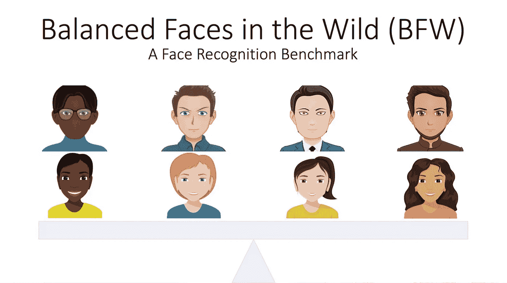
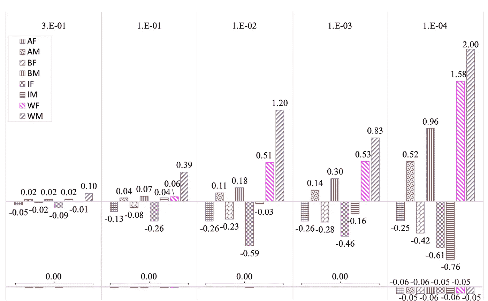
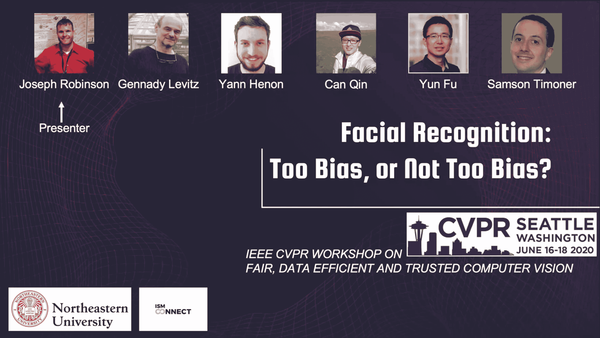

# 面部识别:让人可以信任的 AI！

> 原文：<https://towardsdatascience.com/facial-recognition-too-biased-or-not-too-biased-ai-that-people-can-trust-5be1fdc24c77?source=collection_archive---------82----------------------->

优先考虑性别、种族和身份平衡的人脸验证数据。

## 人工智能中的偏倚问题:标记人脸和基准数据集

我们的报纸— [FR:太偏向，还是不太偏向？](https://arxiv.org/pdf/2002.06483.pdf) —作为与 [2020 年计算机视觉和模式识别会议](http://cvpr2020.thecvf.com/) (CVPR)同时举行的[公平、数据高效和可信计算机视觉研讨会](https://fadetrcv.github.io/)的一部分发布。

这个简短教程的目的是向读者提供以下内容:

1.  ***高层对论文的理解*** —回答*那又怎样？谁在乎呢。*
2.  ***通过分享我在主观问题上的观点来增加教程的趣味***——当然，这并没有包括在我们发表的论文中。
3.  **提供*一站式资源*。作为这项工作的一部分，我们不仅提供论文，还以易于使用的结构和源代码(主要是 Python)提供数据。作为代码库的一部分，有几个笔记本举例说明了这项工作的各个方面(例如，论文中的每个图都有一个笔记本，提供了一种快速复制的方法)。**

(3)的几个组成部分被列在写博客的*待办事项*清单上。换句话说，在接下来的几个星期里，预计教程将会被非常详细地分享(也就是说，通常比实际的论文更详细)，而且大部分是作为独立的博客。完成后，每个链接将在此处列出。

# 目录

1.  [论文摘要](https://medium.com/p/5be1fdc24c77#6a7a)
2.  [AI 中的偏见为何是福:半空；半满？](https://medium.com/p/5be1fdc24c77#8e6e)
3.  [观看论文展示(2020 年 CVPR)](https://medium.com/p/5be1fdc24c77#46b9)
4.  [相关参考文献](https://medium.com/p/5be1fdc24c77#4a57)

# 论文摘要

在论文中，我们提出了一个针对 FR 中偏倚问题的解决方案(即人脸验证，一对一设置)。然而，由于缺乏标记数据，我们建立并发布了野外(BFW)平衡人脸数据集——一个在身份，种族和性别方面平衡的人脸验证基准。我们探索 BFW 揭示偏见的证据，并通过应用基本信号检测理论的概念获得洞察力。最后，我们对数据进行了基准测试，确定了少数民族人口统计数据(例如，亚洲女性和印度男性)的表现确实存在偏差，而大多数人(例如，白人男性和白人女性)的表现存在明显的百分比差异。为了减轻不平衡性能，我们提出了一个滑动阈值，证明能够完全消除偏斜(即，从与预期 FPR 的百分之几的差异下降到 0%)。我们还包括一个实验，该实验显示了人类中的相同类型的偏差(即，我们评估了人类并按人口统计进行了分析，显示了在感知自己的子群中的差异时的有利表现)。下图列出了我们论文中的一个关键结果。

与预期 FPR 的百分比差异。*顶部:全局阈值(t_g)产生的 FPR 跨度为预期值(即 1e-4 的 WM)的 2 倍(即 200%)。此外，女性 F 组的表现评分总是低于男性 M 组。除了 1e-4 列中的 IM，其下降到最低的负%差。下图:特定于亚组的阈值将这种差异降低到几乎为零，在有小差异的地方，不同亚组之间的%差异现在是平衡的，因此是公平的。*

图的顶部显示了每个子组的预期 FPR 与实际的百分比差异。为了避免过于深入本文的任何一个方面(即，受制于未来的教程)，让我们继续前进。在任何情况下，如果读者感兴趣的话，我们鼓励你仔细看看这篇文章，看看这个图的演示代码，或者在下面的评论区提出问题或想法！

我们希望 BFW 建立一个据点，为不同分组(和平衡)的 FR 性能的当前状态进行评估。换句话说，我们需要代理来衡量偏差，我们在构建时必须特别严格，因为各种来源都有可能产生偏差。

以下是几个相关链接。欢迎任何和所有请求—我们不仅会尽力提供，而且会相应地更新所有材料。

因此，我们希望发布的代码、演示笔记本以及对问题的更深入理解和建议的解决方案。不管怎样，数据现在可以下载了！只需填写表格，下载链接将被共享。

*   BFW 人脸识别工具(即 [Github](https://github.com/visionjo/facerec-bias-bfw)
*   数据下载表格(即 [BFW 登记表](https://forms.office.com/Pages/ResponsePage.aspx?id=DQSIkWdsW0yxEjajBLZtrQAAAAAAAAAAAAMAAMDJhXxUMElHQ0tVSDFSNDZTMVBPSVpXMkxJTkY4Ny4u)
*   作者联系方式(即[个人网页](https://www.jrobsvision.com/)

下面的 GIF 给出了项目关键方面的一些快照。

在演示文稿中快速浏览几张重要幻灯片的 GIF 图片。

# 半空？还是半满的？

个人对这个话题的整体看法——无论是在实际研究中，主流媒体以非专家理解的方式传播，还是作为企业家投资——偏见是这些天来讨论的一件大事，事实就是如此。

等等，我是认真的吗？bias ML 有什么了不起的地方？这怎么可能是“大事”？是的，是的，和容易，分别。我是认真的！作为一名全职的 ML 研究员，从我记事起，我就是一名兼职的历史学生。事实上，我的第一次教学经历是在《美国历史 I》和《美国历史 II》中(有趣的事实:生活中肯定有更多的关卡，我预见到自己的职业目标是成为一名政治科学家)。

这不是历史上第一次出现像偏见这样的现象；我们终于有了一种可以观察、量化和指出偏见的机制。，同时没有强加的个人指责，而是客观的机制，我们可以使用科学方法和相关的统计措施来衡量、分析和理解。

尽管如此，这个话题肯定会在适当的时候出现在自己的博客上。因此，请注意，我欣赏这个问题，而不是因为它引入的问题，因为没有问题是第一次被引入。然而，最后，我们有了衡量偏见的机制，而不需要将某人称为个人偏见(即，它是 ML 机制，而不是编码者)。最后，我们可以解决一个可以追溯到人类起源的问题。此外，我们现在可以以透明的方式解决问题，并且适合期望的结果——因为可能永远不会有一刀切的 ML 解决方案；然而，肯定会有适合特定用例的解决方案。因此，对我们来说，更重要的是意识到偏差，寻求可解释的结果和对系统偏差的理解，以便它可以被解决以适合特定的应用，或者它可以被部署，但不能更深入地理解为什么相应的 AI 会做出决定。你感觉如何？

# 论文展示(2020 年 CVPR)

你可能听说过，2020 年的 CVPR 将完全是虚拟的。因此，我们对这份文件的介绍也是如此。事实上，我们必须在早期(即昨天)提交视频演示。这更像是一个轻松的演讲，因为整个报告只需要几分钟(即大约 5 分钟)就可以完成。尽管如此，我们还是希望这份报告的水平足够高，能够阐明该报告旨在解决的大问题。

Github 上有复制所有已报道实验的代码，以及一些补充内容(例如，[https://github.com/visionjo/facerec-bias-bfw](https://github.com/visionjo/facerec-bias-bfw))。此外，通过此[表单](https://forms.office.com/Pages/ResponsePage.aspx?id=DQSIkWdsW0yxEjajBLZtrQAAAAAAAAAAAAMAAMDJhXxUMElHQ0tVSDFSNDZTMVBPSVpXMkxJTkY4Ny4u)下载面部图像(即 BFW 数据库)。

欢迎任何问题、评论和请求！我们希望其他人也能利用这一努力。

这里有一组被发现有趣的媒体内容(即相关作品)。

# 相关参考文献

*   [减轻预测正义中的算法偏差:人工智能公平的 4 个设计原则](/mitigating-algorithmic-bias-in-predictive-justice-ux-design-principles-for-ai-fairness-machine-learning-d2227ce28099)，作者[维亚切斯拉夫·波隆斯基博士](https://medium.com/u/ba50eee34de9?source=post_page-----5be1fdc24c77--------------------------------)
*   [不偏不倚的可编程公平遇上区块链:方排队 IEO 5 月 1 日开始](https://medium.com/@exmarkets/impartial-programmable-fairness-meets-blockchain-square-queue-ieo-begins-on-may-1st-42ee2915eb94)，由[ExMarkets.com](https://medium.com/u/6ef3b3447363?source=post_page-----5be1fdc24c77--------------------------------)
*   [什么是“公平”？](https://medium.com/message/what-is-fairness-73940071840)，作者[丹娜·博伊德](https://medium.com/u/ce5e55092c08?source=post_page-----5be1fdc24c77--------------------------------)
*   [让公平成为机器学习的固有部分](https://medium.com/@ODSC/making-fairness-an-intrinsic-part-of-machine-learning-5773574ae93e)，作者 [ODSC -开放数据科学](https://medium.com/u/2b9d62538208?source=post_page-----5be1fdc24c77--------------------------------)
*   [减少数据科学中的偏见并确保公平](https://medium.com/civis-analytics/reducing-bias-and-ensuring-fairness-in-data-science-424ded3badbb)，作者[亨利·欣内菲尔德](https://medium.com/u/201bb5f48c7?source=post_page-----5be1fdc24c77--------------------------------)
*   [解释公平的衡量标准](/explaining-measures-of-fairness-f0e419d4e0d7)，作者[斯科特·伦德伯格](https://medium.com/u/3a739af9ef3a?source=post_page-----5be1fdc24c77--------------------------------)
*   [机器学习模型在实践中的公平性](https://medium.com/swlh/machine-learning-model-fairness-in-practice-bdebeaa76ee8)，由 [ODSC -开放数据科学](https://medium.com/u/2b9d62538208?source=post_page-----5be1fdc24c77--------------------------------)
*   [和谐主题演讲:衡量隐私、安全赌注、激进公平](https://medium.com/harmony-one/harmony-keynote-scaling-privacy-secure-staking-radical-fairness-17fe52a797ea)，演讲人[谢霆锋](https://medium.com/u/25568c6f4446?source=post_page-----5be1fdc24c77--------------------------------)
*   [DeepMind 正在使用这种旧技术来评估机器学习模型中的公平性](/deepmind-is-using-this-old-technique-to-evaluate-fairness-in-machine-learning-models-f33bce98196e)，作者是 [Jesus Rodriguez](https://medium.com/u/46674a2c9422?source=post_page-----5be1fdc24c77--------------------------------)
*   [机器学习公平教程](/a-tutorial-on-fairness-in-machine-learning-3ff8ba1040cb)，作者[钟子元](https://medium.com/u/7f7e630c5d74?source=post_page-----5be1fdc24c77--------------------------------)

一定要看看并分享你对这个博客或其他任何方面的想法。或许分享你偶然发现或想到的资源。这里，同样，是组成项目的组件。以下是论文、数据和源代码的下载链接:

*   BFW 人脸识别工具(即 [Github](https://github.com/visionjo/facerec-bias-bfw) )
*   数据下载表格(即 [BFW 登记表](https://forms.office.com/Pages/ResponsePage.aspx?id=DQSIkWdsW0yxEjajBLZtrQAAAAAAAAAAAAMAAMDJhXxUMElHQ0tVSDFSNDZTMVBPSVpXMkxJTkY4Ny4u)
*   作者联系方式(即[个人网页](https://www.jrobsvision.com/)

如果你喜欢这篇文章，那就去 LinkedIn 上联系吧，因为我倾向于分享大多数博客帖子的链接(也就是说，关注最新最棒的:))！

感谢阅读，我希望它至少在一个方面让你受益——不要有偏见，但这可能是我最喜欢的有偏见的博客😜