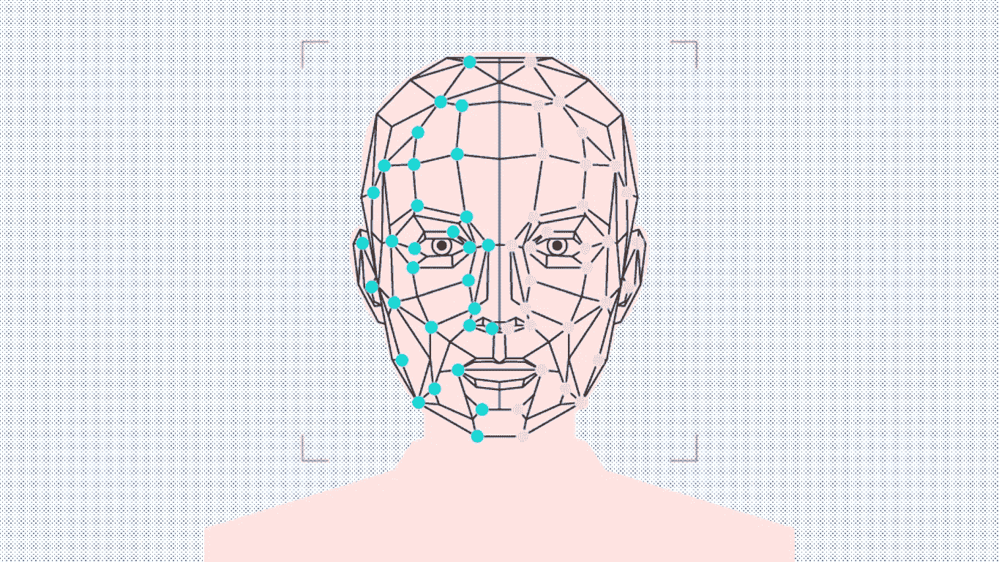
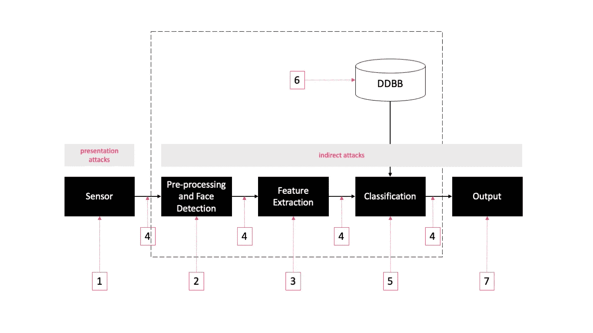
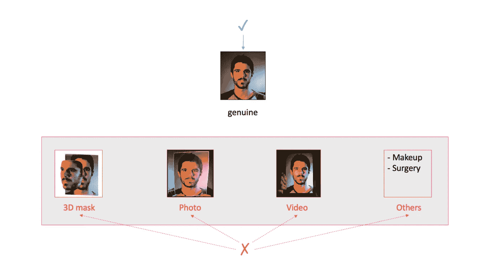
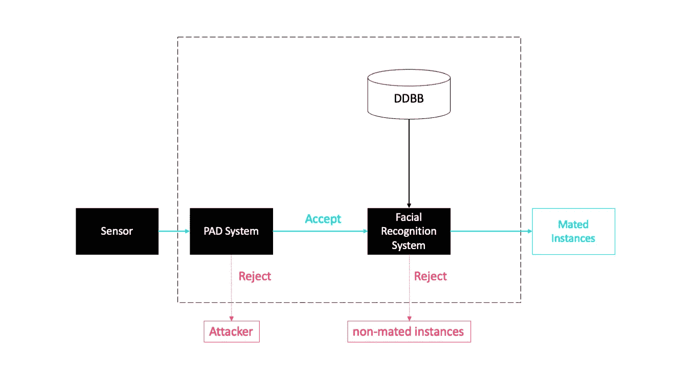

# 面部识别:攻击类型和反欺骗技术

> 原文：<https://towardsdatascience.com/facial-recognition-types-of-attacks-and-anti-spoofing-techniques-9d732080f91e?source=collection_archive---------14----------------------->

## [数据隐私](https://towardsdatascience.com/tagged/data-privacy)

## 破除人脸识别易造假的神话

作者图片

由于技术的快速发展，特别是在计算机科学和电子学方面。如今，就市场份额而言，面部识别正在成为仅次于指纹的世界第二大部署最广泛的生物认证方法。每天都有越来越多的制造商在他们的产品中加入人脸识别，例如苹果公司的 Face-ID 技术，银行为入职流程实施 eKYC 解决方案。

与人脸识别研究的主要目的是提高验证和识别任务的性能相反，人脸识别系统的安全弱点在过去很少被研究，并且仅在最近几年，一些注意力被给予检测不同类型的攻击，包括检测生物特征是来自活人还是假货。

# 面部识别系统上使用的两种攻击

作者图片

如上图所示，有七个模块和点可以成为攻击的目标，它们分为两种类型:呈现攻击和间接攻击。

## 演示攻击

表示攻击在传感器级(1)执行，无需进入系统内部。

演示攻击与纯粹的生物特征漏洞有关。在这些攻击中，入侵者使用某种类型的人工制品，通常是人造的(例如，面部照片、面具、合成指纹或打印的虹膜图像)，或者试图模仿真实用户的外貌(例如，步态、签名)来欺骗性地访问生物特征识别系统。

因为“生物特征不是秘密”，攻击者意识到这一现实，即大量的生物特征数据暴露在外，显示人的面部、眼睛、声音和行为，因此他们利用这些信息来源，试图利用以下示例来绕过面部识别系统。

*   攻击者使用用户的照片进行伪装。
*   他们使用用户的视频来模仿。
*   或者黑客可以构建并使用受攻击面部的 3D 模型，例如超逼真的面具

我们使用反欺骗技术来防止这些攻击。

## 间接攻击

间接攻击(2–7)可以在匹配的数据库、通信渠道等处进行。在这种类型的攻击中，攻击者需要访问系统内部。

间接攻击可以通过与“经典”网络安全相关的技术来防止，而不是生物识别技术，所以我们不会在本文中讨论它们。

# 攻击方法

如果不实施表示攻击检测措施，大多数最新的面部生物识别系统都容易受到简单的攻击。

通常，通过向摄像机呈现目标人的照片、视频或 3D 面具，可以欺骗人脸识别系统。或者使用化妆或整形手术。然而，由于高分辨率数码相机的高曝光率和低成本，使用照片和视频是最常见的攻击类型。

*   ***照片攻击*** :照片攻击包括向人脸识别系统的传感器显示被攻击身份的照片。
*   ***视频攻击*** :攻击者可以在任何再现视频的设备中播放合法用户的视频，然后将其呈现给传感器/摄像头。
*   ***3D Mask 攻击*** :在这种类型的攻击中，攻击者构建人脸的 3D 重建，并将其呈现给传感器/摄像头。
*   ***其他攻击*** :化妆、手术

作者图片

# 反欺骗技术

因为大部分的人脸识别系统很容易被欺骗手段攻击。因此，为了在真实场景中设计安全的人脸识别系统，从系统的初始规划开始，反欺骗技术就应该是重中之重。

由于人脸识别系统试图区分真正的用户，而不是确定提交给传感器的生物样本是真是假。我们可以用以下四种不同的方法来做。

## 传感器

我们使用可用的传感器来检测信号中任何具有活体特征的模式。

## 专用硬件

使用专用硬件来检测活性的证据，例如 3D 摄像机，但是并不总是能够部署。

## 挑战-应答法

使用质询-响应方法，通过请求用户以特定方式与系统交互，可以检测到表示攻击。

*   笑容
*   悲伤或快乐的面部表情
*   头部运动

## 算法

使用以下识别算法本质上对攻击具有鲁棒性。

**镜面特征投影:**首先，通过刻画真品图像对应的镜面特征空间，并在此基础上学习真品和仿冒品数据的投影。接下来，对应于真实投影、3D 掩模投影和印刷照片投影来训练 SVM 模型，然后将该模型用作检测模仿的反欺骗模型。

**深度特征融合:**通过深入研究人脸图像颜色特征信息对人脸检测的重要性，利用深度卷积神经网络 ResNet 和 SENet 构建深度特征融合网络结构，对涉及的人脸反欺骗数据进行有效训练。

**图像质量评估:**该方法基于图像质量度量的组合。该解决方案将原始图像与经过处理的图像进行比较。

**深度学习**:该方法基于多输入架构，结合了预训练的 CNN 模型和本地二进制模式描述符。

 [## 生物认证方法

### 指纹、面部识别、手形、虹膜识别、视网膜识别、语音识别、按键…

towardsdatascience.com](/biometric-authentication-methods-61c96666883a) 

# 如何实施？

我们可以使用反电子欺骗技术构建一个演示攻击检测系统(PAD ),并将其与面部识别系统集成。

通过这种方法，反电子欺骗系统首先做出决定，只有当样本被确定为来自活人时，它们才由人脸识别系统进行处理。

很简单，对吧？