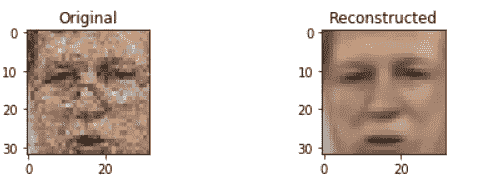
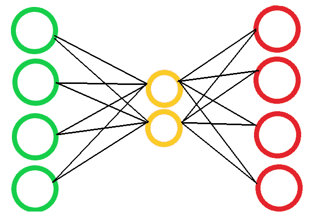
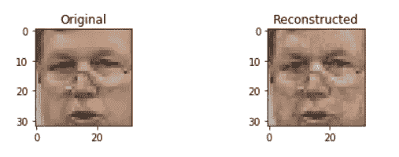
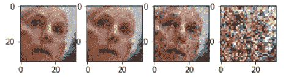
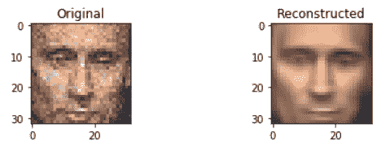

# 使用自动编码器的面部重建

> 原文：<https://towardsdatascience.com/facial-reconstruction-using-autoencoders-ed945def10df?source=collection_archive---------49----------------------->

## 了解如何从头开始使用自动编码器重建图像/消除图像噪声

作者图片

你们中的许多人可能已经目睹了面部识别或重建在犯罪剧或间谍惊悚片中的应用。是的，它有助于解决一个案件，所以为什么不建立自己的。在本文中，我们将关注如何从包含噪声或受损的图像中重建人脸。这也被称为图像去噪。使用无监督的深度学习技术，或者更确切地说是自动编码器的自我监督的深度学习技术，这个程序有助于重建或消除面部图像的噪声。

作者图片

# 什么是自动编码器？

顾名思义，自动编码器对自身进行编码。它接受输入，并使它们通过隐藏层，这些隐藏层应该给出与输入相似的输出。因此，整个目标是从输出得到相同的结果。自动编码器有两个组件，即编码器和解码器。编码器负责将输入数据压缩成较小的编码。而解码器学习构建输出，与使用编码的输入相同。从推荐系统到分类问题，它们都有广泛的应用。这里，我们将使用卷积自动编码器(CAEs ),它建立在标准网络组件上，即卷积层和跳跃连接，其性能优于采用对抗训练和复杂损失函数的最先进方法。

# 数据:数据集和预处理

我们将在这个项目中使用 [LFW 数据集](http://vis-www.cs.umass.edu/lfw/#download)。这是一个人脸照片数据库，旨在研究无约束人脸识别问题。该数据集包含从网络上收集的 13，000 多张人脸图像。每张脸上都贴有照片中人的名字。1680 名照片中的人在数据集中有两张或更多不同的照片。对于预处理，我们将原始矩阵转换为从数据集获得的图像，并将颜色系统转换为 RGB。我们还会考虑与面部图像相关的各种属性，如鼻子的形状、浓妆、微笑等。

# 构建模型

作者要点

在这里，我们构建了一个定制的模型构建器，在这里我们可以指定图像尺寸和输出表示。我们使用了一个基于 Keras 的模型，因为它很容易应用。在代码片段中， ***img_shape*** 表示图像尺寸， ***code_space*** 是输出表示的尺寸。

需要适当地选择 ***code_space*** 作为较小的数字，它将压缩图像那么多，但是较少的特征将被考虑，我们将不能得到准确的结果。在这段代码中，我取了一个 10000 的 ***code_space*** 进行演示。

我们在同一个函数中分别建立编码器和解码器，它们分别是一个单层的神经网络。

# 培训和测试

作者要点

既然模型准备好了，数据也处理好了，那么就该训练了！

我们将在数据集中存在的常规人脸上训练该模型，目的是该模型将重建相同的人脸。我尝试用不同数量的时期来可视化结果。我最终得出结论，在训练损失为 0.0020，测试损失为 0.0025 的情况下，20 个历元足以获得一个好结果。

作者图片

现在我们有了一个足够好的模型，我们将尝试在原始图像中添加噪声，并通过我们的模型进行映射，以给出一个更清晰的图像。对于添加噪声，我们将使用高斯噪声的方法，并在其上重新训练模型。

作者图片

在重新训练该模型以将有噪声的图像映射到更清晰的图像之后，我们在 25 个时期之后得到训练损失以及 0.0038 的测试损失。可视化结果如下:

作者图片

# 自动编码器的更多应用

自动编码器在同一领域的另一个很酷的应用是制作[**【deep fakes】**](https://github.com/aerophile/awesome-deepfakes)**。**这可用于多种方式，如编码器和解码器来自不同型号的人脸互换。

自动编码器的另一个应用是推荐系统，在该系统中，它可以根据用户之前评论的电影，对电影进行精确评级，比如说 1-5 级。

其他应用包括降维、图像压缩(也用于本例)、特征提取、图像生成和序列间预测。

# 源代码和其他资源

查看我的 GitHub 上的全部代码，以及数据集的相关链接。

 [## iishipatel/面部重建器-DL

### 使用无监督的深度学习技术或者更确切地说是自动编码器的自我监督的深度学习技术，这…

github.com](https://github.com/iishipatel/Face-Reconstructor-DL) 

自动编码器的附加阅读链接。

 [## 在 Keras 中构建自动编码器

### 在本教程中，我们将回答一些关于自动编码器的常见问题，我们将涵盖代码的例子…

blog.keras.io](https://blog.keras.io/building-autoencoders-in-keras.html)  [## 利用标准卷积自动编码器的潜力进行图像恢复…

### 研究人员已经将深度神经网络应用于图像恢复任务，其中他们提出了各种网络…

arxiv.org](https://arxiv.org/abs/1803.00370)