# 地学中使用无监督机器学习的相分类

> 原文：<https://towardsdatascience.com/facies-classification-using-unsupervised-machine-learning-in-geoscience-8b33f882a4bf?source=collection_archive---------15----------------------->

## 石油和天然气领域的数据科学

## 利用 K-均值聚类理解地球结构

岩相是在给定沉积环境中，在相对均匀的水动力机制作用下沉积的，在物理特征(如沉积结构、粒度)方面彼此完全不同的均匀沉积岩石体。基于这些性质的不同类型的相包括沉积相、岩相、地震相等。

在这些岩石单元中发现的物理和有机特征通常为该地区可能发生的不同过程和系统(如沉积环境)提供了一些见解。几个相与物理模型和其他地质数据的组合可以帮助提供地质区域的信息性低维模型，从而更好地洞察该区域的地质情况。

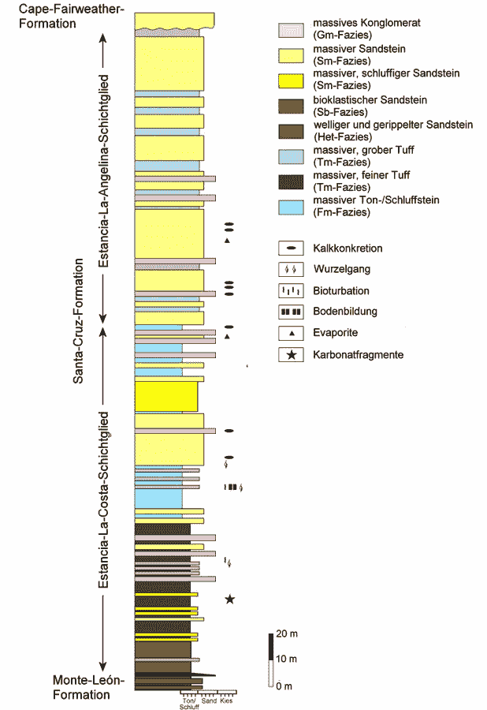

摘自 [Wikimedia](https://commons.wikimedia.org/wiki/File:Geology_Santa_Cruz_Formation.png) :地质构造中相分类的一个例子。

在石油和天然气勘探中，沉积环境的知识至关重要，因为它有助于提供有关石油系统的良好画面。石油系统由源岩(富含有机物的岩石，如果充分加热，会产生碳氢化合物)、储集岩(一组岩石单元，保存从源岩迁移的碳氢化合物储量)和密封岩(相对不渗透的岩石单元，在储集岩周围形成屏障，防止碳氢化合物迁移到储层之外)。例如，具有砂岩单元的一系列相可能是良好储层的标志，因为它们往往具有高渗透性和多孔性，是储存碳氢化合物的理想条件。被称为瓦尔特相定律的一般规则规定，相的垂直连续反映了沉积环境的横向变化，即岩石记录中的两个相邻相必须在地层中横向沉积。因此，可以通过观察包含储层单元的相的横向范围和几何形状来估计地质储量。

关于地下岩石的主要数据来源有多种，其中大部分涉及钻井。相分类的理想数据源是从钻井中获得的岩心(岩石)样本，因为它们允许直接评估沉积结构。然而，获得这些是昂贵的，并且由于成本的原因，在某些情况下并不总是可行的选择。在这些情况下，间接测量是必要的。在这项研究中，我将重点关注电缆测井。电缆测井包括将仪器下入井眼并记录测量值的过程，这些测量值详细描述了周围岩石和流体随深度变化的物理特性。这是一种评估储层的方法，因为它有助于区分含油、气和水的地层，确定孔隙度，以及每个地层中存在的碳氢化合物的大致数量。

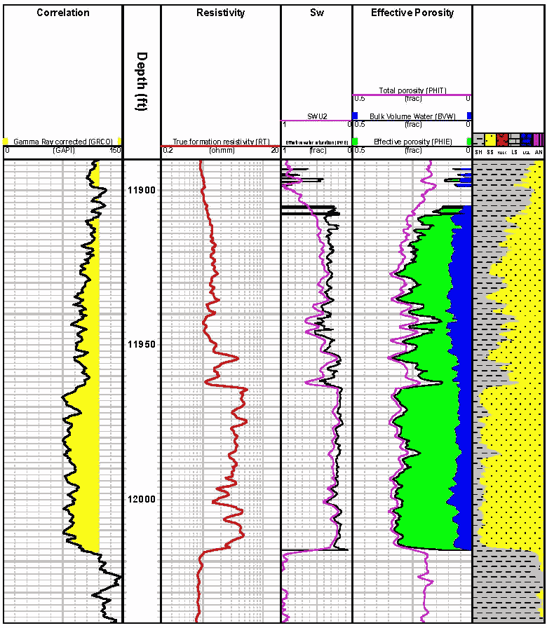

摘自[维基百科](https://en.wikipedia.org/wiki/File:Wikipedia_petrophysics_figure_1.jpg):一些常见岩性的测井响应示意图。页岩(SH)和砂岩(SS)如图所示。

为了使用测井数据分配相，需要分析员分析记录并确定深度的近似岩性。对于较大的数据集，这可能会变得非常繁琐，并且在时间上非常低效。因此，这一过程的自动化是必要的，并且可能有助于给出区域地质的快速且相当准确的图像。我将使用 K-means 聚类演示无监督学习如何帮助这个过程。

# 学习区

分析集中在美国堪萨斯州的西北地区，特别是森林城市盆地。该盆地主要是一个浅层油气区，有一些煤炭生产。

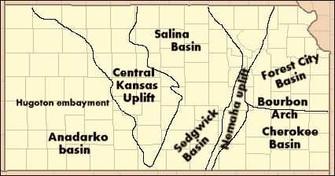

摘自[维基百科](https://en.wikipedia.org/wiki/File:Kansas_Structure_Map.png):堪萨斯州主要地形盆地的地下地质结构

我的重点是森林城市盆地内的 Nemaha 地区，该地区已知有石油和天然气，并在那里钻了几口井。该数据由堪萨斯州地质调查局提供，该机构拥有该地区不同油井的公共记录(请参见 https://www.shalexp.com/kinney-oil-company[了解更多油井详情)。](https://www.shalexp.com/kinney-oil-company)

从[获取 **LAS** 文件格式的测井记录，并检查数据质量和完整性。选择的标准是存在八条被认为是分析所必需的曲线。下表显示了相关曲线及其提供的关于岩层的特性。这些值都是以英尺为单位测量的深度的函数。](http://www.kgs.ku.edu/PRS/Scans/Log_Summary/index.html)

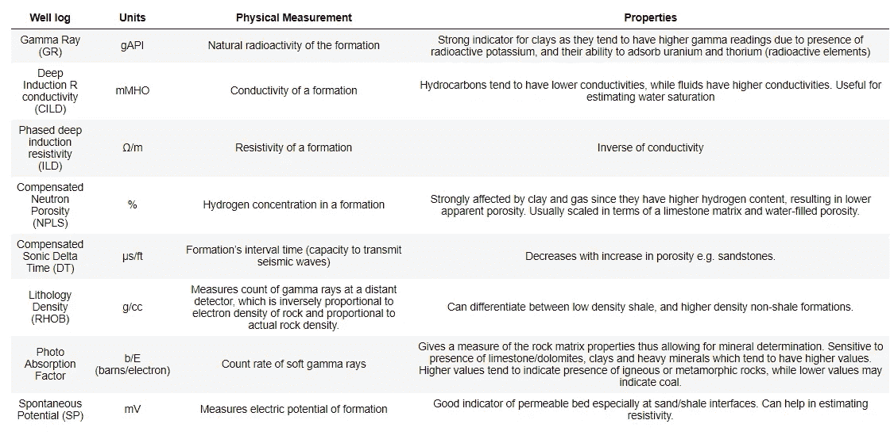

记录工具及其属性的列表

使用各种各样的测井记录是有用的，因为它们不仅提供地层的岩性、孔隙度和电导率等属性信息，而且相互结合使用，可以在个别测井记录可能失效的情况下更好地执行，从而提高岩性估计的准确性。我分析了几口井，能够获得 6 口具有所需曲线的井。然后，将不同孔的这些曲线合并成一个 CSV 文件进行处理。井名和每个深度的地层也包括在内。在 http://www.kgs.ku.edu/Magellan/Qualified/index.html[获得地层信息](http://www.kgs.ku.edu/Magellan/Qualified/index.html)。属于金内石油公司的油井

# 数据预处理和清洗

对原始数据进行描述性统计，以确定缺失值和潜在异常值的存在。剔除异常值至关重要，因为异常值的存在会增加数据的可变性，使实验结果不太可能具有统计学意义。

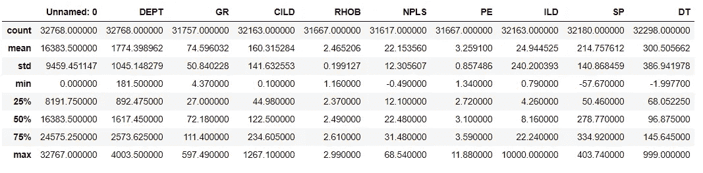

原始测井数据的描述性统计

不同测井记录的计数不同，这表明某些测井记录缺少数值。此外，一些不含数据的测井记录的数值为 999。通常，缺失值的问题可以通过输入可用值的平均值或中值来解决。然而，地质情况可能相当复杂，简单地用平均值替换缺失值可能无法反映实际地质情况。缺失值总数只占总数据的一小部分，所以它们被删除了。未命名的列也被删除，因为它对应于数据测量的索引。


剔除缺失值后测井数据的描述性统计

# 移除异常值

因此，缺失数据已被删除，但如果我们注意每个测井记录的最大值，我们会注意到一些最大值明显大于平均值的情况，这是异常值的危险信号。让我们直观地检查一下这些数据。

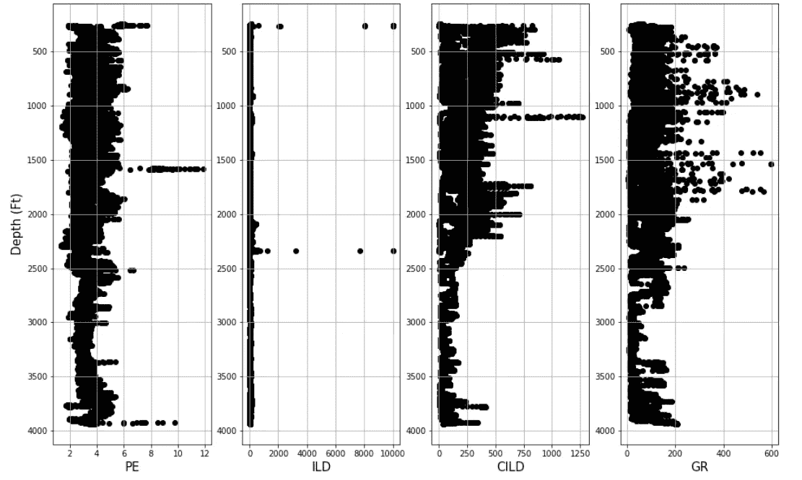

作为深度函数的测井记录

我们可以看到一些数据，这些数据明显大于某些测井的总体数据，特别是在电阻率测井(**【ILD】**)中。请注意， **ILD** 的值高达 10，000ω/m，这在某些岩性中确实存在。但大多数岩石类型的电阻率值都在一个范围内，高达 10000ω/m 的值也包含该范围内的 2000ω/m。根据相对较低的高值出现率来判断，移除这些值可能会改善聚类结果。使用 **ILD** 曲线作为参考点，我发现保持落在 99.95 分位数内的值导致 **ILD** 的截止值约为 2000ω/m。它足够温和，以尽量减少数据丢失。

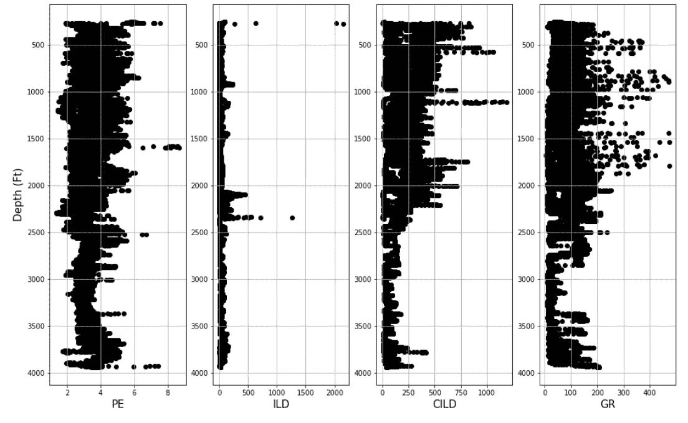

剔除异常值后作为深度函数的测井记录

由于某些岩性可能导致某些物理测量中的大峰值(例如 **ILD、CILD)** ，因此选择了自然测井，以最小化测量值的可变性。这适用于 **ILD** 和 **CILD** 测井，因为它们的数值范围很大。最后，处理后的日志被保存到 CSV 文件中。

# k 均值聚类

在预处理数据之后，重要的是进行一些特征选择，以确保更快的训练，以及降低我们的模型的复杂性和提高准确性。在我们的数据集中，我们有两个日志提供非常相似的信息；电阻率( **ILD** )和电导率测井( **CILD** )。我们可以通过检查日志之间的相关性来验证这一点，看看它们的相关性有多强。

```
features.corr() # compute correlation between the well log curves
```

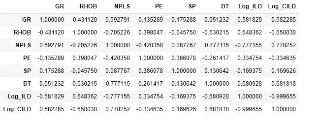

测井数据的相关矩阵

虽然有一些高相关值，但对于这项研究，0.8 及以上的相关性被认为具有统计学意义。我选择了一个高值，因为一些测井记录在岩性方面测量非常相似的属性，但它们也有重要的差异，可以帮助区分不同的岩性。对数电阻率和电导率值具有近乎完美的相关性，即它们给我们的信息基本相同。电导率因此从特性列表中删除。

接下来，使用 *sklearn* 软件包中的 *scale* 模块对数据进行缩放。k-means 聚类的问题是我们不知道哪种聚类分离是我们数据的最准确表示。因此，我采用了两种技术，可以让我们了解最佳的集群大小。

让我们从肘部技巧开始。此方法对指定数量的聚类运行 K-means 聚类，并计算平方和，即聚类中每个点与其指定的聚类质心之间的差异之和。最佳聚类通常被选择为这样的点，在该点处平方和最小，并且增加聚类的后续变化最小。让我们对大小从 1 到 12 的集群进行分析

```
wcss = []  # Store within sum of square values for each cluster sizecl_num = 12 # Total number of clusters
for i in range (1,cl_num):
    kmeans = KMeans(i, random_state=10) 
    kmeans.fit(x_scaled)
    wcss_iter = kmeans.inertia_ # calculates the wcss
    wcss.append(wcss_iter)
wcss
```

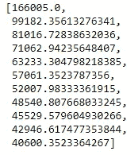

在所使用的每个聚类数的平方和内计算

接下来，我们将这些值绘制成所用聚类数的函数

```
number_clusters = range(1,cl_num)
plt.figure(figsize=(10,8))
plt.plot(number_clusters, wcss, '*-')
plt.xlabel('Number of clusters',fontsize=20)
plt.ylabel('Within-cluster Sum of Squares',fontsize=20)
```

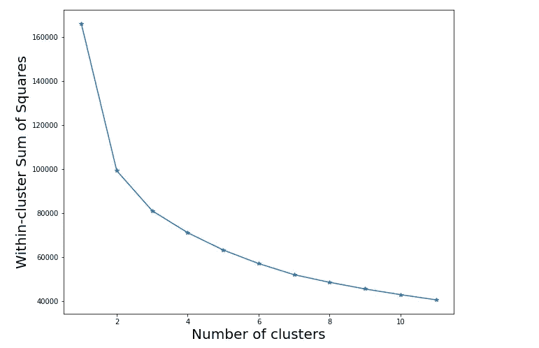

作为指定聚类数的函数的平方和内(WCSS)

虽然不是很明显，但我们可以看到曲线在集群数量= 5 的*附近开始变平。*我们可以通过查看剪影得分来进一步评估最佳聚类大小。剪影分数是一种衡量对象与其自己的聚类(内聚性)相比与其他聚类(分离性)有多相似的方法。轮廓系数接近 1 表示样本远离相邻的聚类。值为 0 表示样本位于或非常接近两个相邻聚类之间的判定边界，负值表示这些样本可能被分配到错误的聚类。让我们从*聚类数= 5 开始计算不同数量的聚类的轮廓分数。*

```
from sklearn.metrics import silhouette_scorerange_n_clusters = [5,6,7,8,9] # Number of clustersfor n_clusters in range_n_clusters:

    clusterer = KMeans(n_clusters=n_clusters, random_state=10)
    cluster_labels = clusterer.fit_predict(x_scaled)

    silhouette_avg = silhouette_score(x_scaled, cluster_labels)

    print("For n_clusters =", n_clusters,
          "The average silhouette_score is :", silhouette_avg)
```

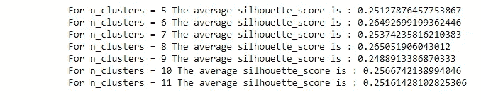

轮廓分数是指定聚类数的函数。

轮廓得分在*聚类数= 8* 时具有最高值。值 6 具有非常相似的轮廓分数，但是在相识别中具有更大的间隔更好。这是因为一些岩性往往会相互交错，因此更多的集群可能会揭示这些模式。

使用 *sklearn 的聚类*模块中的 *KMeans* 算法，将测井数据分成 8 组。我利用 100 个随机初始质心种子来增加找到最佳描述数据的聚类分离的概率。

# 数据可视化和解释

使用从 [Brendan Hall](https://github.com/seg/2016-ml-contest/blob/master/Facies_classification.ipynb) 修改的代码绘制了部分油井的测井记录和岩相(作为深度的函数)。


井的分类结果:木本英亩

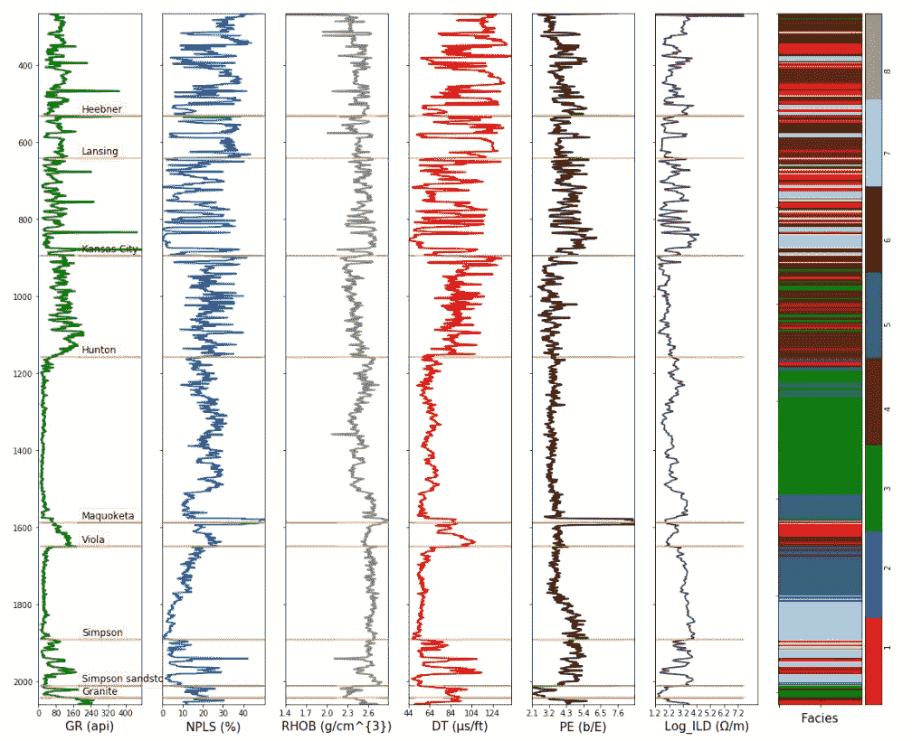

井的分类结果:鲍姆加特纳

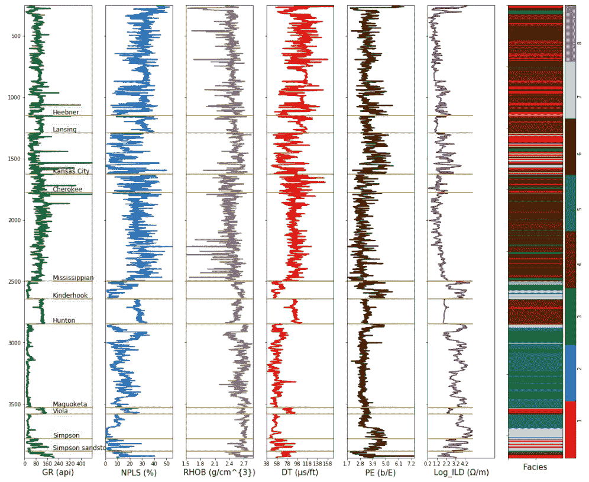

哈特尔井分类结果

# 验证结果

曲线图显示，由于相同深度附近的岩相变化，该区域存在岩性的横向变化。我们可以通过了解堪萨斯的地层来验证这些结果。根据 [KGS 地质](http://www.kgs.ku.edu/Publications/Bulletins/Sub9/page2.html)，该区域主要岩性为:砂岩、页岩、白云石、石灰岩以及一些淤泥、燧石和白垩。对岩心样本的分析也表明石膏和黄铁矿的存在。我的分析强调了 8 个相，这是基于已知信息的合理结果。不同的岩石有不同的测井响应，这些响应结合使用可以给我们一个很好的概念，即下面的岩性是什么。不同的岩性有不同的测井响应，这里有，这里有。

如果我们以 Viola 地层为例，在 Woody Acres 井，它主要由**相 2** 代表。其特点是伽马射线值极低，密度值在 2.5-2.8g/cm3 之间，DT 值在低端(47-67s/ft)。PE 值显示在地层中间有一个跳跃，表明存在另一种岩性，但其总体特性表明有一个**白云岩层**，其中含有一些石灰岩。在鲍姆加特纳油井中，地层下半部分的 PE 值向 5 b/E 的值跳跃，这是石灰岩的指示。就 PE 值而言，上半部分显示出与白云石相似的性质，其不断降低的中子孔隙度和相对稳定的密度表明该相是白云石和石灰岩的组合，即白云质石灰岩层。因此，我们可以将**相 7** 和**相 5** 分别归于**灰岩**和**白云质灰岩**。

哈特尔油井中的 Kinderhook 地层显示伽马读数突然增加，中子孔隙度增加，密度读数相对稳定，电阻率读数低得多。除了前面提到的特性之外，声波孔隙度的突然增加指向**相 4** 的**页岩**层。该井的 Viola 地层也具有非常相似的性质，但是声波孔隙度值较低，电阻率值与 Kinderhook 地层相比略高，表明其中含有砂、石灰石或白云石。然而，PE 值低于白云石或石灰岩，表明**相 1** 是一个**砂质页岩**层。最后，Hunton 地层顶部的低伽马值，加上中子孔隙度的下降以及白云质范围内密度和 PE 值的增加，表明**相 3** 的**白云质砂**状态。

参考 [KGS 地质学](http://www.kgs.ku.edu/Publications/Bulletins/Sub9/page2.html)揭示 Viola 地层由细粒至粗粒石灰岩和白云石组成，含有不同数量的燧石。它还强调了 Hunton 地层通常由灰色至棕色、细粒、结晶白云石或石灰石组成，某些部分含有少量燧石。它也是一种稍粗粒、稍带孔洞孔隙的砂质白云岩，在地层的其他部分带有一些燧石。这与我的分析相一致，我的分析显示石灰岩和白云岩构成了这些地层的主要岩性。

# 摘要

无监督的机器学习可以是一种以经济高效的方式从数据中获得一些快速见解的好方法，并且可以作为这项研究中演示的额外监督工作的指南。然而，尽管这项技术的前景非常诱人，但了解与此方法相关的注意事项也很重要。

聚类的最佳数量不容易预测，并且在大多数情况下是主观的。大多数岩性不是完全同质的，往往包括不同的岩石类型，因此找到最佳的 *k* 值是困难的，有时甚至是不可能的，可能需要一些*先验*知识。此外，聚类可以根据初始质心起始位置而改变。对于有大量数据的情况，这也不是一个实用的解决方案。在这些情况下，最好使用监督学习技术。在未来的工作中，我将演示如何将*卷积神经网络*应用于相分类，以及评估其在准确性和其他指标方面的有效性。

欢迎评论和反馈。在不久的将来，代码和数据集将在这里[提供](https://github.com/Ibinaldo?tab=repositories)，我的 Linkedin 个人资料可以在这里找到[。我希望你觉得这篇文章有趣，这是一个有趣的研究项目！](https://www.linkedin.com/in/ibinabo-bestmann/)

伊比纳波·贝斯曼