# 使用机器学习技术促进足球中的商业和战术决策

> 原文：<https://towardsdatascience.com/facilitating-business-and-tactical-decisions-in-football-using-machine-learning-techniques-f65b0ab074fc?source=collection_archive---------42----------------------->

## 机器学习技术如何应用于回答现代足球俱乐部的重要问题的例子。


在 [Unsplash](https://unsplash.com?utm_source=medium&utm_medium=referral) 上由 [Waldemar Brandt](https://unsplash.com/@waldemarbrandt67w?utm_source=medium&utm_medium=referral) 拍照

经理、教练和高层仅仅根据他们在球场上看到的来决定球员的表现和转会的日子已经一去不复返了。快速的技术发展为足球队使用分析来做出关键的商业和战术决策铺平了道路。如今，一支足球队不仅仅由球员、经理和教练组组成，还拥有大量分析师，他们利用技术来跟踪球员在比赛和训练期间的表现。数据分析和机器学习在革命性地改变球员如何提高比赛的某个方面，或者俱乐部的体育总监如何在转会窗口期间花巨资做出更好的决定方面发挥了巨大的作用。


由[卢卡斯·布拉塞克](https://unsplash.com/@goumbik?utm_source=medium&utm_medium=referral)在 [Unsplash](https://unsplash.com?utm_source=medium&utm_medium=referral) 上拍摄

这篇文章揭示了如何在统计和机器学习模型的帮助下，在一个足球俱乐部内做出关键决策。本文将帮助回答的一些问题是:*哪些属性显著影响球员的价值，球员必须专注于比赛的哪些方面才能从中场转变为进攻或防守等*和*如果球员被出售给另一家俱乐部，如何找到替代者。*

我们将使用在 Kaggle 上找到的 FIFA20 球员数据集(数据集链接:[https://www . ka ggle . com/stefanoleone 992/FIFA-20-complete-player-dataset？select=players_20.csv](https://www.kaggle.com/stefanoleone992/fifa-20-complete-player-dataset?select=players_20.csv) )来回答这些问题。它总共有 18，278 个玩家，有 104 个不同的属性，每一行都是一个玩家。在数据集中的 104 列中，有许多*身体、精神和金钱*属性。我们将假设该数据集中的属性在现实生活中是真实的，并且它们反映了球员在上一个足球赛季的表现。

我们用 R 来回答这些问题。

以下是数据的快照:

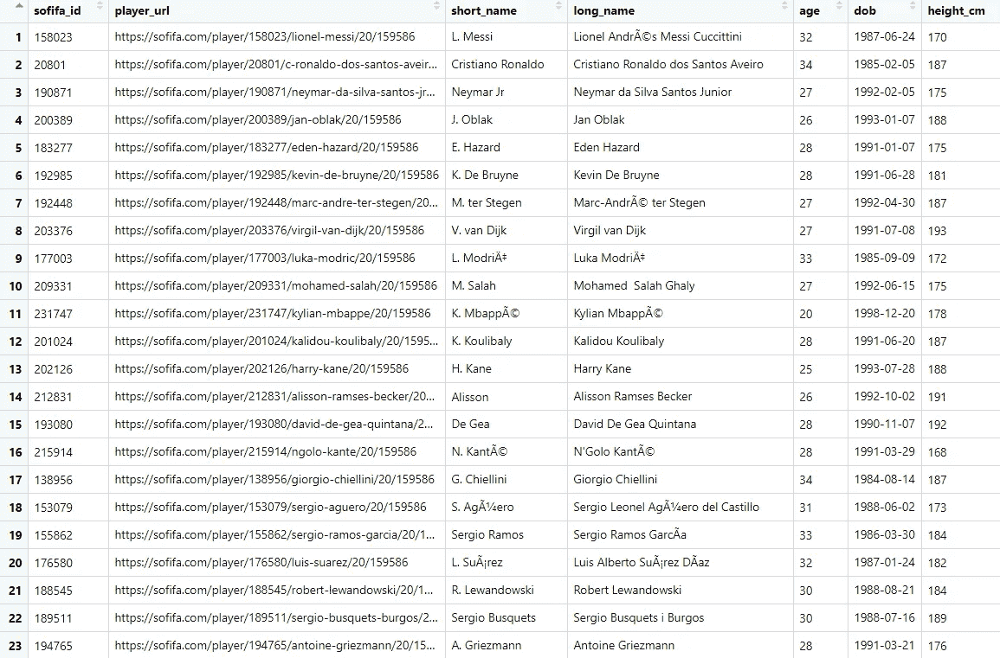

**我们可以在快照中看到数据集的前 7 列(图片由作者提供)**

该数据集中的一些列或属性是:*‘short _ name’*，它表示玩家的简称，*‘age’，‘height _ cm’*是玩家的身高(以厘米为单位)，*，‘weight _ kg’*是玩家的体重(以千克为单位)，*，‘total’*是玩家的评分(满分为 100 分)，*，‘club’*，即玩家所属的俱乐部，*，‘value _ EUR’*数据集中还存在许多其他属性，其中大多数属性的取值都有上限，为 100。

现在来回答几个重要的问题。

# **哪些属性显著影响球员的价值？**

在这个数据集中，玩家的价值是他的欧元价值，用*‘value _ EUR’*表示。我们可以看到哪些属性对决定一个球员的价值起着重要的作用。为此，我们可以拟合一个线性模型，将*‘value _ EUR’*作为目标变量或结果变量，将数据集中的其他属性作为预测变量。我们可以使用特征选择方法来找到显著影响结果变量的属性。我们将实现的一些特征选择方法有:向前逐步选择，向后逐步选择和套索回归或 L1 正则化。每种方法都选择对结果变量影响最大的属性子集。

## **数据预处理:**

```
#load required libraries
library(ggplot2)
library(dplyr)
library(tidyr)
library(data.table)#load the dataset into RStudio
f20 <- fread('path to the dataset')f20_copy <- fread('path to the dataset')f20 <- as_tibble(f20)#remove players that have no 'team_position'
f20 <- f20 %>% dplyr::filter(team_position != "")f20 <- f20 %>% separate(player_positions, c("player_position", NA, NA))#assign respective team positions for substitutes and reserves
select2 <- f20$team_position == "SUB"
f20[select2, "team_position"] <- f20[select2, "player_position"]select3 <- f20$team_position == "RES"
f20[select3, "team_position"] <- f20[select3, "player_position"]#remove GKs from the dataset
f20 <- f20 %>% dplyr::filter(team_position != "GK")sofifa_id <- f20 %>% select(sofifa_id)#we're interested in a player's physical, mental and monetary attributes, so, we'll only keep those attributes in the dataset
f20 <- f20 %>% select(-player_url, -dob, -real_face, -player_tags, 
                                    -loaned_from, -joined, -player_position, -contract_valid_until,
                                    -nation_position, -nation_jersey_number, -player_traits, -gk_diving,
                                    -gk_handling, -gk_kicking, -gk_reflexes, -gk_speed, -gk_positioning,
                                    -goalkeeping_diving, -goalkeeping_handling, -goalkeeping_kicking,
                                    -goalkeeping_positioning, -goalkeeping_reflexes, 
                                    -ls, -st, -rs, -lw, -lf, -cf, -rf, -rw, -lam, -cam, -ram, 
                                    -lm, -lcm, -cm, -rcm, -rm, -lwb, -ldm, -cdm, -rdm, -rwb, 
                                    -lb, -lcb, -cb, -rcb, -rb, -work_rate,
                              -nationality, -club, -body_type, -team_jersey_number, -preferred_foot, -short_name, -team_position, -long_name, -sofifa_id)#assign row names for the dataframe
f20 <- cbind(f20, sofifa_id = sofifa_id$sofifa_id)
row.names(f20) <- f20$sofifa_id
f20[47] <- NULL
```

我们已经完成了数据集的预处理。我们从数据集中删除了守门员，因为他们的许多属性都有 NA 值(如果我们想找到显著影响守门员价值的属性，我们可以在数据框架中拟合一个只有守门员的线性模型)。

## **正向逐步选择:**

我们使用*‘value _ EUR’*作为结果变量执行向前逐步选择。leaps 包中的 *'regsubsets()'* 函数执行 FSS。调用 *'coef()'* 函数查看算法选择的属性。

```
library(leaps)f20_fss <- regsubsets(value_eur ~ ., data = f20, method = "forward")
coef(f20_fss, 8) 
```

FSS 模型选择:*‘年龄’，‘整体’，‘潜力’，‘工资 _ 欧元’，‘国际 _ 声誉’，‘释放 _ 条款 _ 欧元’，‘动力 _ 耐力’，*‘防守 _ 滑行 _ 铲球’，*作为显著属性或预测因子。*

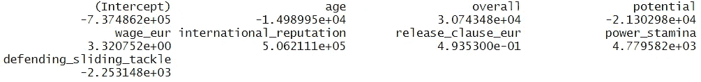

FSS 选择的属性**(图片由作者提供)**

## **向后逐步选择:**

同样，我们使用*‘value _ EUR’*作为结果变量，执行反向逐步选择。在 *'regsubsets()'* 功能中，将方法更改为 backward 以执行 BSS。

```
f20_bss <- regsubsets(value_eur ~ ., data = f20, method = "backward")

coef(f20_bss, 8)
```

BSS 模型选择与 FSS 模型相同的属性。


BSS 选择的属性**(图片由作者提供)**

## 拉索回归或 L1 正则化；

Lasso 回归，也称为 L1 正则化，是一种将某些属性的系数缩小到 0 的线性回归。它本质上执行特征选择，即具有非零系数的属性被套索选择。

```
library(glmnet) # library to perform lasso regression#standardize the dataset using 'scale()' function
f20_2 <- f20 %>% na.omit() %>% scale() %>% as.data.frame()lambdas <- 10^seq(10, -2, length=100)x <- model.matrix(value_eur~., f20_2)
f20_lasso <- cv.glmnet(x, f20_2$value_eur, alpha = 1, lambda = lambdas, nfolds = 10, standardize = TRUE)#best lambda
lambda_best <- f20_lasso$lambda.min
lambda_best#fit lasso model again with the best lambda value
lasso_model <- glmnet(x, f20_2$value_eur, alpha = 1, lambda = lambda_best, standardize = TRUE)
coef(lasso_model)
```

*'cv.glmnet()'* 是一个 k 重交叉验证函数，用于查找λ的最佳值。在 *'cv.glmnet()'* 函数中设置 alpha=1，进行套索回归。一旦我们获得了*‘lambda _ best’，*，我们就使用这个值通过*‘glmnet()’*函数再次执行套索回归。在套索模型上调用 *'coef()'* 函数，查看套索选择的属性。

在套索模型上调用 *'coef()'* 函数的输出是:

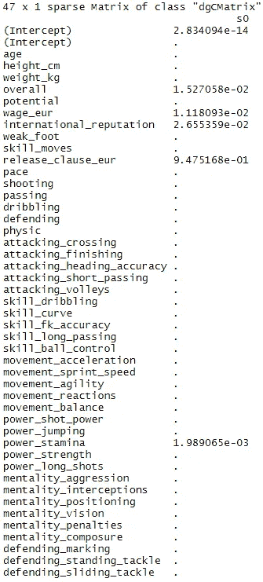

套索模型中的属性系数**(图片由作者提供)**

lasso 选择*‘总体’，‘工资 _ 欧元’，‘国际 _ 声誉’，‘释放 _ 条款 _ 欧元’*和*‘力量 _ 耐力’*作为显著属性或预测值。

现在，我们将只在数据集中包含通过上述特征选择方法选择的属性，并使用*‘value _ EUR’*作为输出变量训练线性模型。然后，我们可以通过查看测试集上的单个 RMSE 值来比较这些模型的性能。

## FSS 和 BSS 选择属性的线性回归(FSS 和 BSS 选择相同的属性):

```
f20_fss_bss <- f20_2 %>% select(age, overall, potential, wage_eur, international_reputation,
              release_clause_eur, power_stamina, defending_sliding_tackle, value_eur)library(modelr)#function to perform k-fold cross validation on the dataset and to return train and test RMSEs
cvlmf <- function(fitt, data, k){
  set.seed(1)
  data <- crossv_kfold(data, k)
  data <- data %>%
    mutate(fit = map(train, ~ fitt, data = .))
  data <- data %>% 
    mutate(rmse_train = map2_dbl(fit, train, ~rmse(.x,.y)),
           rmse_test = map2_dbl(fit, test, ~rmse(.x,.y)) )
  paste0("rmse_train = ", mean(data$rmse_train), ",", " rmse_test = ", mean(data$rmse_test))
}#linear model
fss_bss_model <- lm(value_eur ~ ., data = f20_fss_bss)#returns train and test RMSEs 
cvlmf(fss_bss_model, f20_fss_bss, 5)#plot of the linear model
par(mfrow = c(2,2))
plot(fss_bss_model)
```

我们得到交叉验证的测试集 RMSE 为 0.1066。在线性模型上调用*‘plot()’*函数给我们一个 2 交叉 2 网格的回归诊断图。

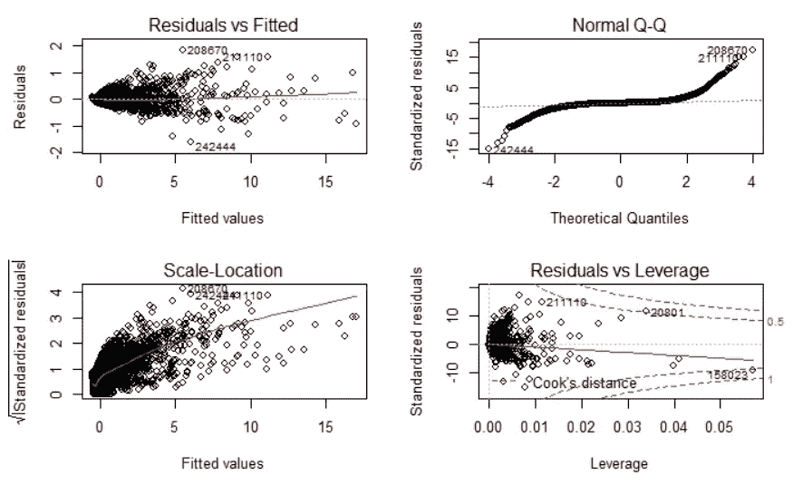

线性回归诊断图

要了解更多关于这些诊断图的信息，我建议你浏览一下这篇文章。在残差与杠杆率图中，我们可以看到一些高杠杆率点，它们分别标有*‘sofifa _ id’的*。高杠杆点是数据集中具有极端属性值的那些观测值或行，即它们缺少相邻的观测值。

在我们的数据集中，一些高杠杆点是:梅西，c 罗和保罗·迪巴拉。

```
f20_copy %>% filter(sofifa_id %in% c(211110, 20801, 158023)) %>% 
  select(sofifa_id, short_name)
```

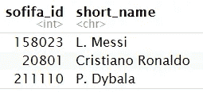

高杠杆点**(图片由作者提供)**

## 通过 L1 正则化选择属性的套索回归:

```
f20_lassodf <- f20_2 %>% select(overall, wage_eur, international_reputation, 
                                release_clause_eur, power_stamina, value_eur)#train and test set split
set.seed(100) 
index = sample(1:nrow(f20_lassodf), 0.8*nrow(f20_lassodf)) 
train = f20_lassodf[index,] 
test = f20_lassodf[-index,] x_train = as.matrix(train[,-6])
y_train = train$value_eurx_test = as.matrix(test[,-6])
y_test = test$value_eurf20_lambda_best <- cv.glmnet(x_train, y_train, alpha = 1, lambda = lambdas, nfolds = 10,
                       standardize = TRUE)#best lambda
lambda_best <- f20_lasso_model$lambda.min
lambda_best#train lasso model again with best lambda value
f20_lasso_model <- glmnet(x_train, y_train, alpha = 1, lambda = lambda_best, standardize = TRUE)#prediction on the test set
predictions_test <- predict(f20_lasso_model, s = lambda_best, newx = x_test)
predictions_test <- as.vector(predictions_test)#function to evaluate RMSE
evaluate_model <- function(true, predicted, data) {
  SSE <- sum((predicted - true)^2)
  SST <- sum((true - mean(true))^2)
  RMSE = sqrt(SSE/nrow(data))
  return(RMSE)
}evaluate_model(y_test, predictions_test, test)
```

我们获得的测试集 RMSE 为 2.4230，高于我们拟合常规线性模型时获得的测试集 RMSE。由于 FSS 和 BSS 选择的属性模型给了我们一个更好的测试集 RMSE，我们将分析*‘年龄’，‘整体’，‘潜力’，‘工资 _ 欧元’，‘国际声誉’，‘释放 _ 条款 _ 欧元’，‘力量 _ 耐力’，*，*‘防守 _ 滑行 _ 铲球’的系数。*这些都是对一个玩家价值有重大影响的属性。

上述属性的系数:


FSS 和 BSS 选择的属性系数**(作者提供的图片)**

我们注意到*‘总体’，‘工资 _ 欧元’，‘国际 _ 声誉’，‘释放 _ 条款 _ 欧元’*和*，‘力量 _ 耐力’*对一名球员的价值有正面影响，而在所有其他属性不变的情况下，*‘年龄’，‘潜力’，*和*‘防守 _ 滑行 _ 阻截’，*对一名球员的价值有负面影响。令人惊讶的是，很少与球员在球场上的技能相关的属性会对*‘value _ EUR’产生重大影响。*

*   *‘年龄’*的系数表明，如果一名球员年龄增长一岁，在所有其他属性不变的情况下，他的价值会减少 14，990 欧元。
*   *‘总体’*的系数表明，如果玩家的*‘总体’*或等级增加 1 点，在所有其他属性不变的情况下，他的价值增加 30，743 欧元。
*   *‘潜力’*的系数表明，如果一个玩家的潜力等级增加 1 点，在其他所有属性不变的情况下，他的价值减少 21303 欧元。

我们可以类似地解释其他属性的系数。上面的一些解释具有直观的意义，因为很容易理解，随着球员年龄的增长，他的转会市场价值将会下降，而评级更高的球员具有更高的转会市场价值。与直觉相反的是，“潜力”等级的增加会导致玩家价值的降低。我们也看到，擅长铲球的球员往往价值较低。

类似地，我们可以使用特征选择模型来选择显著影响属于球场上特定位置的球员的价值的属性，即，我们可以找到分别影响守门员、进攻者、中场和防守者的价值的属性。

# 为转会到另一家俱乐部的球员寻找替代者

球员在俱乐部之间的转会在足球界非常普遍，在夏季和冬季转会窗口期间发生了数以千计的转会。当一名球员离开我们的俱乐部时，我们希望用一名同样优秀的球员来代替他。机器学习中的聚类方法有助于找到具有相似技能的玩家。我们可以通过观察同一个集群中的其他玩家来找到一个玩家的替代者。

例如，如果利物浦要卖掉维吉尔·范迪克，他们会用一个同样有能力的中后卫来代替他。然后他们可以寻找和范·迪克属于同一群的中后卫来替代。

## **数据预处理:**

```
#load necessary libraries
library(dplyr)
library(tidyr)
library(data.table)f20 <- fread('path to the dataset')
f20 <- as_tibble(f20)f20 <- f20 %>% dplyr::filter(team_position != "")f20 <- f20 %>% separate(player_positions, c("player_position", NA, NA))select2 <- f20$team_position == "SUB"
f20[select2, "team_position"] <- f20[select2, "player_position"]select3 <- f20$team_position == "RES"
f20[select3, "team_position"] <- f20[select3, "player_position"]#remove goalkeepers from the dataset
f20 <- f20 %>% dplyr::filter(team_position != "GK")#only variables related to a player's skill set should be included in the dataset
f20 <- f20 %>% select(-player_url, -dob, -real_face, -player_tags, 
                                    -loaned_from, -joined, -player_position, -contract_valid_until,
                                    -nation_position, -nation_jersey_number, -player_traits, -gk_diving,
                                    -gk_handling, -gk_kicking, -gk_reflexes, -gk_speed, -gk_positioning,
                                    -goalkeeping_diving, -goalkeeping_handling, -goalkeeping_kicking,
                                    -goalkeeping_positioning, -goalkeeping_reflexes, 
                                    -ls, -st, -rs, -lw, -lf, -cf, -rf, -rw, -lam, -cam, -ram, 
                                    -lm, -lcm, -cm, -rcm, -rm, -lwb, -ldm, -cdm, -rdm, -rwb, 
                                    -lb, -lcb, -cb, -rcb, -rb, -work_rate,
                              -nationality, -club, -body_type, -team_jersey_number, -preferred_foot, -short_name, -team_position, -overall, -potential, -value_eur, -wage_eur,
                      -international_reputation, -release_clause_eur, -age, -long_name)#assign row names
row.names(f20) <- f20$sofifa_id
f20[1] <- NULL#standardize the data
f20 <- scale(f20)f20 <- na.omit(f20)
```

## k 表示聚类:

我们需要确定集群的数量。为了做到这一点，我们将使用肘法。k-means 聚类背后的基本思想是，我们希望最小化聚类平方和内的总数。总 WSS 衡量一个集群的紧凑性，我们希望它尽可能小。应该选择簇的数量，这样添加另一个簇不会显著提高总 WSS。要了解更多关于确定最佳集群数量的信息，请阅读这篇文章。

```
#libraries to do k-means clustering
library(factoextra)
library(NbClust)#determining the optimal number of clusters using elbow method
fviz_nbclust(f20, kmeans, method = "wss") +
  labs(subtitle = "Elbow method")
#Lets go with 4 clusters.set.seed(123)
f20_km <- kmeans(f20, 4, nstart = 25)
#print(f20_km)#number of observations in each cluster
f20_km$size#visualizing the clusters
fviz_cluster(f20_km, f20, ellipse.type = "norm")#structure of the k-means model
str(f20_km)
```

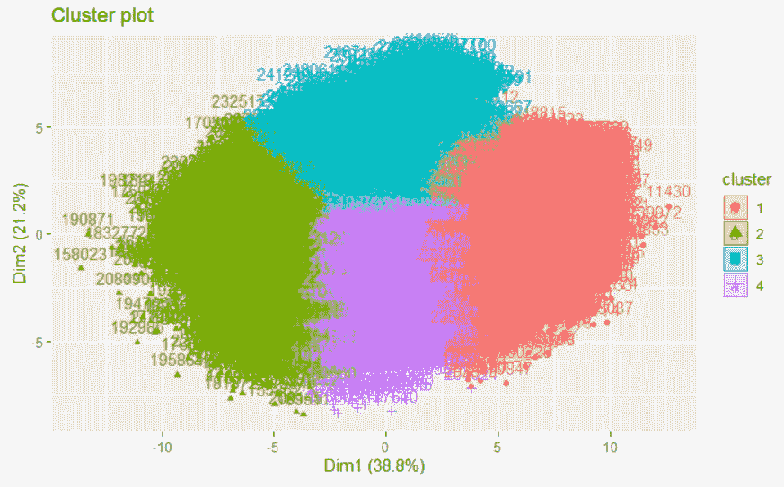

k=4 的 k 均值聚类结果**(图片由作者提供)**

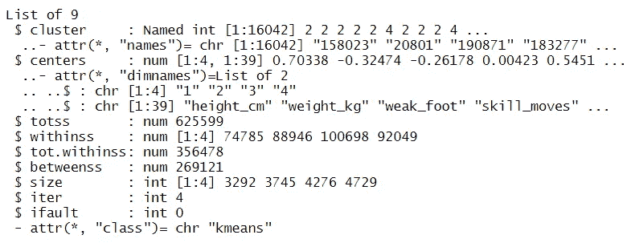

k 均值模型的结构

我们将在数据帧中创建一个新列来表示玩家所属的集群。

```
clusters_df <- data.frame(sofifa_id = as.integer(names(f20_km$cluster)), 
                          player_cluster = f20_km$cluster)fifa20 <- fread('path to the dataset')
fifa20 <- as_tibble(fifa20)fifa20 <- fifa20 %>% filter(team_position != "")fifa20 <- fifa20 %>% separate(player_positions, c("player_position", NA, NA))select1 <- fifa20$team_position == "SUB"
fifa20[select1, "team_position"] <- fifa20[select1, "player_position"]select2 <- fifa20$team_position == "RES"
fifa20[select2, "team_position"] <- fifa20[select2, "player_position"]fifa20 <- fifa20 %>% filter(team_position != "GK")#inner join by 'sofifa_id' to create 'player_cluster' column in the dataframe
fifa20 <- inner_join(fifa20, clusters_df)#keep columns that we're going to look at
fifa20 <- fifa20 %>% select(age, short_name, wage_eur,value_eur, overall, potential, team_position, work_rate, club, release_clause_eur, player_cluster)
```

同一集群中的玩家拥有相似的技能组合。让我们看看这 4 个集群中的一些参与者。

```
#players belonging to the same cluster
fifa20%>% filter(player_cluster == 1) %>% head(7)
fifa20%>% filter(player_cluster == 2) %>% head(7)
fifa20%>% filter(player_cluster == 3) %>% head(7)
fifa20%>% filter(player_cluster == 4) %>% head(7)
```

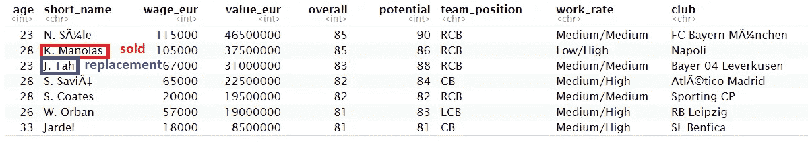

第一组的球员**(图片由作者提供)**

上图中，如果 k .马诺拉斯被那不勒斯卖给另一家俱乐部，他们可以考虑竞购拜耳勒沃库森的 J. Tah。他们两个有相似的评价，事实上那不勒斯会出价一个比马诺拉斯更年轻的球员，他的周薪更低，更有潜力。如果他们对 Tah 的收购失败，他们可以在相同的位置上寻找其他替代者，如萨维奇，科茨和贾德尔等。

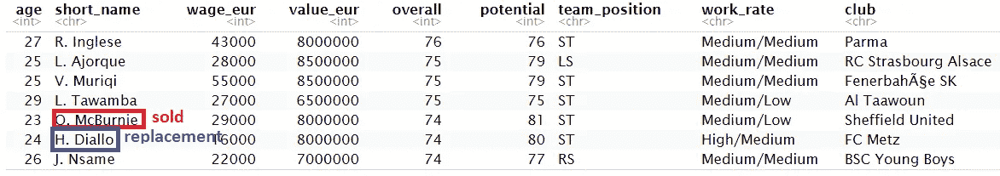

第三集群的玩家**(图片由作者提供)**

上图中，如果 o .麦克伯尼被谢菲尔德联队卖掉，他们可以考虑竞购梅茨队的 h .迪亚洛。如果谢菲尔德对他的出价失败了，他们可以看看同组的其他球员，如英格尔塞、阿托克和穆里奇等。

对于属于集群 2 和集群 4 的球员，我们可以有类似的转会解释。

# 在场上的位置之间切换

许多球员在场上短期或长期改变位置。球员改变位置有很多原因，比如管理决策、年龄和个人喜好等。如前所述，举例来说，年龄的增长会促使一名球员成为一名深度进攻组织者，而不是一名敏捷的边锋。我们的数据表明，30 岁以后，*‘年龄’*vs*‘步伐’的剧情有一个总体下降的趋势。*因此，随着年龄的增长，许多球员选择在球场上需要较少速度的更深位置。

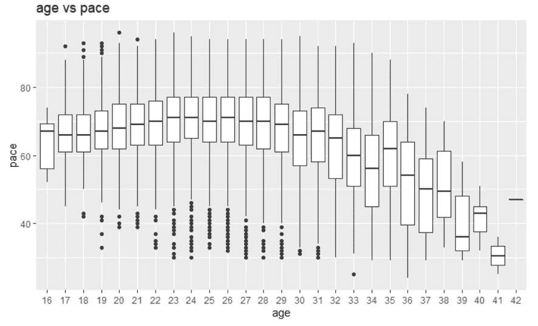

“年龄”vs“步伐”的情节**(图片由作者提供)**

如果我们把场上的位置大致分为门将、后卫、中场、攻击手，就可以发现这些位置上的球员所支配的属性。我们可以以守门员为参照或基础类别，通过对数据拟合多项逻辑回归模型，对守门员、后卫、中场和攻击手的共同属性进行比较研究。

## 以守门员为基本类别的位置比较:

```
#load some of the required libraries
library(dplyr)
library(tidyr)
library(data.table)
library(modelr)
library(caret)fifa20 <- fread('path to the dataset')fifa20 <- as_tibble(fifa20)#remove players with no position
fifa20 <- fifa20 %>% dplyr::filter(team_position != "")fifa20 <- fifa20 %>% separate(player_positions, c("player_position", NA, NA))select1 <- fifa20$team_position == "SUB"
fifa20[select1, "team_position"] <- fifa20[select1, "player_position"]select2 <- fifa20$team_position == "RES"
fifa20[select2, "team_position"] <- fifa20[select2, "player_position"]#group team positions into 4 categories: goalkeepers, defenders, midfielders and attackers
library(plyr)
fifa20$team_position <- mapvalues(fifa20$team_position, from = c("RW","LW","ST","CF","LS","RS","RF","LF"), 
          to = c("attack","attack","attack","attack","attack","attack","attack","attack"))fifa20$team_position <- mapvalues(fifa20$team_position, from = c("LCB","RCB","LB","CB","RB","RWB","LWB"), 
          to = c("defense","defense","defense","defense","defense","defense","defense"))fifa20$team_position <- mapvalues(fifa20$team_position, from = c("CAM","RCM","CDM","LDM","RM","LCM","LM","RDM","RAM","CM","LAM"), 
          to = c("midfield","midfield","midfield","midfield","midfield","midfield","midfield","midfield","midfield","midfield","midfield"))#keep the attributes common among goalkeepers, defenders, midfielders and attackers
fifa20 <- fifa20 %>% select(team_position, age, height_cm, weight_kg, movement_acceleration, movement_sprint_speed, movement_agility, movement_reactions, movement_balance, power_shot_power, power_jumping, power_stamina, power_strength, power_long_shots)#standardize the data
preObj3 <- preProcess(fifa20[, -1], method=c("center", "scale"))
newData3 <- predict(preObj3, fifa20[, -1])
fifa20 <- cbind(newData3, team_position = fifa20$team_position)
```

将数据分成训练集和测试集。在训练集上拟合多项式逻辑回归模型，并分析 4 个类别中每个类别的系数。

```
#structure of the dataset
str(fifa20)set.seed(100)
trainingRows <- sample(1:nrow(fifa20), 0.75*nrow(fifa20))
train <- fifa20[trainingRows, ]
test <- fifa20[-trainingRows, ]#library to train a multinomial model
library(nnet)#set base class
train$team_position <- relevel(train$team_position, ref = "GK")#train the model on the train set
multinom.fit <- multinom(team_position ~ . -1, data = train)#model coefficients
coef(multinom.fit)
```

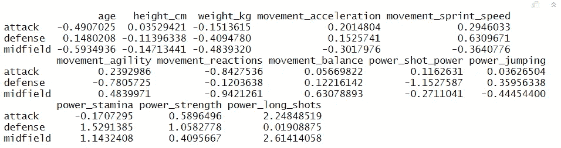

多项式逻辑回归模型的属性系数**(图片由作者提供)**

从上面的系数图中，我们可以分析出与守门员相比，不同位置之间的差异。说到年龄，根据系数来看，门将比进攻球员和中场球员年龄大，比后卫年轻。守门员比攻击手、中场和后卫更重。他们的反应也比其他三个类别的球员更好，这很直观，因为他们需要闪电般的反应来扑救和偏转射门。系数显示，后卫、中场和进攻球员比守门员有更好的平衡能力，这也有直观的意义，因为守门员被限制在球场上的特定区域，而其他 3 类球员可以在奔跑时不断改变方向，覆盖整个球场，这需要大量的球上和球下的平衡。后卫，中场，进攻手在力量和远射方面也比 GKs 强。类似地，剩余属性的系数也可以被解释。

```
#predict team positions on the test set
predicted_probs <- predict(multinom.fit, test, "probs")
predicted_positions <- predict(multinom.fit, test)#confusion matrix
confusionMatrix(test$team_position, predicted_positions)
```

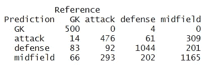

测试集混淆矩阵**(图片由作者提供)**

从上面的混淆矩阵中，我们可以看到很少有球员被错误地归类为守门员，因此我们可以说他们很容易被识别。许多进攻者和防守者被错误地归类为中场。这可能是因为进攻者和防守者的属性值类似于中场。中场球员几乎同样被错误地归类为进攻者和防守者。

在上面的分析中，我们包括了数据集中的所有玩家。我们也可以只对世界顶级联赛的球员进行类似的分析，比如英超、西甲、德甲、意甲、法甲和荷甲等。我们可以看到，当我们从上述联盟中排除球员时，错误分类率会更高还是更低。

## 在位置之间切换:

当一个球员在进攻者、中场和防守者之间转换时，应该关注身体、精神或比赛中的哪些方面？我们可以通过查看二项逻辑回归模型的属性系数来回答这个问题，在每个模型中，玩家来自两个位置。

```
f20 <- fread('path to the dataset')
f20 <- as_tibble(f20)f20 <- f20 %>% dplyr::filter(team_position != "")f20 <- f20 %>% separate(player_positions, c("player_position", NA, NA))select2 <- f20$team_position == "SUB"
f20[select2, "team_position"] <- f20[select2, "player_position"]select3 <- f20$team_position == "RES"
f20[select3, "team_position"] <- f20[select3, "player_position"]#remove GKs from the dataset
f20 <- f20 %>% dplyr::filter(team_position != "GK")#remove redundant variables
f20 <- f20 %>% select(-player_url, -long_name, -dob, -real_face, -player_tags, 
                                    -loaned_from, -joined, -player_position, -contract_valid_until,
                                    -nation_position, -nation_jersey_number, -player_traits, -gk_diving,
                                    -gk_handling, -gk_kicking, -gk_reflexes, -gk_speed, -gk_positioning,
                                    -goalkeeping_diving, -goalkeeping_handling, -goalkeeping_kicking,
                                    -goalkeeping_positioning, -goalkeeping_reflexes, 
                                    -ls, -st, -rs, -lw, -lf, -cf, -rf, -rw, -lam, -cam, -ram, 
                                    -lm, -lcm, -cm, -rcm, -rm, -lwb, -ldm, -cdm, -rdm, -rwb, 
                                    -lb, -lcb, -cb, -rcb, -rb, -work_rate, -sofifa_id,
                             -short_name, -nationality, -club, -body_type, -team_jersey_number, -preferred_foot, -age,  -height_cm, -value_eur, -wage_eur, -potential, -international_reputation, -release_clause_eur, -overall)#group team positions into attack, midfield and defense
f20$team_position <- mapvalues(f20$team_position, from = c("RW","LW","ST","CF","LS","RS","RF","LF"), 
          to = c("attack","attack","attack","attack","attack","attack","attack","attack"))f20$team_position <- mapvalues(f20$team_position, from = c("LCB","RCB","LB","CB","RB","RWB","LWB"), 
          to = c("defense","defense","defense","defense","defense","defense","defense"))f20$team_position <- mapvalues(f20$team_position, from = c("CAM","RCM","CDM","LDM","RM","LCM","LM","RDM","RAM","CM","LAM"), 
          to = c("midfield","midfield","midfield","midfield","midfield","midfield","midfield","midfield","midfield","midfield","midfield"))#standardize the data
preObj4 <- preProcess(f20[, -4], method=c("center", "scale"))
newData4 <- predict(preObj4, f20[, -4])
f20 <- cbind(newData4, team_position = f20$team_position)
```

**前锋 vs 中场:**

如前所述，玩家可以出于多种原因切换位置。让我们来看看当一个球员从一个攻击手转变为一个中场时，他必须专注于什么属性，反之亦然。

```
#include only attackers and midfielders
f20_am <- f20 %>% dplyr::filter(team_position %in% c("attack","midfield"))
f20_am$team_position <- as.character(f20_am$team_position)#encode attack as the positive class
f20_am$team_position[f20_am$team_position == "attack"] <- 1
f20_am$team_position[f20_am$team_position == "midfield"] <- 0
f20_am$team_position <- as.numeric(f20_am$team_position)#binomial logistic regression model
am_fit <- glm(team_position ~ ., data = f20_am, family = "binomial")
summary(am_fit)
```

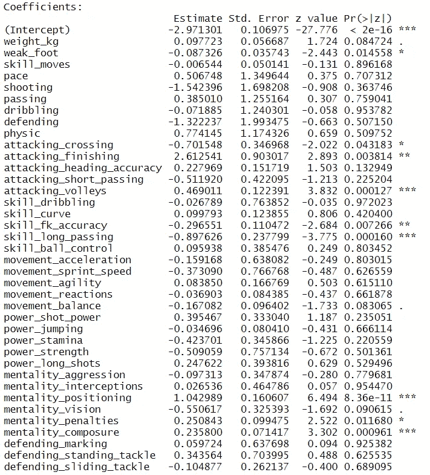

进攻者对中场模型的属性系数**(图片由作者提供)**

从上图中，我们看到*‘弱 _ 脚’，‘攻 _ 传’，‘攻 _ 整理’，‘攻 _ 截击’，‘技 _ 准’，‘技 _ 长 _ 传’，‘心态 _ 定位’，‘心态 _ 罚’*，*，‘心态 _ 沉着’*是我们进攻者 vs 中场模型中的显著属性。

进攻者比中场球员更擅长完成任务，即进球能力、凌空抽射、定位(即在场上正确的位置进球)、点球和场上沉着冷静。由于上述属性的系数估计为正，这些属性的增加与玩家成为攻击者的机会的增加相关联。

中场球员比进攻球员更擅长利用他们的弱点，传球，任意球和长传。由于上述属性的系数估计是负的，这些属性的增加与玩家成为攻击者的机会的减少相关联。

以上两种解释都有很强的直觉，数据也为我们的直觉提供了有力的证据。谈到在不同位置之间转换的球员，为了让一名中场球员成为一名进攻者，一个人应该专注于射门，截击，定位，点球和冷静。对于一个成为中场的进攻者来说，他应该专注于传中，利用他们的弱脚，任意球和长传。

我们可以对另外两对进行类似的分析，即进攻者对防守者和中场对防守者。

数据分析和数据科学只会在体育界变得更加突出，而不仅仅是在足球界。随着时间的推移，我们将看到越来越多的球队和俱乐部雇佣数据科学家和分析师，为业务和战术决策寻找数据驱动的解决方案。球队可以通过避免出价购买不符合要求标准的球员来减少转会窗口期间的财务损失，球员可以改善他们比赛中肉眼不一定明显的方面，经理可以在分析和机器学习技术的帮助下提出训练方案和战术来赢得更多比赛。