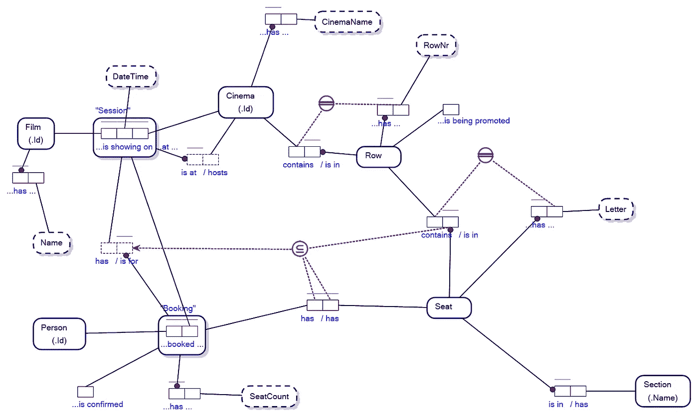

# 简而言之，基于事实的人工智能

> 原文：<https://towardsdatascience.com/fact-based-ai-in-a-nutshell-62a184880e37?source=collection_archive---------35----------------------->

## 使用基于事实的建模来启动一次性学习

在早期的一篇文章中，[基于事实的人工智能——改进知识图](/fact-based-ai-improving-on-a-knowledge-graph-12c37481cce6),我提供了基于事实的建模在人工智能中的前景，同时提供了背景知识以供消化。在这里我们直奔事实。

在人工智能研究中已经变得很明显的是，机器学习(ML)、深度学习(DL)和神经网络一般来说都不是容易“一次性学习”的机制。

一般而言，神经网络必须在大的训练数据集上进行训练，从而产生一种机制，该机制基于接近训练数据集的实时数据来提供概率结果。

在一组熊猫图像上训练一个合适的神经网络，然后提供一张新的熊猫图像，神经网络将给出它认为新图像是什么的概率，希望预测是“*熊猫*”。

神经网络提供的训练数据越少，无论其内部结构如何优化，它提供有利结果的机会就越小。也就是说，你不能可靠地为一个合适的神经网络提供一张熊猫的照片，并期望它能识别另一张不同的熊猫照片。一般来说，它无法一次性学会一个概念或一套规则。

这与人类的学习形成了鲜明的对比，在人类的学习中，一个人可以很容易地掌握和应用所学的知识，只需要被引入问题空间一次。在问题空间的广大领域中，这是真实的。

一次性学习是机器学习和深度学习的一个公认问题，该领域的专家正在努力解决这个问题。在我看来，如果没有某种形式的一次性学习，ML/DL 策略不太可能到达[人工通用智能(AGI)](https://en.wikipedia.org/wiki/Artificial_general_intelligence) 。

ML/DL 方法中的一个问题是，数据以累积权重的方式通过节点网络传递，并且在每个节点处几乎没有逻辑应用于数据，而是基于统计的数学应用于由节点接收的累积权重的值。对输入数据应用统计数学的结果提供了按概率分级的输出数据，提供了对输入数据的概率逻辑。

例如，包含 ML/DL 的自动驾驶汽车在停车标志处停下来，因为从统计上看这是一件好事；因为从统计学上来说，这就是它被训练的目的。

基于这种策略的一些直通(或前馈)网络的问题是，如果一个人的脸在统计上有鼻子、眼睛、嘴、眉毛和下巴，给定一张“脸”的照片，其中一只眼睛被替换为鼻子，反之亦然，一只眼睛被替换为嘴(反之亦然)，网络会将图像分类为脸，不管这个命题有多荒谬。这是因为图像仍然有鼻子、眼睛、嘴巴、眉毛和下巴。

对神经网络的兴起有影响的 Geoffrey Hinton 已经意识到了这个问题，并且正在开发和推广他所谓的[胶囊网络](https://en.wikipedia.org/wiki/Capsule_neural_network)，该胶囊网络在网络内的早期阶段节点执行本地化的逻辑处理，以便更好地调整提供给后期阶段网络节点的精确权重，从而提供输入数据分类的更真实的近似。这个想法是，给这样一个网络提供一张荒谬的脸的图片，网络将*而不是*把图像分类为一张脸，因为网络早期的本地化逻辑要求脸的各个部分在解剖学上正确的位置。

这并没有让我们更接近一次性学习，而是引入了一个概念，即网络节点必须执行统计数学之外的某种形式的逻辑。

神经网络的另一个问题是，许多问题本质上不是统计性的，而是需要谓词逻辑的技巧。为了让这篇文章简短，我不会争论为什么，而是简单地说，你可能会直接为人工智能提供一个模型，而不是试图通过统计来训练人工智能学习模型。也就是说，只需给人工智能一个*中的模型*。

让我们看一个例子。下面的[对象-角色建模(ORM)](https://en.wikipedia.org/wiki/Object-role_modeling) 图提供了适当跟踪和存储在电影院观看电影的座位预订所需的细节。

对象-角色模型

可立即识别为*数据*的[图](https://en.wikipedia.org/wiki/Graph_theory)，其中数据是概念模型的表示，该信息捕获了预订电影座位所必需的约束:

**如果某**订票有**某**座位**，那么
那张**订票是给**某**时段**那张**是在**某**电影院**那张**包含**某**排**那张**包含**那张**座位

这种谓词处理超出了大多数神经网络，因为它们不包含节点级别的谓词逻辑处理；但我觉得这是一次性学习技术的发展方向。

简单的前馈神经网络在执行上述模型的规则时无法胜任，但是对于 AGI 来说，这种模型很常见。

需要在节点/神经元级别和节点内进行本地化谓词检查。

存储为 ORM 模型的基于事实的模型非常适合存储在神经网络的节点矩阵中，因为它们具有内在的基于图形的表示法，其中图形中的每个节点代表它所代表的逻辑模型的一部分。

基于谓词逻辑的人工智能解决方案在过去受到了负面报道。例如， [Cyc 项目在过去被贴上了失败的标签](https://en.wikipedia.org/wiki/Cyc)；据称是因为 Cyc 的早期迭代完全依赖于谓词逻辑和归纳。然而，AGI 必须能够处理谓词逻辑的基本前提是毋庸置疑的。如果 AGI 是谓词逻辑和神经网络的混合体，那么谓词逻辑必须存储在它的模型中。似乎 Cycorp 已经意识到这一点，[已经开始研究深度学习和基于事实的推理](https://www.cyc.com/wp-content/uploads/2019/11/Cyc_ML.pdf)。

我在 [Viev](http://www.viev.com/) 的研究旨在提供构建基于事实的模型的工具，这些模型的元模型可以整合到新一轮的神经网络中，这些神经网络在节点/神经元级别整合了逻辑处理。

在人工智能的逻辑存储中使用对象角色建模的一个好处是，在许多情况下，不需要自然语言生成。生成自然语言所需的工作显著减少，因为 ORM 首先以自然语言存储事实，并且以与一阶逻辑的句子同态的逻辑结构存储事实。

在上面的例子中，人工智能对爱丽丝所做的一般陈述“我在电影院预定了座位”的反应，可以很容易地识别爱丽丝所谈论的世界的候选模型，并横过图表来问问题，例如，“那是哪个时段的？”，或者“你订了几个座位？”“那是什么电影？”用已经存储在模型中的语言进行外推。

## 在模型中存储数据，以及模型作为数据存储在哪里

对象-角色建模是一种[基于事实的建模](/what-is-fact-based-modelling-106ba15649fa)，除了存储关于事实的元信息，比如人们可以在电影院预订座位，ORM 还可以存储关于这些事实的实际数据。

如上所述的相同模型可以存储关于 Alice 已经在电影院预订了座位的信息；如下所示，其中 Alice 的 Person_Id 为 1:

对象-角色模型中的示例事实数据

因此，对象角色建模是基于事实的人工智能的核心，不仅模型可以存储为数据，而且与模型相关的事实也可以存储在模型中。模型和事实数据只是数据。

神经网络已经是数据的图表。简而言之，基于事实的人工智能是将模型/模式和它们的相关数据合并为神经网络或基于谓词逻辑的人工智能中的图内节点。

我希望这对寻找新道路的人工智能研究人员有所帮助。如果时间允许，我会写更多关于基于事实的人工智能和对象角色建模的文章。

— — — — — — — — — -

**NB** 本文表达的模型原始版本版权归 DataConstellation 所有，在 GitHub 上的 ActiveFacts 项目下共享:[https://github.com/cjheath/activefacts](https://github.com/cjheath/activefacts)。示例和许可证位于:[https://github.com/cjheath/activefacts-examples](https://github.com/cjheath/activefacts-examples)