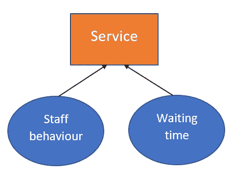
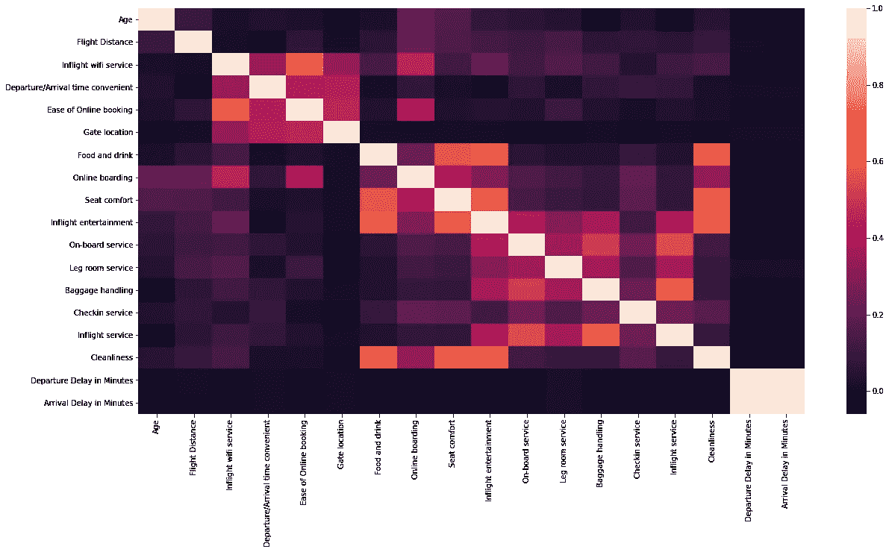
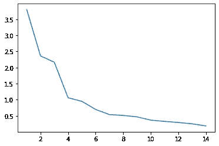

# 因子分析教程

> 原文：<https://towardsdatascience.com/factor-analysis-a-complete-tutorial-1b7621890e42?source=collection_archive---------8----------------------->

## 特征值、要素创造和克朗巴赫的阿尔法

因子分析的目标是用较少的变量(称为因子)来描述相关变量之间的可变性。它基于这样一种想法，即存在一些“潜在的”因素，这些因素可以描述多个变量。



来源:自创图片

如果我们想在建立模型之前减少变量的数量，这是非常有用的。

本教程使用的数据是航空公司乘客满意度数据集，可以在这里找到:[https://www . ka ggle . com/teejmahal 20/Airline-Passenger-satisfaction](https://www.kaggle.com/teejmahal20/airline-passenger-satisfaction)

该数据集包含一项航空公司乘客满意度调查。它有 103，904 条意见和 25 个栏目，其中 14 个栏目代表了客户对一项调查的回应，该调查评估了航班的不同方面(机上 wifi 服务、食物和饮料、在线登机、座位舒适度等)。这 14 列对于我们即将进行的因子分析非常重要。

任何因素分析的第一步都是查看所有变量的相关图，看是否有任何变量是无用的或与其他变量相关性太大。

```
import seaborn as snsplt.figure(figsize=(20,10))
c= df.corr()
sns.heatmap(c)
```



一些变量高度相关，尤其是与调查答案相关的变量。然而，真正突出的是“出发延误分钟数”和“到达延误分钟数”之间极高的相关性(0.98)。有道理。如果飞机比预计的晚起飞，它也应该晚到达。考虑到这种极高的相关性，我决定从数据集中删除该列。

```
df.drop(['Arrival Delay in Minutes'], axis=1, inplace=True)
```

现在我们已经去掉了无用的变量，这里是将用于因子分析的 14 个变量。

```
Inflight wifi service               
Departure/Arrival time convenient    
Ease of Online booking               
Gate location                        
Food and drink                       
Online boarding                      
Seat comfort                         
Inflight entertainment               
On-board service                     
Leg room service                     
Baggage handling                     
Checkin service                      
Inflight service                     
Cleanliness 
```

# 要素分析

那么我们的 14 个变量是否可以描述成更少的潜在变量(因子)？让我们来看看，但是首先，我们必须安装并导入所需的包。

```
!pip install factor_analyzer  
from factor_analyzer import FactorAnalyzer
```

为了弄清楚我们需要多少个因子，我们可以看看特征值，它是一个衡量一个因子能解释多少变量方差的指标。大于 1 的特征值意味着因子比唯一变量能解释更多的方差。特征值为 2.5 意味着该因子可以解释 2.5 个变量的方差，依此类推。

```
***#Subset of the data, the 14 columns containing the survey answers*** x =df[df.columns[6:20]] fa = FactorAnalyzer()
fa.fit(x, 10)***#Get Eigen values and plot them*** ev, v = fa.get_eigenvalues()
ev
plt.plot(range(1,x.shape[1]+1),ev)
```



考虑到第三个因子后特征值的大幅下降，我们在这里只使用 3 个因子。这些因子的特征值分别为 3.7、2.3 和 2.1，这意味着它们描述了大约 8.1 个变量的方差。

FactorAnalyzer 函数用于指定所需的因子数量以及旋转类型。简单来说，旋转的思想是旋转因子，以便实现更简单、更可解释的结构。存在许多类型的旋转。下面，我将使用 varimax 旋转，它使平方负载的方差之和最大化，同时确保创建的因子不相关(正交性)。我们来看看是哪些因素造成的。

```
fa = FactorAnalyzer(3, rotation='varimax')
fa.fit(x)
loads = fa.loadings_
print(loads)
```

出局:

```
[[ 0.16826952  0.12827119  0.75809134]
 [-0.02950837  0.05968117  0.50138365]
 [ 0.03023106  0.02091435  0.93277526]
 [-0.0338282  -0.03231121  0.50404385]
 [ 0.75263893  0.01094635  0.00616734]
 [ 0.39545345  0.1138114   0.35906543]
 [ 0.78999049  0.08146326  0.02725824]
 [ 0.7456934   0.46674984  0.01203424]
 [ 0.09388069  0.70115382  0.02900913]
 [ 0.07445487  0.48144209  0.08065029]
 [ 0.02346305  0.76474833  0.02769279]
 [ 0.14351222  0.28418169  0.02888186]
 [ 0.01813146  0.79977083  0.01825226]
 [ 0.85842046  0.08814824 -0.00170807]]
```

因子负载越高，变量对所述因子越重要。这里将使用 0.5 的负载截止值。这个临界值决定了哪些变量属于哪个因子。例如，我们看到第一个因子包含变量 5、7、8 和 14(分别为 0.75、0.78、0.74 和 0.85 的载荷)。

以下是创建的 3 个因素、它们包含的变量及其可能的“可解释性”:

1.  **舒适度**:食物和饮料、座位舒适度、机上娱乐、清洁度
2.  **服务**:机上服务、行李搬运、机上服务
3.  **便利性**:机上 Wifi、出发/到达时间便利性、在线预订、登机口位置。

这很好，但是我们怎么知道我们的因素是好的呢？那么，克朗巴赫阿尔法可以用来衡量一个因素的变量是否形成一个“连贯”和可靠的因素。α值大于 0.6 实际上是可以接受的。下面是使用 pingouin 包获取 Cronbach alpha 的代码。

```
!pip install pingouin
import pingouin as pg***#Create the factors*** factor1 = df[['Food and drink', 'Seat comfort', 'Inflight entertainment', 'Cleanliness']]
factor2 = df[['On-board service', 'Baggage handling', 'Inflight service']]
factor3 = df[['Inflight wifi service', 'Departure/Arrival time convenient', 'Ease of Online booking', 'Gate location']]***#Get cronbach alpha*** factor1_alpha = pg.cronbach_alpha(factor1)
factor2_alpha = pg.cronbach_alpha(factor2)
factor3_alpha = pg.cronbach_alpha(factor3)print(factor1_alpha, factor2_alpha, factor3_alpha)
```

出局:

```
(0.876288, array([0.875, 0.878])) (0.794292, array([0.792, 0.796])) (0.767975, array([0.766, 0.77 ]))
```

α被评估为 0.87、0.79 和 0.76，这表明它们是有用的和连贯的。我们可以使用这些新的因素作为变量进行其他分析或预测。下面是将因子应用于整个数据帧并创建 3 个新变量的代码，这 3 个变量可用于替换 14 个变量。

```
new_variables = fa.fit_transform(x)
```

非常感谢你的阅读！