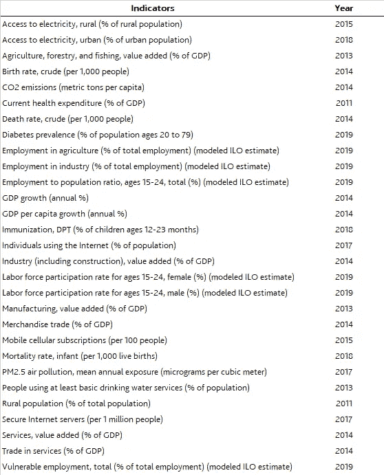
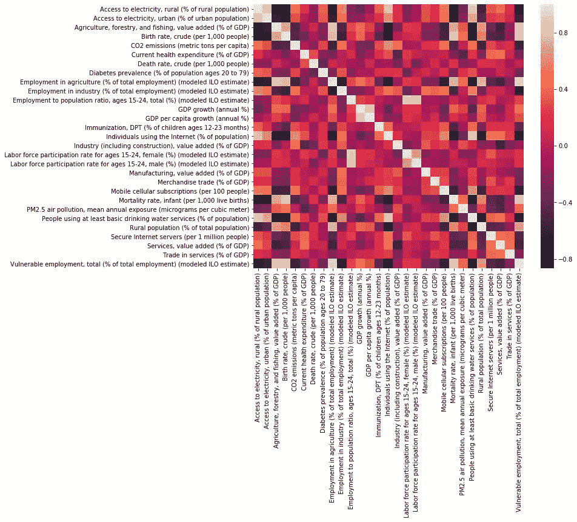
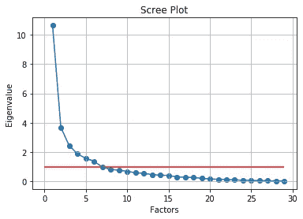
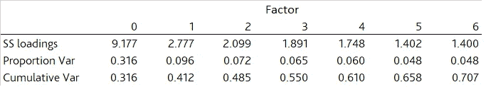
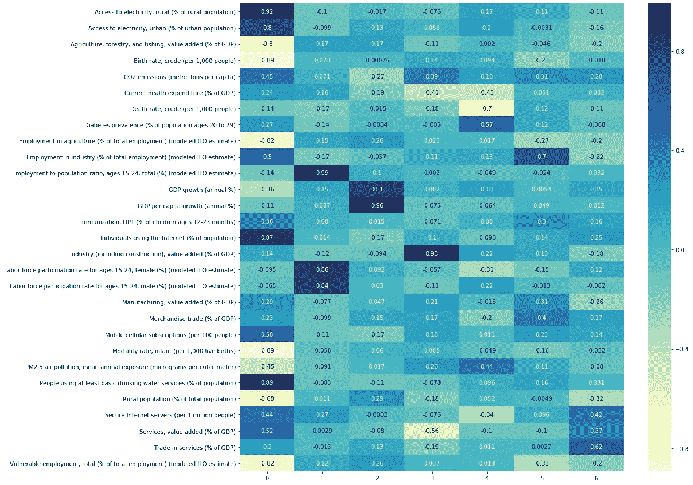
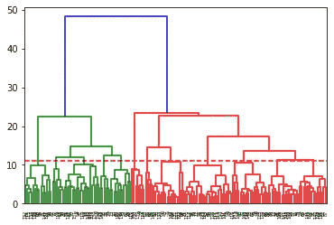
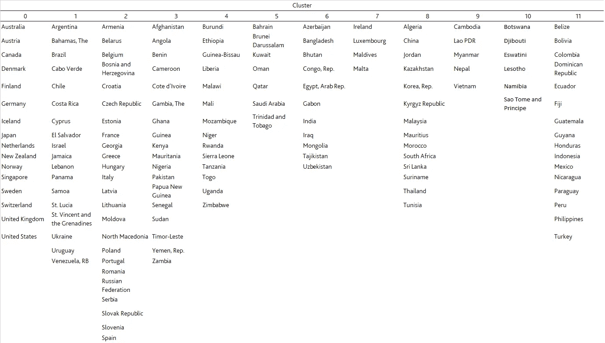
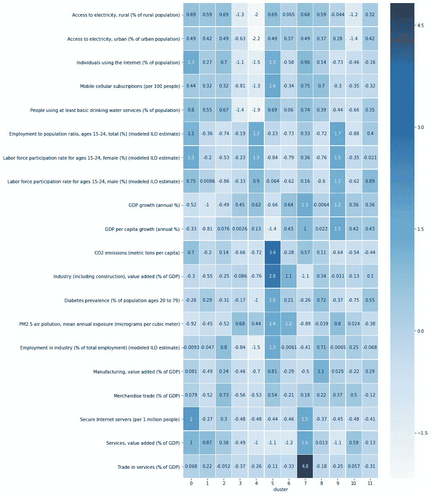
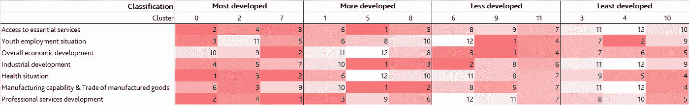
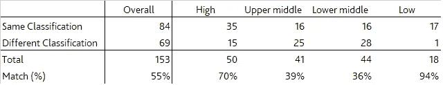

# 国家分类的因子分析和聚类分析

> 原文：<https://towardsdatascience.com/factor-analysis-cluster-analysis-on-countries-classification-1bdb3d8aa096?source=collection_archive---------12----------------------->

## 让我们更多维度地了解这个世界！！！

由[格伦·卡斯滕斯-彼得斯](https://unsplash.com/@glenncarstenspeters?utm_source=medium&utm_medium=referral)在 [Unsplash](https://unsplash.com?utm_source=medium&utm_medium=referral) 上拍摄的照片

最近，我被一则新闻吸引住了，根据世界银行的分类，坦桑尼亚已经提前五年达到了中等偏下收入水平。出于对他们如何做出判断的好奇，我看了一下世界银行的官方网站[这里](https://blogs.worldbank.org/opendata/new-country-classifications-income-level-2019-2020)。

基本上，世界银行通过考虑人均国民总收入(GNI )(现值美元)将世界经济分为四个收入组——高、中上、中下和低。

毫无疑问，这是一个很好的指标，代表了基本上生活在该经济领域的居民的平均收入水平，这反过来又反映了该国的总体经济发展水平。尽管如此，我认为情况应该不止如此，因为同一收入组的国家在不同方面可能仍有很大差异。

因此，基于从[世界银行数据库](https://data.worldbank.org/indicator)中选取的一组有趣的指标，我首先尝试应用**因子分析，看看这些指标能代表什么维度**，然后是**聚类分析，对经济体进行重新分类**。希望这篇文章能帮助我们更好地了解这个世界。关于本文的代码，可以参考 Github 链接[这里](https://github.com/ngaiyin1760/Factor-analysis-Cluster-analysis-on-countries-classification)。

# **数据**

F 首先，这项工作选取了不同方面的 **29 个指标**。为了防止因具有显著尺度差异的数字指标(如国内生产总值(GDP)或人口规模)而导致的一些潜在偏差，我主要选择了比率或增长指标，并纳入了一些非传统指标，如糖尿病患病率和移动电话用户数。

## **指标选中**

选定指标清单

从上面的列表中，您可能会注意到，由于数据的可用性，指标的年份并不相同。我相信这是世界银行使用单一指标(人均国民总收入)进行经济分类的主要原因之一。

我们所能做的最好的事情就是选择有合理数量的国家提供数据的指标(> 140 个经济体)，然后选择最近的一年。经过筛选，共有**159 个国家**纳入本次演习。

## **相关矩阵**

现在，让我们用下面的代码绘制一个相关矩阵，看看指标之间的关系。

从相关矩阵中，我们可以观察到一些有趣但合理的关系。举个例子，

*(a)* ***获得电力(占人口的百分比)与至少使用基本饮用水服务的人口百分比之间的正相关关系***——电力和饮用水是社会中的基本服务。两者应在相似的阶段同时发展，因此在一个国家内具有相似的可及性水平。

*(b)* ***弱势就业(占总就业的百分比)与农业就业(占总就业的百分比)之间的正相关关系*** *—* 与工业和服务部门的就业相比，农业就业应该更加弱势。

*【c】****农村人口(占人口的百分比)与使用互联网的个人(占人口的百分比)之间的负相关*** —农村人口占总人口的比例越高，经济可能越不发达。因此，农村人口比例与上网人口比例呈负相关，上网人口比例代表了一个经济体的技术发展水平。

# **因素分析**

事实上，变量之间还有许多其他有趣的关系。为了更快更好地了解全貌，我们可以应用因子分析将 29 个指标缩减为更少的因子。

但是有多少因素应该减少到？我们可以通过绘制一个 scree 图得到一个概念，x 轴是因子数，y 轴是特征值。一般来说，如果一个因子的特征值大于或接近 1，我们会包括它。下图显示了**可能有 7 个因素。**

对于因子分析背后的概念，这篇[文章](/factor-analysis-101-31710b7cadff)给出了很好的解释。

## **碎石地块**

因子分析的 Scree 图

## **由载荷解释的差异**

7 个因子的选择解释了 29 个指标总方差的 71%。百分比越高，模型越好。

## **因子加载**

接下来，我们看一下因子加载的热图，它基本上是变量和因子的相关系数。它显示了由特定因素上的变量所解释的方差。

让我们深入研究 7 个因素的含义，看看哪些变量与每个因素高度相关。请注意，下面的解释是主观的。

**因素 0** — **获得社会基本服务** *(农村/城市人口获得电力，使用互联网的个人和至少使用基本饮用水服务的人，移动电话用户)*

**因素 1** — **青年就业状况** *(就业与人口比率，15-24 岁，劳动力参与率，15-24 岁，女性/男性)*

**因素二** — **整体经济增长** *(GDP 增长率和人均 GDP 增长率)*

**因素 3** — **工业发展** *(工业增加值(包括建筑业)和二氧化碳排放量)*

**因素 4** — **健康状况** *(糖尿病患病率与 PM2.5 空气污染)许多研究已经固化了汽车排放的颗粒物与糖尿病之间的联系。有兴趣的话，这篇* [*文章*](https://www.theatlantic.com/health/archive/2018/07/a-frightening-new-reason-to-worry-about-air-pollution/564428/) *不错。*

**要素 5**——**制造业能力&制成品贸易** *(工业就业、商品贸易和制造业增加值)*

**因素 6** — **专业服务发展** *(服务贸易、服务增值和安全互联网服务器)*

现在，我们知道这 7 个因素代表了经济的 7 个完全不同的方面。然而，少数指标与所有 7 个因素的相关性很低，即出生率、死亡率和婴儿死亡率。如此低的相关性可能是有意义的，因为这些指标更像是经济中许多要素的最终产品。因此，很难将它们归入上述任何因素。

# **聚类分析**

接下来，我们将应用聚类分析对经济进行分类。在下文中，我们将应用最常用的方法之一— **系统聚类，用自底向上的方法、欧几里德距离和沃德方法来计算相似度**。对于层次聚类的详细解释，这篇[文章](/understanding-the-concept-of-hierarchical-clustering-technique-c6e8243758ec)给出了一个很好的教训。

## **标准化**

每个指标都有自己的尺度。例如，农村人口占总人口的比例总是高于 GDP 增长率。为了防止这种规模差异导致无与伦比的权重和不可靠的结论，我们必须首先对数据进行标准化。

## **层次聚类分析**

标准化数据后，我们可以使用名为**aggregate veclustering**的库来执行聚类。

并且为了可视化聚类结果，应用了**树状图，**记录合并或分裂序列的树形图。但是，请注意，最终形成的集群数量完全基于您的判断。如果聚类太多，分类可能会太细。如果太少，经济可能无法很好地分类。

## 系统树图

层次聚类的树状图

从树状图来看，可能有 **12 个集群。**基于这一选择，我们接下来对数据集应用函数**agglomerate clustering**，将 n_clusters 设置为 12，将 affinity 设置为欧几里德距离，将 linkage 设置为 Ward 方法。

## **按集群排列的国家名单**

聚类结果以国家列表的形式显示如下。

按组列出的国家列表

## **星团的特征**

将 159 个国家分成 12 个组后，最重要的是了解每个组的特征，并调查为什么这些国家被分组在一起。所以让我们来看看下面的热图。我提取了与 7 个因素高度相关的 20 个变量，并按因素组排序，即前五行代表**因素 0——获得社会基本服务。**

根据集群的特征，我试图将 12 个集群进一步分为 4 大类(**最发达、较发达、欠发达**和**最不发达经济体**)。然而，即使在一个大群体中，集群的特征仍然有所不同。请参考下面的详细描述。

## **大多数发达经济体**

*共同特征:*良好的社会基本服务可及性，良好的工业发展和相对良好的健康状况

**集群 0** *(美、英、日)——青年劳动力参与水平高但经济增长缓慢*

**集群 2** *(法国、意大利和西班牙)——制成品贸易能力强，但青年劳动力参与水平低*

**集群 7** *(爱尔兰和卢森堡)——经济增长非常快，专业服务发展出色，但制造业能力相对较弱*

## **更发达的经济体**

*共同特征:*基本服务可及性较好，但青年劳动力参与和专业服务发展水平相对较低

**集群 1** *(巴西、阿根廷和乌拉圭)——工业发展落后，制造业和制成品贸易能力薄弱*

**集群 5** *(卡塔尔和沙特阿拉伯)——工业发展良好，但卫生状况极差*

**集群 8** *(中国、韩国和南非)——良好的工业发展和制造能力，经济适度增长*

## **欠发达经济体**

*共同特征:*制造业和制成品贸易能力中等，但专业服务发展水平低，获得社会基本服务的机会少

**集群 6** *(印度、埃及和孟加拉国)——工业发展很快，但青年劳动力参与率很低，健康状况不佳*

**集群 9** *(越南和柬埔寨)——青年劳动力参与率非常高，经济增长非常快*

**第 11 类** *(墨西哥、印尼和菲律宾)——平均工业发展和经济增长*

## **最不发达经济体**

*共同特征:*经济增长中等，但工业发展非常落后，社会基本服务难以获得

集群 3 *(阿富汗、巴基斯坦和喀麦隆)——制造业和制成品贸易能力非常弱，卫生状况相对较差*

**集群 4** *(津巴布韦和乌干达)——青年劳动力参与率非常高，但专业服务发展较差，制造业和制成品贸易能力非常弱*

**集群 10** *(吉布提和纳米比亚)——制造业和制成品贸易能力高于平均水平，但青年劳动力参与水平低*

总而言之，请参考下面的热图。方框内的数字是该集群在该方面(因子)的排名。数字越小，集群在这方面的性能越好。

## **与世界银行现行分类的比较**

最后但同样重要的是，将我们的分类(*最发达、较发达、欠发达和最不发达*)与[世界银行的](https://datahelpdesk.worldbank.org/knowledgebase/articles/906519-world-bank-country-and-lending-groups) ( *高收入、中上收入、中下收入和低收入*)进行比较会很有趣。

我们的分类与世界银行的分类的比较

根据比较表， **55%的国家在两种分类方法下被归入同一组。**令人惊讶的是，**高收入组和低收入组分别获得了 70%和 94%的匹配概率**。相比之下，两个中等收入群体的匹配概率相对较低(< 40%)。

# **结论**

上述结果表明**人均国民总收入(GNI)可能只显示了画面的一半**。除此之外，还有许多其他故事，尤其是对中等收入群体/发展中经济体而言。这些国家的经济模式和社会状况可能会有很大差异，即使它们的人均国民总收入水平相似。

本文利用了两种流行的统计方法——**因子分析**和**聚类分析**来帮助我们从不同的维度理解经济并对国家进行分类。我希望这能提高你在更多维度上分析世界经济的兴趣，并有一个超越官方分类的更深层次的思考。

非常感谢，下次再见。

# 参考

1.  柴坦尼亚·瑞迪·帕特拉。(2018).[理解层次聚类技术的概念](/understanding-the-concept-of-hierarchical-clustering-technique-c6e8243758ec)。
2.  杰佩·安德森。(2019).[因素分析 101](/factor-analysis-101-31710b7cadff) 。
3.  奥尔加·卡赞。(2018).担心空气污染的一个可怕的新理由。
4.  世界银行数据小组。(2019).[按收入水平划分的新国家分类:2019–2020](https://blogs.worldbank.org/opendata/new-country-classifications-income-level-2019-2020)。

 [## 用我的推荐链接加入媒体-哈德森高

### 如果你对我写的东西感兴趣，不要错过成为 Medium 会员的机会。您将可以完全访问所有…

medium.com](https://medium.com/@hudsonko/membership) 

如果你有兴趣了解聚类分析在选股中的应用，你可以看看下面的另一篇文章。谢了。

 [## 股票选择的聚类分析

### 时间抛开复杂的时间序列模型，简单的基本面分析也可以帮助赚钱！！！

towardsdatascience.com](/clustering-analysis-on-stock-selection-2c2fd079b295)