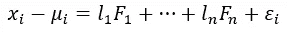
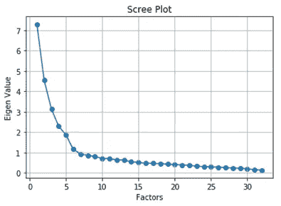
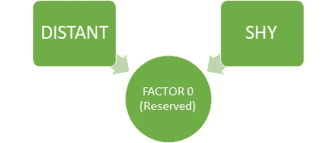
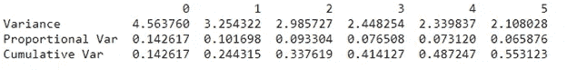
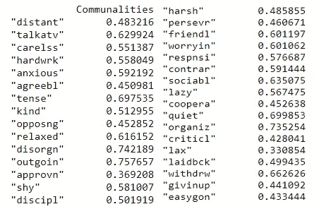

# 因子分析-我的 ML 奥利奥检测器

> 原文：<https://towardsdatascience.com/factor-analysis-my-ml-oreo-detector-2e02abc2bb30?source=collection_archive---------20----------------------->

***“美貌得眼球，个性得人心”。这些线条描绘了我们视野之外的事物的重要性。一种机器学习算法怎么样，它可以找到关于内在美的信息，比如我的心脏，它可以找到奥利奥的奶油层，尽管外面有令人倒胃口的松脆饼干。***

# 要素分析

因子分析是一种用于降维的无监督机器学习算法。该算法从观察变量中创建因子来表示公共方差，即由于观察变量之间的相关性而产生的方差。是的，这听起来有点专业，所以让我们把它分成比萨饼和切片。



用因素表示特征(作者提供的图片)

***x*** 为变量， ***F*** 为因子， **l** 为因子载荷，也可视为因子对相应变量的权重。因子的数量等于变量的数量。

# 故事时间

让我们用一个例子让一切更清楚。假设我们每个人现在都是招聘人员，我们想为我们的公司招聘员工。采访过程已经结束，对于被采访者的每一种性格，我们都给他们打了分。受访者的各种性格有疏远、放松、粗心、健谈、懒惰等..大约有 32 个变量。我们可以看到放松、粗心和懒惰的特征是相互关联的，因为这些人不会成功。由于这些变量是相关的，我们可以尝试形成一个称为“不成功行为”的因素，它将解释常见的差异，即由于这些特征之间的相关性而产生的差异。


相似或相关的特征可以被分组并表示为因素(图片由作者提供)

数据集和代码可以从我的 [GithubRepo](https://github.com/Dhamodaran-Babu/Machine-Learning-Exercises/tree/master/12.Factor%20Analysis) 下载

# 因子分析的步骤

因子分析涉及的各个步骤是

*   巴特利特球形度试验和 KMO 试验
*   确定因子的数量
*   解释这些因素

确保您已经移除了异常值，对数据进行了标准缩放，并且要素必须是数字。

我将在以下软件包的帮助下用 python 实现这一点

*   因子分析器
*   numpy
*   熊猫
*   matplotlib

# 巴特利特球形试验

Bartlett 检验检查给定数据中是否存在相关性。它测试相关矩阵是一个相同矩阵的零假设(H0)。全同矩阵包括所有对角元素为 1。因此，零假设假设变量之间不存在相关性。我们想要拒绝这个零假设，因为因子分析旨在解释共同方差，即由于变量之间的相关性而产生的变化。如果 p 检验统计值小于 0.05，我们可以确定相关性不是相同的矩阵，即相关性存在于具有 95%置信水平的变量中。

```
from factor_analyzer.factor_analyzer import calculate_bartlett_sphericitychi2,p = calculate_bartlett_sphericity(dataframe)
print("Chi squared value : ",chi2)
print("p value : ",p)#OUTPUT:Bartlett Sphericity TestChi squared value : 4054.19037041082
p value : 0.0
```

使用 pandas 读取数据集并将数据集存储在 dataframe 中。我们将数据集存储在名为“dataset”的数据帧中。只需将“数据集”通过 calculate _ bartltett _ sphericty 函数，它将测试零假设并返回卡方值和 p 检验统计量。由于 p 检验统计量小于 0.05，我们可以得出结论，变量之间存在相关性，这是应用因子分析的绿色信号。

# 凯泽-迈耶-奥尔金(KMO)试验

KMO 检验测量的是变量中可能是普通方差的方差的比例。预计会有更大的比例，因为它代表变量之间存在更多的相关性，从而为因子分析等维度缩减技术的应用让路。KMO 分数总是在 0 到 1 之间，大于 0.6 的值非常受欢迎。我们也可以说它是衡量我们的数据对因子分析的适合程度的一个标准。

```
from factor_analyzer.factor_analyzer import calculate_kmokmo_vars,kmo_model = calculate_kmo(dataset)
print(kmo_model)#OUTPUT:
KMO Test Statistic 0.8412492848324344
```

只需将包含数据集信息的 dataframe 传递给 calculate_kmo 函数。该函数将返回存储在变量“kmo_vars”中的每个变量的方差比例，并且我们的整个数据的方差比例存储在“kmo_model”中。我们可以看到，我们的数据的总体方差比例为 0.84。这表明我们的数据有更多的相关性和降维技术，如因子分析可以应用。

# **确定因子的数量**

数据集中因子的数量等于数据集中变量的数量。所有的因素都不能提供大量有用的关于变量间共同方差的信息。所以我们必须决定因素的数量。因子的数量可以根据因子解释的公共方差的数量来决定。一般来说，我们将画出因子和它们的特征值。特征值只不过是因子解释的方差的数量。我们将选择特征值大于 1 的因子的数量。

但是为什么要选择特征值大于 1 的因子呢？答案很简单。在均值为 0、标准差为 1 的标准正态分布中，方差为 1。因为我们对数据进行了标准缩放，所以特征的方差为 1。这就是选择特征值(方差)大于 1 的因子的原因，即这些因子比单个观察变量解释更多的方差。

```
from factor_analyzer import FactorAnalyzerfa = FactorAnalyzer(rotation = None,impute = "drop",n_factors=dataframe.shape[1])fa.fit(dataframe)
ev,_ = fa.get_eigenvalues()plt.scatter(range(1,dataframe.shape[1]+1),ev)
plt.plot(range(1,dataframe.shape[1]+1),ev)
plt.title('Scree Plot')
plt.xlabel('Factors')
plt.ylabel('Eigen Value')
plt.grid()
```



确定因素数量(图片由作者提供)

特征值函数将返回原始特征值和公因数特征值。现在，我们将只考虑原始特征值。从图中我们可以看到，特征值从第 7 个因子下降到 1 以下。因此，最佳因子数为 6。

# 解释这些因素

创建最佳数量的因子，在我们的示例中为 6。然后，我们必须利用负荷、方差和共性来解释这些因素。

## 装货

```
fa = FactorAnalyzer(n_factors=6,rotation='varimax')
fa.fit(dataset)
print(pd.DataFrame(fa.loadings_,index=dataframe.columns))
```


因子加载(图片由作者提供)

负荷表明一个因素在多大程度上解释了一个变量。加载分数的范围从-1 到 1。接近-1 或 1 的值表示因子对这些变量有影响。值接近 0 表示因子对变量的影响较小。

例如，在因子 0 中，我们可以看到特征“疏远”和“害羞”健谈比其他变量具有更高的负载。由此我们可以看出，因子 0 解释了矜持人群中的普遍差异，即疏远和害羞人群中的差异。



因子 0(保留)(图片由作者提供)

## 差异

使用“get_factor_variance”函数可以找出每个因素解释的差异量。

```
print(pd.DataFrame(fa.get_factor_variance(),index=['Variance','Proportional Var','Cumulative Var']))
```



由因素解释的差异(图片由作者提供)

第一行代表由每个因素解释的方差。比例方差是由总方差中的一个因子解释的方差。累积方差只不过是每个因素的比例方差的累积和。在我们的案例中，这 6 个因素合起来可以解释总方差的 55.3%。

在非旋转情况下，方差将等于特征值。旋转会改变比例方差的分布，但累积方差将保持不变。倾斜旋转允许因子之间相关，而正交旋转保持因子不相关。

## 社区

公度是每个变量的方差的比例，可以用因子来解释。旋转对变量的公度没有任何影响。

```
print(pd.DataFrame(fa.get_communalities(),index=dataframe.columns,columns=['Communalities']))
```



社群(作者图片)

由因子解释的每个变量的方差的比例可以从上面推断出来。例如，我们可以考虑变量“talkatv ”,其方差的 62.9%可以由所有因素共同解释。

这就是关于因子分析的全部内容，因子分析可用于发现潜在的方差，这是由于观察到的变量之间的相关性，比如我的心脏发现了奥利奥的奶油层，尽管外层松脆的饼干令人倒胃口。