# 基于隐式反馈数据的项目推荐因式分解机

> 原文：<https://towardsdatascience.com/factorization-machines-for-item-recommendation-with-implicit-feedback-data-5655a7c749db?source=collection_archive---------1----------------------->

## 超越经典的矩阵分解方法，包括用户/项目辅助特征，并直接优化项目排名顺序

## 介绍

在本文中，我们将介绍因式分解机(FM ),它是一个灵活而强大的协同过滤推荐建模框架。然后，我们将描述直接优化项目排名顺序的专门损失函数如何使将 FM 模型应用于隐式反馈数据成为可能。我们将通过使用新的[开源 FM 建模库](https://github.com/etlundquist/rankfm)的[真实世界隐式反馈数据集](https://www.instacart.com/datasets/grocery-shopping-2017)来演示这些要点。向前！

## **推荐系统**

随着数字经济规模的不断扩大和复杂性的不断增加，推荐系统为每个用户提供个性化的相关内容的作用比以往任何时候都更加重要。拥有越来越大的产品目录的电子商务网站可以同时向数百万用户呈现个性化的店面。数字内容提供商可以帮助用户浏览更多的书籍、文章、歌曲、电影等。比花一生的时间找到最符合每个用户特定兴趣和口味的小子集还要多。例如，网飞在 2015 年报告称，其推荐系统影响了网站上大约 80%的流媒体时间，并进一步估计该系统的价值每年超过 1B 美元。[【1】](#_edn1)

推荐系统的两种广泛的高级方法是**基于内容的过滤(CBF)** 和**协同过滤(CF)。** CBF 模型将用户和项目表示为**属性**或**特征**的向量(如用户年龄、状态、收入、活动水平；项目部门、类别、流派、价格)。相比之下，CF 方法仅依赖于**过去的用户行为**:该模型分析共现模式，以确定用户和/或项目的相似性，并试图仅使用用户记录的交互来推断用户对看不见的项目的偏好。基于 CF 的方法具有不受领域限制(即不需要特定的业务知识或特性工程)的优势，并且通常比 CBF 模型更准确和更具可扩展性。[【2】](#_edn2)

## **矩阵分解**

许多最受欢迎和最成功的 CF 方法都是基于矩阵分解(MF)的，由于 2006-2009 Netflix 奖的举办，其发展速度迅速加快，获奖作品大量使用了 MF 技术，包括现在流行的 SVD++算法。[【3】](#_edn1)MF 模型试图学习用户和项目在共享潜在因素空间中的低维表示或嵌入。本质上，观察到的稀疏用户-项目交互矩阵被“分解”成包含用户和项目嵌入的两个低秩矩阵的近似乘积。在学习了这些潜在因素之后，可以计算用户/项目相似性，并且通过比较用户/项目潜在因素表示来推断未观察到的偏好。

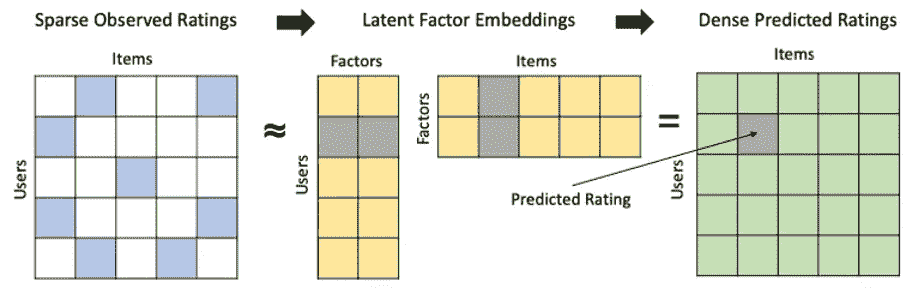

作者图片

许多流行的 MF 算法通过最小化观察和预测评级之间的平方误差来学习这些用户/项目潜在因素，其中预测评级被计算为相关用户和项目潜在因素的内积。一些模型规范还包括全局用户/项目偏差和/或正则化项，以防止过度拟合。常见的 MF 损失函数可以表示为:

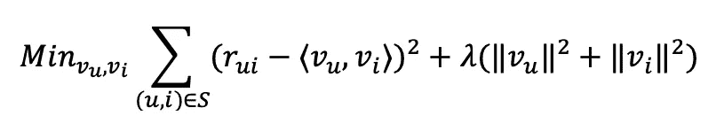

## **隐性反馈**

然而，当处理隐式反馈数据时，这种公式就失效了，在这种情况下，您不会直接观察到任何显式的数字评级或肯定/否定的响应，而只能观察到原始的用户行为(例如，观看、页面浏览、购买、点击)。隐式反馈数据在现实推荐环境中更为常见，事实上，仅使用显式反馈数据(即使存在)构建的推荐系统通常表现不佳，因为评级不是随机丢失的，而是与潜在的用户偏好高度相关。[【4】](#_edn1)为了使 MF 方法适应隐式反馈数据，胡等人[【5】](#_edn2)引入了评级的概念，作为二元隐含偏好(用户是否观察到该项目)，用数字置信权重表示该二元偏好的假定强度。这个模型公式是在 [SparkML](https://spark.apache.org/docs/latest/ml-collaborative-filtering.html) 和[隐式](https://github.com/benfred/implicit) Python 库中实现的流行隐式反馈 ALS 算法的基础:

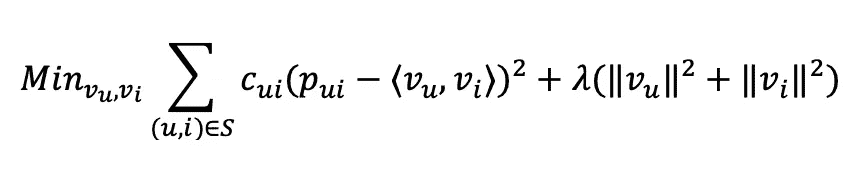

虽然简单有效，但这种方法有几个主要缺点。首先，通过将数据表示为用户/项目交互的矩阵，不可能包括辅助特征，例如在 CBF 模型中使用的用户/项目属性和/或关于交互本身的其他上下文信息。当存在丰富的辅助功能时，这是一个重大的机会损失，也阻止了模型为新用户/项目生成信息性预测，通常称为[冷启动问题](https://en.wikipedia.org/wiki/Cold_start_(recommender_systems))。第二，将用户隐式反馈编码为二进制(0，1)评级并最小化模型的预测误差是用户偏好的非常间接的表示——你不能确定未被观察到的项目实际上对用户来说是负面的，当然一些正面(和负面)的项目比具有完全相同的编码(0，1)评级的其他项目更受欢迎。

考虑大多数推荐实际上是如何提供给用户的:作为一个或多个有序的项目列表。因此，直觉上，真正的目标应该是为每个用户导出正确的项目排序。这将允许我们生成推荐，其中所有项目都按照与每个用户的相关性排序，最相关的项目出现在每个用户的推荐项目列表的最顶端。

作者的亚马逊 Prime 视频主页

为了克服这些限制，我们需要一个更通用的模型框架，它可以扩展潜在因素方法，以纳入任意的辅助特征，以及使用隐式反馈数据直接优化项目排序的专用损失函数。进入**因式分解机**和**学习排名**。

## **因式分解机**

因子分解机器(FM)是通用的监督学习模型，将任意实值特征映射到低维潜在因子空间，可以自然地应用于各种预测任务，包括回归、分类和排序。FMs 可以在非常稀疏的数据下准确估计模型参数，并以线性复杂度进行训练，允许它们扩展到非常大的数据集[【6】](#_edn1)——这些特性使 FMs 非常适合现实世界的推荐问题。与上面讨论的输入用户-项目交互矩阵的经典 MF 模型不同，FM 模型将用户-项目交互表示为实值特征向量和数字目标变量的元组-这种数据格式应该为任何训练过标准回归或分类模型的人所熟悉。

典型地，对于协同过滤，基本特征将是用户和项目指示符的二进制向量，使得每个训练样本恰好具有对应于给定用户/项目组合的两个非零条目。然而，这些用户/项目指示符可以用任意辅助特征来扩充，例如，用户或项目属性和/或与交互本身相关的上下文特征(例如，星期几、添加到购物车订单等)。).

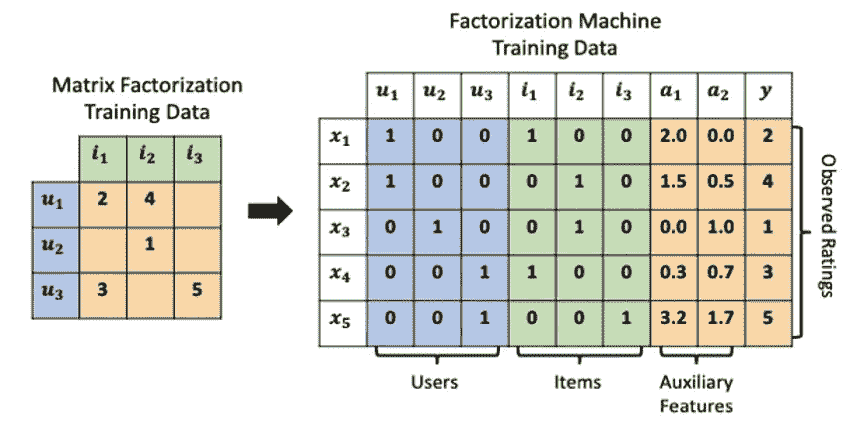

作者图片

FM 模型方程由特征之间的 n 向相互作用组成。二阶模型(到目前为止最常见)包括每个基本特征的权重以及每个成对特征组合的交互项。

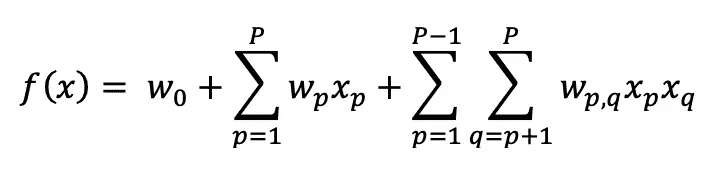

这个模型公式可能看起来很熟悉——它只是一个二次线性回归。然而，与分别估计每个交互项的多项式线性模型不同，FMs 使用**因式分解的交互参数**:特征交互权重表示为两个特征的潜在因子空间嵌入的内积:

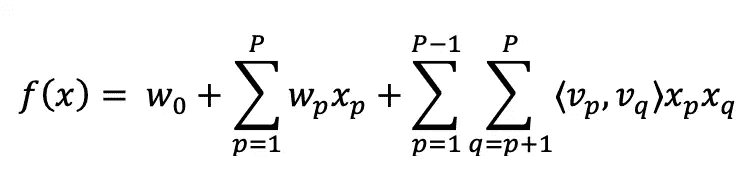

这极大地减少了要估计的参数数量，同时通过打破相互作用项之间严格的独立性标准来促进更精确的估计。考虑一个有 1，000，000 个用户和 10，000 个项目的现实推荐数据集。二次线性模型将需要估计 U+I+UI ~ 100 亿个参数。维度 F=10 的 FM 模型将只需要 U+I+F(U+I)~ 1100 万个参数。此外，许多常见的 MF 算法(包括 SVD++，ALS)可以重新制定为更通用/灵活的 FM 模型类的特例。[【7】](#_edn1)

然而，如何使 FM 模型适应隐式反馈数据并不是显而易见的。一种天真的方法是将所有观察到的用户-项目交互标记为(1)，将所有未观察到的交互标记为(-1)，并使用常见的分类损失函数(如铰链或对数损失)来训练模型。但是对于真实世界的推荐数据集，这将需要创建数十亿未观察到的用户项目训练样本，并且由于交互稀疏性而导致严重的类别不平衡。这种方法也具有与上面讨论的隐式反馈 MF 适应相同的概念问题:它仍然最小化评级预测误差，而不是直接优化项目排名顺序。

## **学习排名**

直接学习排序顺序而不是最小化预测误差的优化技术被称为排序学习(LTR)。LTR 模型在成对或成列的训练样本上训练，而不是在单个观察值上训练。损失函数基于项目的相对顺序，而不是它们的原始分数。使用 LTR 的模型已经在搜索、信息检索和协同过滤方面产生了最先进的结果。这些技术是使 FM 模型适应隐式反馈推荐问题的关键。

用于项目推荐的最流行的 LTR 技术之一是**贝叶斯个性化排名(BPR)。** BPR 试图通过最大化模型参数的后验概率(MAP)来为每个用户学习项目的正确排序，给定观察到的用户项目偏好的数据集和选择的先验分布。假设每个用户观察到的项目(隐式反馈)优于未观察到的项目，并且假设所有成对的偏好是独立的。为了学习这些偏好，创建由[用户(u)，观察项目(I)，未观察项目(j)]元组组成的训练样本，并最大化关于模型参数的以下对数似然函数。[【第八期】](#_edn1)

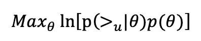

其中 **( > u|theta)** 是模型对用户(u)的预测项目排名。这可以使用上述训练数据通过最大化用户观察到的项目优于他们未观察到的项目的联合概率来学习。我们可以使用 sigmoid 函数将该概率定义为映射到[0，1]的用户观察到的(I)和未观察到的(j)项目的预测效用分数之间的差异:

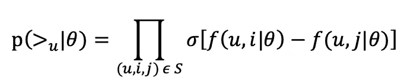

其中实值用户项目效用分数 **f(u，i|theta)** 和 **f(u，j|theta)** 是使用上面给出的主 FM 模型等式生成的。将所有这些放在一起并包括一个正则项，最大化的标准变成:

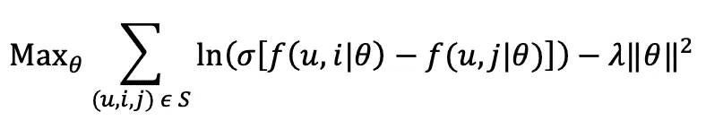

更进一步，**加权近似成对等级(WARP)** 不是简单地随机采样未观察到的项目(j)，而是对每个观察到的训练样本采样许多未观察到的项目，直到它为用户找到等级反转，从而产生更有信息的梯度更新。这在具有大量项目和高度倾斜的项目流行度(非常常见)的上下文中尤其重要。[【9】](#_edn1)基本程序是:

1.为用户随机抽取一个未观察到的项目，并计算其效用分数。如果未观察项目的分数超过观察项目的分数加上固定的余量，则进行梯度更新，否则继续对负项目进行采样

2.在发现边界违规之前，根据采样的负项数量调整渐变更新的幅度-如果采样的负项越多，更新幅度就越小，因为模型当前更有可能对用户偏好进行正确排序

事实上，如果您使用(0，1)乘数缩放梯度更新的幅度，BPR 可以被视为 WARP 的特殊情况，其中负样本的最大数量等于 1，导致梯度更新乘数恒定为 1。相对于 BPR，使用 WARP 会增加每个历元的训练时间，但通常会产生更快的收敛和更好的模型性能。

## **模型评估**

现在，所有的理论都清楚了，让我们看看这些组件如何在一个众所周知的真实数据集上产生高质量的推荐。我们将使用作者的新 [RankFM](https://github.com/etlundquist/rankfm) 包训练一个隐式反馈 FM 模型，该包实现了上述技术，并将其性能与之前讨论的流行的隐式反馈 ALS MF 算法进行比较(通过[隐式](https://github.com/benfred/implicit)包)。目标是表明，与类似指定的经典 MF 模型相比，包含辅助特征并使用 LTR 优化技术训练的 FM 模型产生更好的性能。

在本练习中，我们将使用 [2017 年 Instacart 订单数据](https://www.instacart.com/datasets/grocery-shopping-2017)。它包含 200，000 个用户，50，000 个项目，340 万个订单，以及超过 3，200 万个记录的用户-项目交互。对数据的快速探索性研究揭示了高度的稀疏性:中间用户在 9 个订单中仅购买了 48 个项目，而中间项目在 60 个订单中仅被 35 个用户购买。总体交互稀疏率为 99.87%。

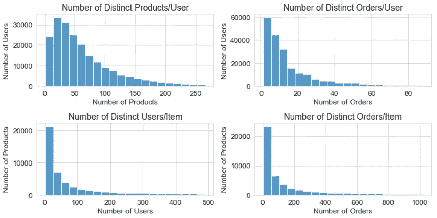

我们将随机划分总体交互数据，用 75%来训练模型，剩下的 25%来评估验证指标和模型性能。为了反映重复购买携带更强偏好信号的想法，我们将结合使用每个用户商品购买计数的日志定义的样本权重。我们将用一组表示每个商品的超市部门和通道的商品特性来扩充主要的用户-商品交互数据。不幸的是，这个数据集没有用户辅助功能可以利用。

现在我们来训练 RankFM 模型。我们将使用 50 个潜在因素，最多 100 个负样本的偏差损失，以及一个逆比例学习计划，该计划将随着时间的推移降低学习速率，以帮助 SGD 收敛。RankFM 将打印每个训练时期的对数似然性，以便您可以逐个时期地监控训练时间和性能增益:

我们可以使用主 FM 模型方程和 **predict()** 方法生成实值效用分数。没有出现在训练数据中的用户和项目可以被丢弃，或者在结果得分向量中将得分设置为 **np.nan** 。我们可以使用 **recommend()** 方法为验证集中的每个用户生成 TopN 个推荐项目。有一个有用的标志，让您选择是否包括以前观察到的训练项目或只生成新项目的建议。结果是一个 pandas 数据框架，其中包含 UserID 索引值和每个用户推荐的项目，这些项目按预期的偏好从左到右排列:

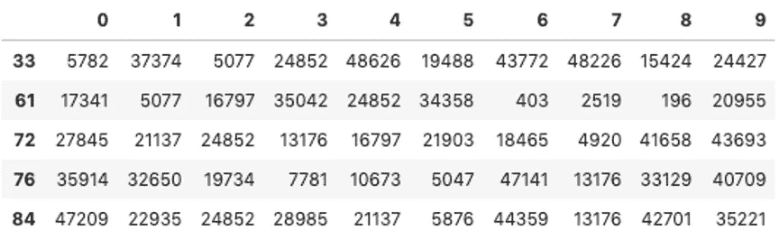

最后，我们将评估延迟验证数据的性能指标。RankFM 包括一个独立的**评估**模块，该模块实现了许多流行的推荐器指标，包括**命中率**、**倒数排名**、**折扣累积收益**和**精度/召回**。

使用具有 50，000 个独特项目的数据集，其中中值用户购买少于 50 个项目，我们能够在很少的功能工程和所需的数据准备的情况下获得 80%以上的验证命中率。不算太寒酸。

## **基线模型对比**

现在，让我们将 RankFM 的性能与我们的基线 ALS 算法进行比较。为此，我们首先需要将用户-项目交互数据转换成一个稀疏的 CSR 矩阵。我们将使用完全相同的数据分割，并输入我们生成的样本权重作为置信度得分来训练 ALS 模型。

现在我们有了所需输入格式的数据，我们可以拟合 ALS 模型并为验证用户生成 TopN 建议。我们将使用与 RankFM 相同的潜在因子维度，否则使用默认值。

最后，我们将计算用于评估 RankFM 模型的同一组拒绝交互的模型的命中率、精确度和召回率。

虽然完整的分析需要在各种超参数组合中适当调整两个模型，但我们可以看到，使用相同的相互作用数据和大致相等的模型规格(即潜在因素的数量)，FM 模型公式和 LTR 优化技术可以获得适度的性能增益(5–10%)。如果用户有更少的记录交互(在 Instacart 数据中，每个用户至少有 3 个订单)和/或我们有更多信息用户/商品辅助功能，我们可能会看到相对于基线 ALS MF 模型的更大性能增益。

## **总结**

在本文中，我们探索了因子分解机器(FM)作为一个通用而强大的模型框架，特别适合于协同过滤推荐问题。与传统的矩阵分解(MF)方法不同，FM 模型可以自然地扩展到包括用户、项目或上下文辅助特征，以增加主要交互数据。然后，我们展示了学习-排序(LTR)损失函数，如贝叶斯个性化排序(BPR)和加权近似成对排序(WARP)是如何成功地使 FM 模型适应隐式反馈数据的关键。为了证明这些观点，我们展示了一个隐式反馈 FM 模型，它在一个众所周知的开源隐式反馈推荐数据集上优于流行的 ALS MF 基线算法。最后，我们介绍了 [RankFM](https://github.com/etlundquist/rankfm) :一个新的 python 包，用于构建和评估带有隐式反馈数据的推荐问题的 FM 模型。

## **参考文献**

[【1】](#_ednref1)c .戈麦斯-乌里韦，n .亨特。[网飞推荐系统:算法、商业价值和创新](https://dl.acm.org/doi/10.1145/2843948) (2015)，美国计算机学会管理信息系统汇刊

[【2】](#_ednref2)y .科伦，r .贝尔，c .沃林斯基。[推荐系统的矩阵分解技术](https://ieeexplore.ieee.org/document/5197422) (2009)，IEEE

[【3】](#_ednref1)y .科伦，r .贝尔，c .沃林斯基。[奈飞奖的贝尔科尔解决方案](https://www.netflixprize.com/assets/GrandPrize2009_BPC_BellKor.pdf) (2008 年)[www.netflixprize.com](http://www.netflixprize.com)

[【4】](#_ednref1)h . Steck。[非随机缺失数据推荐系统的训练和测试](https://dl.acm.org/doi/10.1145/1835804.1835895) (2010)。KDD

胡。[隐式反馈数据集的协同过滤](https://ieeexplore.ieee.org/document/4781121) (2008)。电气电子工程师学会

s·伦德尔。[因子分解机器](https://www.csie.ntu.edu.tw/~b97053/paper/Rendle2010FM.pdf) (2010)。ICDM 2010

[【7】](#_ednref1)s·伦德尔。[因子分解机器](https://www.csie.ntu.edu.tw/~b97053/paper/Rendle2010FM.pdf) (2010)。ICDM 2010

[【8】](#_ednref1)s .伦德尔，c .弗赖登塔尔，z .甘特纳，l .施密特-蒂梅。 [BPR:来自隐式反馈的贝叶斯个性化排序](https://dl.acm.org/doi/10.5555/1795114.1795167) (2009)。UAI 2009

[【9】](#_ednref1)s .伦德尔，c .科登泰勒。[根据隐式反馈改进项目推荐的成对学习](http://citeseerx.ist.psu.edu/viewdoc/download?doi=10.1.1.587.3946&rep=rep1&type=pdf) (2014)。2014 年美国计算机学会